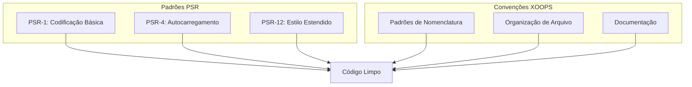

# Padrões PHP

> XOOPS segue padrões de codificação PSR-1, PSR-4 e PSR-12 com convenções específicas do XOOPS.

---

## Visão Geral de Padrões



---

## Estrutura de Arquivo

### Tags PHP

```php
<?php
// Sempre use tags PHP completas, nunca tags curtas
// Omita tag de fechamento ?> em arquivos PHP puros

declare(strict_types=1);

namespace XoopsModules\MyModule;

// Código aqui...
```

### Cabeçalho de Arquivo

```php
<?php

declare(strict_types=1);

/**
 * XOOPS - PHP Content Management System
 *
 * @package    XoopsModules\MyModule
 * @subpackage Class
 * @author     Seu Nome <email@example.com>
 * @copyright  2026 Projeto XOOPS
 * @license    GPL-2.0-or-later
 * @link       https://xoops.org
 */

namespace XoopsModules\MyModule;

use XoopsObject;
use XoopsPersistableObjectHandler;
```

---

## Convenções de Nomenclatura

### Classes

```php
// PascalCase para nomes de classe
class ItemHandler extends XoopsPersistableObjectHandler
{
    // ...
}

// Interfaces terminam com "Interface"
interface RepositoryInterface
{
    public function find(int $id): ?object;
}

// Traits terminam com "Trait"
trait TimestampTrait
{
    public function getCreatedAt(): \DateTimeInterface
    {
        // ...
    }
}

// Classes abstratas prefixam com "Abstract"
abstract class AbstractEntity
{
    // ...
}
```

### Métodos e Funções

```php
// camelCase para métodos
public function getActiveItems(): array
{
    // ...
}

// Verbos para métodos de ação
public function createItem(array $data): Item
public function updateItem(int $id, array $data): bool
public function deleteItem(int $id): bool
public function findById(int $id): ?Item
public function hasPermission(string $permission): bool
public function isActive(): bool
public function canEdit(): bool
```

### Variáveis e Propriedades

```php
class Item
{
    // camelCase para propriedades
    private int $itemId;
    private string $itemTitle;
    private bool $isPublished;
    private array $categoryIds;

    // camelCase para variáveis
    public function process(): void
    {
        $itemCount = 0;
        $activeItems = [];
        $isValid = true;
    }
}
```

### Constantes

```php
// UPPER_SNAKE_CASE para constantes
class Config
{
    public const DEFAULT_ITEMS_PER_PAGE = 10;
    public const MAX_UPLOAD_SIZE = 10485760;
    public const CACHE_LIFETIME = 3600;
}

// Ou em chamadas define()
define('XOOPS_ROOT_PATH', '/path/to/xoops');
define('MYMODULE_VERSION', '1.0.0');
```

---

## Estrutura de Classe

```php
<?php

declare(strict_types=1);

namespace XoopsModules\MyModule;

use XoopsDatabase;
use XoopsPersistableObjectHandler;

/**
 * Manipulador para objetos Item
 *
 * @package XoopsModules\MyModule
 */
class ItemHandler extends XoopsPersistableObjectHandler
{
    // 1. Constantes
    public const TABLE_NAME = 'mymodule_items';

    // 2. Propriedades (ordem de visibilidade: public, protected, private)
    public int $defaultLimit = 10;

    protected string $table;

    private XoopsDatabase $db;

    // 3. Construtor
    public function __construct(?XoopsDatabase $db = null)
    {
        $this->db = $db ?? \XoopsDatabaseFactory::getDatabaseConnection();
        parent::__construct($this->db, self::TABLE_NAME, Item::class, 'id', 'title');
    }

    // 4. Métodos públicos
    public function getPublishedItems(int $limit = 10): array
    {
        $criteria = new \CriteriaCompo();
        $criteria->add(new \Criteria('status', 'published'));
        $criteria->setLimit($limit);

        return $this->getObjects($criteria);
    }

    public function findBySlug(string $slug): ?Item
    {
        $criteria = new \Criteria('slug', $slug);
        $items = $this->getObjects($criteria);

        return $items[0] ?? null;
    }

    // 5. Métodos protegidos
    protected function validateItem(Item $item): bool
    {
        // Lógica de validação
        return true;
    }

    // 6. Métodos privados
    private function sanitizeInput(string $input): string
    {
        return htmlspecialchars($input, ENT_QUOTES, 'UTF-8');
    }
}
```

---

## Regras de Formatação

### Indentação e Espaçamento

```php
// Use 4 espaços para indentação (não tabs)
class Example
{
    public function method(): void
    {
        if ($condition) {
            // 4 espaços
            foreach ($items as $item) {
                // 8 espaços
                $this->process($item);
            }
        }
    }
}

// Uma linha em branco entre métodos
public function methodOne(): void
{
    // ...
}

public function methodTwo(): void
{
    // ...
}

// Sem espaço em branco no final
// Arquivos terminam com uma nova linha única
```

### Comprimento de Linha

```php
// Máximo 120 caracteres por linha
// Quebre linhas logicamente

// Chamadas de método longas
$result = $this->someHandler->processComplexOperation(
    $parameter1,
    $parameter2,
    $parameter3,
    $parameter4
);

// Arrays longas
$config = [
    'option1' => 'value1',
    'option2' => 'value2',
    'option3' => 'value3',
];

// Condições longas
if ($condition1
    && $condition2
    && $condition3
) {
    // ...
}
```

### Estruturas de Controle

```php
// if/elseif/else
if ($condition) {
    // código
} elseif ($otherCondition) {
    // código
} else {
    // código
}

// switch
switch ($value) {
    case 1:
        doSomething();
        break;

    case 2:
        doSomethingElse();
        break;

    default:
        doDefault();
        break;
}

// try/catch
try {
    $result = $this->riskyOperation();
} catch (SpecificException $e) {
    $this->handleSpecific($e);
} catch (\Exception $e) {
    $this->handleGeneral($e);
} finally {
    $this->cleanup();
}

// foreach
foreach ($items as $key => $value) {
    // código
}

// for
for ($i = 0; $i < $count; $i++) {
    // código
}
```

---

## Declarações de Tipo

```php
<?php

declare(strict_types=1);

class TypeExample
{
    // Tipos de propriedade (PHP 7.4+)
    private int $id;
    private string $title;
    private ?string $description = null;
    private array $tags = [];
    private bool $isActive = false;

    // Construtor com parâmetros tipados
    public function __construct(
        int $id,
        string $title,
        ?string $description = null
    ) {
        $this->id = $id;
        $this->title = $title;
        $this->description = $description;
    }

    // Declarações de tipo de retorno
    public function getId(): int
    {
        return $this->id;
    }

    public function getTitle(): string
    {
        return $this->title;
    }

    // Tipo de retorno anulável
    public function getDescription(): ?string
    {
        return $this->description;
    }

    // Tipos union (PHP 8.0+)
    public function getValue(): int|string
    {
        return $this->value;
    }

    // Tipo de retorno void
    public function setTitle(string $title): void
    {
        $this->title = $title;
    }

    // Array de retorno com docblock para conteúdo
    /**
     * @return Item[]
     */
    public function getItems(): array
    {
        return $this->items;
    }
}
```

---

## Documentação

### DocBlock de Classe

```php
/**
 * Manipula operações CRUD para entidades Article
 *
 * Este manipulador fornece métodos para criar, ler, atualizar,
 * e deletar artigos no banco de dados.
 *
 * @package    XoopsModules\Publisher
 * @subpackage Handler
 * @author     Equipe de Desenvolvimento XOOPS
 * @since      1.0.0
 */
class ArticleHandler extends XoopsPersistableObjectHandler
{
```

### DocBlock de Método

```php
/**
 * Recuperar artigos por categoria
 *
 * Obtém artigos publicados pertencentes a uma categoria específica,
 * ordenados por data de criação descendente.
 *
 * @param int  $categoryId ID de categoria
 * @param int  $limit      Máximo de artigos para retornar
 * @param int  $offset     Offset inicial para paginação
 * @param bool $published  Apenas retornar artigos publicados
 *
 * @return Article[] Array de objetos Article
 *
 * @throws \InvalidArgumentException Se ID de categoria for inválido
 *
 * @since 1.0.0
 */
public function getByCategory(
    int $categoryId,
    int $limit = 10,
    int $offset = 0,
    bool $published = true
): array {
```

---

## Configuração de Ferramentas

### PHP CS Fixer

```php
// .php-cs-fixer.php
<?php

$finder = PhpCsFixer\Finder::create()
    ->in(__DIR__ . '/class')
    ->in(__DIR__ . '/src');

return (new PhpCsFixer\Config())
    ->setRules([
        '@PSR12' => true,
        'array_syntax' => ['syntax' => 'short'],
        'ordered_imports' => ['sort_algorithm' => 'alpha'],
        'no_unused_imports' => true,
        'declare_strict_types' => true,
    ])
    ->setFinder($finder);
```

### PHPStan

```yaml
# phpstan.neon
parameters:
    level: 6
    paths:
        - class/
        - src/
    ignoreErrors:
        - '#Call to an undefined method XoopsObject::#'
```

---

## Documentação Relacionada

- Padrões JavaScript
- Organização de Código
- Diretrizes de Pull Request

---

#xoops #php #coding-standards #psr #best-practices
