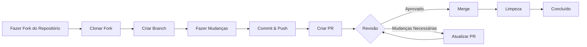

> Este guia o orienta através do processo completo de contribuição para XOOPS, desde a configuração inicial até a pull request mesclada.

---

## Pré-requisitos

Antes de começar a contribuir, certifique-se de ter:

- **Git** instalado e configurado
- **Conta do GitHub** (gratuita)
- **PHP 7.4+** para desenvolvimento XOOPS
- **Composer** para gerenciamento de dependências
- Conhecimento básico de fluxos de trabalho Git
- Familiaridade com Código de Conduta

---

## Passo 1: Fazer Fork do Repositório

### Na Interface Web do GitHub

1. Navegue até o repositório (ex: `XOOPS/XoopsCore27`)
2. Clique no botão **Fork** no canto superior direito
3. Selecione onde fazer fork (sua conta pessoal)
4. Aguarde o fork ser concluído

### Por Que Fazer Fork?

- Você obtém sua própria cópia para trabalhar
- Mantenedores não precisam gerenciar muitas branches
- Você tem controle total de seu fork
- Pull Requests referenciam seu fork e o repositório upstream

---

## Passo 2: Clonar Seu Fork Localmente

```bash
# Clone seu fork (substitua SEU_USUARIO)
git clone https://github.com/SEU_USUARIO/XoopsCore27.git
cd XoopsCore27

# Adicionar remote upstream para rastrear repositório original
git remote add upstream https://github.com/XOOPS/XoopsCore27.git

# Verificar se remotes estão configurados corretamente
git remote -v
# origin    https://github.com/SEU_USUARIO/XoopsCore27.git (fetch)
# origin    https://github.com/SEU_USUARIO/XoopsCore27.git (push)
# upstream  https://github.com/XOOPS/XoopsCore27.git (fetch)
# upstream  https://github.com/XOOPS/XoopsCore27.git (nofetch)
```

---

## Passo 3: Configurar Ambiente de Desenvolvimento

### Instalar Dependências

```bash
# Instalar dependências do Composer
composer install

# Instalar dependências de desenvolvimento
composer install --dev

# Para desenvolvimento de módulo
cd modules/mymodule
composer install
```

### Configurar Git

```bash
# Definir identidade de Git
git config user.name "Seu Nome"
git config user.email "seu.email@example.com"

# Opcional: Definir configuração global de Git
git config --global user.name "Seu Nome"
git config --global user.email "seu.email@example.com"
```

### Executar Testes

```bash
# Certificar-se de que testes passam em estado limpo
./vendor/bin/phpunit

# Executar suite de teste específica
./vendor/bin/phpunit --testsuite unit
```

---

## Passo 4: Criar Branch de Recurso

### Convenção de Nomenclatura de Branch

Siga este padrão: `<tipo>/<descrição>`

**Tipos:**
- `feature/` - Novo recurso
- `fix/` - Correção de bug
- `docs/` - Apenas documentação
- `refactor/` - Refatoração de código
- `test/` - Adições de teste
- `chore/` - Manutenção, tooling

**Exemplos:**
```bash
# Branch de recurso
git checkout -b feature/add-two-factor-auth

# Branch de correção de bug
git checkout -b fix/prevent-xss-in-forms

# Branch de documentação
git checkout -b docs/update-api-guide

# Sempre fazer branch a partir de upstream/main (ou develop)
git checkout -b feature/my-feature upstream/main
```

### Manter Branch Atualizada

```bash
# Antes de começar trabalho, sincronizar com upstream
git fetch upstream
git merge upstream/main

# Depois, se upstream mudou
git fetch upstream
git rebase upstream/main
```

---

## Passo 5: Fazer Suas Mudanças

### Práticas de Desenvolvimento

1. **Escrever código** seguindo Padrões de PHP
2. **Escrever testes** para nova funcionalidade
3. **Atualizar documentação** se necessário
4. **Executar linters** e formatadores de código

### Verificações de Qualidade de Código

```bash
# Executar todos os testes
./vendor/bin/phpunit

# Executar com cobertura
./vendor/bin/phpunit --coverage-html coverage/

# Executar PHP CS Fixer
./vendor/bin/php-cs-fixer fix --dry-run

# Executar análise estática PHPStan
./vendor/bin/phpstan analyse class/ src/
```

### Fazer Commit de Boas Mudanças

```bash
# Verificar o que você mudou
git status
git diff

# Preparar arquivos específicos
git add class/MyClass.php
git add tests/MyClassTest.php

# Ou preparar todas as mudanças
git add .

# Fazer commit com mensagem descritiva
git commit -m "feat(auth): adicionar suporte de autenticação de dois fatores"
```

---

## Passo 6: Manter Branch em Sincronização

Enquanto trabalha em seu recurso, a branch principal pode avançar:

```bash
# Buscar últimas mudanças do upstream
git fetch upstream

# Opção A: Rebase (preferido para histórico limpo)
git rebase upstream/main

# Opção B: Merge (mais simples mas adiciona merge commits)
git merge upstream/main

# Se conflitos ocorrem, resolvê-los então:
git add .
git rebase --continue  # ou git merge --continue
```

---

## Passo 7: Push para Seu Fork

```bash
# Push sua branch para seu fork
git push origin feature/my-feature

# Em push subsequentes
git push

# Se fez rebase, pode precisar force push (usar com cuidado!)
git push --force-with-lease origin feature/my-feature
```

---

## Passo 8: Criar Pull Request

### Na Interface Web do GitHub

1. Vá para seu fork no GitHub
2. Você verá uma notificação para criar um PR de sua branch
3. Clique em **"Compare & pull request"**
4. Ou manualmente clique em **"New pull request"** e selecione sua branch

### Título e Descrição de PR

**Formato de Título:**
```
<tipo>(<escopo>): <assunto>
```

Exemplos:
```
feat(auth): adicionar autenticação de dois fatores
fix(forms): prevenir XSS em entrada de texto
docs: atualizar guia de instalação
refactor(core): melhorar performance
```

**Modelo de Descrição:**

```markdown
## Descrição
Breve explicação do que este PR faz.

## Mudanças
- Mudou X de A para B
- Adicionou recurso Y
- Corrigiu bug Z

## Tipo de Mudança
- [ ] Novo recurso (adiciona nova funcionalidade)
- [ ] Correção de bug (corrige um problema)
- [ ] Mudança quebra-compatibilidade (API/mudança de comportamento)
- [ ] Atualização de documentação

## Testes
- [ ] Adicionados testes para nova funcionalidade
- [ ] Todos os testes existentes passam
- [ ] Teste manual realizado

## Capturas de Tela (se aplicável)
Incluir capturas de tela antes/depois para mudanças de UI.

## Problemas Relacionados
Fecha #123
Relacionado a #456

## Lista de Verificação
- [ ] Código segue diretrizes de estilo
- [ ] Autorrevisão do próprio código
- [ ] Comentado código complexo
- [ ] Documentação atualizada
- [ ] Nenhum novo aviso gerado
- [ ] Testes passam localmente
```

### Lista de Verificação de Revisão de PR

Antes de submeter, certifique-se:

- [ ] Código segue Padrões de PHP
- [ ] Testes incluídos e passam
- [ ] Documentação atualizada (se necessário)
- [ ] Nenhum conflito de merge
- [ ] Mensagens de commit claras
- [ ] Problemas relacionados referenciados
- [ ] Descrição de PR é detalhada
- [ ] Sem código de debug ou console logs

---

## Passo 9: Responder ao Feedback

### Durante Revisão de Código

1. **Ler comentários cuidadosamente** - Entender o feedback
2. **Fazer perguntas** - Se pouco claro, pedir esclarecimento
3. **Discutir alternativas** - Respeitosamente debater abordagens
4. **Fazer mudanças solicitadas** - Atualizar sua branch
5. **Force-push commits atualizados** - Se reescrever histórico

```bash
# Fazer mudanças
git add .
git commit --amend  # Modificar último commit
git push --force-with-lease origin feature/my-feature

# Ou adicionar novos commits
git commit -m "Endereçar feedback de revisão de PR"
git push origin feature/my-feature
```

### Esperar Iteração

- A maioria das PRs requer múltiplas rodadas de revisão
- Ser paciente e construtivo
- Ver feedback como oportunidade de aprendizado
- Mantenedores podem sugerir refators

---

## Passo 10: Merge e Limpeza

### Após Aprovação

Uma vez que mantenedores aprovam e mesclam:

1. **GitHub auto-mescla** ou mantenedor clica merge
2. **Sua branch é deletada** (geralmente automático)
3. **Mudanças estão em upstream**

### Limpeza Local

```bash
# Mudar para branch principal
git checkout main

# Atualizar main com mudanças mescladas
git fetch upstream
git merge upstream/main

# Deletar branch local de recurso
git branch -d feature/my-feature

# Deletar do seu fork (se não for auto-deletado)
git push origin --delete feature/my-feature
```

---

## Diagrama de Fluxo



---

## Cenários Comuns

### Sincronizando Antes de Começar

```bash
# Sempre começar fresco
git fetch upstream
git checkout -b feature/new-thing upstream/main
```

### Adicionando Mais Commits

```bash
# Apenas fazer push novamente
git add .
git commit -m "feat: mudanças adicionais"
git push origin feature/new-thing
```

### Corrigindo Erros

```bash
# Último commit tem mensagem errada
git commit --amend -m "Mensagem correta"
git push --force-with-lease

# Reverter para estado anterior (cuidado!)
git reset --soft HEAD~1  # Manter mudanças
git reset --hard HEAD~1  # Descartar mudanças
```

### Manipulando Conflitos de Merge

```bash
# Rebase e resolver conflitos
git fetch upstream
git rebase upstream/main

# Editar arquivos conflitantes para resolver
# Então continuar
git add .
git rebase --continue
git push --force-with-lease
```

---

## Melhores Práticas

### Faça

- Manter branches focadas em problemas únicos
- Fazer commits pequenos e lógicos
- Escrever mensagens de commit descritivas
- Atualizar sua branch frequentemente
- Testar antes de fazer push
- Documentar mudanças
- Ser responsivo ao feedback

### Não Faça

- Trabalhar diretamente em branch main/master
- Misturar mudanças não relacionadas em um PR
- Fazer commit de arquivos gerados ou node_modules
- Force push após PR ser público (use --force-with-lease)
- Ignorar feedback de revisão de código
- Criar PRs massivas (quebrar em menores)
- Fazer commit de dados sensíveis (chaves de API, senhas)

---

## Dicas para Sucesso

### Comunicar

- Fazer perguntas em problemas antes de começar trabalho
- Pedir orientação sobre mudanças complexas
- Discutir abordagem na descrição do PR
- Responder ao feedback prontamente

### Seguir Padrões

- Revisar Padrões de PHP
- Verificar diretrizes de Relatório de Problema
- Ler Visão Geral de Contribuição
- Seguir Diretrizes de Pull Request

### Aprender o Codebase

- Ler padrões de código existentes
- Estudar implementações similares
- Entender a arquitetura
- Consultar Conceitos Principais

---

## Documentação Relacionada

- Código de Conduta
- Diretrizes de Pull Request
- Relatório de Problema
- Padrões de Codificação PHP
- Visão Geral de Contribuição

---

#xoops #git #github #contributing #workflow #pull-request
