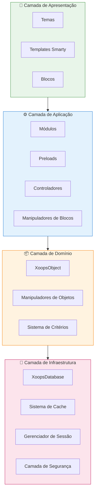
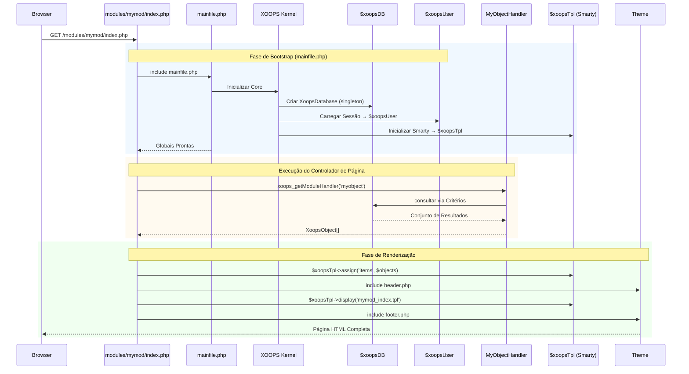

:::note[Sobre Este Documento]
Esta página descreve a **arquitetura conceitual** do XOOPS que se aplica às versões atuais (2.5.x) e futuras (4.0.x). Alguns diagramas mostram a visão de design em camadas.

**Para detalhes específicos da versão:**
- **XOOPS 2.5.x Atual:** Usa `mainfile.php`, globais (`$xoopsDB`, `$xoopsUser`), preloads e padrão de handlers
- **XOOPS 4.0 Alvo:** Middleware PSR-15, container DI, roteador - veja [Roadmap](../../07-XOOPS-4.0/XOOPS-4.0-Roadmap.md)
:::

Este documento fornece uma visão geral abrangente da arquitetura do sistema XOOPS, explicando como os vários componentes funcionam juntos para criar um sistema de gerenciamento de conteúdo flexível e extensível.

## Visão Geral

O XOOPS segue uma arquitetura modular que separa as preocupações em camadas distintas. O sistema é construído em torno de vários princípios principais:

- **Modularidade**: A funcionalidade é organizada em módulos independentes e instaláveis
- **Extensibilidade**: O sistema pode ser estendido sem modificar o código principal
- **Abstração**: As camadas de banco de dados e apresentação são abstraídas da lógica de negócio
- **Segurança**: Mecanismos de segurança integrados protegem contra vulnerabilidades comuns

## Camadas do Sistema



### 1. Camada de Apresentação

A camada de apresentação lida com a renderização da interface do usuário usando o mecanismo de templates Smarty.

**Componentes Principais:**
- **Temas**: Estilo visual e layout
- **Templates Smarty**: Renderização de conteúdo dinâmico
- **Blocos**: Widgets de conteúdo reutilizáveis

### 2. Camada de Aplicação

A camada de aplicação contém a lógica de negócio, controladores e funcionalidade do módulo.

**Componentes Principais:**
- **Módulos**: Pacotes de funcionalidade independentes
- **Manipuladores**: Classes de manipulação de dados
- **Preloads**: Ouvintes de eventos e ganchos

### 3. Camada de Domínio

A camada de domínio contém objetos de negócio principais e regras.

**Componentes Principais:**
- **XoopsObject**: Classe base para todos os objetos de domínio
- **Manipuladores**: Operações CRUD para objetos de domínio

### 4. Camada de Infraestrutura

A camada de infraestrutura fornece serviços principais como acesso a banco de dados e cache.

## Ciclo de Vida da Requisição

Entender o ciclo de vida da requisição é crucial para o desenvolvimento eficaz do XOOPS.

### Fluxo do Controlador de Página XOOPS 2.5.x

O XOOPS 2.5.x atual usa um padrão **Page Controller** onde cada arquivo PHP lida com sua própria requisição. As globais (`$xoopsDB`, `$xoopsUser`, `$xoopsTpl`, etc.) são inicializadas durante o bootstrap e disponíveis em toda a execução.



### Globais Principais em 2.5.x

| Global | Tipo | Inicializado | Propósito |
|--------|------|-------------|---------|
| `$xoopsDB` | `XoopsDatabase` | Bootstrap | Conexão com banco de dados (singleton) |
| `$xoopsUser` | `XoopsUser\|null` | Carregamento de sessão | Usuário atualmente conectado |
| `$xoopsTpl` | `XoopsTpl` | Inicialização de template | Mecanismo de templates Smarty |
| `$xoopsModule` | `XoopsModule` | Carregamento de módulo | Contexto do módulo atual |
| `$xoopsConfig` | `array` | Carregamento de configuração | Configuração do sistema |

:::note[Comparação XOOPS 4.0]
No XOOPS 4.0, o padrão Page Controller é substituído por um **Pipeline de Middleware PSR-15** e despacho baseado em roteador. As globais são substituídas por injeção de dependência. Veja [Contrato de Modo Híbrido](../../07-XOOPS-4.0/Specifications/Hybrid-Mode-Contract.md) para garantias de compatibilidade durante a migração.
:::

### 1. Fase de Bootstrap

```php
// mainfile.php é o ponto de entrada
include_once XOOPS_ROOT_PATH . '/mainfile.php';

// Inicialização do core
$xoops = Xoops::getInstance();
$xoops->boot();
```

**Passos:**
1. Carregar configuração (`mainfile.php`)
2. Inicializar autoloader
3. Configurar tratamento de erros
4. Estabelecer conexão com banco de dados
5. Carregar sessão do usuário
6. Inicializar mecanismo de templates Smarty

### 2. Fase de Roteamento

```php
// Roteamento de requisição para módulo apropriado
$module = $GLOBALS['xoopsModule'];
$controller = $module->getController();
$controller->dispatch($request);
```

**Passos:**
1. Analisar URL da requisição
2. Identificar módulo alvo
3. Carregar configuração do módulo
4. Verificar permissões
5. Rotear para manipulador apropriado

### 3. Fase de Execução

```php
// Execução do controlador
$data = $handler->getObjects($criteria);
$xoopsTpl->assign('items', $data);
```

**Passos:**
1. Executar lógica do controlador
2. Interagir com a camada de dados
3. Processar regras de negócio
4. Preparar dados da visualização

### 4. Fase de Renderização

```php
// Renderização de template
include XOOPS_ROOT_PATH . '/header.php';
$xoopsTpl->display('db:module_template.tpl');
include XOOPS_ROOT_PATH . '/footer.php';
```

**Passos:**
1. Aplicar layout do tema
2. Renderizar template do módulo
3. Processar blocos
4. Gerar resposta

## Componentes Principais

### XoopsObject

A classe base para todos os objetos de dados no XOOPS.

```php
<?php
class MyModuleItem extends XoopsObject
{
    public function __construct()
    {
        $this->initVar('id', XOBJ_DTYPE_INT, null, false);
        $this->initVar('title', XOBJ_DTYPE_TXTBOX, '', true, 255);
        $this->initVar('content', XOBJ_DTYPE_TXTAREA, '', false);
        $this->initVar('created', XOBJ_DTYPE_INT, time(), false);
    }
}
```

**Métodos Principais:**
- `initVar()` - Definir propriedades do objeto
- `getVar()` - Recuperar valores de propriedade
- `setVar()` - Definir valores de propriedade
- `assignVars()` - Atribuição em massa a partir de array

### XoopsPersistableObjectHandler

Lida com operações CRUD para instâncias de XoopsObject.

```php
<?php
class MyModuleItemHandler extends XoopsPersistableObjectHandler
{
    public function __construct(\XoopsDatabase $db)
    {
        parent::__construct($db, 'mymodule_items', 'MyModuleItem', 'id', 'title');
    }

    public function getActiveItems($limit = 10)
    {
        $criteria = new CriteriaCompo();
        $criteria->add(new Criteria('status', 1));
        $criteria->setSort('created');
        $criteria->setOrder('DESC');
        $criteria->setLimit($limit);

        return $this->getObjects($criteria);
    }
}
```

**Métodos Principais:**
- `create()` - Criar nova instância de objeto
- `get()` - Recuperar objeto por ID
- `insert()` - Salvar objeto no banco de dados
- `delete()` - Remover objeto do banco de dados
- `getObjects()` - Recuperar múltiplos objetos
- `getCount()` - Contar objetos correspondentes

### Estrutura do Módulo

Cada módulo XOOPS segue uma estrutura de diretório padrão:

```
modules/mymodule/
├── class/                  # Classes PHP
│   ├── MyModuleItem.php
│   └── MyModuleItemHandler.php
├── include/                # Arquivos de inclusão
│   ├── common.php
│   └── functions.php
├── templates/              # Templates Smarty
│   ├── mymodule_index.tpl
│   └── mymodule_item.tpl
├── admin/                  # Área de administrador
│   ├── index.php
│   └── menu.php
├── language/               # Traduções
│   └── english/
│       ├── main.php
│       └── modinfo.php
├── sql/                    # Esquema de banco de dados
│   └── mysql.sql
├── xoops_version.php       # Informações do módulo
├── index.php               # Entrada do módulo
└── header.php              # Cabeçalho do módulo
```

## Container de Injeção de Dependência

O desenvolvimento moderno do XOOPS pode aproveitar a injeção de dependência para melhor testabilidade.

### Implementação Básica do Container

```php
<?php
class XoopsDependencyContainer
{
    private array $services = [];

    public function register(string $name, callable $factory): void
    {
        $this->services[$name] = $factory;
    }

    public function resolve(string $name): mixed
    {
        if (!isset($this->services[$name])) {
            throw new \InvalidArgumentException("Service not found: $name");
        }

        $factory = $this->services[$name];

        if (is_callable($factory)) {
            return $factory($this);
        }

        return $factory;
    }

    public function has(string $name): bool
    {
        return isset($this->services[$name]);
    }
}
```

### Container Compatível com PSR-11

```php
<?php
namespace Xmf\Di;

use Psr\Container\ContainerInterface;

class BasicContainer implements ContainerInterface
{
    protected array $definitions = [];

    public function set(string $id, mixed $value): void
    {
        $this->definitions[$id] = $value;
    }

    public function get(string $id): mixed
    {
        if (!$this->has($id)) {
            throw new \InvalidArgumentException("Service not found: $id");
        }

        $entry = $this->definitions[$id];

        if (is_callable($entry)) {
            return $entry($this);
        }

        return $entry;
    }

    public function has(string $id): bool
    {
        return isset($this->definitions[$id]);
    }
}
```

### Exemplo de Uso

```php
<?php
// Registro de serviço
$container = new XoopsDependencyContainer();

$container->register('database', function () {
    return XoopsDatabaseFactory::getDatabaseConnection();
});

$container->register('userHandler', function ($c) {
    return new XoopsUserHandler($c->resolve('database'));
});

// Resolução de serviço
$userHandler = $container->resolve('userHandler');
$user = $userHandler->get($userId);
```

## Pontos de Extensão

O XOOPS fornece vários mecanismos de extensão:

### 1. Preloads

Os preloads permitem que os módulos se conectem a eventos principais.

```php
<?php
// modules/mymodule/preloads/core.php
class MymoduleCorePreload extends XoopsPreloadItem
{
    public static function eventCoreHeaderEnd($args)
    {
        // Executar quando o processamento do cabeçalho termina
    }

    public static function eventCoreFooterStart($args)
    {
        // Executar quando o processamento do rodapé começa
    }
}
```

### 2. Plugins

Os plugins estendem funcionalidades específicas dentro dos módulos.

```php
<?php
// modules/mymodule/plugins/notify.php
class MymoduleNotifyPlugin
{
    public function onItemCreate($item)
    {
        // Enviar notificação quando item é criado
    }
}
```

### 3. Filtros

Os filtros modificam dados conforme passam pelo sistema.

```php
<?php
// Exemplo de filtro de conteúdo
$myts = MyTextSanitizer::getInstance();
$content = $myts->displayTarea($rawContent, 1, 1, 1);
```

## Boas Práticas

### Organização de Código

1. **Use namespaces** para novo código:
   ```php
   namespace XoopsModules\MyModule;

   class Item extends \XoopsObject
   {
       // Implementação
   }
   ```

2. **Siga autoload PSR-4**:
   ```json
   {
       "autoload": {
           "psr-4": {
               "XoopsModules\\MyModule\\": "class/"
           }
       }
   }
   ```

3. **Separe responsabilidades**:
   - Lógica de domínio em `class/`
   - Apresentação em `templates/`
   - Controladores na raiz do módulo

### Desempenho

1. **Use cache** para operações custosas
2. **Carregue lazy** recursos quando possível
3. **Minimize consultas ao banco de dados** usando lote de critérios
4. **Otimize templates** evitando lógica complexa

### Segurança

1. **Valide toda entrada** usando `Xmf\Request`
2. **Escape output** em templates
3. **Use prepared statements** para consultas ao banco de dados
4. **Verifique permissões** antes de operações sensíveis

## Documentação Relacionada

- [Design-Patterns](Design-Patterns.md) - Padrões de design usados no XOOPS
- [Database Layer](../Database/Database-Layer.md) - Detalhes de abstração de banco de dados
- [Smarty Basics](../Templates/Smarty-Basics.md) - Documentação do sistema de templates
- [Security Best Practices](../Security/Security-Best-Practices.md) - Diretrizes de segurança

---

#xoops #arquitetura #core #design #system-design
