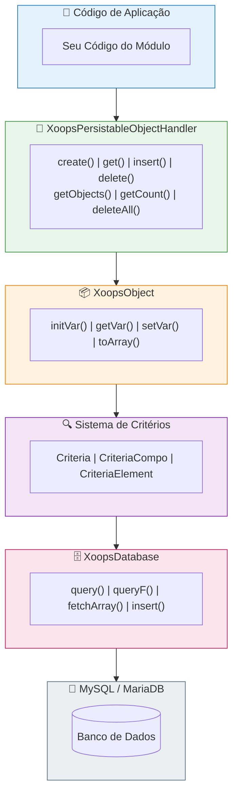

# 🗄️ Camada de Banco de Dados

<span class="version-badge version-25x">2.5.x ✅</span> <span class="version-badge version-40x">4.0.x ✅</span>

> Entendendo a abstração de banco de dados XOOPS, persistência de objetos e construção de consultas.

:::tip[Torne Seu Acesso a Dados à Prova do Futuro]
O padrão handler/Critérios funciona em ambas as versões. Para se preparar para XOOPS 4.0, considere envolver manipuladores em classes [Repository](../../03-Module-Development/Patterns/Repository-Pattern.md) para melhor testabilidade. Veja [Escolhendo um Padrão de Acesso a Dados](../../03-Module-Development/Choosing-Data-Access-Pattern.md).
:::

---

## Visão Geral

A camada de banco de dados XOOPS fornece uma abstração robusta sobre MySQL/MariaDB, apresentando:

- **Padrão Factory** - Gerenciamento centralizado de conexão com banco de dados
- **Mapeamento Objeto-Relacional** - XoopsObject e manipuladores
- **Construção de Consultas** - Sistema de Critérios para consultas complexas
- **Reutilização de Conexão** - Conexão única via factory singleton (não pool)

---

## 🏗️ Arquitetura



---

## 🔌 Conexão com Banco de Dados

### Obtendo a Conexão

```php
// Recomendado: Use a instância de banco de dados global
$db = \XoopsDatabaseFactory::getDatabaseConnection();

// Legado: Variável global (ainda funciona)
global $xoopsDB;
```

### XoopsDatabaseFactory

O padrão factory garante que uma única conexão de banco de dados seja reutilizada:

```php
<?php

class XoopsDatabaseFactory
{
    private static ?XoopsDatabase $instance = null;

    public static function getDatabaseConnection(): XoopsDatabase
    {
        if (self::$instance === null) {
            self::$instance = new XoopsMySQLDatabase();
        }
        return self::$instance;
    }
}
```

---

## 📦 XoopsObject

A classe base para todos os objetos de dados no XOOPS.

### Definindo um Objeto

```php
<?php

namespace XoopsModules\MyModule;

class Article extends \XoopsObject
{
    public function __construct()
    {
        $this->initVar('article_id', \XOBJ_DTYPE_INT, null, false);
        $this->initVar('category_id', \XOBJ_DTYPE_INT, 0, true);
        $this->initVar('title', \XOBJ_DTYPE_TXTBOX, '', true, 255);
        $this->initVar('content', \XOBJ_DTYPE_TXTAREA, '', false);
        $this->initVar('author_id', \XOBJ_DTYPE_INT, 0, true);
        $this->initVar('status', \XOBJ_DTYPE_TXTBOX, 'draft', true, 20);
        $this->initVar('views', \XOBJ_DTYPE_INT, 0, false);
        $this->initVar('created', \XOBJ_DTYPE_INT, time(), false);
        $this->initVar('updated', \XOBJ_DTYPE_INT, 0, false);
    }
}
```

### Tipos de Dados

| Constante | Tipo | Descrição |
|----------|------|-------------|
| `XOBJ_DTYPE_INT` | Inteiro | Valores numéricos |
| `XOBJ_DTYPE_TXTBOX` | String | Texto curto (< 255 caracteres) |
| `XOBJ_DTYPE_TXTAREA` | Texto | Conteúdo de texto longo |
| `XOBJ_DTYPE_EMAIL` | Email | Endereços de email |
| `XOBJ_DTYPE_URL` | URL | Endereços web |
| `XOBJ_DTYPE_FLOAT` | Float | Números decimais |
| `XOBJ_DTYPE_ARRAY` | Array | Arrays serializados |
| `XOBJ_DTYPE_OTHER` | Misto | Dados brutos |

### Trabalhando com Objetos

```php
// Criar novo objeto
$article = new Article();

// Definir valores
$article->setVar('title', 'Meu Artigo');
$article->setVar('content', 'Conteúdo do artigo aqui...');
$article->setVar('category_id', 5);
$article->setVar('author_id', $xoopsUser->getVar('uid'));

// Obter valores
$title = $article->getVar('title');           // Valor bruto
$titleDisplay = $article->getVar('title', 'e'); // Para edição (entidades HTML)
$titleShow = $article->getVar('title', 's');    // Para exibição (sanitizado)

// Atribuição em massa a partir de array
$article->assignVars([
    'title' => 'Novo Título',
    'status' => 'publicado'
]);

// Converter para array
$data = $article->toArray();
```

---

## 🔧 Manipuladores de Objeto

### XoopsPersistableObjectHandler

A classe manipulador gerencia operações CRUD para instâncias de XoopsObject.

```php
<?php

namespace XoopsModules\MyModule;

class ArticleHandler extends \XoopsPersistableObjectHandler
{
    public function __construct(\XoopsDatabase $db = null)
    {
        parent::__construct(
            $db,
            'mymodule_articles',  // Nome da tabela
            Article::class,       // Classe do objeto
            'article_id',         // Chave primária
            'title'               // Campo identificador
        );
    }
}
```

### Métodos do Manipulador

```php
// Obter instância do manipulador
$articleHandler = xoops_getModuleHandler('article', 'mymodule');

// Criar novo objeto
$article = $articleHandler->create();

// Obter por ID
$article = $articleHandler->get(123);

// Inserir (criar ou atualizar)
$success = $articleHandler->insert($article);

// Deletar
$success = $articleHandler->delete($article);

// Obter múltiplos objetos
$articles = $articleHandler->getObjects($criteria);

// Obter contagem
$count = $articleHandler->getCount($criteria);

// Obter como array (chave => valor)
$list = $articleHandler->getList($criteria);

// Deletar múltiplos
$deleted = $articleHandler->deleteAll($criteria);
```

### Métodos Personalizados do Manipulador

```php
<?php

namespace XoopsModules\MyModule;

class ArticleHandler extends \XoopsPersistableObjectHandler
{
    // ... construtor

    /**
     * Obter artigos publicados
     */
    public function getPublished(int $limit = 10, int $start = 0): array
    {
        $criteria = new \CriteriaCompo();
        $criteria->add(new \Criteria('status', 'publicado'));
        $criteria->setSort('created');
        $criteria->setOrder('DESC');
        $criteria->setLimit($limit);
        $criteria->setStart($start);

        return $this->getObjects($criteria);
    }

    /**
     * Obter artigos por categoria
     */
    public function getByCategory(int $categoryId, int $limit = 10): array
    {
        $criteria = new \CriteriaCompo();
        $criteria->add(new \Criteria('category_id', $categoryId));
        $criteria->add(new \Criteria('status', 'publicado'));
        $criteria->setSort('created');
        $criteria->setOrder('DESC');
        $criteria->setLimit($limit);

        return $this->getObjects($criteria);
    }

    /**
     * Obter artigos por autor
     */
    public function getByAuthor(int $authorId): array
    {
        $criteria = new \Criteria('author_id', $authorId);
        return $this->getObjects($criteria);
    }

    /**
     * Incrementar contagem de visualizações
     */
    public function incrementViews(int $articleId): bool
    {
        $sql = sprintf(
            'UPDATE %s SET views = views + 1 WHERE article_id = %d',
            $this->table,
            $articleId
        );
        return $this->db->queryF($sql) !== false;
    }

    /**
     * Obter artigos populares
     */
    public function getPopular(int $limit = 5): array
    {
        $criteria = new \CriteriaCompo();
        $criteria->add(new \Criteria('status', 'publicado'));
        $criteria->setSort('views');
        $criteria->setOrder('DESC');
        $criteria->setLimit($limit);

        return $this->getObjects($criteria);
    }
}
```

---

## 🔍 Sistema de Critérios

O sistema de Critérios fornece uma maneira poderosa e orientada a objetos para construir cláusulas SQL WHERE.

### Critérios Básicos

```php
// Igualdade simples
$criteria = new \Criteria('status', 'publicado');

// Com operador
$criteria = new \Criteria('views', 100, '>=');

// Comparação de coluna
$criteria = new \Criteria('updated', 'created', '>');
```

### CriteriaCompo (Combinando Critérios)

```php
$criteria = new \CriteriaCompo();

// Condições AND (padrão)
$criteria->add(new \Criteria('status', 'publicado'));
$criteria->add(new \Criteria('category_id', 5));

// Condições OR
$criteria->add(new \Criteria('featured', 1), 'OR');

// Condições aninhadas
$subCriteria = new \CriteriaCompo();
$subCriteria->add(new \Criteria('author_id', 1));
$subCriteria->add(new \Criteria('author_id', 2), 'OR');
$criteria->add($subCriteria);
```

### Ordenação e Paginação

```php
$criteria = new \CriteriaCompo();
$criteria->add(new \Criteria('status', 'publicado'));

// Ordenação
$criteria->setSort('created');
$criteria->setOrder('DESC');

// Múltiplos campos de ordenação
$criteria->setSort('category_id, created');
$criteria->setOrder('ASC, DESC');

// Paginação
$criteria->setLimit(10);    // Itens por página
$criteria->setStart(20);    // Offset

// Agrupar por
$criteria->setGroupby('category_id');
```

### Operadores

| Operador | Exemplo | Saída SQL |
|----------|---------|------------|
| `=` | `new Criteria('status', 'publicado')` | `status = 'publicado'` |
| `!=` | `new Criteria('status', 'draft', '!=')` | `status != 'draft'` |
| `>` | `new Criteria('views', 100, '>')` | `views > 100` |
| `>=` | `new Criteria('views', 100, '>=')` | `views >= 100` |
| `<` | `new Criteria('views', 100, '<')` | `views < 100` |
| `<=` | `new Criteria('views', 100, '<=')` | `views <= 100` |
| `LIKE` | `new Criteria('title', '%php%', 'LIKE')` | `title LIKE '%php%'` |
| `NOT LIKE` | `new Criteria('title', '%test%', 'NOT LIKE')` | `title NOT LIKE '%test%'` |
| `IN` | `new Criteria('id', '(1,2,3)', 'IN')` | `id IN (1,2,3)` |
| `NOT IN` | `new Criteria('id', '(1,2,3)', 'NOT IN')` | `id NOT IN (1,2,3)` |

### Exemplo Complexo

```php
// Encontrar artigos publicados em categorias específicas,
// com termo de busca no título, ordenados por visualizações
$criteria = new \CriteriaCompo();

// Status deve ser publicado
$criteria->add(new \Criteria('status', 'publicado'));

// Em categorias 1, 2 ou 3
$criteria->add(new \Criteria('category_id', '(1, 2, 3)', 'IN'));

// Título contém termo de busca
$searchTerm = '%' . $db->escape($searchQuery) . '%';
$criteria->add(new \Criteria('title', $searchTerm, 'LIKE'));

// Criado nos últimos 30 dias
$thirtyDaysAgo = time() - (30 * 24 * 60 * 60);
$criteria->add(new \Criteria('created', $thirtyDaysAgo, '>='));

// Ordenar por visualizações descendente
$criteria->setSort('views');
$criteria->setOrder('DESC');

// Paginar
$criteria->setLimit(10);
$criteria->setStart($page * 10);

$articles = $articleHandler->getObjects($criteria);
$totalCount = $articleHandler->getCount($criteria);
```

---

## 📝 Consultas Diretas

Para consultas complexas não possíveis com Critérios, use SQL direto.

### Consultas Seguras (Leitura)

```php
$db = \XoopsDatabaseFactory::getDatabaseConnection();

$sql = sprintf(
    'SELECT a.*, c.category_name
     FROM %s a
     LEFT JOIN %s c ON a.category_id = c.category_id
     WHERE a.status = %s
     ORDER BY a.created DESC
     LIMIT %d',
    $db->prefix('mymodule_articles'),
    $db->prefix('mymodule_categories'),
    $db->quoteString('publicado'),
    10
);

$result = $db->query($sql);

while ($row = $db->fetchArray($result)) {
    // Processar linha
    echo $row['title'];
}
```

### Consultas de Escrita

```php
// Inserir
$sql = sprintf(
    "INSERT INTO %s (title, content, created) VALUES (%s, %s, %d)",
    $db->prefix('mymodule_articles'),
    $db->quoteString($title),
    $db->quoteString($content),
    time()
);
$db->queryF($sql);
$newId = $db->getInsertId();

// Atualizar
$sql = sprintf(
    "UPDATE %s SET views = views + 1 WHERE article_id = %d",
    $db->prefix('mymodule_articles'),
    $articleId
);
$db->queryF($sql);
$affectedRows = $db->getAffectedRows();

// Deletar
$sql = sprintf(
    "DELETE FROM %s WHERE article_id = %d",
    $db->prefix('mymodule_articles'),
    $articleId
);
$db->queryF($sql);
```

### Escapando Valores

```php
// Escape de string
$safeString = $db->quoteString($userInput);
// ou
$safeString = $db->escape($userInput);

// Inteiro (sem escape necessário, apenas conversão)
$safeInt = (int) $userInput;
```

---

## ⚠️ Boas Práticas de Segurança

### Sempre Escape de Entrada do Usuário

```php
// NUNCA faça isto
$sql = "SELECT * FROM articles WHERE title = '$_GET[title]'"; // Injeção SQL!

// FAÇA isto
$title = $db->escape($_GET['title']);
$sql = "SELECT * FROM articles WHERE title = '$title'";

// Ou melhor, use Critérios
$criteria = new \Criteria('title', $db->escape($_GET['title']));
```

### Use Consultas Parametrizadas (XMF)

```php
use Xmf\Database\TableLoad;

// Inserção em massa segura
$tableLoad = new TableLoad('mymodule_articles');
$tableLoad->insert([
    ['title' => 'Artigo 1', 'content' => 'Conteúdo 1'],
    ['title' => 'Artigo 2', 'content' => 'Conteúdo 2'],
]);
```

### Validar Tipos de Entrada

```php
use Xmf\Request;

$id = Request::getInt('id', 0, 'GET');
$title = Request::getString('title', '', 'POST');
```

---

## 📊 Exemplo de Esquema de Banco de Dados

```sql
-- sql/mysql.sql

CREATE TABLE `{PREFIX}_mymodule_articles` (
    `article_id` INT(11) UNSIGNED NOT NULL AUTO_INCREMENT,
    `category_id` INT(11) UNSIGNED NOT NULL DEFAULT 0,
    `title` VARCHAR(255) NOT NULL DEFAULT '',
    `content` TEXT,
    `author_id` INT(11) UNSIGNED NOT NULL DEFAULT 0,
    `status` VARCHAR(20) NOT NULL DEFAULT 'draft',
    `views` INT(11) UNSIGNED NOT NULL DEFAULT 0,
    `created` INT(11) UNSIGNED NOT NULL DEFAULT 0,
    `updated` INT(11) UNSIGNED NOT NULL DEFAULT 0,
    PRIMARY KEY (`article_id`),
    KEY `category_id` (`category_id`),
    KEY `author_id` (`author_id`),
    KEY `status` (`status`),
    KEY `created` (`created`)
) ENGINE=InnoDB DEFAULT CHARSET=utf8mb4;
```

---

## 🔗 Documentação Relacionada

- [Análise Profunda do Sistema de Critérios](../../04-API-Reference/Kernel/Criteria.md)
- [Padrões de Design - Factory](../Architecture/Design-Patterns.md)
- [Prevenção de Injeção de SQL](../Security/SQL-Injection-Prevention.md)
- [Referência API XoopsDatabase](../../04-API-Reference/Database/XoopsDatabase.md)

---

#xoops #banco-de-dados #orm #critérios #manipuladores #mysql
