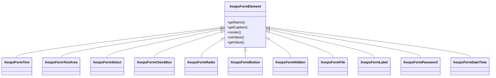

## Visão Geral

O XOOPS fornece um conjunto abrangente de elementos de formulário através de sua hierarquia de classe `XoopsFormElement`. Esses elementos lidam com renderização, validação e processamento de dados para formulários web.

## Hierarquia de Elemento de Formulário



## Elementos de Entrada de Texto

### XoopsFormText

Entrada de texto em uma linha:

```php
use XoopsFormText;

$element = new XoopsFormText(
    caption: 'Nome de Usuário',
    name: 'username',
    size: 30,
    maxlength: 50,
    value: $currentValue
);
```

### XoopsFormPassword

Entrada de senha com mascaramento:

```php
use XoopsFormPassword;

$element = new XoopsFormPassword(
    caption: 'Senha',
    name: 'password',
    size: 30,
    maxlength: 100
);
```

### XoopsFormTextArea

Entrada de texto em múltiplas linhas:

```php
use XoopsFormTextArea;

$element = new XoopsFormTextArea(
    caption: 'Descrição',
    name: 'description',
    value: $currentValue,
    rows: 5,
    cols: 50
);
```

## Elementos de Seleção

### XoopsFormSelect

Dropdown de seleção:

```php
use XoopsFormSelect;

$element = new XoopsFormSelect(
    caption: 'Categoria',
    name: 'category_id',
    value: $selected,
    size: 1,
    multiple: false
);

$element->addOption(1, 'Categoria 1');
$element->addOption(2, 'Categoria 2');
$element->addOptionArray([
    3 => 'Categoria 3',
    4 => 'Categoria 4'
]);
```

### XoopsFormCheckBox

Entrada de checkbox:

```php
use XoopsFormCheckBox;

$element = new XoopsFormCheckBox(
    caption: 'Recursos',
    name: 'features',
    value: $selected
);

$element->addOption('comments', 'Ativar Comentários');
$element->addOption('ratings', 'Ativar Classificações');
```

### XoopsFormRadio

Grupo de botões de rádio:

```php
use XoopsFormRadio;

$element = new XoopsFormRadio(
    caption: 'Status',
    name: 'status',
    value: $currentValue
);

$element->addOption('draft', 'Rascunho');
$element->addOption('published', 'Publicado');
$element->addOption('archived', 'Arquivado');
```

## Upload de Arquivo

### XoopsFormFile

Entrada de upload de arquivo:

```php
use XoopsFormFile;

$element = new XoopsFormFile(
    caption: 'Carregar Imagem',
    name: 'image'
);

$element->setMaxFileSize(2 * 1024 * 1024); // 2MB
```

## Data e Hora

### XoopsFormDateTime

Seletor de data/hora:

```php
use XoopsFormDateTime;

$element = new XoopsFormDateTime(
    caption: 'Data de Publicação',
    name: 'publish_date',
    size: 15,
    value: time()
);
```

## Elementos Especiais

### XoopsFormHidden

Campo oculto:

```php
use XoopsFormHidden;

$element = new XoopsFormHidden('article_id', $articleId);
```

### XoopsFormLabel

Etiqueta somente leitura:

```php
use XoopsFormLabel;

$element = new XoopsFormLabel(
    caption: 'Criado por',
    value: $authorName
);
```

### XoopsFormButton

Botões de formulário:

```php
use XoopsFormButton;

// Botão enviar
$submit = new XoopsFormButton('', 'submit', 'Salvar', 'submit');

// Botão redefinir
$reset = new XoopsFormButton('', 'reset', 'Redefinir', 'reset');
```

## Personalização de Elemento

### Adicionando Classes CSS

```php
$element->setExtra('class="form-control custom-class"');
```

### Adicionando Atributos Personalizados

```php
$element->setExtra('data-validate="required" placeholder="Digite texto..."');
```

### Definindo Descrição

```php
$element->setDescription('Digite um nome de usuário único (3-20 caracteres)');
```

## Documentação Relacionada

- Visão Geral de Formulários
- Validação de Formulário
- Renderizadores Personalizados
