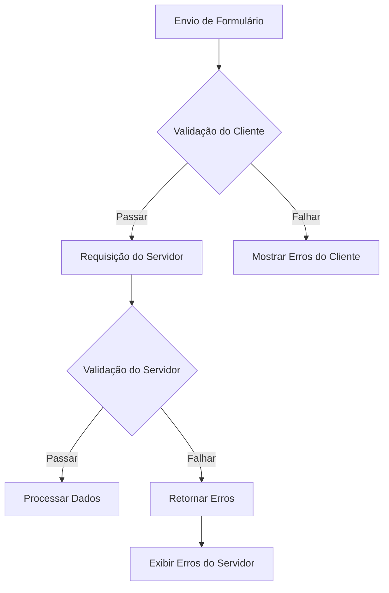

## Visão Geral

XOOPS fornece validação tanto do lado do cliente quanto do servidor para entradas de formulário. Este guia cobre técnicas de validação, validadores integrados e implementação de validação personalizada.

## Arquitetura de Validação



## Validação do Lado do Servidor

### Usando XoopsFormValidator

```php
use Xoops\Core\Form\Validator;

$validator = new Validator();

$validator->addRule('username', 'required', 'Nome de usuário é obrigatório');
$validator->addRule('username', 'minLength:3', 'Nome de usuário deve ter pelo menos 3 caracteres');
$validator->addRule('username', 'maxLength:50', 'Nome de usuário não pode exceder 50 caracteres');
$validator->addRule('email', 'email', 'Por favor, digite um endereço de email válido');
$validator->addRule('password', 'minLength:8', 'Senha deve ter pelo menos 8 caracteres');

if (!$validator->validate($_POST)) {
    $errors = $validator->getErrors();
    // Lidar com erros
}
```

### Regras de Validação Embutidas

| Regra | Descrição | Exemplo |
|------|-------------|---------|
| `required` | Campo não deve estar vazio | `required` |
| `email` | Formato de email válido | `email` |
| `url` | Formato de URL válido | `url` |
| `numeric` | Somente valor numérico | `numeric` |
| `integer` | Somente valor inteiro | `integer` |
| `minLength` | Comprimento mínimo de string | `minLength:3` |
| `maxLength` | Comprimento máximo de string | `maxLength:100` |
| `min` | Valor numérico mínimo | `min:1` |
| `max` | Valor numérico máximo | `max:100` |
| `regex` | Padrão regex personalizado | `regex:/^[a-z]+$/` |
| `in` | Valor em lista | `in:draft,published,archived` |
| `date` | Formato de data válido | `date` |
| `alpha` | Apenas letras | `alpha` |
| `alphanumeric` | Letras e números | `alphanumeric` |

### Regras de Validação Personalizadas

```php
$validator->addCustomRule('unique_username', function($value) {
    $memberHandler = xoops_getHandler('member');
    $criteria = new \CriteriaCompo();
    $criteria->add(new \Criteria('uname', $value));
    return $memberHandler->getUserCount($criteria) === 0;
}, 'Nome de usuário já existe');

$validator->addRule('username', 'unique_username');
```

## Validação de Requisição

### Sanitizando Entrada

```php
use Xoops\Core\Request;

// Obter valores sanitizados
$username = Request::getString('username', '', 'POST');
$email = Request::getEmail('email', '', 'POST');
$age = Request::getInt('age', 0, 'POST');
$price = Request::getFloat('price', 0.0, 'POST');
$tags = Request::getArray('tags', [], 'POST');

// Com validação
$username = Request::getString('username', '', 'POST', [
    'minLength' => 3,
    'maxLength' => 50
]);
```

### Prevenção de XSS

```php
use Xoops\Core\Text\Sanitizer;

$sanitizer = Sanitizer::getInstance();

// Sanitizar conteúdo HTML
$cleanContent = $sanitizer->sanitizeForDisplay($userContent);

// Remover todo HTML
$plainText = $sanitizer->stripHtml($userContent);

// Permitir tags específicas
$content = $sanitizer->sanitizeForDisplay($userContent, [
    'allowedTags' => '<p><br><strong><em><a>'
]);
```

## Validação do Lado do Cliente

### Atributos de Validação HTML5

```php
// Campo obrigatório
$element->setExtra('required');

// Validação de padrão
$element->setExtra('pattern="[a-zA-Z0-9]+" title="Apenas alfanumérico"');

// Restrições de comprimento
$element->setExtra('minlength="3" maxlength="50"');

// Restrições numéricas
$element->setExtra('min="1" max="100"');
```

### Validação JavaScript

```javascript
document.getElementById('myForm').addEventListener('submit', function(e) {
    const username = document.getElementById('username').value;
    const errors = [];

    if (username.length < 3) {
        errors.push('Nome de usuário deve ter pelo menos 3 caracteres');
    }

    if (!/^[a-zA-Z0-9_]+$/.test(username)) {
        errors.push('Nome de usuário pode conter apenas letras, números e sublinhados');
    }

    if (errors.length > 0) {
        e.preventDefault();
        displayErrors(errors);
    }
});
```

## Proteção CSRF

### Geração de Token

```php
// Gerar token no formulário
$form->addElement(new \XoopsFormHiddenToken());

// Isso adiciona um campo oculto com token de segurança
```

### Verificação de Token

```php
use Xoops\Core\Security;

if (!Security::checkReferer()) {
    die('Origem da requisição inválida');
}

if (!Security::checkToken()) {
    die('Token de segurança inválido');
}
```

## Validação de Upload de Arquivo

```php
use Xoops\Core\Uploader;

$uploader = new Uploader(
    uploadDir: XOOPS_UPLOAD_PATH . '/images/',
    allowedMimeTypes: ['image/jpeg', 'image/png', 'image/gif'],
    maxFileSize: 2 * 1024 * 1024, // 2MB
    maxWidth: 1920,
    maxHeight: 1080
);

if ($uploader->fetchMedia('image_upload')) {
    if ($uploader->upload()) {
        $savedFile = $uploader->getSavedFileName();
    } else {
        $errors[] = $uploader->getErrors();
    }
}
```

## Exibição de Erro

### Coletando Erros

```php
$errors = [];

if (empty($username)) {
    $errors['username'] = 'Nome de usuário é obrigatório';
}

if (!filter_var($email, FILTER_VALIDATE_EMAIL)) {
    $errors['email'] = 'Formato de email inválido';
}

if (!empty($errors)) {
    // Armazenar em sessão para exibição após redirecionamento
    $_SESSION['form_errors'] = $errors;
    $_SESSION['form_data'] = $_POST;
    header('Location: ' . $_SERVER['HTTP_REFERER']);
    exit;
}
```

### Exibindo Erros

```smarty
{if $errors}
<div class="alert alert-danger">
    <ul>
        {foreach $errors as $field => $message}
        <li>{$message}</li>
        {/foreach}
    </ul>
</div>
{/if}
```

## Boas Práticas

1. **Sempre validar no lado do servidor** - Validação do lado do cliente pode ser contornada
2. **Usar consultas parametrizadas** - Prevenir injeção de SQL
3. **Sanitizar saída** - Prevenir ataques XSS
4. **Validar uploads de arquivo** - Verificar tipos MIME e tamanhos
5. **Usar tokens CSRF** - Prevenir falsificação de requisição entre sites
6. **Limitar taxa de envios** - Prevenir abuso

## Documentação Relacionada

- Referência de Elementos de Formulário
- Visão Geral de Formulários
- Boas Práticas de Segurança
