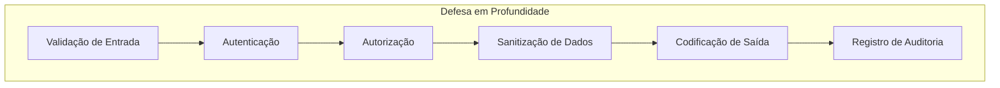

## Visão Geral

Este documento descreve boas práticas de segurança para desenvolvimento XOOPS, cobrindo validação de entrada, codificação de saída, autenticação, autorização e proteção contra vulnerabilidades web comuns.

## Princípios de Segurança



## Validação de Entrada

### Sanitização de Requisição

```php
use Xoops\Core\Request;

// Sempre usar getters tipados
$id = Request::getInt('id', 0, 'GET');
$name = Request::getString('name', '', 'POST');
$email = Request::getEmail('email', '', 'POST');
$url = Request::getUrl('website', '', 'POST');

// Nunca usar $_GET/$_POST/$_REQUEST brutos
// Ruim: $id = $_GET['id'];
// Bom: $id = Request::getInt('id', 0, 'GET');
```

### Regras de Validação

```php
// Validar antes de usar
if ($id <= 0) {
    throw new InvalidArgumentException('ID inválido');
}

if (!preg_match('/^[a-zA-Z0-9_]{3,50}$/', $username)) {
    throw new InvalidArgumentException('Formato de nome de usuário inválido');
}

// Usar validação whitelist para enums
$allowedStatuses = ['draft', 'publicado', 'arquivado'];
if (!in_array($status, $allowedStatuses, true)) {
    throw new InvalidArgumentException('Status inválido');
}
```

## Prevenção de Injeção de SQL

### Usar Consultas Parametrizadas

```php
// BOM: Consulta parametrizada
$sql = "SELECT * FROM {$xoopsDB->prefix('users')} WHERE uid = ?";
$result = $xoopsDB->query($sql, [$userId]);

// RUIM: Concatenação de string (vulnerável!)
// $sql = "SELECT * FROM users WHERE uid = " . $userId;
```

### Usando Objetos Criteria

```php
use Criteria;
use CriteriaCompo;

$criteria = new CriteriaCompo();
$criteria->add(new Criteria('status', 'publicado'));
$criteria->add(new Criteria('uid', $userId, '='));
$criteria->add(new Criteria('created', time() - 86400, '>'));

$articles = $articleHandler->getObjects($criteria);
```

## Prevenção de XSS

### Codificação de Saída

```php
use Xoops\Core\Text\Sanitizer;

// Contexto HTML
$safeName = htmlspecialchars($userName, ENT_QUOTES, 'UTF-8');

// Em templates (automaticamente escapado)
{$userName|escape}

// Para conteúdo rico
$sanitizer = Sanitizer::getInstance();
$safeContent = $sanitizer->sanitizeForDisplay($content);
```

### Política de Segurança de Conteúdo

```php
// Definir cabeçalhos CSP
header("Content-Security-Policy: default-src 'self'; script-src 'self'; style-src 'self' 'unsafe-inline'");
```

## Proteção CSRF

### Implementação de Token

```php
// Gerar token
use Xoops\Core\Security;

$token = Security::createToken();

// Em formulário
echo '<input type="hidden" name="XOOPS_TOKEN_REQUEST" value="' . $token . '">';

// Verificar no envio
if (!Security::checkToken()) {
    die('Incompatibilidade de token de segurança');
}
```

### Usando XoopsForm

```php
// Adiciona automaticamente token CSRF
$form = new XoopsThemeForm('Editar Artigo', 'articleform', 'save.php');
$form->addElement(new XoopsFormHiddenToken());
```

## Autenticação

### Manipulação de Senha

```php
// Hash de senhas (PHP 5.5+)
$hashedPassword = password_hash($plainPassword, PASSWORD_ARGON2ID);

// Verificar senhas
if (password_verify($plainPassword, $storedHash)) {
    // Senha correta
}

// Verificar se rehash é necessário
if (password_needs_rehash($storedHash, PASSWORD_ARGON2ID)) {
    $newHash = password_hash($plainPassword, PASSWORD_ARGON2ID);
    // Atualizar hash armazenado
}
```

### Segurança de Sessão

```php
// Regenerar ID de sessão após login
session_regenerate_id(true);

// Definir opções de cookie de sessão segura
ini_set('session.cookie_httponly', 1);
ini_set('session.cookie_secure', 1);
ini_set('session.cookie_samesite', 'Lax');
```

## Autorização

### Verificações de Permissão

```php
// Verificar admin de módulo
if (!$xoopsUser || !$xoopsUser->isAdmin($xoopsModule->mid())) {
    redirect_header('index.php', 3, 'Acesso negado');
}

// Verificar permissões de grupo
$grouppermHandler = xoops_getHandler('groupperm');
$groups = $xoopsUser ? $xoopsUser->getGroups() : [XOOPS_GROUP_ANONYMOUS];

if (!$grouppermHandler->checkRight('view_item', $itemId, $groups, $moduleId)) {
    throw new AccessDeniedException('Permissão negada');
}
```

### Acesso Baseado em Função

```php
class PermissionChecker
{
    public function canEdit(Article $article, ?XoopsUser $user): bool
    {
        if (!$user) {
            return false;
        }

        // Admin pode editar qualquer coisa
        if ($user->isAdmin()) {
            return true;
        }

        // Autor pode editar seus próprios
        if ($article->getAuthorId() === $user->uid()) {
            return true;
        }

        // Verificar permissão de editor
        return $this->hasPermission($user, 'article_edit');
    }
}
```

## Segurança de Upload de Arquivo

```php
class SecureUploader
{
    private array $allowedMimeTypes = [
        'image/jpeg',
        'image/png',
        'image/gif'
    ];

    private array $allowedExtensions = ['jpg', 'jpeg', 'png', 'gif'];

    public function validate(array $file): bool
    {
        // Verificar tamanho de arquivo
        if ($file['size'] > 2 * 1024 * 1024) {
            throw new FileTooLargeException();
        }

        // Verificar tipo MIME
        $finfo = new finfo(FILEINFO_MIME_TYPE);
        $mimeType = $finfo->file($file['tmp_name']);

        if (!in_array($mimeType, $this->allowedMimeTypes, true)) {
            throw new InvalidFileTypeException();
        }

        // Verificar extensão
        $extension = strtolower(pathinfo($file['name'], PATHINFO_EXTENSION));
        if (!in_array($extension, $this->allowedExtensions, true)) {
            throw new InvalidFileTypeException();
        }

        // Gerar nome de arquivo seguro
        return true;
    }

    public function generateSafeFilename(string $original): string
    {
        $extension = strtolower(pathinfo($original, PATHINFO_EXTENSION));
        return bin2hex(random_bytes(16)) . '.' . $extension;
    }
}
```

## Registro de Auditoria

```php
class SecurityLogger
{
    public function logAuthAttempt(string $username, bool $success, string $ip): void
    {
        $data = [
            'username' => $username,
            'success' => $success,
            'ip' => $ip,
            'user_agent' => $_SERVER['HTTP_USER_AGENT'] ?? '',
            'timestamp' => time()
        ];

        // Registrar em banco de dados ou arquivo
        $this->log('auth', $data);
    }

    public function logSensitiveAction(int $userId, string $action, array $context): void
    {
        $data = [
            'user_id' => $userId,
            'action' => $action,
            'context' => json_encode($context),
            'ip' => $_SERVER['REMOTE_ADDR'],
            'timestamp' => time()
        ];

        $this->log('audit', $data);
    }
}
```

## Cabeçalhos de Segurança

```php
// Cabeçalhos de segurança recomendados
header('X-Content-Type-Options: nosniff');
header('X-Frame-Options: SAMEORIGIN');
header('X-XSS-Protection: 1; mode=block');
header('Referrer-Policy: strict-origin-when-cross-origin');
header('Permissions-Policy: geolocation=(), microphone=(), camera=()');

// HSTS (apenas para sites HTTPS)
if (isset($_SERVER['HTTPS']) && $_SERVER['HTTPS'] === 'on') {
    header('Strict-Transport-Security: max-age=31536000; includeSubDomains');
}
```

## Limitação de Taxa

```php
class RateLimiter
{
    public function check(string $key, int $maxAttempts, int $windowSeconds): bool
    {
        $cacheKey = 'rate_limit:' . $key;
        $attempts = (int) $this->cache->get($cacheKey, 0);

        if ($attempts >= $maxAttempts) {
            return false; // Taxa limitada
        }

        $this->cache->increment($cacheKey, 1, $windowSeconds);
        return true;
    }
}

// Uso
$limiter = new RateLimiter();
if (!$limiter->check('login:' . $ip, 5, 300)) {
    throw new TooManyRequestsException('Muitas tentativas de login');
}
```

## Lista de Verificação de Segurança

- [ ] Toda entrada do usuário validada e sanitizada
- [ ] Consultas parametrizadas para todas as operações de banco de dados
- [ ] Codificação de saída para todo conteúdo gerado pelo usuário
- [ ] Tokens CSRF em todos os formulários que alteram estado
- [ ] Hash de senha seguro (Argon2id)
- [ ] Segurança de sessão configurada
- [ ] Validação de upload de arquivo
- [ ] Cabeçalhos de segurança definidos
- [ ] Limitação de taxa implementada
- [ ] Registro de auditoria ativado
- [ ] Mensagens de erro não vazam informações sensíveis

## Documentação Relacionada

- Authentication System
- Permission System
- Input Validation
