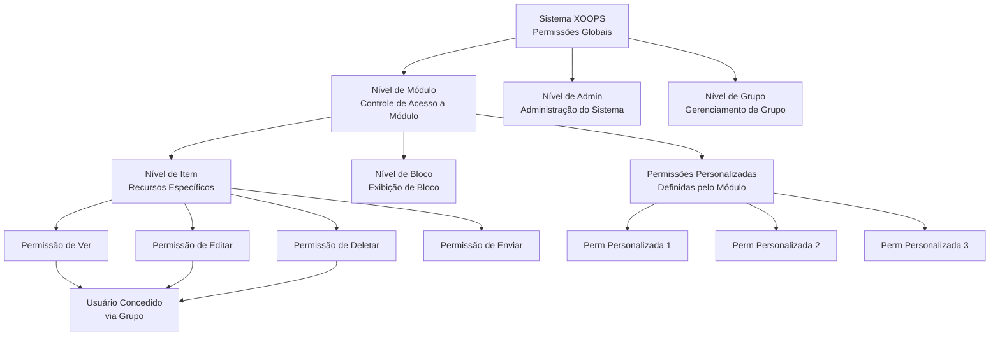
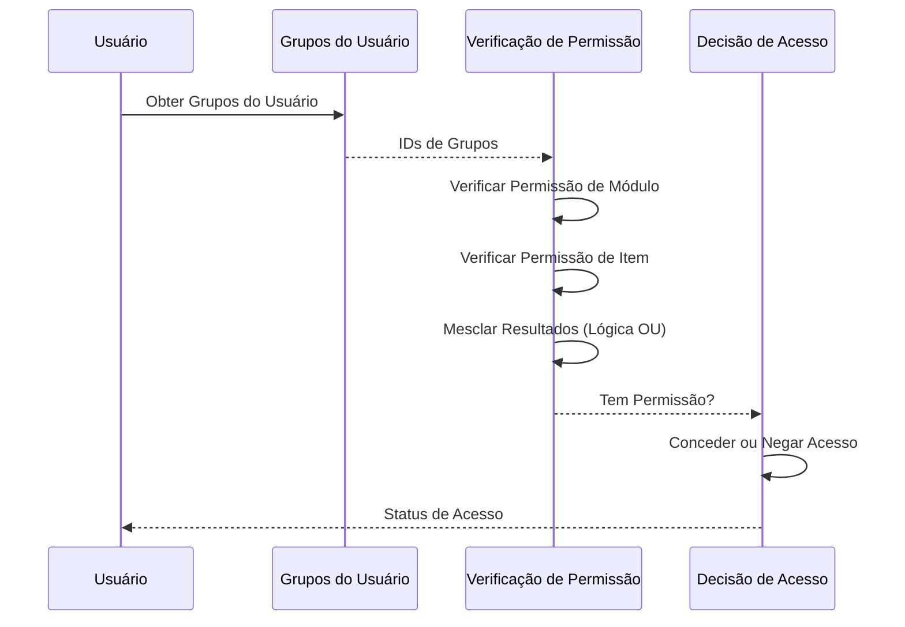

# Sistema de Permissões no XOOPS

O Sistema de Permissões do XOOPS é um framework de controle de acesso granular que gerencia quem pode realizar quais ações em quais recursos. Este documento cobre tipos de permissões, mecanismos de verificação, hierarquia e exemplos de implementação.

## Tipos de Permissões

### Permissões no Nível do Módulo

As permissões no nível do módulo controlam o acesso a módulos inteiros ou funções do módulo.

**Nomes de Permissão Comuns:**
- `module_view` - Ver conteúdo do módulo
- `module_read` - Ler recursos do módulo
- `module_submit` - Enviar conteúdo para módulo
- `module_edit` - Editar conteúdo do módulo
- `module_admin` - Administrar módulo

```php
<?php
/**
 * Exemplo de permissão de módulo
 */

$permissionHandler = xoops_getHandler('groupperm');
$userGroups = $xoopsUser->getGroups();
$moduleId = 2; // Módulo de Artigos

// Verificar se usuário pode ver módulo
$canView = false;
foreach ($userGroups as $groupId) {
    if ($permissionHandler->checkRight('module_view', $groupId, $moduleId)) {
        $canView = true;
        break;
    }
}

if (!$canView) {
    redirect('index.php?error=no_access');
}
```

### Permissões no Nível de Item

As permissões no nível de item controlam o acesso a recursos específicos dentro de um módulo.

**Exemplos:**
- ID do Artigo: Grupo pode ver/editar artigo específico?
- ID da Categoria: Grupo pode acessar categoria?
- ID da Página: Grupo pode ver/modificar página específica?

```php
<?php
/**
 * Exemplo de permissão de item
 */

$permissionHandler = xoops_getHandler('groupperm');
$userGroups = $xoopsUser->getGroups();
$moduleId = 2;      // Módulo de Artigos
$articleId = 42;    // Artigo específico

// Verificar se usuário pode editar artigo específico
$canEdit = false;
foreach ($userGroups as $groupId) {
    if ($permissionHandler->checkRight(
        'item_edit',
        $groupId,
        $moduleId,
        $articleId
    )) {
        $canEdit = true;
        break;
    }
}
```

### Permissões de Bloco

As permissões de bloco controlam a visibilidade e a interação com blocos exibidos nas páginas.

```php
<?php
/**
 * Exemplo de permissão de bloco
 */

$permissionHandler = xoops_getHandler('groupperm');
$userGroups = $xoopsUser->getGroups();

// Verificar se usuário pode ver bloco
$blockId = 5;
$canViewBlock = false;

foreach ($userGroups as $groupId) {
    if ($permissionHandler->checkRight('block_view', $groupId, 1, $blockId)) {
        $canViewBlock = true;
        break;
    }
}
```

### Permissões de Grupo

Permissões que controlam gerenciamento e administração de grupos.

```php
<?php
/**
 * Exemplo de permissão de gerenciamento de grupo
 */

$permissionHandler = xoops_getHandler('groupperm');
$userGroups = $xoopsUser->getGroups();

// Verificar se usuário pode gerenciar grupos
$canManageGroups = false;
foreach ($userGroups as $groupId) {
    if ($permissionHandler->checkRight('group_admin', $groupId, 1)) {
        $canManageGroups = true;
        break;
    }
}
```

## Hierarquia de Permissões

### Diagrama de Estrutura de Permissões



### Cadeia de Herança de Permissões



## Verificação de Permissões

### XoopsGroupPermHandler

A classe `XoopsGroupPermHandler` fornece métodos para verificar e gerenciar permissões.

```php
<?php
/**
 * Métodos de XoopsGroupPermHandler
 */

class XoopsGroupPermHandler
{
    /**
     * Verificar se grupo tem permissão
     *
     * @param string $gperm_name Nome da permissão
     * @param int $gperm_group_id ID do Grupo
     * @param int $gperm_modid ID do Módulo
     * @param int $gperm_itemid ID do Item (opcional)
     * @return bool Status da permissão
     */
    public function checkRight(
        $gperm_name,
        $gperm_group_id,
        $gperm_modid,
        $gperm_itemid = 0
    ) { }

    /**
     * Adicionar permissão a grupo
     *
     * @param string $gperm_name Nome da permissão
     * @param int $gperm_group_id ID do Grupo
     * @param int $gperm_modid ID do Módulo
     * @param int $gperm_itemid ID do Item (opcional)
     * @return bool Status de sucesso
     */
    public function addRight(
        $gperm_name,
        $gperm_group_id,
        $gperm_modid,
        $gperm_itemid = 0
    ) { }

    /**
     * Remover permissão de grupo
     *
     * @param string $gperm_name Nome da permissão
     * @param int $gperm_group_id ID do Grupo
     * @param int $gperm_modid ID do Módulo
     * @param int $gperm_itemid ID do Item (opcional)
     * @return bool Status de sucesso
     */
    public function deleteRight(
        $gperm_name,
        $gperm_group_id,
        $gperm_modid,
        $gperm_itemid = 0
    ) { }

    /**
     * Obter todas as permissões para grupo em módulo
     *
     * @param int $groupId ID do Grupo
     * @param int $modId ID do Módulo
     * @return array Lista de permissões
     */
    public function getGroupPermissions($groupId, $modId) { }

    /**
     * Obter IDs de itens permitidos para grupo
     *
     * @param string $permName Nome da permissão
     * @param int $groupId ID do Grupo
     * @param int $modId ID do Módulo
     * @return array IDs de itens
     */
    public function getPermittedItemIds(
        $permName,
        $groupId,
        $modId
    ) { }
}
```

## Implementação de Verificação de Permissões

### Verificação de Permissão de Usuário Único

```php
<?php
/**
 * Utilitário de verificação de permissões
 */
class PermissionChecker
{
    private $permissionHandler;
    private $user;

    public function __construct(XoopsUser $user = null)
    {
        $this->permissionHandler = xoops_getHandler('groupperm');
        $this->user = $user ?? $GLOBALS['xoopsUser'] ?? null;
    }

    /**
     * Verificar se usuário tem permissão
     *
     * @param string $permissionName Nome da permissão
     * @param int $moduleId ID do Módulo
     * @param int $itemId ID do Item (opcional)
     * @return bool Status da permissão
     */
    public function hasPermission(
        string $permissionName,
        int $moduleId,
        int $itemId = 0
    ): bool
    {
        if (!$this->user instanceof XoopsUser) {
            return false;
        }

        $userGroups = $this->user->getGroups();

        foreach ($userGroups as $groupId) {
            if ($this->permissionHandler->checkRight(
                $permissionName,
                $groupId,
                $moduleId,
                $itemId
            )) {
                return true;
            }
        }

        return false;
    }

    /**
     * Exigir permissão ou negar acesso
     *
     * @param string $permissionName Nome da permissão
     * @param int $moduleId ID do Módulo
     * @param int $itemId ID do Item (opcional)
     * @throws Exception Se permissão negada
     */
    public function requirePermission(
        string $permissionName,
        int $moduleId,
        int $itemId = 0
    ): void
    {
        if (!$this->hasPermission($permissionName, $moduleId, $itemId)) {
            throw new Exception('Permissão negada');
        }
    }

    /**
     * Obter IDs de itens permitidos
     *
     * @param string $permissionName Nome da permissão
     * @param int $moduleId ID do Módulo
     * @return array IDs de itens que o usuário pode acessar
     */
    public function getPermittedItems(
        string $permissionName,
        int $moduleId
    ): array
    {
        if (!$this->user instanceof XoopsUser) {
            return [];
        }

        $permitted = [];
        $userGroups = $this->user->getGroups();

        foreach ($userGroups as $groupId) {
            $items = $this->permissionHandler->getPermittedItemIds(
                $permissionName,
                $groupId,
                $moduleId
            );
            $permitted = array_merge($permitted, $items);
        }

        return array_unique($permitted);
    }

    /**
     * Verificar múltiplas permissões (lógica E)
     *
     * @param array $permissions Nomes de permissões
     * @param int $moduleId ID do Módulo
     * @param int $itemId ID do Item (opcional)
     * @return bool Todas as permissões concedidas
     */
    public function hasAllPermissions(
        array $permissions,
        int $moduleId,
        int $itemId = 0
    ): bool
    {
        foreach ($permissions as $perm) {
            if (!$this->hasPermission($perm, $moduleId, $itemId)) {
                return false;
            }
        }
        return true;
    }

    /**
     * Verificar múltiplas permissões (lógica OU)
     *
     * @param array $permissions Nomes de permissões
     * @param int $moduleId ID do Módulo
     * @param int $itemId ID do Item (opcional)
     * @return bool Qualquer permissão concedida
     */
    public function hasAnyPermission(
        array $permissions,
        int $moduleId,
        int $itemId = 0
    ): bool
    {
        foreach ($permissions as $perm) {
            if ($this->hasPermission($perm, $moduleId, $itemId)) {
                return true;
            }
        }
        return false;
    }
}
```

### Middleware de Permissão

```php
<?php
/**
 * Middleware de permissão para filtro de requisição
 */
class PermissionMiddleware
{
    private $permissionChecker;

    public function __construct(PermissionChecker $checker)
    {
        $this->permissionChecker = $checker;
    }

    /**
     * Aplicar permissão na requisição
     *
     * @param string $permissionName Permissão a verificar
     * @param int $moduleId ID do Módulo
     * @param int $itemId ID do Item (opcional)
     * @return void Interrompe execução se permissão negada
     */
    public function enforce(
        string $permissionName,
        int $moduleId,
        int $itemId = 0
    ): void
    {
        try {
            $this->permissionChecker->requirePermission(
                $permissionName,
                $moduleId,
                $itemId
            );
        } catch (Exception $e) {
            // Registrar negação de permissão
            error_log(sprintf(
                'Permissão negada: %s (Usuário: %s, Módulo: %d, Item: %d)',
                $permissionName,
                $GLOBALS['xoopsUser']?->getVar('uname') ?? 'anônimo',
                $moduleId,
                $itemId
            ));

            // Enviar resposta de erro
            header('HTTP/1.1 403 Forbidden');
            die('Acesso negado');
        }
    }

    /**
     * Filtrar array de itens por permissão
     *
     * @param array $items Itens a filtrar
     * @param string $permissionName Nome da permissão
     * @param int $moduleId ID do Módulo
     * @param callable $idExtractor Callback para extrair ID do item
     * @return array Itens filtrados
     */
    public function filterByPermission(
        array $items,
        string $permissionName,
        int $moduleId,
        callable $idExtractor
    ): array
    {
        return array_filter($items, function($item) use (
            $permissionName,
            $moduleId,
            $idExtractor
        ) {
            $itemId = $idExtractor($item);
            return $this->permissionChecker->hasPermission(
                $permissionName,
                $moduleId,
                $itemId
            );
        });
    }
}
```

## Exemplos Práticos de Implementação

### Controle de Acesso de Módulo

```php
<?php
/**
 * Exemplo de controle de acesso de módulo
 */

// Obter módulo atual
$moduleId = $GLOBALS['xoopsModule']->getVar('mid');
$moduleDir = $GLOBALS['xoopsModule']->getVar('dirname');

// Criar verificador de permissão
$checker = new PermissionChecker();

// Verificar permissão de ver módulo
if (!$checker->hasPermission('module_view', $moduleId)) {
    redirect('index.php?error=access_denied');
}

// Obter itens que usuário pode acessar
$permittedItems = $checker->getPermittedItems('item_view', $moduleId);

// Construir consulta para mostrar apenas itens permitidos
$sql = 'SELECT * FROM articles WHERE id IN (' . implode(',', $permittedItems) . ')';
```

### Exemplo de Gerenciamento de Conteúdo

```php
<?php
/**
 * Gerenciamento de artigo com permissões
 */

class ArticleManager
{
    private $permissionChecker;
    private $moduleId = 2;

    public function __construct(PermissionChecker $checker)
    {
        $this->permissionChecker = $checker;
    }

    /**
     * Obter artigos que usuário pode ver
     *
     * @return array Lista de artigos
     */
    public function getViewableArticles(): array
    {
        $this->permissionChecker->requirePermission(
            'module_view',
            $this->moduleId
        );

        $permittedIds = $this->permissionChecker->getPermittedItems(
            'article_view',
            $this->moduleId
        );

        if (empty($permittedIds)) {
            return [];
        }

        $db = XoopsDatabaseFactory::getDatabaseConnection();
        $result = $db->query(
            'SELECT * FROM articles WHERE id IN (' .
            implode(',', $permittedIds) .
            ') AND published = 1'
        );

        $articles = [];
        while ($row = $db->fetchArray($result)) {
            $articles[] = $row;
        }

        return $articles;
    }

    /**
     * Criar artigo com verificação de permissão
     *
     * @param array $data Dados do artigo
     * @return int ID do artigo
     */
    public function createArticle(array $data): int
    {
        $this->permissionChecker->requirePermission(
            'article_create',
            $this->moduleId
        );

        $db = XoopsDatabaseFactory::getDatabaseConnection();
        $db->query(
            'INSERT INTO articles (title, content, author_id, created) VALUES (?, ?, ?, ?)',
            array($data['title'], $data['content'], $_SESSION['xoopsUserId'], time())
        );

        return $db->getInsertId();
    }

    /**
     * Atualizar artigo com verificação de permissão
     *
     * @param int $articleId ID do artigo
     * @param array $data Dados de atualização
     * @return bool Sucesso
     */
    public function updateArticle(int $articleId, array $data): bool
    {
        $this->permissionChecker->requirePermission(
            'article_edit',
            $this->moduleId,
            $articleId
        );

        $db = XoopsDatabaseFactory::getDatabaseConnection();
        return (bool)$db->query(
            'UPDATE articles SET title = ?, content = ? WHERE id = ?',
            array($data['title'], $data['content'], $articleId)
        );
    }

    /**
     * Deletar artigo com verificação de permissão
     *
     * @param int $articleId ID do artigo
     * @return bool Sucesso
     */
    public function deleteArticle(int $articleId): bool
    {
        $this->permissionChecker->requirePermission(
            'article_delete',
            $this->moduleId,
            $articleId
        );

        $db = XoopsDatabaseFactory::getDatabaseConnection();
        return (bool)$db->query(
            'DELETE FROM articles WHERE id = ?',
            array($articleId)
        );
    }
}
```

### Verificação de Permissão do Painel de Admin

```php
<?php
/**
 * Controle de acesso do painel de admin
 */

// Verificar se usuário é webmaster
if (!in_array(1, $xoopsUser->getGroups())) {
    redirect('index.php');
    exit;
}

$checker = new PermissionChecker();
$moduleId = $GLOBALS['xoopsModule']->getVar('mid');

// Verificar permissão de admin
$checker->requirePermission('module_admin', $moduleId);

// Carregar conteúdo de admin
?>
<h1>Painel de Admin</h1>
<p>Bem-vindo, Administrador</p>
```

## Cache de Permissões

### Verificação de Permissão Otimizada

```php
<?php
/**
 * Verificador de permissão com cache para desempenho
 */
class CachedPermissionChecker extends PermissionChecker
{
    private $cache = [];
    private $cachePrefix = 'xoops_perm_';

    /**
     * Verificar permissão com cache
     *
     * @param string $permissionName Nome da permissão
     * @param int $moduleId ID do Módulo
     * @param int $itemId ID do Item (opcional)
     * @return bool Status da permissão
     */
    public function hasPermission(
        string $permissionName,
        int $moduleId,
        int $itemId = 0
    ): bool
    {
        $cacheKey = $this->getCacheKey(
            $permissionName,
            $moduleId,
            $itemId
        );

        // Verificar cache em memória
        if (isset($this->cache[$cacheKey])) {
            return $this->cache[$cacheKey];
        }

        // Verificar cache APCu
        $cacheKeyFull = $this->cachePrefix . $cacheKey;
        $cached = apcu_fetch($cacheKeyFull);
        if ($cached !== false) {
            $this->cache[$cacheKey] = $cached;
            return $cached;
        }

        // Verificar permissão real
        $result = parent::hasPermission($permissionName, $moduleId, $itemId);

        // Cachear resultado (TTL 1 hora)
        $this->cache[$cacheKey] = $result;
        apcu_store($cacheKeyFull, $result, 3600);

        return $result;
    }

    /**
     * Gerar chave de cache
     *
     * @param string $permissionName Nome da permissão
     * @param int $moduleId ID do Módulo
     * @param int $itemId ID do Item
     * @return string Chave de cache
     */
    private function getCacheKey(
        string $permissionName,
        int $moduleId,
        int $itemId
    ): string
    {
        $uid = $this->user?->getVar('uid') ?? 0;
        return md5("{$uid}_{$permissionName}_{$moduleId}_{$itemId}");
    }

    /**
     * Limpar cache de permissão para usuário
     *
     * @param int $uid ID do Usuário
     */
    public static function clearUserCache(int $uid): void
    {
        // Isso precisaria ser mais sofisticado em produção
        apcu_clear_cache();
    }
}
```

## Boas Práticas de Segurança

### Regras de Atribuição de Permissão

1. **Princípio do Menor Privilégio**: Atribuir apenas permissões necessárias
2. **Acesso Baseado em Função**: Usar grupos para permissões baseadas em função
3. **Auditorias Regulares**: Revisar permissões periodicamente
4. **Separação de Deveres**: Separar permissões de admin de usuário
5. **Negação Explícita**: Abordagem de negar por padrão, permitir explicitamente

### Validação de Permissão

```php
<?php
/**
 * Boas práticas de validação de permissão
 */

// Sempre verificar permissão antes da ação
$moduleId = 2;
$articleId = 42;

try {
    $checker = new PermissionChecker();

    // Verificação de permissão explícita
    if (!$checker->hasPermission('article_edit', $moduleId, $articleId)) {
        throw new Exception('Permissões insuficientes');
    }

    // Realizar ação apenas após permissão verificada
    updateArticle($articleId);

} catch (Exception $e) {
    // Registrar evento de segurança
    error_log('Permissão negada: ' . $e->getMessage());
    // Mostrar erro amigável ao usuário
    die('Você não tem permissão para executar esta ação');
}
```

## Links Relacionados

- User Management.md
- Group System.md
- Authentication.md
- ../../Security/Security-Guidelines.md

## Tags

#permissions #access-control #security #authorization #acl #permission-checking
