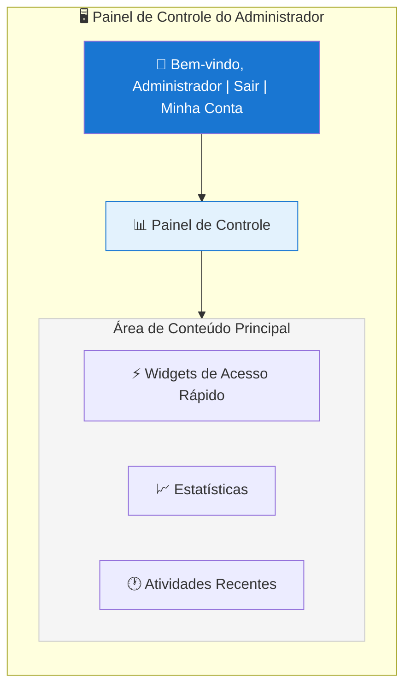
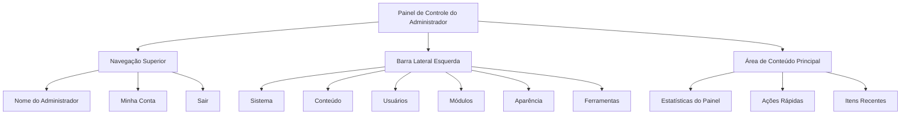

# Visão Geral do Painel de Administrador XOOPS

Guia completo para navegação e uso do painel de controle do administrador XOOPS.

## Acessando o Painel de Administrador

### Login de Administrador

Abra seu navegador e acesse:

```
http://seu-dominio.com/xoops/admin/
```

Ou se XOOPS estiver na raiz:

```
http://seu-dominio.com/admin/
```

Digite suas credenciais de administrador:

```
Usuário: [Seu nome de usuário de administrador]
Senha: [Sua senha de administrador]
```

### Após o Login

Você verá o painel de controle principal do administrador:



## Layout do Painel de Administrador



## Componentes do Painel de Controle

### Barra Superior

A barra superior contém controles essenciais:

| Elemento | Finalidade |
|---|---|
| **Logo do Administrador** | Clique para voltar ao painel de controle |
| **Mensagem de Boas-vindas** | Mostra o nome do administrador conectado |
| **Minha Conta** | Editar perfil e senha do administrador |
| **Ajuda** | Acessar documentação |
| **Sair** | Desconectar do painel de administrador |

### Barra Lateral de Navegação Esquerda

Menu principal organizado por função:

```
├── Sistema
│   ├── Painel de Controle
│   ├── Preferências
│   ├── Usuários de Administrador
│   ├── Grupos
│   ├── Permissões
│   ├── Módulos
│   └── Ferramentas
├── Conteúdo
│   ├── Páginas
│   ├── Categorias
│   ├── Comentários
│   └── Gerenciador de Mídia
├── Usuários
│   ├── Usuários
│   ├── Solicitações de Usuários
│   ├── Usuários Online
│   └── Grupos de Usuários
├── Módulos
│   ├── Módulos
│   ├── Configurações de Módulo
│   └── Atualizações de Módulo
├── Aparência
│   ├── Temas
│   ├── Templates
│   ├── Blocos
│   └── Imagens
└── Ferramentas
    ├── Manutenção
    ├── Email
    ├── Estatísticas
    ├── Logs
    └── Backups
```

### Área de Conteúdo Principal

Exibe informações e controles para a seção selecionada:

- Formulários para configuração
- Tabelas de dados com listas
- Gráficos e estatísticas
- Botões de ação rápida
- Texto de ajuda e dicas

### Widgets do Painel de Controle

Acesso rápido a informações-chave:

- **Informações do Sistema:** Versão do PHP, versão do MySQL, versão do XOOPS
- **Estatísticas Rápidas:** Contagem de usuários, total de posts, módulos instalados
- **Atividade Recente:** Últimos logins, mudanças de conteúdo, erros
- **Status do Servidor:** CPU, memória, uso de disco
- **Notificações:** Alertas do sistema, atualizações pendentes

## Funções Principais de Administrador

### Gerenciamento de Sistema

**Local:** Sistema > [Várias Opções]

#### Preferências

Configure as configurações básicas do sistema:

```
Sistema > Preferências > [Categoria de Configurações]
```

Categorias:
- Configurações Gerais (nome do site, fuso horário)
- Configurações de Usuário (registro, perfis)
- Configurações de Email (configuração SMTP)
- Configurações de Cache (opções de cache)
- Configurações de URL (URLs amigáveis)
- Meta Tags (configurações SEO)

Veja Configuração Básica e Configurações do Sistema.

#### Usuários de Administrador

Gerencie contas de administrador:

```
Sistema > Usuários de Administrador
```

Funções:
- Adicionar novos administradores
- Editar perfis de administrador
- Alterar senhas de administrador
- Deletar contas de administrador
- Definir permissões de administrador

### Gerenciamento de Conteúdo

**Local:** Conteúdo > [Várias Opções]

#### Páginas/Artigos

Gerencie o conteúdo do site:

```
Conteúdo > Páginas (ou seu módulo)
```

Funções:
- Criar novas páginas
- Editar conteúdo existente
- Deletar páginas
- Publicar/despublicar
- Definir categorias
- Gerenciar revisões

#### Categorias

Organize o conteúdo:

```
Conteúdo > Categorias
```

Funções:
- Criar hierarquia de categorias
- Editar categorias
- Deletar categorias
- Atribuir a páginas

#### Comentários

Modere comentários de usuários:

```
Conteúdo > Comentários
```

Funções:
- Ver todos os comentários
- Aprovar comentários
- Editar comentários
- Deletar spam
- Bloquear comentadores

### Gerenciamento de Usuários

**Local:** Usuários > [Várias Opções]

#### Usuários

Gerencie contas de usuários:

```
Usuários > Usuários
```

Funções:
- Ver todos os usuários
- Criar novos usuários
- Editar perfis de usuários
- Deletar contas
- Redefinir senhas
- Alterar status de usuário
- Atribuir a grupos

#### Usuários Online

Monitore usuários ativos:

```
Usuários > Usuários Online
```

Mostra:
- Usuários atualmente online
- Hora da última atividade
- Endereço IP
- Localização do usuário (se configurado)

#### Grupos de Usuários

Gerencie funções e permissões de usuários:

```
Usuários > Grupos
```

Funções:
- Criar grupos personalizados
- Definir permissões de grupo
- Atribuir usuários a grupos
- Deletar grupos

### Gerenciamento de Módulos

**Local:** Módulos > [Várias Opções]

#### Módulos

Instale e configure módulos:

```
Módulos > Módulos
```

Funções:
- Ver módulos instalados
- Ativar/desativar módulos
- Atualizar módulos
- Configurar configurações de módulo
- Instalar novos módulos
- Ver detalhes de módulo

#### Verificar Atualizações

```
Módulos > Módulos > Verificar Atualizações
```

Exibe:
- Atualizações de módulo disponíveis
- Histórico de alterações
- Opções de download e instalação

### Gerenciamento de Aparência

**Local:** Aparência > [Várias Opções]

#### Temas

Gerencie temas do site:

```
Aparência > Temas
```

Funções:
- Ver temas instalados
- Definir tema padrão
- Upload de novos temas
- Deletar temas
- Visualização de tema
- Configuração de tema

#### Blocos

Gerencie blocos de conteúdo:

```
Aparência > Blocos
```

Funções:
- Criar blocos personalizados
- Editar conteúdo de bloco
- Organizar blocos na página
- Definir visibilidade de bloco
- Deletar blocos
- Configurar cache de bloco

#### Templates

Gerencie templates (avançado):

```
Aparência > Templates
```

Para usuários avançados e desenvolvedores.

### Ferramentas do Sistema

**Local:** Sistema > Ferramentas

#### Modo de Manutenção

Previna o acesso de usuários durante manutenção:

```
Sistema > Modo de Manutenção
```

Configure:
- Ativar/desativar manutenção
- Mensagem de manutenção personalizada
- Endereços IP permitidos (para testes)

#### Gerenciamento de Banco de Dados

```
Sistema > Banco de Dados
```

Funções:
- Verificar consistência do banco de dados
- Executar atualizações de banco de dados
- Reparar tabelas
- Otimizar banco de dados
- Exportar estrutura do banco de dados

#### Logs de Atividade

```
Sistema > Logs
```

Monitore:
- Atividade de usuário
- Ações administrativas
- Eventos de sistema
- Logs de erro

## Ações Rápidas

Tarefas comuns acessíveis do painel de controle:

```
Links Rápidos:
├── Criar Nova Página
├── Adicionar Novo Usuário
├── Criar Bloco de Conteúdo
├── Fazer Upload de Imagem
├── Enviar Email em Massa
├── Atualizar Todos os Módulos
└── Limpar Cache
```

## Atalhos de Teclado do Painel de Administrador

Navegação rápida:

| Atalho | Ação |
|---|---|
| `Ctrl+H` | Ir para ajuda |
| `Ctrl+D` | Ir para painel de controle |
| `Ctrl+Q` | Pesquisa rápida |
| `Ctrl+L` | Sair |

## Gerenciamento de Conta de Usuário

### Minha Conta

Acesse seu perfil de administrador:

1. Clique em "Minha Conta" no canto superior direito
2. Edite informações de perfil:
   - Endereço de email
   - Nome real
   - Informações de usuário
   - Avatar

### Alterar Senha

Altere sua senha de administrador:

1. Vá para **Minha Conta**
2. Clique em "Alterar Senha"
3. Digite a senha atual
4. Digite a nova senha (duas vezes)
5. Clique em "Salvar"

**Dicas de Segurança:**
- Use senhas fortes (16+ caracteres)
- Inclua maiúsculas, minúsculas, números, símbolos
- Altere a senha a cada 90 dias
- Nunca compartilhe credenciais de administrador

### Sair

Desconecte do painel de administrador:

1. Clique em "Sair" no canto superior direito
2. Você será redirecionado para a página de login

## Estatísticas do Painel de Administrador

### Estatísticas do Painel

Visão geral rápida de métricas do site:

| Métrica | Valor |
|--------|-------|
| Usuários Online | 12 |
| Total de Usuários | 256 |
| Total de Posts | 1.234 |
| Total de Comentários | 5.678 |
| Total de Módulos | 8 |

### Status do Sistema

Informações do servidor e desempenho:

| Componente | Versão/Valor |
|-----------|---------------|
| Versão XOOPS | 2.5.11 |
| Versão PHP | 8.2.x |
| Versão MySQL | 8.0.x |
| Carga do Servidor | 0.45, 0.42 |
| Uptime | 45 dias |

### Atividade Recente

Cronologia de eventos recentes:

```
12:45 - Login de administrador
12:30 - Novo usuário registrado
12:15 - Página publicada
12:00 - Comentário postado
11:45 - Módulo atualizado
```

## Sistema de Notificação

### Alertas de Administrador

Receba notificações para:

- Novas inscrições de usuários
- Comentários aguardando moderação
- Tentativas de login falhadas
- Erros de sistema
- Atualizações de módulo disponíveis
- Problemas de banco de dados
- Avisos de espaço em disco

Configure alertas:

**Sistema > Preferências > Configurações de Email**

```
Notificar Administrador no Registro: Sim
Notificar Administrador nos Comentários: Sim
Notificar Administrador nos Erros: Sim
Email de Alerta: admin@seu-dominio.com
```

## Tarefas Comuns de Administrador

### Criar uma Nova Página

1. Vá para **Conteúdo > Páginas** (ou módulo relevante)
2. Clique em "Adicionar Nova Página"
3. Preencha:
   - Título
   - Conteúdo
   - Descrição
   - Categoria
   - Metadados
4. Clique em "Publicar"

### Gerenciar Usuários

1. Vá para **Usuários > Usuários**
2. Veja lista de usuários com:
   - Nome de usuário
   - Email
   - Data de registro
   - Último login
   - Status

3. Clique no nome de usuário para:
   - Editar perfil
   - Alterar senha
   - Editar grupos
   - Bloquear/desbloquear usuário

### Configurar Módulo

1. Vá para **Módulos > Módulos**
2. Encontre o módulo na lista
3. Clique no nome do módulo
4. Clique em "Preferências" ou "Configurações"
5. Configure opções de módulo
6. Salve as alterações

### Criar um Novo Bloco

1. Vá para **Aparência > Blocos**
2. Clique em "Adicionar Novo Bloco"
3. Digite:
   - Título do bloco
   - Conteúdo do bloco (HTML permitido)
   - Posição na página
   - Visibilidade (todas as páginas ou específicas)
   - Módulo (se aplicável)
4. Clique em "Enviar"

## Ajuda do Painel de Administrador

### Documentação Integrada

Acesse ajuda do painel de administrador:

1. Clique no botão "Ajuda" na barra superior
2. Ajuda sensível ao contexto para a página atual
3. Links para documentação
4. Perguntas frequentes

### Recursos Externos

- Site Oficial XOOPS: https://xoops.org/
- Fórum da Comunidade: https://xoops.org/modules/newbb/
- Repositório de Módulo: https://xoops.org/modules/repository/
- Bugs/Problemas: https://github.com/XOOPS/XoopsCore/issues

## Personalizando o Painel de Administrador

### Tema de Administrador

Escolha o tema da interface de administração:

**Sistema > Preferências > Configurações Gerais**

```
Tema de Administrador: [Selecionar tema]
```

Temas disponíveis:
- Padrão (claro)
- Modo escuro
- Temas personalizados

### Personalização do Painel de Controle

Escolha quais widgets aparecem:

**Painel de Controle > Personalizar**

Selecione:
- Informações do sistema
- Estatísticas
- Atividade recente
- Links rápidos
- Widgets personalizados

## Permissões do Painel de Administrador

Diferentes níveis de administração têm permissões diferentes:

| Função | Capacidades |
|---|---|
| **Webmaster** | Acesso total a todas as funções de administrador |
| **Administrador** | Funções de administrador limitadas |
| **Moderador** | Apenas moderação de conteúdo |
| **Editor** | Criação e edição de conteúdo |

Gerencie permissões:

**Sistema > Permissões**

## Práticas Recomendadas de Segurança para Painel de Administrador

1. **Senha Forte:** Use senha com 16+ caracteres
2. **Alterações Regulares:** Altere a senha a cada 90 dias
3. **Monitore o Acesso:** Verifique os logs de "Usuários de Administrador" regularmente
4. **Limite o Acesso:** Renomeie pasta de administrador para segurança adicional
5. **Use HTTPS:** Sempre acesse administrador via HTTPS
6. **Whitelist de IP:** Restrinja acesso de administrador a IPs específicos
7. **Logout Regular:** Faça logout quando terminar
8. **Segurança do Navegador:** Limpe o cache do navegador regularmente

Veja Configuração de Segurança.

## Solução de Problemas do Painel de Administrador

### Não Consegue Acessar Painel de Administrador

**Solução:**
1. Verifique credenciais de login
2. Limpe cache e cookies do navegador
3. Tente outro navegador
4. Verifique se o caminho da pasta de administrador está correto
5. Verifique as permissões de arquivo na pasta de administrador
6. Verifique a conexão com o banco de dados em mainfile.php

### Página em Branco de Administrador

**Solução:**
```bash
# Verifique erros do PHP
tail -f /var/log/apache2/error.log

# Ativar modo de depuração temporariamente
sed -i "s/define('XOOPS_DEBUG', 0)/define('XOOPS_DEBUG', 1)/" /var/www/html/xoops/mainfile.php

# Verifique permissões de arquivo
ls -la /var/www/html/xoops/admin/
```

### Painel de Administrador Lento

**Solução:**
1. Limpe cache: **Sistema > Ferramentas > Limpar Cache**
2. Otimize banco de dados: **Sistema > Banco de Dados > Otimizar**
3. Verifique recursos do servidor: `htop`
4. Revise consultas lentas no MySQL

### Módulo Não Aparecendo

**Solução:**
1. Verifique módulo instalado: **Módulos > Módulos**
2. Verifique módulo ativado
3. Verifique permissões atribuídas
4. Verifique se os arquivos do módulo existem
5. Revise logs de erro

## Próximas Etapas

Após se familiarizar com o painel de administrador:

1. Crie sua primeira página
2. Configure grupos de usuários
3. Instale módulos adicionais
4. Configure configurações básicas
5. Implemente segurança

---

**Tags:** #painel-de-administrador #painel-de-controle #navegação #primeiros-passos

**Artigos Relacionados:**
- ../Configuration/Basic-Configuration
- ../Configuration/System-Settings
- Creating-Your-First-Page
- Managing-Users
- Installing-Modules
