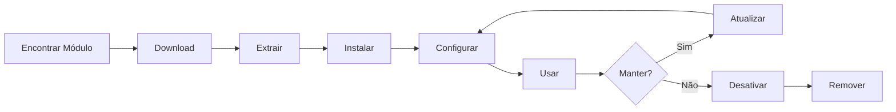

# Instalando e Gerenciando Módulos XOOPS

Aprenda como estender a funcionalidade do XOOPS instalando e configurando módulos.

## Entendendo Módulos XOOPS

### O que são Módulos?

Módulos são extensões que adicionam funcionalidade ao XOOPS:

| Tipo | Finalidade | Exemplos |
|---|---|---|
| **Conteúdo** | Gerenciar tipos de conteúdo específicos | Notícias, Blog, Tickets |
| **Comunidade** | Interação de usuários | Forum, Comentários, Avaliações |
| **eCommerce** | Venda de produtos | Shop, Carrinho, Pagamentos |
| **Mídia** | Lidar com arquivos/imagens | Galeria, Downloads, Vídeos |
| **Utilitário** | Ferramentas e ajudantes | Email, Backup, Análise |

### Módulos Principais vs. Opcionais

| Módulo | Tipo | Incluído | Removível |
|---|---|---|---|
| **Sistema** | Principal | Sim | Não |
| **Usuário** | Principal | Sim | Não |
| **Perfil** | Recomendado | Sim | Sim |
| **PM (Mensagem Privada)** | Recomendado | Sim | Sim |
| **WF-Channel** | Opcional | Muitas vezes | Sim |
| **Notícias** | Opcional | Não | Sim |
| **Forum** | Opcional | Não | Sim |

## Ciclo de Vida do Módulo



## Encontrando Módulos

### Repositório de Módulos XOOPS

Repositório oficial de módulos XOOPS:

**Visite:** https://xoops.org/modules/repository/

```
Diretório > Módulos > [Procurar Categorias]
```

Procure por categoria:
- Gerenciamento de Conteúdo
- Comunidade
- eCommerce
- Multimídia
- Desenvolvimento
- Administração de Site

### Avaliando Módulos

Antes de instalar, verifique:

| Critério | O que Procurar |
|---|---|
| **Compatibilidade** | Funciona com sua versão XOOPS |
| **Avaliação** | Boas avaliações e comentários de usuários |
| **Atualizações** | Mantido recentemente |
| **Downloads** | Popular e amplamente utilizado |
| **Requisitos** | Compatível com seu servidor |
| **Licença** | GPL ou licença de código aberto similar |
| **Suporte** | Desenvolvedor e comunidade ativos |

### Leia Informações do Módulo

Cada listagem de módulo mostra:

```
Nome do Módulo: [Nome]
Versão: [X.X.X]
Requer: XOOPS [Versão]
Autor: [Nome]
Última Atualização: [Data]
Downloads: [Número]
Avaliação: [Estrelas]
Descrição: [Descrição breve]
Compatibilidade: PHP [Versão], MySQL [Versão]
```

## Instalando Módulos

### Método 1: Instalação do Painel de Administrador

**Etapa 1: Acessar Seção de Módulos**

1. Faça login no painel de administrador
2. Navegue para **Módulos > Módulos**
3. Clique em **"Instalar Novo Módulo"** ou **"Procurar Módulos"**

**Etapa 2: Upload de Módulo**

Opção A - Upload Direto:
1. Clique em **"Escolher Arquivo"**
2. Selecione arquivo .zip do módulo do computador
3. Clique em **"Upload"**

Opção B - Upload de URL:
1. Cole URL do módulo
2. Clique em **"Download e Instalar"**

**Etapa 3: Revisar Informações do Módulo**

```
Nome do Módulo: [Nome mostrado]
Versão: [Versão]
Autor: [Informações do autor]
Descrição: [Descrição completa]
Requisitos: [Versões PHP/MySQL]
```

Revise e clique em **"Prosseguir com Instalação"**

**Etapa 4: Escolher Tipo de Instalação**

```
☐ Instalação Nova (Nova instalação)
☐ Atualizar (Atualizar existente)
☐ Deletar Depois Instalar (Substituir existente)
```

Selecione opção apropriada.

**Etapa 5: Confirmar Instalação**

Revise confirmação final:
```
Módulo será instalado em: /modules/modulename/
Banco de Dados: xoops_db
Prosseguir? [Sim] [Não]
```

Clique em **"Sim"** para confirmar.

**Etapa 6: Instalação Completa**

```
Instalação bem-sucedida!

Módulo: [Nome do Módulo]
Versão: [Versão]
Tabelas criadas: [Número]
Arquivos instalados: [Número]

[Ir para Configurações de Módulo]  [Voltar aos Módulos]
```

### Método 2: Instalação Manual (Avançado)

Para instalação manual ou solução de problemas:

**Etapa 1: Download de Módulo**

1. Download módulo .zip do repositório
2. Extrair para `/var/www/html/xoops/modules/modulename/`

```bash
# Extrair módulo
unzip module_name.zip
cp -r module_name /var/www/html/xoops/modules/

# Definir permissões
chmod -R 755 /var/www/html/xoops/modules/module_name
```

**Etapa 2: Executar Script de Instalação**

```
Visite: http://seu-dominio.com/xoops/modules/module_name/admin/index.php?op=install
```

Ou através do painel de administrador (Sistema > Módulos > Atualizar DB).

**Etapa 3: Verificar Instalação**

1. Vá para **Módulos > Módulos** no admin
2. Procure seu módulo na lista
3. Verifique se mostra como "Ativo"

## Configuração de Módulo

### Acessar Configurações de Módulo

1. Vá para **Módulos > Módulos**
2. Encontre seu módulo
3. Clique no nome do módulo
4. Clique em **"Preferências"** ou **"Configurações"**

### Configurações Comuns de Módulo

A maioria dos módulos oferece:

```
Status do Módulo: [Ativado/Desativado]
Exibir no Menu: [Sim/Não]
Peso do Módulo: [1-999] (ordem de exibição)
Visível para Grupos: [Caixas de seleção para grupos de usuários]
```

### Opções Específicas do Módulo

Cada módulo tem configurações exclusivas. Exemplos:

**Módulo de Notícias:**
```
Itens Por Página: 10
Mostrar Autor: Sim
Permitir Comentários: Sim
Moderação Obrigatória: Sim
```

**Módulo de Forum:**
```
Tópicos Por Página: 20
Posts Por Página: 15
Tamanho Máximo de Anexo: 5MB
Habilitar Assinaturas: Sim
```

**Módulo de Galeria:**
```
Imagens Por Página: 12
Tamanho de Miniatura: 150x150
Upload Máximo: 10MB
Marca de Água: Sim/Não
```

Revise a documentação do seu módulo para opções específicas.

### Salvar Configuração

Após ajustar configurações:

1. Clique em **"Enviar"** ou **"Salvar"**
2. Você verá confirmação:
   ```
   Configurações salvas com sucesso!
   ```

## Gerenciando Blocos de Módulo

Muitos módulos criam "blocos" - áreas de conteúdo tipo widget.

### Ver Blocos de Módulo

1. Vá para **Aparência > Blocos**
2. Procure blocos do seu módulo
3. A maioria dos módulos mostra "[Nome do Módulo] - [Descrição do Bloco]"

### Configurar Blocos

1. Clique no nome do bloco
2. Ajuste:
   - Título do bloco
   - Visibilidade (todas as páginas ou específicas)
   - Posição na página (esquerda, centro, direita)
   - Grupos de usuários que podem ver
3. Clique em **"Enviar"**

### Exibir Bloco na Homepage

1. Vá para **Aparência > Blocos**
2. Encontre o bloco que deseja
3. Clique em **"Editar"**
4. Defina:
   - **Visível para:** Selecione grupos
   - **Posição:** Escolha coluna (esquerda/centro/direita)
   - **Páginas:** Homepage ou todas as páginas
5. Clique em **"Enviar"**

## Instalando Exemplos de Módulo Específico

### Instalando Módulo de Notícias

**Perfeito para:** Posts de blog, comunicados

1. Download módulo de Notícias do repositório
2. Upload via **Módulos > Módulos > Instalar**
3. Configure em **Módulos > Notícias > Preferências**:
   - Histórias por página: 10
   - Permitir comentários: Sim
   - Aprovar antes de publicar: Sim
4. Crie blocos para últimas notícias
5. Comece a publicar histórias!

### Instalando Módulo de Forum

**Perfeito para:** Discussão da comunidade

1. Download módulo de Forum
2. Instale via painel de administrador
3. Crie categorias de forum no módulo
4. Configure configurações:
   - Tópicos/página: 20
   - Posts/página: 15
   - Habilitar moderação: Sim
5. Atribua permissões de grupos de usuários
6. Crie blocos para tópicos mais recentes

### Instalando Módulo de Galeria

**Perfeito para:** Vitrine de imagem

1. Download módulo de Galeria
2. Instale e configure
3. Crie álbuns de fotos
4. Faça upload de imagens
5. Defina permissões para visualização/upload
6. Exiba galeria no site

## Atualizando Módulos

### Verificar Atualizações

```
Painel de Administrador > Módulos > Módulos > Verificar Atualizações
```

Isto mostra:
- Atualizações de módulo disponíveis
- Versão atual vs. nova versão
- Notas de lançamento/changelog

### Atualizar um Módulo

1. Vá para **Módulos > Módulos**
2. Clique no módulo com atualização disponível
3. Clique no botão **"Atualizar"**
4. Selecione **"Atualizar"** a partir do tipo de instalação
5. Siga o assistente de instalação
6. Módulo atualizado!

### Notas Importantes de Atualização

Antes de atualizar:

- [ ] Backup do banco de dados
- [ ] Backup dos arquivos do módulo
- [ ] Revise changelog
- [ ] Teste no servidor de staging primeiro
- [ ] Anote quaisquer modificações personalizadas

Depois de atualizar:
- [ ] Verifique funcionalidade
- [ ] Verifique configurações de módulo
- [ ] Revise avisos/erros
- [ ] Limpe cache

## Permissões de Módulo

### Atribuir Acesso de Grupo de Usuários

Controle quais grupos de usuários podem acessar módulos:

**Local:** Sistema > Permissões

Para cada módulo, configure:

```
Módulo: [Nome do Módulo]

Acesso de Administrador: [Selecionar grupos]
Acesso de Usuário: [Selecionar grupos]
Permissão de Leitura: [Grupos permitidos para visualizar]
Permissão de Escrita: [Grupos permitidos para postar]
Permissão de Exclusão: [Apenas administradores]
```

### Níveis Comuns de Permissão

```
Conteúdo Público (Notícias, Páginas):
├── Acesso de Administrador: Webmaster
├── Acesso de Usuário: Todos os usuários conectados
└── Permissão de Leitura: Todos

Recursos da Comunidade (Forum, Comentários):
├── Acesso de Administrador: Webmaster, Moderadores
├── Acesso de Usuário: Todos os usuários conectados
└── Permissão de Escrita: Todos os usuários conectados

Ferramentas de Administrador:
├── Acesso de Administrador: Apenas Webmaster
└── Acesso de Usuário: Desativado
```

## Desativando e Removendo Módulos

### Desativar Módulo (Manter Arquivos)

Mantenha módulo mas oculte do site:

1. Vá para **Módulos > Módulos**
2. Encontre módulo
3. Clique no nome do módulo
4. Clique em **"Desativar"** ou defina status como Inativo
5. Módulo oculto mas dados preservados

Reativar a qualquer momento:
1. Clique no módulo
2. Clique em **"Ativar"**

### Remover Módulo Completamente

Delete módulo e seus dados:

1. Vá para **Módulos > Módulos**
2. Encontre módulo
3. Clique em **"Desinstalar"** ou **"Deletar"**
4. Confirme: "Deletar módulo e todos os dados?"
5. Clique em **"Sim"** para confirmar

**Aviso:** Desinstalar deleta todos os dados do módulo!

### Reinstalar Após Desinstalar

Se você desinstalar um módulo:
- Arquivos do módulo deletados
- Tabelas do banco de dados deletadas
- Todos os dados perdidos
- Deve reinstalar para usar novamente
- Pode restaurar do backup

## Solução de Problemas de Instalação de Módulo

### Módulo Não Aparecendo Após Instalação

**Sintoma:** Módulo listado mas não visível no site

**Solução:**
```
1. Verifique se módulo está "Ativo" (Módulos > Módulos)
2. Ativar blocos de módulo (Aparência > Blocos)
3. Verifique permissões de usuário (Sistema > Permissões)
4. Limpe cache (Sistema > Ferramentas > Limpar Cache)
5. Verifique se .htaccess não bloqueia módulo
```

### Erro de Instalação: "Tabela Já Existe"

**Sintoma:** Erro durante instalação de módulo

**Solução:**
```
1. Módulo parcialmente instalado antes
2. Tente opção "Deletar Depois Instalar"
3. Ou desinstale primeiro, depois instale novo
4. Verifique banco de dados para tabelas existentes:
   mysql> SHOW TABLES LIKE 'xoops_module%';
```

### Módulo Faltando Dependências

**Sintoma:** Módulo não se instala - requer outro módulo

**Solução:**
```
1. Observe módulos necessários da mensagem de erro
2. Instale módulos necessários primeiro
3. Depois instale o módulo
4. Instale na ordem correta
```

### Página em Branco Ao Acessar Módulo

**Sintoma:** Módulo carrega mas não mostra nada

**Solução:**
```
1. Ativar modo de depuração em mainfile.php:
   define('XOOPS_DEBUG', 1);

2. Verifique log de erro PHP:
   tail -f /var/log/php_errors.log

3. Verifique permissões de arquivo:
   chmod -R 755 /var/www/html/xoops/modules/modulename

4. Verifique conexão com banco de dados na configuração do módulo

5. Desativar módulo e reinstalar
```

### Módulo Quebra o Site

**Sintoma:** Instalar módulo quebra site

**Solução:**
```
1. Desativar o módulo problemático imediatamente:
   Admin > Módulos > [Módulo] > Desativar

2. Limpe cache:
   rm -rf /var/www/html/xoops/cache/*
   rm -rf /var/www/html/xoops/templates_c/*

3. Restaurar do backup se necessário

4. Verifique logs de erro para causa raiz

5. Entre em contato com desenvolvedor de módulo
```

## Considerações de Segurança de Módulo

### Instale Apenas de Fontes Confiáveis

```
✓ Repositório Oficial XOOPS
✓ Módulos GitHub oficial XOOPS
✓ Desenvolvedores de módulo confiáveis
✗ Sites desconhecidos
✗ Fontes não verificadas
```

### Verifique Permissões de Módulo

Após instalação:

1. Revise código do módulo para atividade suspeita
2. Verifique tabelas do banco de dados para anomalias
3. Monitore alterações de arquivo
4. Mantenha módulos atualizados
5. Remova módulos não utilizados

### Práticas Recomendadas de Permissões

```
Diretório de módulo: 755 (legível, não gravável por servidor web)
Arquivos de módulo: 644 (apenas leitura)
Dados de módulo: Protegido por banco de dados
```

## Recursos de Desenvolvimento de Módulo

### Aprenda Desenvolvimento de Módulo

- Documentação Oficial: https://xoops.org/
- Repositório GitHub: https://github.com/XOOPS/
- Fórum da Comunidade: https://xoops.org/modules/newbb/
- Guia do Desenvolvedor: Disponível em pasta de docs

## Práticas Recomendadas para Módulos

1. **Instale Um por Um:** Monitore conflitos
2. **Teste Após Instalar:** Verifique funcionalidade
3. **Documente Configuração Personalizada:** Anote suas configurações
4. **Mantenha Atualizado:** Instale atualizações de módulo prontamente
5. **Remova Não Utilizados:** Delete módulos não necessários
6. **Backup Antes:** Sempre faça backup antes de instalar
7. **Leia Documentação:** Verifique instruções do módulo
8. **Junte-se à Comunidade:** Peça ajuda se necessário

## Lista de Verificação de Instalação de Módulo

Para cada instalação de módulo:

- [ ] Pesquisar e ler avaliações
- [ ] Verificar compatibilidade de versão XOOPS
- [ ] Backup de banco de dados e arquivos
- [ ] Download da versão mais recente
- [ ] Instalar via painel de administrador
- [ ] Configurar configurações
- [ ] Criar/posicionar blocos
- [ ] Definir permissões de usuários
- [ ] Testar funcionalidade
- [ ] Documentar configuração
- [ ] Agendar para atualizações

## Próximas Etapas

Após instalar módulos:

1. Criar conteúdo para módulos
2. Configurar grupos de usuários
3. Explorar recursos de administração
4. Otimizar desempenho
5. Instalar módulos adicionais conforme necessário

---

**Tags:** #módulos #instalação #extensão #gerenciamento

**Artigos Relacionados:**
- Admin-Panel-Overview
- Managing-Users
- Creating-Your-First-Page
- ../Configuration/System-Settings
