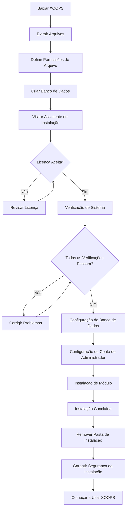

# Guia Completo de Instalação do XOOPS

Este guia fornece uma visão geral abrangente para instalar XOOPS do zero usando o assistente de instalação.

## Pré-requisitos

Antes de iniciar a instalação, certifique-se de ter:

- Acesso ao seu servidor web via FTP ou SSH
- Acesso de administrador ao seu servidor de banco de dados
- Um nome de domínio registrado
- Requisitos do servidor verificados
- Ferramentas de backup disponíveis

## Processo de Instalação



## Instalação Passo a Passo

### Passo 1: Baixar XOOPS

Baixe a versão mais recente de [https://xoops.org/](https://xoops.org/):

```bash
# Usando wget
wget https://xoops.org/download/xoops-2.5.8.zip

# Usando curl
curl -O https://xoops.org/download/xoops-2.5.8.zip
```

### Passo 2: Extrair Arquivos

Extraia o arquivo do XOOPS para sua raiz web:

```bash
# Navegue até a raiz web
cd /var/www/html

# Extraia XOOPS
unzip xoops-2.5.8.zip

# Renomeie a pasta (opcional, mas recomendado)
mv xoops-2.5.8 xoops
cd xoops
```

### Passo 3: Definir Permissões de Arquivo

Defina as permissões apropriadas para os diretórios do XOOPS:

```bash
# Tornar diretórios graváveis (755 para dirs, 644 para arquivos)
find . -type d -exec chmod 755 {} \;
find . -type f -exec chmod 644 {} \;

# Tornar diretórios específicos graváveis pelo servidor web
chmod 777 uploads/
chmod 777 templates_c/
chmod 777 var/
chmod 777 cache/

# Proteger mainfile.php após a instalação
chmod 644 mainfile.php
```

### Passo 4: Criar Banco de Dados

Crie um novo banco de dados para XOOPS usando MySQL:

```sql
-- Criar banco de dados
CREATE DATABASE xoops_db CHARACTER SET utf8mb4 COLLATE utf8mb4_unicode_ci;

-- Criar usuário
CREATE USER 'xoops_user'@'localhost' IDENTIFIED BY 'senha_segura_aqui';

-- Conceder privilégios
GRANT ALL PRIVILEGES ON xoops_db.* TO 'xoops_user'@'localhost';
FLUSH PRIVILEGES;
```

Ou usando phpMyAdmin:

1. Faça login no phpMyAdmin
2. Clique na aba "Bancos de dados"
3. Digite o nome do banco de dados: `xoops_db`
4. Selecione a ordenação "utf8mb4_unicode_ci"
5. Clique em "Criar"
6. Crie um usuário com o mesmo nome do banco de dados
7. Conceda todos os privilégios

### Passo 5: Executar Assistente de Instalação

Abra seu navegador e navegue até:

```
http://seu-dominio.com/xoops/install/
```

#### Fase de Verificação do Sistema

O assistente verifica sua configuração do servidor:

- Versão do PHP >= 5.6.0
- MySQL/MariaDB disponível
- Extensões PHP necessárias (GD, PDO, etc.)
- Permissões de diretório
- Conectividade do banco de dados

**Se as verificações falharem:**

Veja a seção #Problemas-Comuns-de-Instalação para soluções.

#### Configuração de Banco de Dados

Digite suas credenciais de banco de dados:

```
Host do Banco de Dados: localhost
Nome do Banco de Dados: xoops_db
Usuário do Banco de Dados: xoops_user
Senha do Banco de Dados: [sua_senha_segura]
Prefixo de Tabela: xoops_
```

**Notas Importantes:**
- Se seu host de banco de dados diferir de localhost (por exemplo, servidor remoto), digite o nome de host correto
- O prefixo de tabela ajuda se estiver executando várias instâncias do XOOPS em um banco de dados
- Use uma senha forte com letras maiúsculas e minúsculas, números e símbolos

#### Configuração de Conta de Administrador

Crie sua conta de administrador:

```
Nome de Usuário de Administrador: admin (ou escolha um personalizado)
E-mail de Administrador: admin@seu-dominio.com
Senha de Administrador: [senha_única_forte]
Confirmar Senha: [repetir_senha]
```

**Melhores Práticas:**
- Use um nome de usuário único, não "admin"
- Use uma senha com 16+ caracteres
- Armazene as credenciais em um gerenciador de senhas seguro
- Nunca compartilhe as credenciais de administrador

#### Instalação de Módulo

Escolha módulos padrão para instalar:

- **Módulo de Sistema** (obrigatório) - Funcionalidade principal do XOOPS
- **Módulo de Usuário** (obrigatório) - Gerenciamento de usuários
- **Módulo de Perfil** (recomendado) - Perfis de usuário
- **Módulo PM (Mensagem Privada)** (recomendado) - Mensagens internas
- **Módulo WF-Channel** (opcional) - Gerenciamento de conteúdo

Selecione todos os módulos recomendados para uma instalação completa.

### Passo 6: Concluir Instalação

Após todas as etapas, você verá uma tela de confirmação:

```
Instalação Concluída!

Sua instalação do XOOPS está pronta para usar.
Painel de Administração: http://seu-dominio.com/xoops/admin/
Painel do Usuário: http://seu-dominio.com/xoops/
```

### Passo 7: Garantir Segurança da Instalação

#### Remover Pasta de Instalação

```bash
# Remova o diretório de instalação (CRÍTICO para segurança)
rm -rf /var/www/html/xoops/install/

# Ou renomeie-o
mv /var/www/html/xoops/install/ /var/www/html/xoops/install.bak
```

**AVISO:** Nunca deixe a pasta de instalação acessível em produção!

#### Proteger mainfile.php

```bash
# Tornar mainfile.php somente leitura
chmod 644 /var/www/html/xoops/mainfile.php

# Definir propriedade
chown www-data:www-data /var/www/html/xoops/mainfile.php
```

#### Definir Permissões de Arquivo Apropriadas

```bash
# Permissões de produção recomendadas
find . -type f -name "*.php" -exec chmod 644 {} \;
find . -type d -exec chmod 755 {} \;

# Diretórios graváveis para servidor web
chmod 777 uploads/ var/ cache/ templates_c/
```

#### Habilitar HTTPS/SSL

Configure SSL em seu servidor web (nginx ou Apache).

**Para Apache:**
```apache
<VirtualHost *:443>
    ServerName seu-dominio.com
    DocumentRoot /var/www/html/xoops

    SSLEngine on
    SSLCertificateFile /etc/ssl/certs/seu-cert.crt
    SSLCertificateKeyFile /etc/ssl/private/sua-chave.key

    # Forçar redirecionamento HTTPS
    <IfModule mod_rewrite.c>
        RewriteEngine On
        RewriteCond %{HTTPS} off
        RewriteRule ^(.*)$ https://%{HTTP_HOST}%{REQUEST_URI} [L,R=301]
    </IfModule>
</VirtualHost>
```

## Configuração Pós-Instalação

### 1. Acessar Painel de Administração

Navegue até:
```
http://seu-dominio.com/xoops/admin/
```

Faça login com suas credenciais de administrador.

### 2. Configurar Definições Básicas

Configure o seguinte:

- Nome e descrição do site
- Endereço de e-mail do administrador
- Fuso horário e formato de data
- Otimização para mecanismos de busca

### 3. Testar Instalação

- [ ] Visitar página inicial
- [ ] Verificar se os módulos carregam
- [ ] Verificar se o registro de usuário funciona
- [ ] Testar funções do painel de administração
- [ ] Confirmar se HTTPS/SSL funciona

### 4. Agendar Backups

Configure backups automáticos:

```bash
# Criar script de backup (backup.sh)
#!/bin/bash
DATE=$(date +%Y%m%d_%H%M%S)
BACKUP_DIR="/backups/xoops"
XOOPS_DIR="/var/www/html/xoops"

# Backup do banco de dados
mysqldump -u xoops_user -p[senha] xoops_db > $BACKUP_DIR/db_$DATE.sql

# Backup de arquivos
tar -czf $BACKUP_DIR/files_$DATE.tar.gz $XOOPS_DIR

echo "Backup concluído: $DATE"
```

Agende com cron:
```bash
# Backup diário às 2 AM
0 2 * * * /usr/local/bin/backup.sh
```

## Problemas Comuns de Instalação

### Problema: Erros de Permissão Negada

**Sintoma:** "Permissão negada" ao fazer upload ou criar arquivos

**Solução:**
```bash
# Verificar usuário do servidor web
ps aux | grep apache  # Para Apache
ps aux | grep nginx   # Para Nginx

# Corrigir permissões (substitua www-data pelo seu usuário do servidor web)
chown -R www-data:www-data /var/www/html/xoops
chmod -R 755 /var/www/html/xoops
chmod 777 uploads/ var/ cache/ templates_c/
```

### Problema: Falha na Conexão do Banco de Dados

**Sintoma:** "Não é possível conectar ao servidor de banco de dados"

**Solução:**
1. Verifique as credenciais do banco de dados no assistente de instalação
2. Verifique se MySQL/MariaDB está em execução:
   ```bash
   service mysql status  # ou mariadb
   ```
3. Verifique se o banco de dados existe:
   ```sql
   SHOW DATABASES;
   ```
4. Teste a conexão a partir da linha de comando:
   ```bash
   mysql -h localhost -u xoops_user -p xoops_db
   ```

### Problema: Tela Branca em Branco

**Sintoma:** Visitar XOOPS mostra página em branco

**Solução:**
1. Verifique os registros de erro do PHP:
   ```bash
   tail -f /var/log/apache2/error.log
   ```
2. Habilite o modo de depuração em mainfile.php:
   ```php
   define('XOOPS_DEBUG', 1);
   ```
3. Verifique as permissões de arquivo em mainfile.php e arquivos de configuração
4. Verifique se a extensão PHP-MySQL está instalada

### Problema: Não é Possível Escrever no Diretório de Uploads

**Sintoma:** Falha no recurso de upload, "Não é possível escrever em uploads/"

**Solução:**
```bash
# Verificar permissões atuais
ls -la uploads/

# Corrigir permissões
chmod 777 uploads/
chown www-data:www-data uploads/

# Para arquivos específicos
chmod 644 uploads/*
```

### Problema: Extensões PHP Ausentes

**Sintoma:** Falha na verificação do sistema com extensões ausentes (GD, MySQL, etc.)

**Solução (Ubuntu/Debian):**
```bash
# Instalar biblioteca PHP GD
apt-get install php-gd

# Instalar suporte PHP MySQL
apt-get install php-mysql

# Reiniciar servidor web
systemctl restart apache2  # ou nginx
```

**Solução (CentOS/RHEL):**
```bash
# Instalar biblioteca PHP GD
yum install php-gd

# Instalar suporte PHP MySQL
yum install php-mysql

# Reiniciar servidor web
systemctl restart httpd
```

### Problema: Processo de Instalação Lento

**Sintoma:** Assistente de instalação atinge tempo limite ou executa muito lentamente

**Solução:**
1. Aumentar tempo limite do PHP em php.ini:
   ```ini
   max_execution_time = 300  # 5 minutos
   ```
2. Aumentar max_allowed_packet do MySQL:
   ```sql
   SET GLOBAL max_allowed_packet = 256M;
   ```
3. Verificar recursos do servidor:
   ```bash
   free -h  # Verificar RAM
   df -h    # Verificar espaço em disco
   ```

### Problema: Painel de Administração Não Acessível

**Sintoma:** Não é possível acessar o painel de administração após a instalação

**Solução:**
1. Verifique se o usuário administrador existe no banco de dados:
   ```sql
   SELECT * FROM xoops_users WHERE uid = 1;
   ```
2. Limpe o cache do navegador e os cookies
3. Verifique se a pasta de sessões é gravável:
   ```bash
   chmod 777 var/
   ```
4. Verifique se as regras htaccess não bloqueiam o acesso ao administrador

## Lista de Verificação de Verificação

Após a instalação, verifique:

- [x] Página inicial do XOOPS carrega corretamente
- [x] Painel de administração está acessível em /xoops/admin/
- [x] SSL/HTTPS está funcionando
- [x] Pasta de instalação foi removida ou está inacessível
- [x] Permissões de arquivo são seguras (644 para arquivos, 755 para dirs)
- [x] Backups de banco de dados são agendados
- [x] Módulos carregam sem erros
- [x] Sistema de registro de usuário funciona
- [x] Funcionalidade de upload de arquivo funciona
- [x] Notificações por e-mail são enviadas corretamente

## Próximos Passos

Após a conclusão da instalação:

1. Leia o guia de Configuração Básica
2. Proteja sua instalação
3. Explore o painel de administração
4. Instale módulos adicionais
5. Configure grupos de usuários e permissões

---

**Tags:** #instalação #configuração #início-rápido #solução-de-problemas

**Artigos Relacionados:**
- Requisitos-do-Servidor
- Atualizando-XOOPS
- ../Configuração/Configuração-de-Segurança
