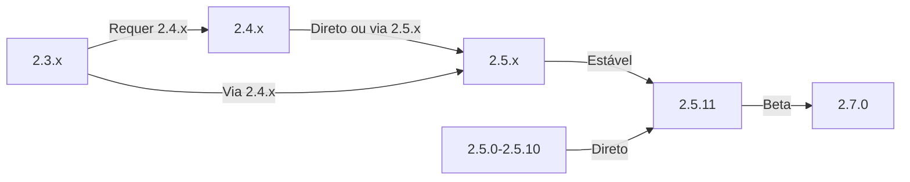

Este guia cobre a atualização do XOOPS de versões mais antigas para a versão mais recente, preservando seus dados e personalizações.

> **Informações de Versão**
> - **Estável:** XOOPS 2.5.11
> - **Beta:** XOOPS 2.7.0 (teste)
> - **Futuro:** XOOPS 4.0 (em desenvolvimento - veja Roteiro)

## Lista de Verificação Pré-Atualização

Antes de começar a atualização, verifique:

- [ ] Versão atual do XOOPS documentada
- [ ] Versão alvo do XOOPS identificada
- [ ] Backup completo do sistema concluído
- [ ] Backup de banco de dados verificado
- [ ] Lista de módulos instalados registrada
- [ ] Modificações personalizadas documentadas
- [ ] Ambiente de teste disponível
- [ ] Caminho de atualização verificado (algumas versões pulam versões intermediárias)
- [ ] Recursos do servidor verificados (espaço em disco suficiente, memória)
- [ ] Modo de manutenção habilitado

## Guia de Caminho de Atualização

Caminhos de atualização diferentes dependendo da versão atual:



**Importante:** Nunca pule versões principais. Se atualizar de 2.3.x, primeiro atualize para 2.4.x, depois para 2.5.x.

## Passo 1: Backup Completo do Sistema

### Backup de Banco de Dados

Use mysqldump para fazer backup do banco de dados:

```bash
# Backup completo de banco de dados
mysqldump -u xoops_user -p xoops_db > /backups/xoops_db_backup_$(date +%Y%m%d_%H%M%S).sql

# Backup comprimido
mysqldump -u xoops_user -p xoops_db | gzip > /backups/xoops_db_backup_$(date +%Y%m%d_%H%M%S).sql.gz
```

Ou usando phpMyAdmin:

1. Selecione seu banco de dados XOOPS
2. Clique na aba "Exportar"
3. Escolha o formato "SQL"
4. Selecione "Salvar como arquivo"
5. Clique em "Ir"

Verificar arquivo de backup:

```bash
# Verificar tamanho de backup
ls -lh /backups/xoops_db_backup*.sql

# Verificar integridade do backup (descomprimido)
head -20 /backups/xoops_db_backup_*.sql

# Verificar backup comprimido
zcat /backups/xoops_db_backup_*.sql.gz | head -20
```

### Backup do Sistema de Arquivos

Faça backup de todos os arquivos do XOOPS:

```bash
# Backup de arquivo comprimido
tar -czf /backups/xoops_files_$(date +%Y%m%d_%H%M%S).tar.gz /var/www/html/xoops

# Descomprimido (mais rápido, requer mais espaço em disco)
tar -cf /backups/xoops_files_$(date +%Y%m%d_%H%M%S).tar /var/www/html/xoops

# Mostrar progresso do backup
tar -czf /backups/xoops_files_$(date +%Y%m%d_%H%M%S).tar.gz --verbose /var/www/html/xoops | tail
```

Armazene backups com segurança:

```bash
# Armazenamento seguro de backup
chmod 600 /backups/xoops_*
ls -lah /backups/

# Opcional: Copiar para armazenamento remoto
scp /backups/xoops_* user@backup-server:/secure/backups/
```

### Testar Restauração de Backup

**CRÍTICO:** Sempre teste se seu backup funciona:

```bash
# Verificar conteúdo do arquivo tar
tar -tzf /backups/xoops_files_*.tar.gz | head -20

# Extrair para local de teste
mkdir /tmp/restore_test
cd /tmp/restore_test
tar -xzf /backups/xoops_files_*.tar.gz

# Verificar se arquivos chave existem
ls -la xoops/mainfile.php
ls -la xoops/install/
```

## Passo 2: Habilitar Modo de Manutenção

Impedir que usuários acessem o site durante a atualização:

### Opção 1: Painel de Administração do XOOPS

1. Faça login no painel de administração
2. Vá para Sistema > Manutenção
3. Habilitar "Modo de Manutenção do Site"
4. Definir mensagem de manutenção
5. Salvar

### Opção 2: Modo de Manutenção Manual

Crie um arquivo de manutenção na raiz web:

```html
<!-- /var/www/html/maintenance.html -->
<!DOCTYPE html>
<html>
<head>
    <title>Sob Manutenção</title>
    <style>
        body { font-family: Arial; text-align: center; padding: 50px; }
        h1 { color: #333; }
        p { color: #666; margin: 20px 0; }
    </style>
</head>
<body>
    <h1>Site Sob Manutenção</h1>
    <p>Estamos atualizando atualmente nosso site.</p>
    <p>Tempo estimado: aproximadamente 30 minutos.</p>
    <p>Obrigado por sua paciência!</p>
</body>
</html>
```

Configure Apache para mostrar página de manutenção:

```apache
# Em .htaccess ou configuração de vhost
ErrorDocument 503 /maintenance.html

# Redirecionar todo o tráfego para página de manutenção
<IfModule mod_rewrite.c>
    RewriteEngine On
    RewriteCond %{REMOTE_ADDR} !^192\.168\.1\.100$  # Seu IP
    RewriteRule ^(.*)$ - [R=503,L]
</IfModule>
```

## Passo 3: Baixar Nova Versão

Baixe o XOOPS do site oficial:

```bash
# Baixar versão mais recente
cd /tmp
wget https://xoops.org/download/xoops-2.5.8.zip

# Verificar checksum (se fornecido)
sha256sum xoops-2.5.8.zip
# Comparar com hash SHA256 oficial

# Extrair para local temporário
unzip xoops-2.5.8.zip
cd xoops-2.5.8
```

## Passo 4: Preparação de Arquivo Pré-Atualização

### Identificar Modificações Personalizadas

Verifique se há arquivos principais personalizados:

```bash
# Procurar arquivos modificados (arquivos com mtime mais novo)
find /var/www/html/xoops -type f -newer /var/www/html/xoops/install.php

# Verificar temas personalizados
ls /var/www/html/xoops/themes/
# Observe quaisquer temas personalizados

# Verificar módulos personalizados
ls /var/www/html/xoops/modules/
# Observe quaisquer módulos criados por você
```

### Documentar Estado Atual

Crie um relatório de atualização:

```bash
cat > /tmp/upgrade_report.txt << EOF
=== Relatório de Atualização XOOPS ===
Data: $(date)
Versão Atual: 2.5.6
Versão Alvo: 2.5.8

=== Módulos Instalados ===
$(ls /var/www/html/xoops/modules/)

=== Modificações Personalizadas ===
[Documente quaisquer modificações personalizadas de tema ou módulo]

=== Temas ===
$(ls /var/www/html/xoops/themes/)

=== Status de Plugin ===
[Liste quaisquer modificações de código personalizado]

EOF
```

## Passo 5: Mesclar Novos Arquivos com Instalação Atual

### Estratégia: Preservar Arquivos Personalizados

Substitua arquivos principais do XOOPS, mas preserve:
- `mainfile.php` (sua configuração de banco de dados)
- Temas personalizados em `themes/`
- Módulos personalizados em `modules/`
- Uploads de usuário em `uploads/`
- Dados do site em `var/`

### Processo Manual de Mesclagem

```bash
# Definir variáveis
XOOPS_OLD="/var/www/html/xoops"
XOOPS_NEW="/tmp/xoops-2.5.8"
BACKUP="/backups/pre-upgrade"

# Criar backup pré-atualização no local
mkdir -p $BACKUP
cp -r $XOOPS_OLD/* $BACKUP/

# Copiar novos arquivos (mas preservar arquivos sensíveis)
# Copiar tudo exceto diretórios protegidos
rsync -av --exclude='mainfile.php' \
    --exclude='modules/custom*' \
    --exclude='themes/custom*' \
    --exclude='uploads' \
    --exclude='var' \
    --exclude='cache' \
    --exclude='templates_c' \
    $XOOPS_NEW/ $XOOPS_OLD/

# Verificar arquivos críticos preservados
ls -la $XOOPS_OLD/mainfile.php
```

### Usando upgrade.php (Se Disponível)

Algumas versões do XOOPS incluem script de atualização automatizado:

```bash
# Copiar novos arquivos com instalador
cp -r /tmp/xoops-2.5.8/* /var/www/html/xoops/

# Executar assistente de atualização
# Visite: http://seu-dominio.com/xoops/upgrade/
```

### Permissões de Arquivo Após Mesclagem

Restaurar permissões apropriadas:

```bash
# Definir propriedade
chown -R www-data:www-data /var/www/html/xoops

# Definir permissões de diretório
find /var/www/html/xoops -type d -exec chmod 755 {} \;

# Definir permissões de arquivo
find /var/www/html/xoops -type f -exec chmod 644 {} \;

# Tornar diretórios graváveis
chmod 777 /var/www/html/xoops/cache
chmod 777 /var/www/html/xoops/templates_c
chmod 777 /var/www/html/xoops/uploads
chmod 777 /var/www/html/xoops/var

# Proteger mainfile.php
chmod 644 /var/www/html/xoops/mainfile.php
```

## Passo 6: Migração de Banco de Dados

### Revisar Alterações de Banco de Dados

Verifique as notas de lançamento do XOOPS para mudanças na estrutura do banco de dados:

```bash
# Extrair e revisar arquivos de migração SQL
find /tmp/xoops-2.5.8 -name "*.sql" -type f
# Documente todos os arquivos .sql encontrados
```

### Executar Atualizações de Banco de Dados

### Opção 1: Atualização Automatizada (se disponível)

Use o painel de administração:

1. Faça login no administrador
2. Vá para **Sistema > Banco de Dados**
3. Clique em "Verificar Atualizações"
4. Analise as mudanças pendentes
5. Clique em "Aplicar Atualizações"

### Opção 2: Atualizações Manuais de Banco de Dados

Execute arquivos de migração SQL:

```bash
# Conectar ao banco de dados
mysql -u xoops_user -p xoops_db

# Exibir alterações pendentes (varia por versão)
SELECT * FROM xoops_config WHERE conf_name LIKE '%version%';

# Executar scripts de migração manualmente se necessário
SOURCE /tmp/xoops-2.5.8/migrate_2.5.6_to_2.5.8.sql;
```

### Verificação de Banco de Dados

Verificar integridade do banco de dados após atualização:

```sql
-- Verificar consistência do banco de dados
REPAIR TABLE xoops_users;
OPTIMIZE TABLE xoops_users;

-- Verificar se tabelas chave existem
SHOW TABLES LIKE 'xoops_%';

-- Verificar contagens de linhas (devem aumentar ou permanecer iguais)
SELECT COUNT(*) FROM xoops_users;
SELECT COUNT(*) FROM xoops_posts;
```

## Passo 7: Verificar Atualização

### Verificação de Página Inicial

Visite sua página inicial do XOOPS:

```
http://seu-dominio.com/xoops/
```

Esperado: Página carrega sem erros, exibe corretamente

### Verificação do Painel de Administração

Acessar administrador:

```
http://seu-dominio.com/xoops/admin/
```

Verifique:
- [ ] Painel de administração carrega
- [ ] Navegação funciona
- [ ] Painel exibe adequadamente
- [ ] Nenhum erro de banco de dados nos registros

### Verificação de Módulo

Verifique módulos instalados:

1. Vá para **Módulos > Módulos** no administrador
2. Verifique se todos os módulos ainda estão instalados
3. Verifique se há mensagens de erro
4. Habilite quaisquer módulos que foram desabilitados

### Verificação de Arquivo de Log

Analise os registros do sistema para erros:

```bash
# Verifique log de erro do servidor web
tail -50 /var/log/apache2/error.log

# Verifique log de erro do PHP
tail -50 /var/log/php_errors.log

# Verifique log de sistema do XOOPS (se disponível)
# No painel de administração: Sistema > Logs
```

### Testar Funções Principais

- [ ] Login/logout de usuário funciona
- [ ] Registro de usuário funciona
- [ ] Funções de upload de arquivo
- [ ] Notificações por e-mail enviadas
- [ ] Funcionalidade de pesquisa funciona
- [ ] Funções de administrador operacionais
- [ ] Funcionalidade de módulo intacta

## Passo 8: Limpeza Pós-Atualização

### Remover Arquivos Temporários

```bash
# Remover diretório de extração
rm -rf /tmp/xoops-2.5.8

# Limpar cache de template (seguro deletar)
rm -rf /var/www/html/xoops/templates_c/*

# Limpar cache do site
rm -rf /var/www/html/xoops/cache/*
```

### Remover Modo de Manutenção

Re-habilitar acesso normal ao site:

```apache
# Remover redirecionamento do modo de manutenção de .htaccess
# Ou deletar arquivo maintenance.html
rm /var/www/html/maintenance.html
```

### Atualizar Documentação

Atualizar suas notas de atualização:

```bash
# Documentar atualização bem-sucedida
cat >> /tmp/upgrade_report.txt << EOF

=== Resultados da Atualização ===
Status: SUCESSO
Data de Atualização: $(date)
Nova Versão: 2.5.8
Duração: [tempo em minutos]

Testes Pós-Atualização:
- [x] Página inicial carrega
- [x] Painel de administração acessível
- [x] Módulos funcionais
- [x] Registro de usuário funciona
- [x] Banco de dados otimizado

EOF
```

## Atualização de Solução de Problemas

### Problema: Tela Branca em Branco Após Atualização

**Sintoma:** Página inicial não mostra nada

**Solução:**
```bash
# Verificar erros do PHP
tail -f /var/log/apache2/error.log

# Habilitar modo de depuração temporariamente
echo "define('XOOPS_DEBUG', 1);" >> /var/www/html/xoops/mainfile.php

# Verificar permissões de arquivo
ls -la /var/www/html/xoops/mainfile.php

# Restaurar de backup se necessário
cp /backups/xoops_files_*.tar.gz /tmp/
cd /tmp && tar -xzf xoops_files_*.tar.gz
```

### Problema: Erro de Conexão de Banco de Dados

**Sintoma:** Mensagem "Não é possível conectar ao banco de dados"

**Solução:**
```bash
# Verificar credenciais do banco de dados em mainfile.php
grep -i "database\|host\|user" /var/www/html/xoops/mainfile.php

# Testar conexão
mysql -h localhost -u xoops_user -p xoops_db -e "SELECT 1"

# Verificar status do MySQL
systemctl status mysql

# Verificar se banco de dados ainda existe
mysql -u xoops_user -p -e "SHOW DATABASES" | grep xoops
```

### Problema: Painel de Administração Não Acessível

**Sintoma:** Não é possível acessar /xoops/admin/

**Solução:**
```bash
# Verificar regras de .htaccess
cat /var/www/html/xoops/.htaccess

# Verificar se arquivos de administrador existem
ls -la /var/www/html/xoops/admin/

# Verificar se mod_rewrite está habilitado
apache2ctl -M | grep rewrite

# Reiniciar servidor web
systemctl restart apache2
```

### Problema: Módulos Não Carregando

**Sintoma:** Módulos mostram erros ou foram desativados

**Solução:**
```bash
# Verificar se arquivos de módulo existem
ls /var/www/html/xoops/modules/

# Verificar permissões de módulo
ls -la /var/www/html/xoops/modules/*/

# Verificar configuração de módulo no banco de dados
mysql -u xoops_user -p xoops_db -e "SELECT * FROM xoops_modules WHERE module_status = 0"

# Reativar módulos no painel de administração
# Sistema > Módulos > Clique no módulo > Atualizar Status
```

### Problema: Erros de Permissão Negada

**Sintoma:** "Permissão negada" ao fazer upload ou salvar

**Solução:**
```bash
# Verificar propriedade de arquivo
ls -la /var/www/html/xoops/ | head -20

# Corrigir propriedade
chown -R www-data:www-data /var/www/html/xoops

# Corrigir permissões de diretório
find /var/www/html/xoops -type d -exec chmod 755 {} \;

# Tornar cache/uploads graváveis
chmod 777 /var/www/html/xoops/cache
chmod 777 /var/www/html/xoops/templates_c
chmod 777 /var/www/html/xoops/uploads
chmod 777 /var/www/html/xoops/var
```

### Problema: Carregamento Lento de Página

**Sintoma:** Páginas carregam muito lentamente após atualização

**Solução:**
```bash
# Limpar todos os caches
rm -rf /var/www/html/xoops/cache/*
rm -rf /var/www/html/xoops/templates_c/*

# Otimizar banco de dados
mysql -u xoops_user -p xoops_db << EOF
OPTIMIZE TABLE xoops_users;
OPTIMIZE TABLE xoops_posts;
OPTIMIZE TABLE xoops_config;
ANALYZE TABLE xoops_users;
EOF

# Verificar log de erros do PHP para avisos
grep -i "deprecated\|warning" /var/log/php_errors.log | tail -20

# Aumentar memória/tempo de execução do PHP temporariamente
# Edite php.ini:
memory_limit = 256M
max_execution_time = 300
```

## Procedimento de Reversão

Se a atualização falhar criticamente, restaure de backup:

### Restaurar Banco de Dados

```bash
# Restaurar de backup
mysql -u xoops_user -p xoops_db < /backups/xoops_db_backup_YYYYMMDD_HHMMSS.sql

# Ou de backup comprimido
gunzip < /backups/xoops_db_backup_YYYYMMDD_HHMMSS.sql.gz | mysql -u xoops_user -p xoops_db

# Verificar restauração
mysql -u xoops_user -p xoops_db -e "SELECT COUNT(*) FROM xoops_users"
```

### Restaurar Sistema de Arquivos

```bash
# Parar servidor web
systemctl stop apache2

# Remover instalação atual
rm -rf /var/www/html/xoops/*

# Extrair backup
cd /var/www/html
tar -xzf /backups/xoops_files_YYYYMMDD_HHMMSS.tar.gz

# Corrigir permissões
chown -R www-data:www-data xoops/
find xoops -type d -exec chmod 755 {} \;
find xoops -type f -exec chmod 644 {} \;
chmod 777 xoops/cache xoops/templates_c xoops/uploads xoops/var

# Iniciar servidor web
systemctl start apache2

# Verificar restauração
# Visite http://seu-dominio.com/xoops/
```

## Lista de Verificação de Verificação de Atualização

Após conclusão da atualização, verifique:

- [ ] Versão do XOOPS atualizada (check admin > System info)
- [ ] Página inicial carrega sem erros
- [ ] Todos os módulos funcionais
- [ ] Login de usuário funciona
- [ ] Painel de administração acessível
- [ ] Upload de arquivo funciona
- [ ] Notificações por e-mail funcionais
- [ ] Integridade do banco de dados verificada
- [ ] Permissões de arquivo corretas
- [ ] Modo de manutenção removido
- [ ] Backups protegidos e testados
- [ ] Desempenho aceitável
- [ ] SSL/HTTPS funcionando
- [ ] Nenhuma mensagem de erro nos registros

## Próximos Passos

Após atualização bem-sucedida:

1. Atualizar qualquer módulo personalizado para versões mais recentes
2. Revisar notas de lançamento para recursos descontinuados
3. Considerar otimizar desempenho
4. Atualizar configurações de segurança
5. Testar toda a funcionalidade completamente
6. Manter arquivos de backup seguros

---

**Tags:** #atualização #manutenção #backup #migração-de-banco-de-dados

**Artigos Relacionados:**
- ../../06-Módulo-Publisher/Guia-do-Usuário/Instalação
- Requisitos-do-Servidor
- ../Configuração/Configuração-Básica
- ../Configuração/Configuração-de-Segurança
