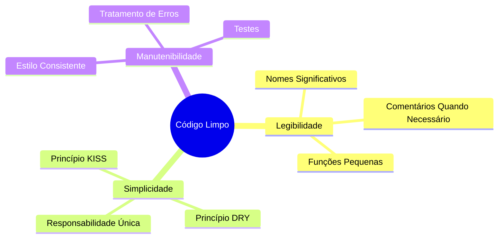

## Visão Geral

Código limpo é código que é fácil de ler, entender e manter. Este guia cobre princípios de código limpo especificamente aplicados ao desenvolvimento de módulos XOOPS.

## Princípios Principais



## Nomes Significativos

### Variáveis

```php
// Ruim
$d = new DateTime();
$u = $memberHandler->getUser($id);
$arr = [];

// Bom
$createdDate = new DateTime();
$currentUser = $memberHandler->getUser($userId);
$publishedArticles = [];
```

### Funções

```php
// Ruim
function process($data) { ... }
function handle($item) { ... }
function doStuff($x, $y) { ... }

// Bom
function publishArticle(Article $article): void { ... }
function calculateTotalPrice(array $items): float { ... }
function sendNotificationEmail(User $user, string $subject): bool { ... }
```

### Classes

```php
// Ruim
class Manager { ... }
class Helper { ... }
class Utils { ... }

// Bom
class ArticleRepository { ... }
class NotificationService { ... }
class PermissionChecker { ... }
```

## Funções Pequenas

### Responsabilidade Única

```php
// Ruim - faz muitas coisas
function processArticle($data) {
    // Validar
    if (empty($data['title'])) {
        throw new Exception('Título necessário');
    }
    // Salvar
    $article = new Article();
    $article->setTitle($data['title']);
    $this->repository->save($article);
    // Notificar
    $this->mailer->send($article->getAuthor(), 'Artigo publicado');
    // Log
    $this->logger->info('Artigo criado');
    return $article;
}

// Bom - cada função faz uma coisa
function validateArticleData(array $data): void
{
    if (empty($data['title'])) {
        throw new ValidationException('Título necessário');
    }
}

function createArticle(array $data): Article
{
    $this->validateArticleData($data);
    return Article::create($data['title'], $data['content']);
}

function publishArticle(Article $article): void
{
    $this->repository->save($article);
    $this->notifyAuthor($article);
    $this->logArticleCreation($article);
}
```

### Comprimento de Função

Manter funções curtas - idealmente menos de 20 linhas:

```php
// Bom - função focada
public function getPublishedArticles(int $limit = 10): array
{
    $criteria = new CriteriaCompo();
    $criteria->add(new Criteria('status', 'published'));
    $criteria->setSort('published_at');
    $criteria->setOrder('DESC');
    $criteria->setLimit($limit);

    return $this->repository->getObjects($criteria);
}
```

## Princípio DRY (Não Repita Você Mesmo)

### Extrair Código Comum

```php
// Ruim - código repetido
function getActiveUsers() {
    $criteria = new CriteriaCompo();
    $criteria->add(new Criteria('level', 0, '>'));
    $criteria->setSort('uname');
    return $this->userHandler->getObjects($criteria);
}

function getActiveAdmins() {
    $criteria = new CriteriaCompo();
    $criteria->add(new Criteria('level', 0, '>'));
    $criteria->add(new Criteria('is_admin', 1));
    $criteria->setSort('uname');
    return $this->userHandler->getObjects($criteria);
}

// Bom - lógica compartilhada extraída
function getUsers(CriteriaCompo $criteria): array
{
    $criteria->add(new Criteria('level', 0, '>'));
    $criteria->setSort('uname');
    return $this->userHandler->getObjects($criteria);
}

function getActiveUsers(): array
{
    return $this->getUsers(new CriteriaCompo());
}

function getActiveAdmins(): array
{
    $criteria = new CriteriaCompo();
    $criteria->add(new Criteria('is_admin', 1));
    return $this->getUsers($criteria);
}
```

## Tratamento de Erros

### Usar Exceções Apropriadamente

```php
// Ruim - exceções genéricas
throw new Exception('Erro');

// Bom - exceções específicas
throw new ArticleNotFoundException($articleId);
throw new PermissionDeniedException('Não pode editar artigo');
throw new ValidationException(['title' => 'Título é obrigatório']);
```

### Tratar Erros Graciosamente

```php
public function findArticle(string $id): ?Article
{
    try {
        return $this->repository->findById($id);
    } catch (DatabaseException $e) {
        $this->logger->error('Erro de banco de dados ao encontrar artigo', [
            'id' => $id,
            'error' => $e->getMessage()
        ]);
        throw new ServiceException('Não foi possível recuperar artigo', 0, $e);
    }
}
```

## Comentários

### Quando Comentar

```php
// Ruim - comentário óbvio
// Incrementar contador
$counter++;

// Bom - explica por quê, não o quê
// Cache por 1 hora para reduzir carga no banco de dados durante tráfego pico
$cache->set($key, $data, 3600);

// Bom - documenta algoritmo complexo
/**
 * Calcular pontuação de relevância do artigo usando algoritmo TF-IDF.
 * Pontuações maiores indicam melhor correspondência com termos de pesquisa.
 */
function calculateRelevanceScore(Article $article, array $terms): float
{
    // ...
}
```

## Organização de Código

### Estrutura de Classe

```php
class ArticleService
{
    // 1. Constantes
    private const MAX_TITLE_LENGTH = 255;

    // 2. Propriedades
    private ArticleRepository $repository;
    private EventDispatcher $events;

    // 3. Construtor
    public function __construct(
        ArticleRepository $repository,
        EventDispatcher $events
    ) {
        $this->repository = $repository;
        $this->events = $events;
    }

    // 4. Métodos públicos
    public function publish(Article $article): void { ... }
    public function archive(Article $article): void { ... }

    // 5. Métodos privados
    private function validateForPublication(Article $article): void { ... }
}
```

## Lista de Verificação de Código Limpo

- [ ] Nomes são significativos e pronunciáveis
- [ ] Funções fazem apenas uma coisa
- [ ] Funções são pequenas (< 20 linhas)
- [ ] Sem código duplicado
- [ ] Tratamento de erros apropriado com exceções específicas
- [ ] Comentários explicam "por quê", não "o quê"
- [ ] Formatação e estilo consistentes
- [ ] Sem números mágicos ou strings
- [ ] Dependências são injetadas, não criadas

## Documentação Relacionada

- Organização-de-Código
- Tratamento-de-Erros
- Boas-Práticas-de-Testes
- Padrões-PHP
