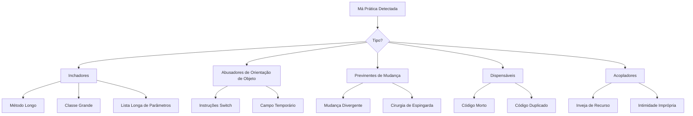

## Visão Geral

Más práticas de código são indicadores de problemas em potencial. Elas não significam necessariamente que o código está quebrado, mas sugerem áreas que poderiam se beneficiar de refatoração.

## Más Práticas Comuns



## Inchadores

### Método Longo

```php
// Cheiro: Método faz muito
function processArticleSubmission($data) {
    // 100+ linhas de validação, salvamento, notificação, etc.
}

// Solução: Extrair em métodos focados
function processArticleSubmission(array $data): Article
{
    $this->validateInput($data);
    $article = $this->createArticle($data);
    $this->saveArticle($article);
    $this->notifySubscribers($article);
    return $article;
}
```

### Classe Grande (Objeto Deus)

```php
// Cheiro: Classe faz tudo
class ArticleManager {
    public function create() { ... }
    public function delete() { ... }
    public function sendEmail() { ... }
    public function generatePDF() { ... }
    public function exportToExcel() { ... }
    public function validateUser() { ... }
    public function checkPermissions() { ... }
    // ... 50 métodos mais
}

// Solução: Dividir em classes focadas
class ArticleService { ... }
class ArticleExporter { ... }
class ArticleNotifier { ... }
class PermissionChecker { ... }
```

### Lista Longa de Parâmetros

```php
// Cheiro: Muitos parâmetros
function createArticle($title, $content, $author, $category, $tags, $status, $publishDate, $featured, $image) { ... }

// Solução: Usar objeto de parâmetro
class CreateArticleCommand {
    public string $title;
    public string $content;
    public int $authorId;
    public int $categoryId;
    public array $tags;
    public string $status;
    public ?DateTime $publishDate;
    public bool $featured;
    public ?string $image;
}

function createArticle(CreateArticleCommand $command): Article { ... }
```

## Abusadores de Orientação de Objeto

### Instruções Switch

```php
// Cheiro: Verificação de tipo com switch
function getDiscount($userType) {
    switch ($userType) {
        case 'regular':
            return 0;
        case 'premium':
            return 10;
        case 'vip':
            return 20;
        default:
            return 0;
    }
}

// Solução: Usar polimorfismo
interface UserType {
    public function getDiscount(): int;
}

class RegularUser implements UserType {
    public function getDiscount(): int { return 0; }
}

class PremiumUser implements UserType {
    public function getDiscount(): int { return 10; }
}

class VipUser implements UserType {
    public function getDiscount(): int { return 20; }
}
```

### Campo Temporário

```php
// Cheiro: Campos usados apenas em certas situações
class Article {
    private $tempCalculatedScore;

    public function search($terms) {
        $this->tempCalculatedScore = $this->calculateScore($terms);
        // ... usar pontuação
    }
}

// Solução: Passar como parâmetro ou valor de retorno
class Article {
    public function getSearchScore(array $terms): float {
        return $this->calculateScore($terms);
    }
}
```

## Previnentes de Mudança

### Mudança Divergente

```php
// Cheiro: Uma classe alterada por muitos motivos diferentes
class Article {
    public function save() { ... } // Mudança de banco de dados
    public function toJson() { ... } // Mudança de formato de API
    public function validate() { ... } // Mudança de regra de negócio
    public function render() { ... } // Mudança de UI
}

// Solução: Separar responsabilidades
class Article { ... } // Apenas objeto de domínio
class ArticleRepository { public function save() { ... } }
class ArticleSerializer { public function toJson() { ... } }
class ArticleValidator { public function validate() { ... } }
```

### Cirurgia de Espingarda

```php
// Cheiro: Uma mudança requer edição em muitos arquivos
// Alterar formato de data requer edição:
// - ArticleController.php
// - ArticleView.php
// - ArticleAPI.php
// - ArticleExport.php

// Solução: Centralizar
class DateFormatter {
    public function format(DateTime $date): string {
        return $date->format($this->config->get('date_format'));
    }
}
```

## Dispensáveis

### Código Morto

```php
// Cheiro: Código inacessível ou não utilizado
function processData($data) {
    if (true) {
        return $this->handleData($data);
    }
    // Isto nunca é executado
    return $this->legacyHandler($data);
}

// Método antigo não utilizado ainda na base de código
function oldMethod() {
    // Não chamado em lugar nenhum
}

// Solução: Remover código morto
function processData($data) {
    return $this->handleData($data);
}
```

### Código Duplicado

```php
// Cheiro: Mesma lógica em múltiplos lugares
class ArticleHandler {
    public function getActive() {
        $criteria = new CriteriaCompo();
        $criteria->add(new Criteria('status', 'active'));
        return $this->getObjects($criteria);
    }
}

class NewsHandler {
    public function getActive() {
        $criteria = new CriteriaCompo();
        $criteria->add(new Criteria('status', 'active'));
        return $this->getObjects($criteria);
    }
}

// Solução: Extrair comportamento comum
trait ActiveRecordsTrait {
    public function getActive(): array {
        $criteria = new CriteriaCompo();
        $criteria->add(new Criteria('status', 'active'));
        return $this->getObjects($criteria);
    }
}
```

## Acopladores

### Inveja de Recurso

```php
// Cheiro: Método usa dados de outro objeto mais que seu próprio
class Invoice {
    public function calculateTotal(Customer $customer) {
        $total = 0;
        foreach ($this->items as $item) {
            $total += $item->price;
        }
        // Usa dados de cliente extensivamente
        if ($customer->isPremium()) {
            $total *= (1 - $customer->getDiscountRate());
        }
        if ($customer->getCountry() === 'US') {
            $total *= 1.08; // Imposto
        }
        return $total;
    }
}

// Solução: Mover comportamento para objeto com os dados
class Customer {
    public function applyDiscount(float $amount): float {
        return $this->isPremium()
            ? $amount * (1 - $this->discountRate)
            : $amount;
    }

    public function applyTax(float $amount): float {
        return $this->country === 'US'
            ? $amount * 1.08
            : $amount;
    }
}
```

## Lista de Verificação de Refatoração

Quando você detecta uma má prática:

1. **Identificar** - Qual é a má prática?
2. **Avaliar** - Como o impacto é severo?
3. **Planejar** - Qual técnica de refatoração se aplica?
4. **Testar** - Os testes existem antes de refatorar?
5. **Refatorar** - Fazer pequenas mudanças incrementais
6. **Verificar** - Executar testes após cada mudança

## Documentação Relacionada

- Princípios de Código Limpo
- Organização de Código
- Boas Práticas de Testes
