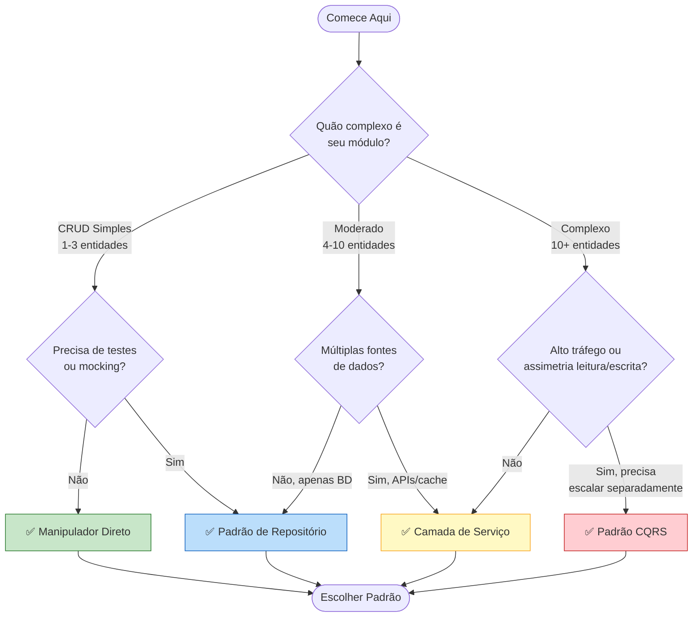
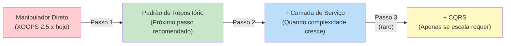

<span class="version-badge version-25x">2.5.x ✅</span> <span class="version-badge version-40x">4.0.x ✅</span>

> **Qual padrão devo usar?** Esta árvore de decisão o ajuda a escolher entre manipuladores diretos, Padrão de Repositório, Camada de Serviço e CQRS.

---

## Árvore de Decisão Rápida



---

## Comparação de Padrão

| Critério | Manipulador Direto | Repositório | Camada de Serviço | CQRS |
|----------|---------------|------------|---------------|------|
| **Complexidade** | ⭐ | ⭐⭐ | ⭐⭐⭐ | ⭐⭐⭐⭐⭐ |
| **Testabilidade** | ❌ Difícil | ✅ Bom | ✅ Ótimo | ✅ Ótimo |
| **Flexibilidade** | ❌ Baixa | ✅ Média | ✅ Alta | ✅ Muito Alta |
| **XOOPS 2.5.x** | ✅ Nativo | ✅ Funciona | ✅ Funciona | ⚠️ Complexo |
| **XOOPS 4.0** | ⚠️ Descontinuado | ✅ Recomendado | ✅ Recomendado | ✅ Para escala |
| **Tamanho da Equipe** | 1 dev | 1-3 devs | 2-5 devs | 5+ devs |
| **Manutenção** | ❌ Maior | ✅ Moderada | ✅ Menor | ⚠️ Requer expertise |

---

## Quando Usar Cada Padrão

### ✅ Manipulador Direto (`XoopsPersistableObjectHandler`)

**Melhor para:** Módulos simples, protótipos rápidos, aprendizado de XOOPS

```php
// Simples e direto - bom para módulos pequenos
$handler = xoops_getModuleHandler('article', 'news');
$articles = $handler->getObjects(new Criteria('status', 1));
```

**Escolha isto quando:**
- Construindo um módulo simples com 1-3 tabelas de banco de dados
- Criando um protótipo rápido
- Você é o único desenvolvedor e não precisa de testes
- O módulo não crescerá significativamente

**Limitações:**
- Difícil fazer teste unitário (dependência global)
- Acoplamento rígido à camada de banco de dados do XOOPS
- Lógica de negócios tende a vazar em controllers

---

### ✅ Padrão de Repositório

**Melhor para:** Maioria dos módulos, equipes querendo testabilidade

```php
// Abstração permite mocking para testes
interface ArticleRepositoryInterface {
    public function findPublished(): array;
    public function save(Article $article): void;
}

class XoopsArticleRepository implements ArticleRepositoryInterface {
    private $handler;

    public function __construct() {
        $this->handler = xoops_getModuleHandler('article', 'news');
    }

    public function findPublished(): array {
        return $this->handler->getObjects(new Criteria('status', 1));
    }
}
```

**Escolha isto quando:**
- Você quer escrever testes unitários
- Você pode mudar fontes de dados depois (BD → API)
- Trabalhando com 2+ desenvolvedores
- Construindo módulos para distribuição

**Caminho de atualização:** Este é o padrão recomendado para preparação do XOOPS 4.0.

---

### ✅ Camada de Serviço

**Melhor para:** Módulos com lógica de negócios complexa

```php
// Serviço coordena múltiplos repositórios e contém regras de negócios
class ArticlePublicationService {
    public function __construct(
        private ArticleRepositoryInterface $articles,
        private NotificationServiceInterface $notifications,
        private CacheInterface $cache
    ) {}

    public function publish(int $articleId): void {
        $article = $this->articles->find($articleId);
        $article->setStatus('published');
        $article->setPublishedAt(new DateTime());

        $this->articles->save($article);
        $this->notifications->notifySubscribers($article);
        $this->cache->invalidate("article:{$articleId}");
    }
}
```

**Escolha isto quando:**
- Operações abrangem múltiplas fontes de dados
- Regras de negócios são complexas
- Você precisa gerenciamento de transação
- Múltiplas partes do app fazem a mesma coisa

**Caminho de atualização:** Combine com Repositório para arquitetura robusta.

---

### ⚠️ CQRS (Segregação de Responsabilidade de Comando e Consulta)

**Melhor para:** Módulos em alta escala com assimetria leitura/escrita

```php
// Comandos modificam estado
class PublishArticleCommand {
    public function __construct(
        public readonly int $articleId,
        public readonly int $publisherId
    ) {}
}

// Consultas leem estado (podem usar modelos de leitura desnormalizados)
class GetPublishedArticlesQuery {
    public function __construct(
        public readonly int $limit = 10
    ) {}
}
```

**Escolha isto quando:**
- Leituras vastamente superam escritas (100:1 ou mais)
- Você precisa escala diferente para leituras vs escritas
- Requisitos complexos de relatório/analítica
- Event sourcing beneficiaria seu domínio

**Aviso:** CQRS adiciona complexidade significativa. A maioria dos módulos XOOPS não precisa.

---

## Caminho de Atualização Recomendado



### Passo 1: Envolver Manipuladores em Repositórios (2-4 horas)

1. Criar uma interface para suas necessidades de acesso a dados
2. Implementar usando o manipulador existente
3. Injetar o repositório em vez de chamar `xoops_getModuleHandler()` diretamente

### Passo 2: Adicionar Camada de Serviço Quando Necessário (1-2 dias)

1. Quando lógica de negócios aparece em controllers, extrair para um Serviço
2. Serviço usa repositórios, não manipuladores diretamente
3. Controllers ficam finos (rota → serviço → resposta)

### Passo 3: Considerar CQRS Apenas Se (raro)

1. Você tem milhões de leituras por dia
2. Modelos de leitura e escrita são significativamente diferentes
3. Você precisa event sourcing para trilhas de auditoria
4. Você tem uma equipe experiente com CQRS

---

## Cartão de Referência Rápida

| Pergunta | Resposta |
|----------|--------|
| **"Eu apenas preciso salvar/carregar dados"** | Manipulador Direto |
| **"Eu quero escrever testes"** | Padrão de Repositório |
| **"Eu tenho regras de negócios complexas"** | Camada de Serviço |
| **"Eu preciso escalar leituras separadamente"** | CQRS |
| **"Estou preparando para XOOPS 4.0"** | Repositório + Camada de Serviço |

---

## Documentação Relacionada

- [Guia do Padrão de Repositório](Patterns/Repository-Pattern.md)
- [Guia do Padrão de Camada de Serviço](Patterns/Service-Layer-Pattern.md)
- [Guia do Padrão CQRS](../07-XOOPS-4.0/Implementation-Guides/CQRS-Pattern-Guide.md) *(avançado)*
- [Contrato do Modo Híbrido](../07-XOOPS-4.0/Specifications/Hybrid-Mode-Contract.md)

---

#padrões #acesso-a-dados #árvore-de-decisão #boas-práticas #xoops
