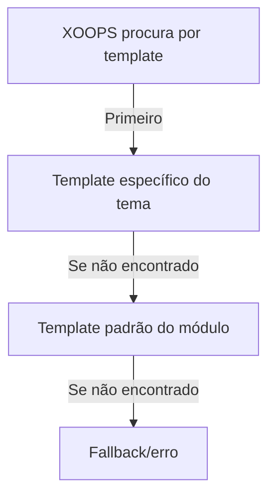

# Templates Personalizados no Publisher

> Guia para criar e personalizar templates do Publisher usando Smarty, CSS e sobrescrita de HTML.

---

## Visão Geral do Sistema de Template

### O que São Templates?

Os templates controlam como o Publisher exibe conteúdo:

```
Os templates renderizam:
  ├── Exibição de artigo
  ├── Listagens de categoria
  ├── Páginas de arquivo
  ├── Listagens de artigo
  ├── Seções de comentário
  ├── Resultados de busca
  ├── Blocos
  └── Páginas de admin
```

### Tipos de Template

```
Templates Base:
  ├── publisher_index.tpl (página inicial do módulo)
  ├── publisher_item.tpl (artigo único)
  ├── publisher_category.tpl (página de categoria)
  └── publisher_archive.tpl (visualização de arquivo)

Templates de Bloco:
  ├── publisher_block_latest.tpl
  ├── publisher_block_categories.tpl
  ├── publisher_block_archives.tpl
  └── publisher_block_top.tpl

Templates Admin:
  ├── admin_articles.tpl
  ├── admin_categories.tpl
  └── admin_*
```

---

## Diretórios de Template

### Estrutura de Arquivo de Template

```
Instalação XOOPS:
├── modules/publisher/
│   └── templates/
│       ├── Publisher/ (templates base)
│       │   ├── publisher_index.tpl
│       │   ├── publisher_item.tpl
│       │   ├── publisher_category.tpl
│       │   ├── blocks/
│       │   │   ├── publisher_block_latest.tpl
│       │   │   └── publisher_block_categories.tpl
│       │   └── css/
│       │       └── publisher.css
│       └── Themes/ (específico de tema)
│           ├── Classic/
│           ├── Modern/
│           └── Dark/

themes/seutema/
└── modules/
    └── publisher/
        ├── templates/
        │   └── publisher_custom.tpl
        ├── css/
        │   └── custom.css
        └── images/
            └── icons/
```

### Hierarquia de Template



---

## Criando Templates Personalizados

### Copiar Template para Tema

**Método 1: Via Gerenciador de Arquivo**

```
1. Navegue até /themes/seutema/modules/publisher/
2. Crie diretório se não existir:
   - templates/
   - css/
   - js/ (opcional)
3. Copie arquivo de template do módulo:
   modules/publisher/templates/Publisher/publisher_item.tpl
   → themes/seutema/modules/publisher/templates/publisher_item.tpl
4. Edite cópia do tema (não cópia do módulo!)
```

**Método 2: Via FTP/SSH**

```bash
# Criar diretório de sobrescrita do tema
mkdir -p /path/to/xoops/themes/seutema/modules/publisher/templates

# Copiar arquivos de template
cp /path/to/xoops/modules/publisher/templates/Publisher/*.tpl \
   /path/to/xoops/themes/seutema/modules/publisher/templates/

# Verificar se arquivos foram copiados
ls /path/to/xoops/themes/seutema/modules/publisher/templates/
```

### Editar Template Personalizado

Abra cópia do tema em editor de texto:

```
Arquivo: /themes/seutema/modules/publisher/templates/publisher_item.tpl

Edite:
  1. Mantenha variáveis Smarty intactas
  2. Modifique estrutura HTML
  3. Adicione classes CSS personalizadas
  4. Ajuste lógica de exibição
```

---

## Básico de Template Smarty

### Variáveis Smarty

O Publisher fornece variáveis para templates:

#### Variáveis de Artigo

```smarty
{* Variáveis de Artigo Único *}
<h1>{$item->title()}</h1>
<p>{$item->description()}</p>
<p>{$item->body()}</p>
<p>Por {$item->uname()} em {$item->date('l, F j, Y')}</p>
<p>Categoria: {$item->category}</p>
<p>Visualizações: {$item->views()}</p>
```

#### Variáveis de Categoria

```smarty
{* Variáveis de Categoria *}
<h2>{$category->name()}</h2>
<p>{$category->description()}</p>
image()}" alt="{$category->name()}">
<p>Artigos: {$category->itemCount()}</p>
```

#### Variáveis de Bloco

```smarty
{* Bloco de Artigos Recentes *}
{foreach from=$items item=item}
  <div class="article">
    <h3>{$item->title()}</h3>
    <p>{$item->summary()}</p>
  </div>
{/foreach}
```

### Sintaxe Smarty Comum

```smarty
{* Variável *}
{$variable}
{$array.key}
{$object->method()}

{* Condicional *}
{if $condition}
  <p>Conteúdo mostrado se verdadeiro</p>
{else}
  <p>Conteúdo mostrado se falso</p>
{/if}

{* Loop *}
{foreach from=$array item=item}
  <li>{$item}</li>
{/foreach}

{* Funções *}
{$variable|truncate:100:"..."}
{$date|date_format:"%Y-%m-%d"}
{$text|htmlspecialchars}

{* Comentários *}
{* Este é um comentário Smarty, não exibido *}
```

---

## Exemplos de Template

### Template de Artigo Único

**Arquivo: publisher_item.tpl**

```smarty
<!-- Visualização de Detalhe de Artigo -->
<div class="publisher-item">

  <!-- Seção de Cabeçalho -->
  <div class="article-header">
    <h1>{$item->title()}</h1>

    {if $item->subtitle()}
      <h2 class="article-subtitle">{$item->subtitle()}</h2>
    {/if}

    <div class="article-meta">
      <span class="author">
        Por <a href="{$item->authorUrl()}">{$item->uname()}</a>
      </span>
      <span class="date">
        {$item->date('l, F j, Y')}
      </span>
      <span class="category">
        <a href="{$item->categoryUrl()}">
          {$item->category}
        </a>
      </span>
      <span class="views">
        {$item->views()} visualizações
      </span>
    </div>
  </div>

  <!-- Imagem em Destaque -->
  {if $item->image()}
    <div class="article-featured-image">
      image()}"
           alt="{$item->title()}"
           class="img-fluid">
    </div>
  {/if}

  <!-- Corpo do Artigo -->
  <div class="article-content">
    {$item->body()}
  </div>

  <!-- Tags -->
  {if $item->tags()}
    <div class="article-tags">
      <strong>Tags:</strong>
      {foreach from=$item->tags() item=tag}
        <span class="tag">
          <a href="{$tag->url()}">{$tag->name()}</a>
        </span>
      {/foreach}
    </div>
  {/if}

  <!-- Seção de Rodapé -->
  <div class="article-footer">
    <div class="article-actions">
      {if $canEdit}
        <a href="{$editUrl}" class="btn btn-primary">Editar</a>
      {/if}
      {if $canDelete}
        <a href="{$deleteUrl}" class="btn btn-danger">Deletar</a>
      {/if}
    </div>

    {if $allowRatings}
      <div class="article-rating">
        <!-- Componente de classificação -->
      </div>
    {/if}
  </div>

</div>

<!-- Seção de Comentários -->
{if $allowComments}
  <div class="article-comments">
    <h3>Comentários</h3>
    {include file="publisher_comments.tpl"}
  </div>
{/if}
```

### Template de Listagem de Categoria

**Arquivo: publisher_category.tpl**

```smarty
<!-- Página de Categoria -->
<div class="publisher-category">

  <!-- Cabeçalho de Categoria -->
  <div class="category-header">
    <h1>{$category->name()}</h1>

    {if $category->image()}
      image()}"
           alt="{$category->name()}"
           class="category-image">
    {/if}

    {if $category->description()}
      <p class="category-description">
        {$category->description()}
      </p>
    {/if}
  </div>

  <!-- Subcategorias -->
  {if $subcategories}
    <div class="subcategories">
      <h3>Subcategorias</h3>
      <ul>
        {foreach from=$subcategories item=sub}
          <li>
            <a href="{$sub->url()}">{$sub->name()}</a>
            ({$sub->itemCount()} artigos)
          </li>
        {/foreach}
      </ul>
    </div>
  {/if}

  <!-- Lista de Artigos -->
  <div class="articles-list">
    <h2>Artigos</h2>

    {if count($items) > 0}
      {foreach from=$items item=item}
        <article class="article-preview">
          {if $item->image()}
            <div class="article-image">
              <a href="{$item->url()}">
                image()}" alt="{$item->title()}">
              </a>
            </div>
          {/if}

          <div class="article-content">
            <h3>
              <a href="{$item->url()}">{$item->title()}</a>
            </h3>

            <div class="article-meta">
              <span class="date">{$item->date('M d, Y')}</span>
              <span class="author">por {$item->uname()}</span>
            </div>

            <p class="article-excerpt">
              {$item->description()|truncate:200:"..."}
            </p>

            <a href="{$item->url()}" class="read-more">
              Leia Mais →
            </a>
          </div>
        </article>
      {/foreach}

      <!-- Paginação -->
      {if $pagination}
        <nav class="pagination">
          {$pagination}
        </nav>
      {/if}
    {else}
      <p class="no-articles">
        Nenhum artigo nesta categoria ainda.
      </p>
    {/if}
  </div>

</div>
```

### Template de Bloco de Artigos Recentes

**Arquivo: publisher_block_latest.tpl**

```smarty
<!-- Bloco de Artigos Recentes -->
<div class="publisher-block-latest">
  <h3>{$block_title|default:"Artigos Recentes"}</h3>

  {if count($items) > 0}
    <ul class="article-list">
      {foreach from=$items item=item name=articles}
        <li class="article-item">
          <a href="{$item->url()}" title="{$item->title()}">
            {$item->title()}
          </a>
          <span class="date">
            {$item->date('M d, Y')}
          </span>

          {if $show_summary && $item->description()}
            <p class="summary">
              {$item->description()|truncate:80:"..."}
            </p>
          {/if}
        </li>
      {/foreach}
    </ul>
  {else}
    <p>Nenhum artigo disponível.</p>
  {/if}
</div>
```

---

## Estilizando com CSS

### Arquivos CSS Personalizados

Crie CSS personalizado no tema:

```
/themes/seutema/modules/publisher/css/custom.css
```

### Estrutura de Template Base

Compreenda a estrutura HTML:

```html
<!-- Módulo Publisher -->
<div class="publisher-module">

  <!-- Visualização de Item -->
  <div class="publisher-item">
    <div class="article-header">...</div>
    <div class="article-featured-image">...</div>
    <div class="article-content">...</div>
    <div class="article-footer">...</div>
  </div>

  <!-- Visualização de Categoria -->
  <div class="publisher-category">
    <div class="category-header">...</div>
    <div class="articles-list">...</div>
  </div>

  <!-- Bloco -->
  <div class="publisher-block-latest">
    <ul class="article-list">...</ul>
  </div>

</div>
```

### Exemplos de CSS

```css
/* Contêiner de Artigo */
.publisher-item {
  background: #fff;
  border: 1px solid #ddd;
  border-radius: 4px;
  padding: 20px;
  margin-bottom: 20px;
}

/* Cabeçalho de Artigo */
.article-header {
  border-bottom: 2px solid #f0f0f0;
  padding-bottom: 15px;
  margin-bottom: 20px;
}

.article-header h1 {
  font-size: 2.5em;
  margin: 0 0 10px 0;
  color: #333;
}

.article-subtitle {
  font-size: 1.3em;
  color: #666;
  font-style: italic;
  margin: 0;
}

/* Informação Meta de Artigo */
.article-meta {
  font-size: 0.9em;
  color: #999;
}

.article-meta span {
  margin-right: 20px;
}

.article-meta a {
  color: #0066cc;
  text-decoration: none;
}

.article-meta a:hover {
  text-decoration: underline;
}

/* Imagem em Destaque de Artigo */
.article-featured-image {
  margin: 20px 0;
  text-align: center;
}

.article-featured-image img {
  max-width: 100%;
  height: auto;
  border-radius: 4px;
}

/* Conteúdo de Artigo */
.article-content {
  font-size: 1.1em;
  line-height: 1.8;
  color: #333;
}

.article-content h2 {
  font-size: 1.8em;
  margin: 30px 0 15px 0;
  color: #222;
}

.article-content h3 {
  font-size: 1.4em;
  margin: 20px 0 10px 0;
  color: #444;
}

.article-content p {
  margin-bottom: 15px;
}

.article-content ul,
.article-content ol {
  margin: 15px 0 15px 30px;
}

.article-content li {
  margin-bottom: 8px;
}

/* Tags de Artigo */
.article-tags {
  margin-top: 20px;
  padding-top: 20px;
  border-top: 1px solid #f0f0f0;
}

.tag {
  display: inline-block;
  background: #f0f0f0;
  padding: 5px 10px;
  margin: 5px 5px 5px 0;
  border-radius: 3px;
  font-size: 0.9em;
}

.tag a {
  color: #0066cc;
  text-decoration: none;
}

.tag a:hover {
  text-decoration: underline;
}

/* Lista de Artigos de Categoria */
.publisher-category .articles-list {
  margin-top: 30px;
}

.article-preview {
  display: flex;
  margin-bottom: 30px;
  padding-bottom: 30px;
  border-bottom: 1px solid #f0f0f0;
}

.article-preview:last-child {
  border-bottom: none;
}

.article-image {
  flex: 0 0 200px;
  margin-right: 20px;
}

.article-image img {
  width: 100%;
  height: 150px;
  object-fit: cover;
  border-radius: 4px;
}

.article-content {
  flex: 1;
}

/* Responsivo */
@media (max-width: 768px) {
  .article-preview {
    flex-direction: column;
  }

  .article-image {
    flex: 1;
    margin: 0 0 15px 0;
  }

  .article-header h1 {
    font-size: 1.8em;
  }
}
```

---

## Referência de Variáveis de Template

### Objeto Item (Artigo)

```smarty
{* Propriedades de Artigo *}
{$item->id()}              {* ID do artigo *}
{$item->title()}           {* Título do artigo *}
{$item->description()}     {* Descrição breve *}
{$item->body()}            {* Conteúdo completo *}
{$item->subtitle()}        {* Subtítulo *}
{$item->uname()}           {* Nome de usuário do autor *}
{$item->authorId()}        {* ID de usuário do autor *}
{$item->date()}            {* Data de publicação *}
{$item->modified()}        {* Última modificação *}
{$item->image()}           {* URL de imagem em destaque *}
{$item->views()}           {* Contagem de visualizações *}
{$item->categoryId()}      {* ID da categoria *}
{$item->category()}        {* Nome da categoria *}
{$item->categoryUrl()}     {* URL da categoria *}
{$item->url()}             {* URL do artigo *}
{$item->status()}          {* Status do artigo *}
{$item->rating()}          {* Classificação média *}
{$item->comments()}        {* Contagem de comentários *}
{$item->tags()}            {* Array de tags do artigo *}

{* Métodos Formatados *}
{$item->date('Y-m-d')}               {* Data formatada *}
{$item->description()|truncate:100}  {* Truncado *}
```

### Objeto Category

```smarty
{* Propriedades de Categoria *}
{$category->id()}          {* ID da categoria *}
{$category->name()}        {* Nome da categoria *}
{$category->description()} {* Descrição *}
{$category->image()}       {* URL de imagem *}
{$category->parentId()}    {* ID da categoria pai *}
{$category->itemCount()}   {* Contagem de artigos *}
{$category->url()}         {* URL da categoria *}
{$category->status()}      {* Status *}
```

### Variáveis de Bloco

```smarty
{$items}           {* Array de itens *}
{$categories}      {* Array de categorias *}
{$pagination}      {* HTML de paginação *}
{$total}           {* Contagem total *}
{$limit}           {* Itens por página *}
{$page}            {* Página atual *}
```

---

## Condicionais de Template

### Verificações Condicionais Comuns

```smarty
{* Verificar se variável existe e não está vazia *}
{if $variable}
  <p>{$variable}</p>
{/if}

{* Verificar se array tem itens *}
{if count($items) > 0}
  {foreach from=$items item=item}
    <li>{$item->title()}</li>
  {/foreach}
{else}
  <p>Nenhum item disponível.</p>
{/if}

{* Verificar permissões de usuário *}
{if $canEdit}
  <a href="edit.php?id={$item->id()}">Editar</a>
{/if}

{if $isAdmin}
  <a href="delete.php?id={$item->id()}">Deletar</a>
{/if}

{* Verificar configurações do módulo *}
{if $allowComments}
  {include file="publisher_comments.tpl"}
{/if}

{* Verificar status *}
{if $item->status() == 1}
  <span class="published">Publicado</span>
{elseif $item->status() == 0}
  <span class="draft">Rascunho</span>
{/if}
```

---

## Técnicas Avançadas de Template

### Incluir Outros Templates

```smarty
{* Incluir outro template *}
{include file="publisher_comments.tpl"}

{* Incluir com variáveis *}
{include file="publisher_article_preview.tpl" item=$item}

{* Incluir se existir *}
{include file="custom_header.tpl"|default:"header.tpl"}
```

### Atribuir Variáveis em Template

```smarty
{* Atribuir variável para uso posterior *}
{assign var="articleTitle" value=$item->title()}

{* Usar variável atribuída *}
<h1>{$articleTitle}</h1>

{* Atribuir valores complexos *}
{assign var="count" value=$items|count}
{if $count > 0}
  <p>Encontrados {$count} artigos</p>
{/if}
```

### Filtros de Template

```smarty
{* Filtros de texto *}
{$text|htmlspecialchars}        {* Escapar HTML *}
{$text|strip_tags}              {* Remover tags HTML *}
{$text|truncate:100:"..."}     {* Truncar texto *}
{$text|upper}                   {* MAIÚSCULAS *}
{$text|lower}                   {* minúsculas *}

{* Filtros de data *}
{$date|date_format:"%Y-%m-%d"}  {* Formatar data *}
{$date|date_format:"%l, %F %j, %Y"} {* Formato completo *}

{* Filtros de número *}
{$number|string_format:"%.2f"}  {* Formatar número *}
{$number|number_format}         {* Adicionar separadores *}

{* Filtros de array *}
{$array|implode:", "}           {* Juntar array *}
{$array|count}                  {* Contar itens *}
```

---

## Depurando Templates

### Exibir Variáveis Smarty

Para depuração (remova em produção):

```smarty
{* Mostrar valor da variável *}
<pre>{$variable|print_r}</pre>

{* Mostrar todas as variáveis disponíveis *}
<pre>{$smarty.all|print_r}</pre>

{* Verificar se variável existe *}
{if isset($variable)}
  Variável existe
{/if}

{* Exibir informações de depuração *}
{if $debug}
  Item: {$item->id()}<br>
  Título: {$item->title()}<br>
  Categoria: {$item->categoryId()}<br>
{/if}
```

### Habilitar Modo de Depuração

Em `/modules/publisher/xoops_version.php` ou configurações de admin:

```php
// Habilitar depuração
define('PUBLISHER_DEBUG', true);
```

---

## Migração de Template

### De Versão Antiga do Publisher

Se estiver atualizando de versão anterior:

1. Compare arquivos antigos e novos de template
2. Mescle mudanças personalizadas
3. Use novos nomes de variável
4. Teste completamente
5. Faça backup de templates antigos

### Caminho de Atualização

```
Template antigo          Template novo          Ação
publisher_item.tpl → publisher_item.tpl   Mesclar personalizações
publisher_cat.tpl  → publisher_category.tpl Renomear, mesclar
block_latest.tpl   → publisher_block_latest.tpl Renomear, verificar
```

---

## Melhores Práticas

### Diretrizes de Template

```
✓ Manter lógica de negócio em PHP, lógica de exibição em templates
✓ Usar nomes de classe CSS significativos
✓ Comentar seções complexas
✓ Testar design responsivo
✓ Validar saída HTML
✓ Escapar dados de usuário
✓ Usar HTML semântico
✓ Manter templates DRY (Não Repita Yourself)
```

### Dicas de Desempenho

```
✓ Minimizar consultas ao banco de dados em templates
✓ Cachear templates compilados
✓ Carregar imagens com preguiça
✓ Minificar CSS/JavaScript
✓ Usar CDN para ativos
✓ Otimizar imagens
✗ Evitar lógica Smarty complexa
```

---

## Documentação Relacionada

- Referência da API
- Ganchos e Eventos
- Configuração
- Criação de Artigos

---

## Recursos

- [Documentação do Smarty](https://www.smarty.net/documentation)
- [GitHub do Publisher](https://github.com/XoopsModules25x/publisher)
- [Guia de Template XOOPS](../../02-Core-Concepts/Templates/Smarty-Basics.md)

---

#publisher #templates #smarty #personalização #tema #xoops
