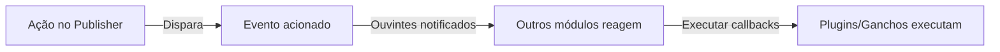

# Ganchos e Eventos do Publisher

> Guia completo para estender a funcionalidade do Publisher usando eventos, ganchos e plugins.

---

## Visão Geral do Sistema de Eventos

### O que São Eventos?

Os eventos permitem que outros módulos reajam às ações do Publisher:

```
Ação do Publisher → Dispara Evento → Outros módulos escutam/reagem

Exemplos:
  - Artigo criado → Enviar email de notificação
  - Artigo publicado → Atualizar mídia social
  - Comentário postado → Notificar autor
  - Categoria criada → Atualizar índice de busca
```

### Fluxo de Evento



---

## Eventos Disponíveis

### Eventos de Item (Artigo)

#### publisher.item.created

Acionado quando um novo artigo é criado.

```php
// Ponto de disparo no Publisher
xoops_events()->trigger('publisher.item.created', array(
    'item' => $item,
    'itemid' => $item->getVar('itemid'),
    'title' => $item->getVar('title'),
    'uid' => $item->getVar('uid')
));
```

**Exemplo de Ouvinte:**

```php
// Escutar criação de artigo
xoops_events()->attach('publisher.item.created', 'onArticleCreated');

function onArticleCreated($item) {
    $itemId = $item['itemid'];
    $title = $item['title'];
    $uid = $item['uid'];

    // Enviar notificação por email
    sendEmailNotification($uid, "Novo artigo: $title");

    // Registrar atividade
    logActivity('Artigo criado', $itemId);

    // Atualizar índice de busca
    updateSearchIndex($itemId);
}
```

#### publisher.item.updated

Acionado quando um artigo é atualizado.

```php
xoops_events()->trigger('publisher.item.updated', array(
    'item' => $item,
    'itemid' => $itemId,
    'changes' => $changes
));
```

#### publisher.item.deleted

Acionado quando um artigo é deletado.

```php
xoops_events()->trigger('publisher.item.deleted', array(
    'itemid' => $itemId,
    'title' => $title,
    'categoryid' => $categoryId
));
```

#### publisher.item.published

Acionado quando o status do artigo muda para publicado.

```php
xoops_events()->trigger('publisher.item.published', array(
    'item' => $item,
    'itemid' => $itemId
));
```

#### publisher.item.approved

Acionado quando artigo pendente é aprovado.

```php
xoops_events()->trigger('publisher.item.approved', array(
    'item' => $item,
    'itemid' => $itemId,
    'uid' => $uid
));
```

#### publisher.item.rejected

Acionado quando artigo é rejeitado.

```php
xoops_events()->trigger('publisher.item.rejected', array(
    'item' => $item,
    'itemid' => $itemId,
    'reason' => $reason
));
```

### Eventos de Categoria

#### publisher.category.created

Acionado quando categoria é criada.

```php
xoops_events()->trigger('publisher.category.created', array(
    'category' => $category,
    'categoryid' => $categoryId,
    'name' => $name
));
```

#### publisher.category.updated

Acionado quando categoria é atualizada.

```php
xoops_events()->trigger('publisher.category.updated', array(
    'category' => $category,
    'categoryid' => $categoryId
));
```

#### publisher.category.deleted

Acionado quando categoria é deletada.

```php
xoops_events()->trigger('publisher.category.deleted', array(
    'categoryid' => $categoryId,
    'name' => $name,
    'itemCount' => $itemCount
));
```

### Eventos de Comentário

#### publisher.comment.created

Acionado quando comentário é postado.

```php
xoops_events()->trigger('publisher.comment.created', array(
    'comment' => $comment,
    'commentid' => $commentId,
    'itemid' => $itemId
));
```

#### publisher.comment.approved

Acionado quando comentário é aprovado.

```php
xoops_events()->trigger('publisher.comment.approved', array(
    'comment' => $comment,
    'commentid' => $commentId
));
```

#### publisher.comment.deleted

Acionado quando comentário é deletado.

```php
xoops_events()->trigger('publisher.comment.deleted', array(
    'commentid' => $commentId,
    'itemid' => $itemId
));
```

---

## Escutando Eventos

### Registrar Ouvinte de Evento

Em seu módulo ou plugin:

```php
<?php
// Registrar ouvinte em xoops_version.php ou arquivo de inicialização
xoops_events()->attach(
    'publisher.item.created',
    array('MyModuleListener', 'onPublisherItemCreated')
);

// Ou usar nome de função
xoops_events()->attach(
    'publisher.item.created',
    'my_module_on_item_created'
);
?>
```

### Método de Classe de Ouvinte

```php
<?php
class MyModuleListener {
    public static function onPublisherItemCreated($data) {
        $itemId = $data['itemid'];
        $title = $data['title'];

        // Executar ação
        self::notifySubscribers($itemId, $title);
    }

    protected static function notifySubscribers($itemId, $title) {
        // Implementação
    }
}
?>
```

### Função de Ouvinte

```php
<?php
function my_module_on_item_created($data) {
    $itemId = $data['itemid'];
    $title = $data['title'];
    $uid = $data['uid'];

    // Enviar notificação
    notifyUser($uid, "Artigo criado: $title");
}
?>
```

---

## Exemplos de Evento

### Exemplo 1: Enviar Email na Criação de Artigo

```php
<?php
// Escutar criação de artigo
xoops_events()->attach(
    'publisher.item.created',
    'send_article_notification_email'
);

function send_article_notification_email($data) {
    $itemId = $data['itemid'];
    $title = $data['title'];
    $uid = $data['uid'];

    // Obter objeto do usuário
    $userHandler = xoops_getHandler('user');
    $user = $userHandler->get($uid);

    if (!$user) {
        return;
    }

    // Obter emails de admin
    $config = xoops_getModuleConfig();
    $adminEmails = $config['admin_emails'];

    // Preparar email
    $subject = "Novo Artigo: $title";
    $message = "Um novo artigo foi criado:\n\n";
    $message .= "Título: $title\n";
    $message .= "Autor: " . $user->getVar('uname') . "\n";
    $message .= "Data: " . date('Y-m-d H:i:s') . "\n";
    $message .= "ID: $itemId\n\n";
    $message .= "Link: " . XOOPS_URL . "/modules/publisher/?op=showitem&itemid=$itemId\n";

    // Enviar para admins
    foreach (explode(',', $adminEmails) as $email) {
        xoops_mail($email, $subject, $message);
    }
}
?>
```

### Exemplo 2: Atualizar Índice de Busca

```php
<?php
// Escutar evento de artigo publicado
xoops_events()->attach(
    'publisher.item.published',
    'update_search_index'
);

function update_search_index($data) {
    $itemId = $data['itemid'];
    $item = $data['item'];

    // Atualizar índice de busca
    $searchHandler = xoops_getModuleHandler('Search');
    $searchHandler->indexArticle($itemId, array(
        'title' => $item->getVar('title'),
        'content' => $item->getVar('body'),
        'author' => $item->getVar('uname'),
        'date' => $item->getVar('datesub')
    ));
}
?>
```

### Exemplo 3: Auto-Postar em Mídia Social

```php
<?php
// Escutar publicação de artigo
xoops_events()->attach(
    'publisher.item.published',
    'post_to_social_media'
);

function post_to_social_media($data) {
    $item = $data['item'];
    $itemId = $data['itemid'];

    // Obter configuração
    $config = xoops_getModuleConfig();

    if ($config['post_to_twitter']) {
        postToTwitter(
            $item->getVar('title'),
            XOOPS_URL . '/modules/publisher/?op=showitem&itemid=' . $itemId
        );
    }

    if ($config['post_to_facebook']) {
        postToFacebook(
            $item->getVar('title'),
            $item->getVar('description')
        );
    }
}

function postToTwitter($text, $url) {
    // Integração com API do Twitter
    // Usar biblioteca OAuth do Twitter
}

function postToFacebook($title, $description) {
    // Integração com API do Facebook
}
?>
```

### Exemplo 4: Sincronizar com Sistema Externo

```php
<?php
// Escutar criação e atualização de artigo
xoops_events()->attach(
    'publisher.item.created',
    'sync_external_system'
);

xoops_events()->attach(
    'publisher.item.updated',
    'sync_external_system'
);

function sync_external_system($data) {
    $item = $data['item'];
    $itemId = $data['itemid'];

    // Obter configuração de API externa
    $config = xoops_getModuleConfig();
    $apiUrl = $config['external_api_url'];
    $apiKey = $config['external_api_key'];

    // Preparar carga útil
    $payload = json_encode(array(
        'id' => $itemId,
        'title' => $item->getVar('title'),
        'content' => $item->getVar('body'),
        'date' => date('c', $item->getVar('datesub'))
    ));

    // Enviar para sistema externo
    $ch = curl_init($apiUrl);
    curl_setopt($ch, CURLOPT_POST, true);
    curl_setopt($ch, CURLOPT_POSTFIELDS, $payload);
    curl_setopt($ch, CURLOPT_HTTPHEADER, array(
        'Content-Type: application/json',
        'Authorization: Bearer ' . $apiKey
    ));
    curl_exec($ch);
    curl_close($ch);
}
?>
```

---

## Sistema de Ganchos

### Ganchos do Publisher

Os ganchos permitem modificações no comportamento do Publisher:

#### publisher.view.article.start

Chamado antes do artigo ser renderizado.

```php
xoops_events()->attach(
    'publisher.view.article.start',
    'modify_article_before_display'
);

function modify_article_before_display(&$item) {
    // Modificar item antes de exibição
    $title = $item->getVar('title');
    $item->setVar('title', '[DESTAQUE] ' . $title);
}
```

#### publisher.view.article.end

Chamado após o artigo ser renderizado.

```php
xoops_events()->attach(
    'publisher.view.article.end',
    'append_to_article'
);

function append_to_article(&$article) {
    // Adicionar conteúdo após artigo
    $article .= '<div class="related-articles">';
    $article .= '<!-- Conteúdo de artigos relacionados -->';
    $article .= '</div>';
}
```

#### publisher.permission.check

Chamado ao verificar permissões.

```php
xoops_events()->attach(
    'publisher.permission.check',
    'custom_permission_logic'
);

function custom_permission_logic(&$allowed, $permission, $itemId) {
    // Lógica de permissão personalizada
    if (custom_rule_applies($itemId)) {
        $allowed = true;
    }
}
```

---

## Sistema de Plugin

### Criar um Plugin

Os plugins estendem a funcionalidade do Publisher:

**Estrutura de Arquivo:**

```
modules/publisher/plugins/
├── myplugin/
│   ├── plugin.php (arquivo principal)
│   ├── language/
│   │   └── english.php
│   ├── templates/
│   └── css/
```

**plugin.php:**

```php
<?php
// Informações do plugin
define('MYPLUGIN_NAME', 'Meu Plugin do Publisher');
define('MYPLUGIN_VERSION', '1.0.0');
define('MYPLUGIN_DESCRIPTION', 'Estende Publisher com recursos personalizados');

// Registrar ganchos/eventos
xoops_events()->attach(
    'publisher.item.created',
    'myplugin_on_item_created'
);

xoops_events()->attach(
    'publisher.view.article.end',
    'myplugin_append_content'
);

// Funções do plugin
function myplugin_on_item_created($data) {
    // Manipular criação de item
}

function myplugin_append_content(&$content) {
    // Adicionar conteúdo ao artigo
    $content .= '<div class="myplugin-content">Conteúdo personalizado</div>';
}

// API do Plugin
class MyPublisherPlugin {
    public static function getArticles($limit = 10) {
        $itemHandler = xoops_getModuleHandler('Item', 'publisher');
        return $itemHandler->getRecent($limit);
    }

    public static function getCategoryTree() {
        $catHandler = xoops_getModuleHandler('Category', 'publisher');
        return $catHandler->getRoots();
    }
}
?>
```

### Carregar Plugin

Na inicialização do Publisher:

```php
<?php
// Carregar plugin
$pluginPath = XOOPS_ROOT_PATH . '/modules/publisher/plugins/myplugin/plugin.php';
if (file_exists($pluginPath)) {
    include_once $pluginPath;
}
?>
```

---

## Filtros

### Filtros de Conteúdo

Os filtros modificam dados antes/depois do processamento:

```php
<?php
// Filtrar título do artigo
$title = apply_filters('publisher_item_title', $title, $itemId);

// Filtrar corpo do artigo
$body = apply_filters('publisher_item_body', $body, $itemId);

// Filtrar exibição do artigo
$display = apply_filters('publisher_item_display', $display, $item);
?>
```

### Registrar Filtro

```php
<?php
// Adicionar filtro
add_filter('publisher_item_title', 'my_title_filter');

function my_title_filter($title, $itemId) {
    // Modificar título
    return strtoupper($title);
}

// Adicionar filtro com prioridade
add_filter(
    'publisher_item_body',
    'my_body_filter',
    10,  // prioridade (menor = mais cedo)
    2    // número de argumentos
);

function my_body_filter($body, $itemId) {
    // Adicionar marca d'água ao corpo
    return $body . '<p class="watermark">© ' . date('Y') . '</p>';
}
?>
```

---

## Ganchos de Ação

### Ações Personalizadas

Execute código em pontos específicos:

```php
<?php
// Executar ação
do_action('publisher_article_saved', $itemId, $item);

// Executar ação com argumentos
do_action('publisher_comment_approved', $commentId, $comment);

// Escutar ação
add_action('publisher_article_saved', 'my_action_handler');

function my_action_handler($itemId, $item) {
    // Executar código
    log_article_save($itemId);
    update_statistics();
}
?>
```

---

## Estendendo com Plugins

### Exemplo de Plugin: Artigos Relacionados

```php
<?php
// Arquivo: modules/publisher/plugins/related-articles/plugin.php

class RelatedArticlesPlugin {
    public static function init() {
        xoops_events()->attach(
            'publisher.view.article.end',
            array(__CLASS__, 'displayRelated')
        );
    }

    public static function displayRelated(&$content) {
        // Obter artigos relacionados
        $related = self::getRelatedArticles();

        if (count($related) > 0) {
            $html = '<div class="related-articles">';
            $html .= '<h3>Artigos Relacionados</h3>';
            $html .= '<ul>';

            foreach ($related as $article) {
                $html .= '<li>';
                $html .= '<a href="' . $article->url() . '">';
                $html .= $article->title();
                $html .= '</a>';
                $html .= '</li>';
            }

            $html .= '</ul>';
            $html .= '</div>';

            $content .= $html;
        }
    }

    protected static function getRelatedArticles() {
        // Obter artigo atual
        global $itemId;

        $itemHandler = xoops_getModuleHandler('Item', 'publisher');
        $item = $itemHandler->get($itemId);

        if (!$item) {
            return array();
        }

        // Obter artigos na mesma categoria
        $related = $itemHandler->getByCategory(
            $item->getVar('categoryid'),
            $limit = 5
        );

        // Remover artigo atual
        $related = array_filter($related, function($article) {
            global $itemId;
            return $article->getVar('itemid') != $itemId;
        });

        return array_slice($related, 0, 3);
    }
}

// Inicializar plugin
RelatedArticlesPlugin::init();
?>
```

---

## Melhores Práticas

### Diretrizes para Ouvinte de Evento

```php
✓ Manter ouvintes performáticos
  - Não fazer processamento pesado em eventos
  - Cachear resultados quando possível

✓ Manipular erros com graça
  - Usar try/catch
  - Registrar erros
  - Não quebrar fluxo principal

✓ Usar nomes significativos
  - my_module_on_publisher_item_created
  - Em vez de: process_event_1

✓ Documentar seus eventos
  - Comentar qual é o ponto de disparo
  - Listar dados esperados
  - Mostrar exemplos de uso

✓ Descarregar ouvintes corretamente
  - Limpar na desinstalação do módulo
  - Remover ganchos quando não mais necessários
```

### Dicas de Desempenho

```
✗ Evitar consultas ao banco de dados em ouvintes
✗ Não bloquear execução com operações lentas
✗ Evitar modificar dados desnecessariamente

✓ Colocar tarefas de longa duração em fila
✓ Cachear chamadas a API externas
✓ Usar carregamento preguiçoso para dependências
✓ Operações de banco de dados em lote
```

---

## Depurando Eventos

### Habilitar Modo de Depuração

```php
<?php
// Na inicialização do módulo
if (defined('XOOPS_DEBUG')) {
    xoops_events()->attach(
        'publisher.item.created',
        'publisher_debug_event'
    );
}

function publisher_debug_event($data) {
    error_log('Evento do Publisher: ' . print_r($data, true));
}
?>
```

### Registrar Eventos

```php
<?php
// Registrar dados de evento
xoops_events()->attach(
    'publisher.item.created',
    'log_publisher_events'
);

function log_publisher_events($data) {
    $log = XOOPS_ROOT_PATH . '/var/log/publisher.log';
    $entry = date('Y-m-d H:i:s') . ' - ';
    $entry .= 'Evento: publisher.item.created' . "\n";
    $entry .= 'Dados: ' . json_encode($data) . "\n\n";
    file_put_contents($log, $entry, FILE_APPEND);
}
?>
```

---

## Documentação Relacionada

- Referência da API
- Templates Personalizados
- Criação de Artigos

---

## Recursos

- [GitHub do Publisher](https://github.com/XoopsModules25x/publisher)
- [Sistema de Eventos XOOPS](../../03-Module-Development/Module-Development.md)
- [Desenvolvimento de Plugin](../../03-Module-Development/Module-Development.md)

---

#publisher #ganchos #eventos #plugins #extensões #personalização #xoops
