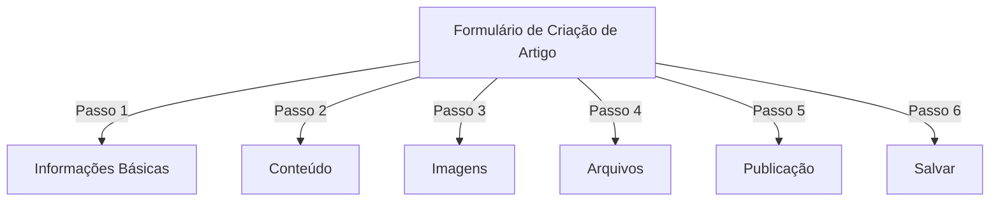
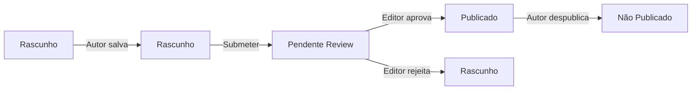
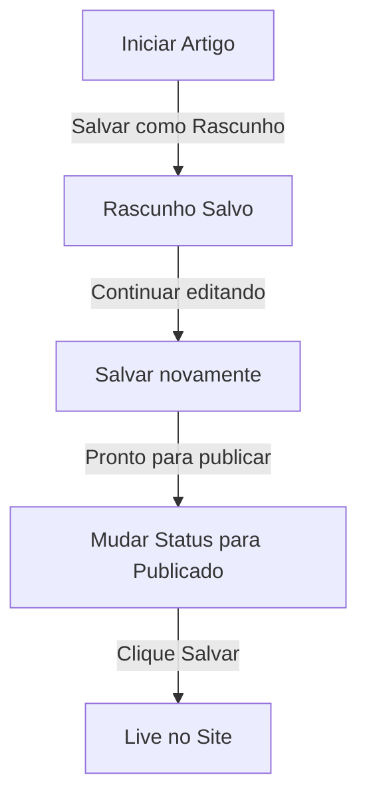

# Criando Artigos no Publisher

> Guia passo a passo para criar, editar, formatar e publicar artigos no módulo Publisher.

---

## Acessar Gerenciamento de Artigos

### Navegação do Painel Admin

```
Painel Admin
└── Módulos
    └── Publisher
        └── Artigos
            ├── Criar Novo
            ├── Editar
            ├── Deletar
            └── Publicar
```

### Caminho Mais Rápido

1. Faça login como **Administrador**
2. Clique **Módulos** na barra de admin
3. Encontre **Publisher**
4. Clique link **Admin**
5. Clique **Artigos** no menu esquerdo
6. Clique botão **Adicionar Artigo**

---

## Formulário de Criação de Artigo

### Informações Básicas

Ao criar um novo artigo, preencha as seguintes seções:



---

## Passo 1: Informações Básicas

### Campos Obrigatórios

#### Título do Artigo

```
Campo: Título
Tipo: Entrada de texto (obrigatório)
Comprimento máx: 255 caracteres
Exemplo: "5 Dicas Principais para Fotografia Melhor"
```

**Diretrizes:**
- Descritivo e específico
- Incluir palavras-chave para SEO
- Evitar TUDO EM MAIÚSCULAS
- Manter menos de 60 caracteres para melhor exibição

#### Selecionar Categoria

```
Campo: Categoria
Tipo: Dropdown (obrigatório)
Opções: Lista de categorias criadas
Exemplo: Fotografia > Tutoriais
```

**Dicas:**
- Categorias pai e subcategorias disponíveis
- Escolher categoria mais relevante
- Apenas uma categoria por artigo
- Pode ser alterada depois

#### Subtítulo do Artigo (Opcional)

```
Campo: Subtítulo
Tipo: Entrada de texto (opcional)
Comprimento máx: 255 caracteres
Exemplo: "Aprenda fundamentos de fotografia em 5 passos fáceis"
```

**Usar para:**
- Título de resumo
- Texto de teaser
- Título estendido

### Descrição do Artigo

#### Descrição Breve

```
Campo: Descrição Breve
Tipo: Textarea (opcional)
Comprimento máx: 500 caracteres
```

**Propósito:**
- Texto de pré-visualização do artigo
- Exibe em listagem de categoria
- Usado em resultados de busca
- Descrição de meta para SEO

**Exemplo:**
```
"Descubra técnicas essenciais de fotografia que transformarão suas fotos
de ordinárias para extraordinárias. Este guia abrangente abrange composição,
iluminação e configurações de exposição."
```

#### Conteúdo Completo

```
Campo: Corpo do Artigo
Tipo: Editor WYSIWYG (obrigatório)
Comprimento máx: Ilimitado
Formato: HTML
```

A área principal de conteúdo do artigo com edição de texto rico.

---

## Passo 2: Formatando Conteúdo

### Usando o Editor WYSIWYG

#### Formatação de Texto

```
Negrito:           Ctrl+B ou clique botão [B]
Itálico:           Ctrl+I ou clique botão [I]
Sublinhado:        Ctrl+U ou clique botão [U]
Tachado:           Alt+Shift+D ou clique botão [S]
Subscrito:         Ctrl+, (vírgula)
Sobrescrito:       Ctrl+. (ponto)
```

#### Estrutura de Cabeçalho

Crie hierarquia adequada de documento:

```html
<h1>Título do Artigo</h1>      <!-- Use uma vez no topo -->
<h2>Seção Principal</h2>        <!-- Para seções principais -->
<h3>Subseção</h3>              <!-- Para subtópicos -->
<h4>Sub-subseção</h4>          <!-- Para detalhes -->
```

**No Editor:**
- Clique dropdown **Formato**
- Selecione nível de cabeçalho (H1-H6)
- Digite seu cabeçalho

#### Listas

**Lista Não Ordenada (Marcadores):**

```markdown
• Ponto um
• Ponto dois
• Ponto três
```

Passos no editor:
1. Clique botão [≡] Lista com marcadores
2. Digite cada ponto
3. Pressione Enter para próximo item
4. Pressione Backspace duas vezes para sair da lista

**Lista Ordenada (Numerada):**

```markdown
1. Primeiro passo
2. Segundo passo
3. Terceiro passo
```

Passos no editor:
1. Clique botão [1.] Lista numerada
2. Digite cada item
3. Pressione Enter para próximo
4. Pressione Backspace duas vezes para sair

**Listas Aninhadas:**

```markdown
1. Ponto principal
   a. Sub-ponto
   b. Sub-ponto
2. Próximo ponto
```

Passos:
1. Criar primeira lista
2. Pressionar Tab para indentar
3. Criar itens aninhados
4. Pressionar Shift+Tab para desindent

#### Links

**Adicionar Hiperlink:**

1. Selecione texto para linkar
2. Clique botão **[🔗] Link**
3. Enter URL: `https://example.com`
4. Opcional: Adicionar título/target
5. Clique **Inserir Link**

**Remover Link:**

1. Clique dentro do texto linkerizado
2. Clique botão **[🔗] Remover Link**

#### Código e Citações

**Blockquote:**

```
"Esta é uma citação importante de um especialista"
- Atribuição
```

Passos:
1. Digite texto de citação
2. Clique botão **[❝] Blockquote**
3. Texto é indentado e estilizado

**Bloco de Código:**

```python
def hello_world():
    print("Olá, Mundo!")
```

Passos:
1. Clique **Formato → Código**
2. Cole código
3. Selecione linguagem (opcional)
4. Código é exibido com destaque de sintaxe

---

## Passo 3: Adicionando Imagens

### Imagem em Destaque (Imagem Hero)

```
Campo: Imagem em Destaque / Imagem Principal
Tipo: Carregamento de imagem
Formato: JPG, PNG, GIF, WebP
Tamanho máx: 5 MB
Recomendado: 600x400 px
```

**Para Carregar:**

1. Clique botão **Carregar Imagem**
2. Selecione imagem do computador
3. Corte/redimensione se necessário
4. Clique **Usar Esta Imagem**

**Posicionamento de Imagem:**
- Exibe no topo do artigo
- Usada em listagens de categoria
- Mostrada em arquivo
- Usada para compartilhamento social

### Imagens Inline

Inserir imagens dentro do texto do artigo:

1. Posicione cursor no editor onde a imagem deve ir
2. Clique botão **[🖼️] Imagem** na barra de ferramentas
3. Escolha opção de carregamento:
   - Carregar nova imagem
   - Selecionar da galeria
   - Enter URL da imagem
4. Configure:
   ```
   Tamanho de Imagem:
   - Largura: 300-600 px
   - Altura: Auto (mantém proporção)
   - Alinhamento: Esquerda/Centro/Direita
   ```
5. Clique **Inserir Imagem**

**Envolver Texto Ao Redor de Imagem:**

No editor após inserir:

```html
<!-- Imagem flutua esquerda, texto envolve ao redor -->

```

### Galeria de Imagens

Criar galeria multi-imagem:

1. Clique botão **Galeria** (se disponível)
2. Carregue múltiplas imagens:
   - Clique único: Adicionar um
   - Arrastar e soltar: Adicionar múltiplas
3. Organize ordem arrastando
4. Definir legendas para cada imagem
5. Clique **Criar Galeria**

---

## Passo 4: Anexando Arquivos

### Adicionar Anexos de Arquivo

```
Campo: Anexos de Arquivo
Tipo: Carregamento de arquivo (múltiplos permitidos)
Suportados: PDF, DOC, XLS, ZIP, etc.
Máx por arquivo: 10 MB
Máx por artigo: 5 arquivos
```

**Para Anexar:**

1. Clique botão **Adicionar Arquivo**
2. Selecione arquivo do computador
3. Opcional: Adicionar descrição de arquivo
4. Clique **Anexar Arquivo**
5. Repita para múltiplos arquivos

**Exemplos de Arquivo:**
- Guias em PDF
- Planilhas do Excel
- Documentos do Word
- Arquivos ZIP
- Código-fonte

### Gerenciar Arquivos Anexados

**Editar Arquivo:**

1. Clique no nome do arquivo
2. Edite descrição
3. Clique **Salvar**

**Deletar Arquivo:**

1. Encontre arquivo na lista
2. Clique ícone **[×] Deletar**
3. Confirme exclusão

---

## Passo 5: Publicação e Status

### Status do Artigo

```
Campo: Status
Tipo: Dropdown
Opções:
  - Rascunho: Não publicado, apenas autor vê
  - Pendente: Aguardando aprovação
  - Publicado: Live no site
  - Arquivado: Conteúdo antigo
  - Não Publicado: Era publicado, agora oculto
```

**Fluxo de Status de Artigo:**



### Opções de Publicação

#### Publicar Imediatamente

```
Status: Publicado
Data de Início: Hoje (auto-preenchida)
Data de Término: (deixe em branco para sem expiração)
```

#### Agendar para Depois

```
Status: Agendado
Data de Início: Data futura/hora
Exemplo: 15 de fevereiro de 2024 às 9:00 AM
```

O artigo será publicado automaticamente na hora especificada.

#### Definir Expiração

```
Habilitar Expiração: Sim
Data de Expiração: Data futura
Ação: Arquivo/Ocultar/Deletar
Exemplo: 1º de abril de 2024 (artigo auto-arquiva)
```

### Opções de Visibilidade

```yaml
Mostrar Artigo:
  - Exibir na página inicial: Sim/Não
  - Mostrar em categoria: Sim/Não
  - Incluir em busca: Sim/Não
  - Incluir em artigos recentes: Sim/Não

Artigo em Destaque:
  - Marcar como destaque: Sim/Não
  - Posição de seção destaque: (número)
```

---

## Passo 6: SEO e Metadados

### Configurações de SEO

```
Campo: Configurações de SEO (Expandir seção)
```

#### Meta Descrição

```
Campo: Meta Descrição
Tipo: Texto (160 caracteres recomendados)
Usado por: Mecanismos de busca, mídia social

Exemplo:
"Aprenda fundamentos de fotografia em 5 passos fáceis.
Descubra técnicas de composição, iluminação e exposição."
```

#### Palavras-chave de Meta

```
Campo: Palavras-chave de Meta
Tipo: Lista separada por vírgulas
Máx: 5-10 palavras-chave

Exemplo: Fotografia, Tutorial, Composição, Iluminação, Exposição
```

#### URL Slug

```
Campo: URL Slug (auto-gerado a partir do título)
Tipo: Texto
Formato: minúsculas, hífens, sem espaços

Auto: "top-5-tips-for-better-photography"
Editar: Alterar antes de publicar
```

#### Tags Open Graph

Auto-gerado a partir de informações do artigo:
- Título
- Descrição
- Imagem em destaque
- URL do artigo
- Data de publicação

Usado pelo Facebook, LinkedIn, WhatsApp, etc.

---

## Passo 7: Comentários e Interação

### Configurações de Comentário

```yaml
Permitir Comentários:
  - Habilitar: Sim/Não
  - Padrão: Herdar de preferências
  - Sobrescrita: Específico a este artigo

Moderar Comentários:
  - Requer aprovação: Sim/Não
  - Padrão: Herdar de preferências
```

### Configurações de Classificação

```yaml
Permitir Classificações:
  - Habilitar: Sim/Não
  - Escala: 5 estrelas (padrão)
  - Mostrar média: Sim/Não
  - Mostrar contagem: Sim/Não
```

---

## Passo 8: Opções Avançadas

### Autor e Byline

```
Campo: Autor
Tipo: Dropdown
Padrão: Usuário atual
Opções: Todos os usuários com permissão de autor

Exibição:
  - Mostrar nome do autor: Sim/Não
  - Mostrar bio do autor: Sim/Não
  - Mostrar avatar do autor: Sim/Não
```

### Bloqueio de Edição

```
Campo: Bloqueio de Edição
Propósito: Evitar alterações acidentais

Bloquear Artigo:
  - Bloqueado: Sim/Não
  - Motivo de bloqueio: "Versão final"
  - Data de desbloqueio: (opcional)
```

### Histórico de Revisão

Versões auto-salvas do artigo:

```
Visualizar Revisões:
  - Clique "Histórico de Revisão"
  - Mostra todas as versões salvas
  - Compare versões
  - Restaure versão anterior
```

---

## Salvando e Publicando

### Fluxo de Salvamento



### Salvar Artigo

**Auto-salvamento:**
- Acionado a cada 60 segundos
- Salva como rascunho automaticamente
- Mostra "Última vez salvo: há 2 minutos"

**Salvamento Manual:**
- Clique **Salvar e Continuar** para manter editando
- Clique **Salvar e Visualizar** para ver versão publicada
- Clique **Salvar** para salvar e fechar

### Publicar Artigo

1. Definir **Status**: Publicado
2. Definir **Data de Início**: Agora (ou data futura)
3. Clique **Salvar** ou **Publicar**
4. Mensagem de confirmação aparece
5. Artigo está live (ou agendado)

---

## Editando Artigos Existentes

### Acessar Editor de Artigo

1. Vá para **Admin → Publisher → Artigos**
2. Encontre artigo na lista
3. Clique ícone **Editar**
4. Faça alterações
5. Clique **Salvar**

### Edição em Lote

Editar múltiplos artigos de uma vez:

```
1. Vá para lista de Artigos
2. Selecione artigos (checkboxes)
3. Escolha "Edição em Lote" do dropdown
4. Altere campo selecionado
5. Clique "Atualizar Todos"

Disponível para:
  - Status
  - Categoria
  - Em Destaque (Sim/Não)
  - Autor
```

### Pré-visualizar Artigo

Antes de publicar:

1. Clique botão **Pré-visualizar**
2. Veja como leitores verão
3. Verifique formatação
4. Teste links
5. Retorne ao editor para ajustes

---

## Gerenciamento de Artigo

### Ver Todos os Artigos

**Visualização de Lista de Artigos:**

```
Admin → Publisher → Artigos

Colunas:
  - Título
  - Categoria
  - Autor
  - Status
  - Data criada
  - Data modificada
  - Ações (Editar, Deletar, Pré-visualizar)

Ordenação:
  - Por título (A-Z)
  - Por data (novo/antigo)
  - Por status (Publicado/Rascunho)
  - Por categoria
```

### Filtrar Artigos

```
Opções de Filtro:
  - Por categoria
  - Por status
  - Por autor
  - Por intervalo de data
  - Buscar por título

Exemplo: Mostrar todos artigos "Rascunho" de "João" em "Notícias"
```

### Deletar Artigo

**Soft Delete (Recomendado):**

1. Alterar **Status**: Não Publicado
2. Clique **Salvar**
3. Artigo oculto mas não deletado
4. Pode ser restaurado depois

**Hard Delete:**

1. Selecione artigo na lista
2. Clique botão **Deletar**
3. Confirme exclusão
4. Artigo removido permanentemente

---

## Melhores Práticas de Conteúdo

### Escrevendo Artigos de Qualidade

```
Estrutura:
  ✓ Título atraente
  ✓ Subtítulo/descrição clara
  ✓ Parágrafo de abertura envolvente
  ✓ Seções lógicas com cabeçalhos
  ✓ Visuais de suporte
  ✓ Conclusão/sumário
  ✓ Call-to-action

Comprimento:
  - Posts de blog: 500-2000 palavras
  - Notícias: 300-800 palavras
  - Guias: 2000-5000 palavras
  - Mínimo: 300 palavras
```

### Otimização de SEO

```
Otimização de Título:
  ✓ Incluir palavra-chave primária
  ✓ Manter menos de 60 caracteres
  ✓ Colocar palavra-chave no início
  ✓ Ser descritivo e específico

Otimização de Conteúdo:
  ✓ Usar cabeçalhos (H1, H2, H3)
  ✓ Incluir palavra-chave em cabeçalho
  ✓ Usar negrito para termos importantes
  ✓ Adicionar links descritivos
  ✓ Incluir imagens com texto alt

Meta Descrição:
  ✓ Incluir palavra-chave primária
  ✓ 155-160 caracteres
  ✓ Action-oriented
  ✓ Único por artigo
```

### Dicas de Formatação

```
Legibilidade:
  ✓ Parágrafos curtos (2-4 frases)
  ✓ Pontos com marcadores para listas
  ✓ Subseções a cada 300 palavras
  ✓ Espaço em branco generoso
  ✓ Quebras de linha entre seções

Apelo Visual:
  ✓ Imagem em destaque no topo
  ✓ Imagens inline no conteúdo
  ✓ Texto alt em todas as imagens
  ✓ Blocos de código para técnico
  ✓ Blockquotes para ênfase
```

---

## Atalhos de Teclado

### Atalhos do Editor

```
Negrito:               Ctrl+B
Itálico:              Ctrl+I
Sublinhado:           Ctrl+U
Link:                 Ctrl+K
Salvar Rascunho:      Ctrl+S
```

### Atalhos de Texto

```
-- →  (travessão para travessão em)
... → … (três pontos para reticências)
(c) → © (copyright)
(r) → ® (registered)
(tm) → ™ (trademark)
```

---

## Tarefas Comuns

### Copiar Artigo

1. Abrir artigo
2. Clique botão **Duplicar** ou **Clonar**
3. Artigo copiado como rascunho
4. Editar título e conteúdo
5. Publicar

### Agendar Artigo

1. Criar artigo
2. Definir **Data de Início**: Data futura/hora
3. Definir **Status**: Publicado
4. Clique **Salvar**
5. Artigo publica automaticamente

### Publicação em Lote

1. Criar artigos como rascunhos
2. Definir datas de publicação
3. Artigos auto-publicam em horários agendados
4. Monitor a partir de visualização "Agendado"

### Mover Entre Categorias

1. Editar artigo
2. Alterar dropdown **Categoria**
3. Clique **Salvar**
4. Artigo aparece em nova categoria

---

## Solução de Problemas

### Problema: Não pode salvar artigo

**Solução:**
```
1. Verificar formulário para campos obrigatórios
2. Verificar se categoria está selecionada
3. Verificar limite de memória PHP
4. Tentar salvar como rascunho primeiro
5. Limpar cache do navegador
```

### Problema: Imagens não exibindo

**Solução:**
```
1. Verificar se carregamento foi bem-sucedido
2. Verificar formato de arquivo (JPG, PNG)
3. Verificar caminho de imagem no banco de dados
4. Verificar permissões de diretório de carregamento
5. Tentar re-carregar imagem
```

### Problema: Barra de ferramentas do editor não mostrando

**Solução:**
```
1. Limpar cache do navegador
2. Tentar navegador diferente
3. Desabilitar extensões do navegador
4. Verificar console de JavaScript para erros
5. Verificar se plugin do editor está instalado
```

### Problema: Artigo não publicando

**Solução:**
```
1. Verificar Status = "Publicado"
2. Verificar Data de Início é hoje ou anterior
3. Verificar permissões permitem publicação
4. Verificar categoria está publicada
5. Limpar cache do módulo
```

---

## Guias Relacionadas

- Guia de Configuração
- Gerenciamento de Categoria
- Configuração de Permissão
- Templates Personalizados

---

## Próximas Etapas

- Criar seu primeiro Artigo
- Configurar Categorias
- Configurar Permissões
- Revisar Personalização de Template

---

#publisher #artigos #conteúdo #criação #formatação #edição #xoops
