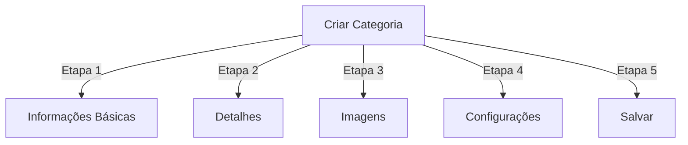

# Gerenciando Categorias no Publisher

> Guia completo para criar, organizar hierarquias e gerenciar categorias no módulo Publisher.

---

## Fundamentos de Categorias

### O Que São Categorias?

Categorias organizam artigos em grupos lógicos:

```
Estrutura de Exemplo:

  Notícias (Categoria Principal)
    ├── Tecnologia
    ├── Esportes
    └── Entretenimento

  Tutoriais (Categoria Principal)
    ├── Fotografia
    │   ├── Básico
    │   └── Avançado
    └── Escrita
        └── Blog
```

### Benefícios de uma Boa Estrutura de Categoria

```
✓ Melhor navegação do usuário
✓ Conteúdo organizado
✓ SEO melhorado
✓ Gerenciamento de conteúdo mais fácil
✓ Fluxo editorial melhor
```

---

## Acessar Gerenciamento de Categorias

### Navegação do Painel de Admin

```
Painel de Admin
└── Módulos
    └── Publisher
        └── Categorias
            ├── Criar Novo
            ├── Editar
            ├── Excluir
            ├── Permissões
            └── Organizar
```

### Acesso Rápido

1. Faça login como **Administrador**
2. Vá para **Admin → Módulos**
3. Clique em **Publisher → Admin**
4. Clique em **Categorias** no menu esquerdo

---

## Criando Categorias

### Formulário de Criação de Categoria



### Etapa 1: Informações Básicas

#### Nome da Categoria

```
Campo: Nome da Categoria
Tipo: Entrada de texto (obrigatório)
Comprimento máximo: 100 caracteres
Singularidade: Deve ser único
Exemplo: "Fotografia"
```

**Diretrizes:**
- Descritivo e singular ou plural consistentemente
- Capitalizado adequadamente
- Evitar caracteres especiais
- Manter razoavelmente curto

#### Descrição da Categoria

```
Campo: Descrição
Tipo: Área de texto (opcional)
Comprimento máximo: 500 caracteres
Usado em: Páginas de listagem de categorias, blocos de categoria
```

**Propósito:**
- Explica o conteúdo da categoria
- Aparece acima dos artigos da categoria
- Ajuda os usuários a entender o escopo
- Usado para descrição meta de SEO

**Exemplo:**
```
"Dicas de fotografia, tutoriais e inspiração para todos
os níveis de habilidade. De fundamentos de composição a técnicas
avançadas de iluminação, domine sua arte."
```

### Etapa 2: Categoria Pai

#### Criar Hierarquia

```
Campo: Categoria Pai
Tipo: Dropdown
Opções: Nenhuma (raiz), ou categorias existentes
```

**Exemplos de Hierarquia:**

```
Estrutura Plana:
  Notícias
  Tutoriais
  Resenhas

Estrutura Aninhada:
  Notícias
    Tecnologia
    Negócios
    Esportes
  Tutoriais
    Fotografia
      Básico
      Avançado
    Escrita
```

**Criar Subcategoria:**

1. Clique no dropdown **Categoria Pai**
2. Selecione categoria pai (ex.: "Notícias")
3. Preencha o nome da categoria
4. Salve
5. Nova categoria aparece como filha

### Etapa 3: Imagem da Categoria

#### Enviar Imagem da Categoria

```
Campo: Imagem da Categoria
Tipo: Envio de imagem (opcional)
Formato: JPG, PNG, GIF, WebP
Tamanho máximo: 5 MB
Recomendado: 300x200 px (ou tamanho do seu tema)
```

**Para Enviar:**

1. Clique no botão **Enviar Imagem**
2. Selecione imagem do computador
3. Recorte/redimensione se necessário
4. Clique em **Usar Esta Imagem**

**Onde É Usada:**
- Página de listagem de categorias
- Cabeçalho de bloco de categoria
- Breadcrumb (alguns temas)
- Compartilhamento em redes sociais

### Etapa 4: Configurações de Categoria

#### Configurações de Exibição

```yaml
Status:
  - Habilitado: Sim/Não
  - Oculto: Sim/Não (oculto de menus, ainda acessível)

Opções de Exibição:
  - Mostrar descrição: Sim/Não
  - Mostrar imagem: Sim/Não
  - Mostrar contagem de artigos: Sim/Não
  - Mostrar subcategorias: Sim/Não

Layout:
  - Itens por página: 10-50
  - Ordem de exibição: Data/Título/Autor
  - Direção de exibição: Ascendente/Descendente
```

#### Permissões de Categoria

```yaml
Quem Pode Ver:
  - Anônimo: Sim/Não
  - Registrado: Sim/Não
  - Grupos específicos: Configurar por grupo

Quem Pode Enviar:
  - Registrado: Sim/Não
  - Grupos específicos: Configurar por grupo
  - Autor deve ter: permissão "enviar artigos"
```

### Etapa 5: Configurações de SEO

#### Meta Tags

```
Campo: Meta Descrição
Tipo: Texto (160 caracteres)
Propósito: Descrição de mecanismo de busca

Campo: Meta Palavras-chave
Tipo: Lista separada por vírgula
Exemplo: fotografia, tutoriais, dicas, técnicas
```

#### Configuração de URL

```
Campo: Slug de URL
Tipo: Texto
Gerado automaticamente a partir do nome da categoria
Exemplo: "fotografia" de "Fotografia"
Pode ser personalizado antes de salvar
```

### Salvar Categoria

1. Preencha todos os campos obrigatórios:
   - Nome da Categoria ✓
   - Descrição (recomendado)
2. Opcional: Enviar imagem, definir SEO
3. Clique em **Salvar Categoria**
4. Mensagem de confirmação aparece
5. Categoria agora está disponível

---

## Hierarquia de Categorias

### Criar Estrutura Aninhada

```
Exemplo passo a passo: Criar Notícias → subcategoria Tecnologia

1. Vá para admin de Categorias
2. Clique em "Adicionar Categoria"
3. Nome: "Notícias"
4. Categoria Pai: (deixe em branco - esta é raiz)
5. Salve
6. Clique em "Adicionar Categoria" novamente
7. Nome: "Tecnologia"
8. Categoria Pai: "Notícias" (selecione do dropdown)
9. Salve
```

### Ver Árvore de Hierarquia

```
Visualização de categorias mostra estrutura em árvore:

📁 Notícias
  📄 Tecnologia
  📄 Esportes
  📄 Entretenimento
📁 Tutoriais
  📄 Fotografia
    📄 Básico
    📄 Avançado
  📄 Escrita
```

Clique nas setas de expansão para mostrar/ocultar subcategorias.

### Reorganizar Categorias

#### Mover Categoria

1. Vá para lista de Categorias
2. Clique em **Editar** na categoria
3. Mude **Categoria Pai**
4. Clique em **Salvar**
5. Categoria movida para nova posição

#### Reordenar Categorias

Se disponível, use arrastar e soltar:

1. Vá para lista de Categorias
2. Clique e arraste categoria
3. Solte na nova posição
4. Ordem salva automaticamente

#### Excluir Categoria

**Opção 1: Exclusão Suave (Ocultar)**

1. Edite categoria
2. Defina **Status**: Desabilitado
3. Clique em **Salvar**
4. Categoria oculta mas não excluída

**Opção 2: Exclusão Dura**

1. Vá para lista de Categorias
2. Clique em **Excluir** na categoria
3. Escolha ação para artigos:
   ```
   ☐ Mover artigos para categoria pai
   ☐ Mover artigos para raiz (Notícias)
   ☐ Excluir todos os artigos na categoria
   ```
4. Confirme exclusão

---

## Operações de Categoria

### Editar Categoria

1. Vá para **Admin → Publisher → Categorias**
2. Clique em **Editar** na categoria
3. Modifique campos:
   - Nome
   - Descrição
   - Categoria pai
   - Imagem
   - Configurações
4. Clique em **Salvar**

### Editar Permissões de Categoria

1. Vá para Categorias
2. Clique em **Permissões** na categoria (ou clique na categoria e depois em Permissões)
3. Configure grupos:

```
Para cada grupo:
  ☐ Ver artigos nesta categoria
  ☐ Enviar artigos para esta categoria
  ☐ Editar próprios artigos
  ☐ Editar todos os artigos
  ☐ Aprovar/Moderar artigos
  ☐ Gerenciar categoria
```

4. Clique em **Salvar Permissões**

### Definir Imagem de Categoria

**Enviar nova imagem:**

1. Edite categoria
2. Clique em **Mudar Imagem**
3. Envie ou selecione imagem
4. Recorte/redimensione
5. Clique em **Usar Imagem**
6. Clique em **Salvar Categoria**

**Remover imagem:**

1. Edite categoria
2. Clique em **Remover Imagem** (se disponível)
3. Clique em **Salvar Categoria**

---

## Permissões de Categoria

### Matriz de Permissões

```
                 Anônimo  Registrado  Editor  Admin
Ver categoria       ✓         ✓         ✓       ✓
Enviar artigo       ✗         ✓         ✓       ✓
Editar próprio      ✗         ✓         ✓       ✓
Editar todos        ✗         ✗         ✓       ✓
Moderar artigos     ✗         ✗         ✓       ✓
Gerenciar categoria ✗         ✗         ✗       ✓
```

### Definir Permissões em Nível de Categoria

#### Controle de Acesso Por Categoria

1. Vá para lista de **Categorias**
2. Selecione uma categoria
3. Clique em **Permissões**
4. Para cada grupo, selecione permissões:

```
Exemplo: categoria Notícias
  Anônimo:   Apenas visualização
  Registrado: Enviar artigos
  Editores:   Aprovar artigos
  Admins:     Controle total
```

5. Clique em **Salvar**

#### Permissões em Nível de Campo

Controle quais campos do formulário os usuários podem ver/editar:

```
Exemplo: Limitar visibilidade de campo para usuários Registrados

Usuários registrados podem ver/editar:
  ✓ Título
  ✓ Descrição
  ✓ Conteúdo
  ✗ Autor (auto-definido para usuário atual)
  ✗ Data agendada (apenas editores)
  ✗ Destaque (apenas admins)
```

**Configure em:**
- Permissões de Categoria
- Procure por seção "Visibilidade de Campo"

---

## Melhores Práticas para Categorias

### Estrutura de Categoria

```
✓ Manter hierarquia com 2-3 níveis de profundidade
✗ Não criar muitas categorias de nível superior
✗ Não criar categorias com um artigo

✓ Usar nomenclatura consistente (plural ou singular)
✗ Não usar nomes vagos ("Coisas", "Outro")

✓ Criar categorias para artigos que existem
✗ Não criar categorias vazias antecipadamente
```

### Diretrizes de Nomenclatura

```
Bons nomes:
  "Fotografia"
  "Desenvolvimento Web"
  "Dicas de Viagem"
  "Notícias de Negócios"

Evitar:
  "Artigos" (muito vago)
  "Conteúdo" (redundante)
  "Notícias&Atualizações" (inconsistente)
  "COISAS DE FOTOGRAFIA" (formatação)
```

### Dicas de Organização

```
Por Tópico:
  Notícias
    Tecnologia
    Esportes
    Entretenimento

Por Tipo:
  Tutoriais
    Vídeo
    Texto
    Interativo

Por Público:
  Para Iniciantes
  Para Especialistas
  Estudos de Caso

Geográfico:
  América do Norte
    Estados Unidos
    Canadá
  Europa
```

---

## Blocos de Categoria

### Bloco de Categoria do Publisher

Exibir listagens de categorias em seu site:

1. Vá para **Admin → Blocos**
2. Encontre **Publisher - Categorias**
3. Clique em **Editar**
4. Configure:

```
Título do Bloco: "Categorias de Notícias"
Mostrar subcategorias: Sim/Não
Mostrar contagem de artigos: Sim/Não
Altura: (pixels ou automático)
```

5. Clique em **Salvar**

### Bloco de Artigos de Categoria

Mostrar artigos recentes de categoria específica:

1. Vá para **Admin → Blocos**
2. Encontre **Publisher - Artigos de Categoria**
3. Clique em **Editar**
4. Selecione:

```
Categoria: Notícias (ou categoria específica)
Número de artigos: 5
Mostrar imagens: Sim/Não
Mostrar descrição: Sim/Não
```

5. Clique em **Salvar**

---

## Análise de Categoria

### Ver Estatísticas de Categoria

Do admin de Categorias:

```
Cada categoria mostra:
  - Total de artigos: 45
  - Publicados: 42
  - Rascunho: 2
  - Aguardando aprovação: 1
  - Total de visualizações: 5.234
  - Artigo mais recente: 2 horas atrás
```

### Ver Tráfego de Categoria

Se análise ativada:

1. Clique no nome da categoria
2. Clique na aba **Estatísticas**
3. Veja:
   - Visualizações de página
   - Artigos populares
   - Tendências de tráfego
   - Termos de busca usados

---

## Templates de Categoria

### Personalizar Exibição de Categoria

Se usar templates personalizados, cada categoria pode substituir:

```
publisher_category.tpl
  ├── Cabeçalho de categoria
  ├── Descrição da categoria
  ├── Imagem da categoria
  ├── Listagem de artigos
  └── Paginação
```

**Para personalizar:**

1. Copie arquivo de template
2. Modifique HTML/CSS
3. Atribua à categoria em admin
4. Categoria usa template personalizado

---

## Tarefas Comuns

### Criar Hierarquia de Notícias

```
Admin → Publisher → Categorias
1. Criar "Notícias" (pai)
2. Criar "Tecnologia" (pai: Notícias)
3. Criar "Esportes" (pai: Notícias)
4. Criar "Entretenimento" (pai: Notícias)
```

### Mover Artigos Entre Categorias

1. Vá para admin de **Artigos**
2. Selecione artigos (checkboxes)
3. Selecione **"Mudar Categoria"** do dropdown de ações em massa
4. Escolha nova categoria
5. Clique em **Atualizar Todos**

### Ocultar Categoria Sem Excluir

1. Edite categoria
2. Defina **Status**: Desabilitado/Oculto
3. Salve
4. Categoria não mostrada em menus (ainda acessível via URL)

### Criar Categoria para Rascunhos

```
Melhor Prática:

Criar categoria "Em Revisão"
  ├── Propósito: Artigos aguardando aprovação
  ├── Permissões: Oculta do público
  ├── Apenas admins/editores podem ver
  ├── Mover artigos aqui até aprovação
  └── Mover para "Notícias" quando publicado
```

---

## Importar/Exportar Categorias

### Exportar Categorias

Se disponível:

1. Vá para admin de **Categorias**
2. Clique em **Exportar**
3. Selecione formato: CSV/JSON/XML
4. Baixe arquivo
5. Backup salvo

### Importar Categorias

Se disponível:

1. Prepare arquivo com categorias
2. Vá para admin de **Categorias**
3. Clique em **Importar**
4. Envie arquivo
5. Escolha estratégia de atualização:
   - Criar apenas novo
   - Atualizar existente
   - Substituir tudo
6. Clique em **Importar**

---

## Solução de Problemas de Categorias

### Problema: Subcategorias não aparecem

**Solução:**
```
1. Verifique se status da categoria pai é "Habilitado"
2. Verifique se permissões permitem visualização
3. Verifique se subcategorias têm status "Habilitado"
4. Limpar cache: Admin → Ferramentas → Limpar Cache
5. Verificar se tema mostra subcategorias
```

### Problema: Não consigo excluir categoria

**Solução:**
```
1. Categoria deve estar sem artigos
2. Mova ou exclua artigos primeiro:
   Admin → Artigos
   Selecione artigos na categoria
   Mude categoria para outra
3. Então exclua categoria vazia
4. Ou escolha opção "mover artigos" ao excluir
```

### Problema: Imagem de categoria não aparece

**Solução:**
```
1. Verifique se imagem foi enviada com sucesso
2. Verificar formato de arquivo de imagem (JPG, PNG)
3. Verifique permissões do diretório de envio
4. Verificar se tema exibe imagens de categoria
5. Tente re-enviar imagem
6. Limpar cache do navegador
```

### Problema: Permissões não têm efeito

**Solução:**
```
1. Verificar permissões de grupo na Categoria
2. Verificar permissões globais do Publisher
3. Verificar se usuário pertence ao grupo configurado
4. Limpar cache de sessão
5. Fazer logout e fazer login novamente
6. Verificar se módulos de permissão estão instalados
```

---

## Lista de Verificação de Melhores Práticas de Categoria

Antes de implantar categorias:

- [ ] Hierarquia tem 2-3 níveis de profundidade
- [ ] Cada categoria tem 5+ artigos
- [ ] Nomes de categoria são consistentes
- [ ] Permissões são apropriadas
- [ ] Imagens de categoria são otimizadas
- [ ] Descrições estão completas
- [ ] Metadados de SEO preenchidos
- [ ] URLs são amigáveis
- [ ] Categorias testadas no front-end
- [ ] Documentação atualizada

---

## Guias Relacionados

- Criação de Artigos
- Gerenciamento de Permissões
- Configuração de Módulo
- Guia de Instalação

---

## Próximas Etapas

- Criar Artigos em categorias
- Configurar Permissões
- Personalizar com Templates Personalizados

---

#publisher #categorias #organização #hierarquia #gerenciamento #xoops
