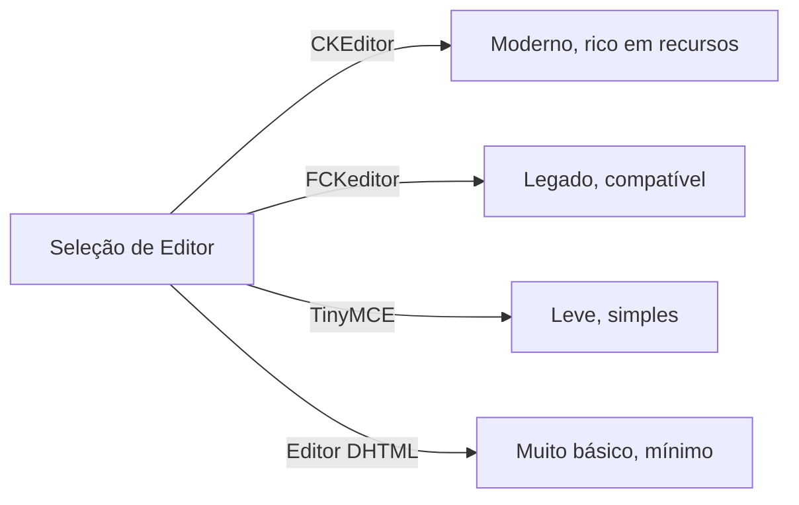
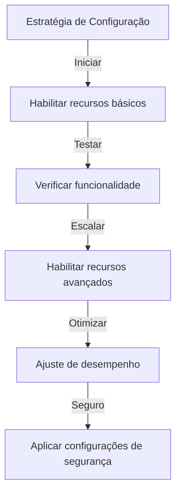

# Configuração Básica do Publisher

> Configure as configurações do módulo Publisher, preferências e opções gerais para sua instalação XOOPS.

---

## Acessar Configuração

### Navegação do Painel de Admin

```
Painel de Admin XOOPS
└── Módulos
    └── Publisher
        ├── Preferências
        ├── Configurações
        └── Configuração
```

1. Faça login como **Administrador**
2. Vá para **Painel de Admin → Módulos**
3. Encontre módulo **Publisher**
4. Clique no link **Preferências** ou **Admin**

---

## Configurações Gerais

### Acessar Configuração

```
Painel de Admin → Módulos → Publisher
```

Clique no **ícone de engrenagem** ou **Configurações** para essas opções:

#### Opções de Exibição

| Configuração | Opções | Padrão | Descrição |
|---------|---------|---------|-------------|
| **Itens por página** | 5-50 | 10 | Artigos mostrados em listas |
| **Mostrar breadcrumb** | Sim/Não | Sim | Exibição de trilha de navegação |
| **Usar paginação** | Sim/Não | Sim | Paginar listas longas |
| **Mostrar data** | Sim/Não | Sim | Exibir data do artigo |
| **Mostrar categoria** | Sim/Não | Sim | Mostrar categoria do artigo |
| **Mostrar autor** | Sim/Não | Sim | Mostrar autor do artigo |
| **Mostrar visualizações** | Sim/Não | Sim | Mostrar contagem de visualizações |

**Configuração de Exemplo:**

```yaml
Itens Por Página: 15
Mostrar Breadcrumb: Sim
Usar Paginação: Sim
Mostrar Data: Sim
Mostrar Categoria: Sim
Mostrar Autor: Sim
Mostrar Visualizações: Sim
```

#### Opções de Autor

| Configuração | Padrão | Descrição |
|---------|---------|-------------|
| **Mostrar nome do autor** | Sim | Exibir nome real ou nome de usuário |
| **Usar nome de usuário** | Não | Mostrar nome de usuário em vez de nome |
| **Mostrar email do autor** | Não | Exibir email de contato do autor |
| **Mostrar avatar do autor** | Sim | Exibir avatar do usuário |

---

## Configuração de Editor

### Selecionar Editor WYSIWYG

O Publisher suporta múltiplos editores:

#### Editores Disponíveis



### CKEditor (Recomendado)

**Melhor para:** Maioria dos usuários, navegadores modernos, recursos completos

1. Vá para **Preferências**
2. Defina **Editor**: CKEditor
3. Configure opções:

```
Editor: CKEditor 4.x
Barra de ferramentas: Completa
Altura: 400px
Largura: 100%
Remover plugins: []
Adicionar plugins: [mathjax, codesnippet]
```

### FCKeditor

**Melhor para:** Compatibilidade, sistemas mais antigos

```
Editor: FCKeditor
Barra de ferramentas: Padrão
Configuração personalizada: (opcional)
```

### TinyMCE

**Melhor para:** Pegada mínima, edição básica

```
Editor: TinyMCE
Plugins: [paste, table, link, image]
Barra de ferramentas: mínima
```

---

## Configurações de Arquivo e Envio

### Configurar Diretórios de Envio

```
Admin → Publisher → Preferências → Configurações de Envio
```

#### Configurações de Tipo de Arquivo

```yaml
Tipos de Arquivo Permitidos:
  Imagens:
    - jpg
    - jpeg
    - gif
    - png
    - webp
  Documentos:
    - pdf
    - doc
    - docx
    - xls
    - xlsx
    - ppt
    - pptx
  Arquivos:
    - zip
    - rar
    - 7z
  Mídia:
    - mp3
    - mp4
    - webm
    - mov
```

#### Limites de Tamanho de Arquivo

| Tipo de Arquivo | Tamanho Máx | Notas |
|-----------|----------|-------|
| **Imagens** | 5 MB | Por arquivo de imagem |
| **Documentos** | 10 MB | Arquivos PDF, Office |
| **Mídia** | 50 MB | Arquivos de vídeo/áudio |
| **Todos os arquivos** | 100 MB | Total por envio |

**Configuração:**

```
Tamanho Máx de Envio de Imagem: 5 MB
Tamanho Máx de Envio de Documento: 10 MB
Tamanho Máx de Envio de Mídia: 50 MB
Tamanho Total de Envio: 100 MB
Máx de Arquivos por Artigo: 5
```

### Redimensionamento de Imagem

O Publisher redimensiona imagens automaticamente para consistência:

```yaml
Tamanho de Miniatura:
  Largura: 150
  Altura: 150
  Modo: Recortar/Redimensionar

Tamanho de Imagem de Categoria:
  Largura: 300
  Altura: 200
  Modo: Redimensionar

Imagem em Destaque de Artigo:
  Largura: 600
  Altura: 400
  Modo: Redimensionar
```

---

## Configurações de Comentário e Interação

### Configuração de Comentários

```
Preferências → Seção de Comentários
```

#### Opções de Comentário

```yaml
Permitir Comentários:
  - Habilitado: Sim/Não
  - Padrão: Sim
  - Substituição por artigo: Sim

Moderação de Comentário:
  - Moderar comentários: Sim/Não
  - Moderar apenas comentários de convidado: Sim/Não
  - Filtro de spam: Habilitado
  - Máx de comentários por dia: (ilimitado)

Exibição de Comentário:
  - Formato de exibição: Encadeado/Plano
  - Comentários por página: 10
  - Formato de data: Data completa/Tempo atrás
  - Mostrar contagem de comentários: Sim/Não
```

### Configuração de Avaliações

```yaml
Permitir Avaliações:
  - Habilitado: Sim/Não
  - Padrão: Sim
  - Substituição por artigo: Sim

Opções de Avaliação:
  - Escala de avaliação: 5 estrelas (padrão)
  - Permitir usuário avaliar próprio: Não
  - Mostrar avaliação média: Sim
  - Mostrar contagem de avaliações: Sim
```

---

## Configurações de SEO e URL

### Otimização de Mecanismo de Busca

```
Preferências → Configurações de SEO
```

#### Configuração de URL

```yaml
URLs de SEO:
  - Habilitado: Não (defina para Sim para URLs de SEO)
  - Reescrita de URL: Nenhuma/Apache mod_rewrite/IIS rewrite

Formato de URL:
  - Categoria: /category/news
  - Artigo: /article/welcome-to-site
  - Arquivo: /archive/2024/01

Meta Descrição:
  - Gerar automaticamente: Sim
  - Comprimento máximo: 160 caracteres

Meta Palavras-chave:
  - Gerar automaticamente: Sim
  - De: Tags de artigo, título
```

### Habilitar URLs de SEO (Avançado)

**Pré-requisitos:**
- Apache com `mod_rewrite` habilitado
- Suporte `.htaccess` habilitado

**Etapas de Configuração:**

1. Vá para **Preferências → Configurações de SEO**
2. Defina **URLs de SEO**: Sim
3. Defina **Reescrita de URL**: Apache mod_rewrite
4. Verifique se arquivo `.htaccess` existe na pasta do Publisher

**Configuração de .htaccess:**

```apache
<IfModule mod_rewrite.c>
    RewriteEngine On
    RewriteBase /modules/publisher/

    # Reescritas de categoria
    RewriteRule ^category/([0-9]+)-(.*)\.html$ index.php?op=showcategory&categoryid=$1 [L,QSA]

    # Reescritas de artigo
    RewriteRule ^article/([0-9]+)-(.*)\.html$ index.php?op=showitem&itemid=$1 [L,QSA]

    # Reescritas de arquivo
    RewriteRule ^archive/([0-9]+)/([0-9]+)/$ index.php?op=archive&year=$1&month=$2 [L,QSA]
</IfModule>
```

---

## Cache e Desempenho

### Configuração de Cache

```
Preferências → Configurações de Cache
```

```yaml
Habilitar Cache:
  - Habilitado: Sim
  - Tipo de cache: Arquivo (ou Memcache)

Tempo de Vida do Cache:
  - Listas de categoria: 3600 segundos (1 hora)
  - Listas de artigos: 1800 segundos (30 minutos)
  - Artigo único: 7200 segundos (2 horas)
  - Bloco de artigos recentes: 900 segundos (15 minutos)

Limpeza de Cache:
  - Limpeza manual: Disponível em admin
  - Limpeza automática ao salvar artigo: Sim
  - Limpar ao mudar categoria: Sim
```

### Limpar Cache

**Limpeza Manual de Cache:**

1. Vá para **Admin → Publisher → Ferramentas**
2. Clique em **Limpar Cache**
3. Selecione tipos de cache para limpar:
   - [ ] Cache de categoria
   - [ ] Cache de artigos
   - [ ] Cache de blocos
   - [ ] Todo cache
4. Clique em **Limpar Selecionado**

**Linha de Comando:**

```bash
# Limpar todo cache do Publisher
php /path/to/xoops/admin/cache_manage.php publisher

# Ou excluir diretamente arquivos de cache
rm -rf /path/to/xoops/var/cache/publisher/*
```

---

## Notificação e Fluxo de Trabalho

### Notificações por Email

```
Preferências → Notificações
```

```yaml
Notificar Admin em Novo Artigo:
  - Habilitado: Sim
  - Destinatário: Email de admin
  - Incluir resumo: Sim

Notificar Moderadores:
  - Habilitado: Sim
  - Em novo envio: Sim
  - Em artigos pendentes: Sim

Notificar Autor:
  - Na aprovação: Sim
  - Na rejeição: Sim
  - Em comentário: Não (opcional)
```

### Fluxo de Trabalho de Envio

```yaml
Exigir Aprovação:
  - Habilitado: Sim
  - Aprovação de editor: Sim
  - Aprovação de admin: Não

Salvamento de Rascunho:
  - Intervalo de salvamento automático: 60 segundos
  - Salvar versões locais: Sim
  - Histórico de revisões: Últimas 5 versões
```

---

## Configurações de Conteúdo

### Padrões de Publicação

```
Preferências → Configurações de Conteúdo
```

```yaml
Status Padrão de Artigo:
  - Rascunho/Publicado: Rascunho
  - Destaque por padrão: Não
  - Tempo de publicação automática: Nenhum

Visibilidade Padrão:
  - Público/Privado: Público
  - Mostrar na página inicial: Sim
  - Mostrar em categorias: Sim

Publicação Agendada:
  - Habilitado: Sim
  - Permitir por artigo: Sim

Expiração de Conteúdo:
  - Habilitado: Não
  - Arquivar automaticamente antigos: Não
  - Arquivar após dias: (ilimitado)
```

### Opções de Conteúdo WYSIWYG

```yaml
Permitir HTML:
  - Em artigos: Sim
  - Em comentários: Não

Permitir Mídia Incorporada:
  - Vídeos (iframe): Sim
  - Imagens: Sim
  - Plugins: Não

Filtragem de Conteúdo:
  - Remover tags: Não
  - Filtro XSS: Sim (recomendado)
```

---

## Configurações de Mecanismo de Busca

### Configurar Integração de Busca

```
Preferências → Configurações de Busca
```

```yaml
Habilitar Indexação de Artigos:
  - Incluir em busca do site: Sim
  - Tipo de índice: Texto completo/Apenas título

Opções de Busca:
  - Buscar em títulos: Sim
  - Buscar em conteúdo: Sim
  - Buscar em comentários: Sim

Meta Tags:
  - Gerar automaticamente: Sim
  - Tags OG (redes sociais): Sim
  - Twitter cards: Sim
```

---

## Configurações Avançadas

### Modo de Debug (Apenas Desenvolvimento)

```
Preferências → Avançado
```

```yaml
Modo de Debug:
  - Habilitado: Não (apenas para desenvolvimento!)

Recursos de Desenvolvimento:
  - Mostrar consultas SQL: Não
  - Registrar erros: Sim
  - Email de erro: admin@example.com
```

### Otimização de Banco de Dados

```
Admin → Ferramentas → Otimizar Banco de Dados
```

```bash
# Otimização manual
mysql> OPTIMIZE TABLE publisher_items;
mysql> OPTIMIZE TABLE publisher_categories;
mysql> OPTIMIZE TABLE publisher_comments;
```

---

## Personalização de Módulo

### Templates de Tema

```
Preferências → Exibição → Templates
```

Selecione conjunto de template:
- Padrão
- Clássico
- Moderno
- Escuro
- Personalizado

Cada template controla:
- Layout de artigo
- Listagem de categoria
- Exibição de arquivo
- Exibição de comentário

---

## Dicas de Configuração

### Melhores Práticas



1. **Começar Simples** - Habilitar recursos principais primeiro
2. **Testar Cada Mudança** - Verificar antes de prosseguir
3. **Habilitar Cache** - Melhora o desempenho
4. **Fazer Backup Primeiro** - Exportar configurações antes de mudanças maiores
5. **Monitorar Logs** - Verificar logs de erro regularmente

### Otimização de Desempenho

```yaml
Para Melhor Desempenho:
  - Habilitar cache: Sim
  - Tempo de vida do cache: 3600 segundos
  - Limitar itens por página: 10-15
  - Comprimir imagens: Sim
  - Minificar CSS/JS: Sim (se disponível)
```

### Endurecimento de Segurança

```yaml
Para Melhor Segurança:
  - Moderar comentários: Sim
  - Desabilitar HTML em comentários: Sim
  - Filtragem XSS: Sim
  - Lista branca de tipo de arquivo: Estrita
  - Tamanho máximo de envio: Limite razoável
```

---

## Exportar/Importar Configurações

### Configuração de Backup

```
Admin → Ferramentas → Exportar Configurações
```

**Para fazer backup da configuração atual:**

1. Clique em **Exportar Configuração**
2. Salve arquivo `.cfg` baixado
3. Armazene em local seguro

**Para restaurar:**

1. Clique em **Importar Configuração**
2. Selecione arquivo `.cfg`
3. Clique em **Restaurar**

---

## Guias de Configuração Relacionados

- Gerenciamento de Categoria
- Criação de Artigo
- Configuração de Permissão
- Guia de Instalação

---

## Solução de Problemas de Configuração

### Configurações Não Salvam

**Solução:**
1. Verificar permissões de diretório em `/var/config/`
2. Verificar acesso de escrita PHP
3. Verificar log de erro PHP para problemas
4. Limpar cache do navegador e tentar novamente

### Editor Não Aparece

**Solução:**
1. Verificar se plugin de editor está instalado
2. Verificar configuração de editor XOOPS
3. Tentar opção de editor diferente
4. Verificar console do navegador para erros JavaScript

### Problemas de Desempenho

**Solução:**
1. Habilitar cache
2. Reduzir itens por página
3. Comprimir imagens
4. Verificar otimização de banco de dados
5. Revisar log de consulta lenta

---

## Próximas Etapas

- Configurar Permissões de Grupo
- Criar seu primeiro Artigo
- Configurar Categorias
- Revisar Templates Personalizados

---

#publisher #configuração #preferências #configurações #xoops
