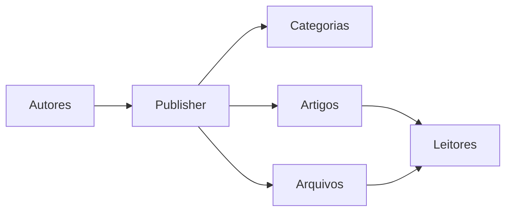
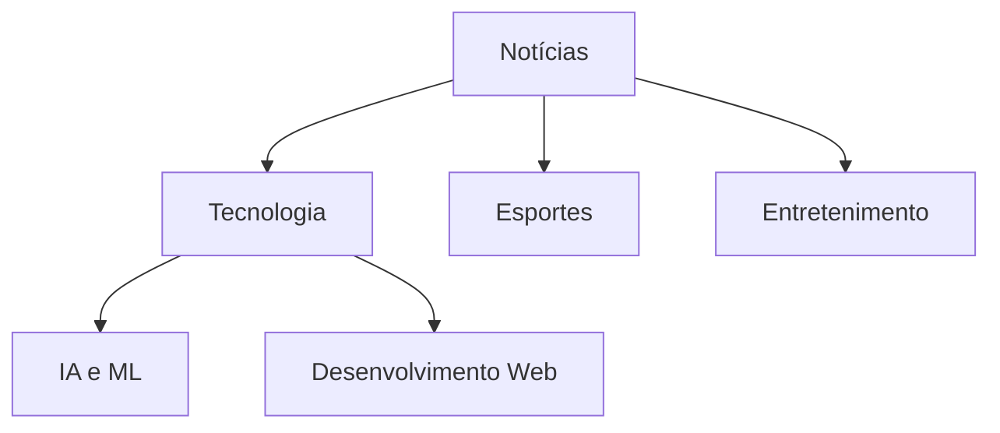
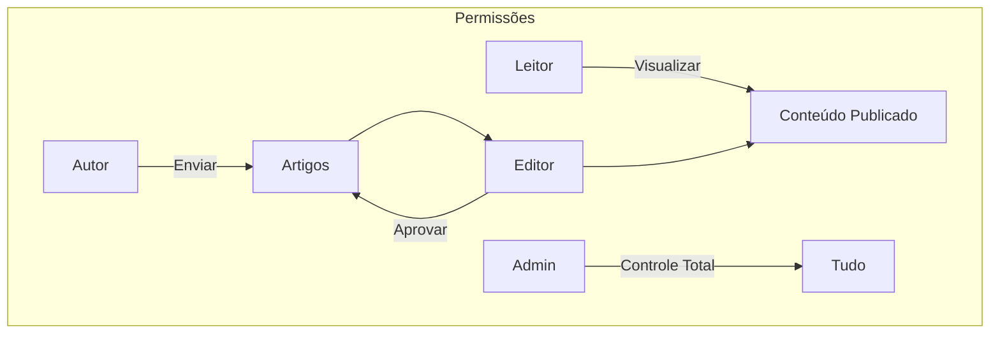
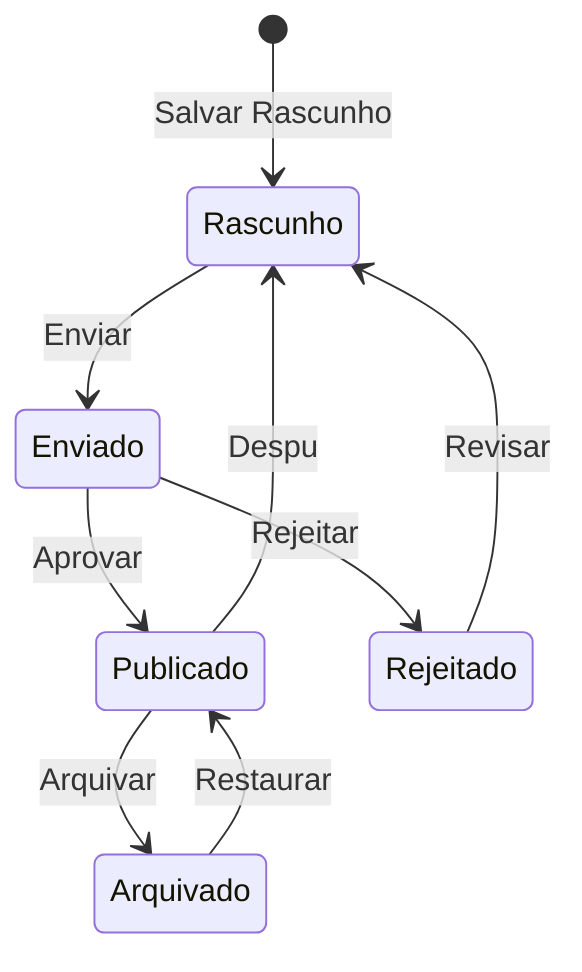

# Começando com o Publisher

> Guia passo a passo para configurar e usar o módulo de notícias/blog Publisher.

---

## O Que É Publisher?

Publisher é o módulo de gerenciamento de conteúdo principal para XOOPS, projetado para:

- **Sites de Notícias** - Publicar artigos com categorias
- **Blogs** - Blogging pessoal ou multi-autor
- **Documentação** - Bases de conhecimento organizadas
- **Portais de Conteúdo** - Conteúdo de mídia mista



---

## Configuração Rápida

### Etapa 1: Instalar Publisher

1. Baixe de [GitHub](https://github.com/XoopsModules25x/publisher)
2. Envie para `modules/publisher/`
3. Vá para Admin → Módulos → Instalar

### Etapa 2: Criar Categorias



1. Admin → Publisher → Categorias
2. Clique em "Adicionar Categoria"
3. Preencha:
   - **Nome**: Nome da categoria
   - **Descrição**: O que esta categoria contém
   - **Imagem**: Imagem de categoria opcional
4. Defina permissões (quem pode enviar/visualizar)
5. Salve

### Etapa 3: Configurar Configurações

1. Admin → Publisher → Preferências
2. Principais configurações para definir:

| Configuração | Recomendado | Descrição |
|---------|-------------|-------------|
| Itens por página | 10-20 | Artigos no índice |
| Editor | TinyMCE/CKEditor | Editor de texto rico |
| Permitir avaliações | Sim | Feedback do leitor |
| Permitir comentários | Sim | Discussões |
| Aprovar automaticamente | Não | Controle editorial |

### Etapa 4: Criar Seu Primeiro Artigo

1. Menu principal → Publisher → Enviar Artigo
2. Preencha o formulário:
   - **Título**: Manchete do artigo
   - **Categoria**: Onde pertence
   - **Resumo**: Descrição breve
   - **Corpo**: Conteúdo completo do artigo
3. Adicione elementos opcionais:
   - Imagem em destaque
   - Anexos de arquivo
   - Configurações de SEO
4. Envie para revisão ou publique

---

## Funções de Usuário



### Leitor
- Visualizar artigos publicados
- Avaliar e comentar
- Pesquisar conteúdo

### Autor
- Enviar novos artigos
- Editar próprios artigos
- Anexar arquivos

### Editor
- Aprovar/rejeitar envios
- Editar qualquer artigo
- Gerenciar categorias

### Administrador
- Controle total do módulo
- Configurar configurações
- Gerenciar permissões

---

## Escrevendo Artigos

### Editor de Artigos

```
┌─────────────────────────────────────────────────────┐
│ Título: [Seu Título do Artigo                     ] │
├─────────────────────────────────────────────────────┤
│ Categoria: [Selecionar Categoria      ▼]            │
├─────────────────────────────────────────────────────┤
│ Resumo:                                             │
│ ┌─────────────────────────────────────────────────┐ │
│ │ Descrição breve mostrada em listagens...        │ │
│ └─────────────────────────────────────────────────┘ │
├─────────────────────────────────────────────────────┤
│ Corpo:                                              │
│ ┌─────────────────────────────────────────────────┐ │
│ │ [N] [I] [S] [Link] [Imagem] [Código]             │ │
│ ├─────────────────────────────────────────────────┤ │
│ │                                                  │ │
│ │ Conteúdo completo do artigo vai aqui...         │ │
│ │                                                  │ │
│ └─────────────────────────────────────────────────┘ │
├─────────────────────────────────────────────────────┤
│ [Enviar] [Visualizar] [Salvar Rascunho]             │
└─────────────────────────────────────────────────────┘
```

### Melhores Práticas

1. **Títulos atraentes** - Manchetes claras e envolventes
2. **Bons resumos** - Atrair leitores para clicar
3. **Conteúdo estruturado** - Usar cabeçalhos, listas, imagens
4. **Categorização apropriada** - Ajudar leitores a encontrar conteúdo
5. **Otimização de SEO** - Palavras-chave no título e conteúdo

---

## Gerenciando Conteúdo

### Fluxo de Status de Artigo



### Descrições de Status

| Status | Descrição |
|--------|-------------|
| Rascunho | Trabalho em progresso |
| Enviado | Aguardando revisão |
| Publicado | Ativo no site |
| Expirado | Passado a data de expiração |
| Rejeitado | Precisa de revisão |
| Arquivado | Removido de listagens |

---

## Navegação

### Acessar Publisher

- **Menu Principal** → Publisher
- **URL Direta**: `seusite.com/modules/publisher/`

### Páginas Principais

| Página | URL | Propósito |
|------|-----|---------|
| Índice | `/modules/publisher/` | Listagens de artigos |
| Categoria | `/modules/publisher/category.php?id=X` | Artigos da categoria |
| Artigo | `/modules/publisher/item.php?itemid=X` | Artigo único |
| Enviar | `/modules/publisher/submit.php` | Novo artigo |
| Pesquisa | `/modules/publisher/search.php` | Encontrar artigos |

---

## Blocos

O Publisher fornece vários blocos para seu site:

### Artigos Recentes
Exibe os artigos publicados mais recentes

### Menu de Categoria
Navegação por categoria

### Artigos Populares
Conteúdo mais visualizado

### Artigo Aleatório
Conteúdo aleatório em destaque

### Destaque
Artigos em destaque

---

## Documentação Relacionada

- Criando e Editando Artigos
- Gerenciando Categorias
- Estendendo o Publisher

---

#xoops #publisher #guia-do-usuario #começando #cms
