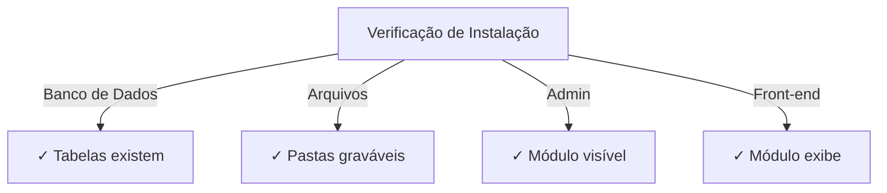

# Guia de Instalação do Publisher

> Instruções completas para instalar e configurar o módulo Publisher para XOOPS CMS.

---

## Requisitos do Sistema

### Requisitos Mínimos

| Requisito | Versão | Notas |
|-------------|---------|-------|
| XOOPS | 2.5.10+ | Plataforma CMS central |
| PHP | 7.1+ | PHP 8.x recomendado |
| MySQL | 5.7+ | Servidor de banco de dados |
| Servidor Web | Apache/Nginx | Com suporte de reescrita |

### Extensões PHP

```
- PDO (Objetos de Dados PHP)
- pdo_mysql ou mysqli
- mb_string (strings multibyte)
- curl (para conteúdo externo)
- json
- gd (processamento de imagem)
```

### Espaço em Disco

- **Arquivos do módulo**: ~5 MB
- **Diretório de cache**: 50+ MB recomendado
- **Diretório de envio**: Conforme necessário para conteúdo

---

## Lista de Verificação Pré-instalação

Antes de instalar o Publisher, verifique:

- [ ] O núcleo XOOPS está instalado e funcionando
- [ ] A conta de admin tem permissões de gerenciamento de módulos
- [ ] Backup do banco de dados criado
- [ ] As permissões de arquivo permitem acesso de escrita ao diretório `/modules/`
- [ ] O limite de memória PHP é de pelo menos 128 MB
- [ ] Os limites de tamanho de envio de arquivo são apropriados (mín. 10 MB)

---

## Etapas de Instalação

### Etapa 1: Baixar Publisher

#### Opção A: Do GitHub (Recomendado)

```bash
# Navegue para o diretório de módulos
cd /path/to/xoops/htdocs/modules/

# Clone o repositório
git clone https://github.com/XoopsModules25x/publisher.git

# Verifique o download
ls -la publisher/
```

#### Opção B: Download Manual

1. Visite [Versões do Publisher no GitHub](https://github.com/XoopsModules25x/publisher/releases)
2. Baixe o arquivo `.zip` mais recente
3. Extraia para `modules/publisher/`

### Etapa 2: Definir Permissões de Arquivo

```bash
# Defina propriedade apropriada
chown -R www-data:www-data /path/to/xoops/htdocs/modules/publisher

# Defina permissões de diretório (755)
find publisher -type d -exec chmod 755 {} \;

# Defina permissões de arquivo (644)
find publisher -type f -exec chmod 644 {} \;

# Torne scripts executáveis
chmod 755 publisher/admin/index.php
chmod 755 publisher/index.php
```

### Etapa 3: Instalar via Admin XOOPS

1. Faça login no **Painel de Admin XOOPS** como administrador
2. Navegue para **Sistema → Módulos**
3. Clique em **Instalar Módulo**
4. Encontre **Publisher** na lista
5. Clique no botão **Instalar**
6. Aguarde a conclusão da instalação (mostra tabelas de banco de dados criadas)

```
Progresso de Instalação:
✓ Tabelas criadas
✓ Configuração inicializada
✓ Permissões definidas
✓ Cache limpo
Instalação Completa!
```

---

## Configuração Inicial

### Etapa 1: Acessar Admin do Publisher

1. Vá para **Painel de Admin → Módulos**
2. Encontre módulo **Publisher**
3. Clique no link **Admin**
4. Agora você está em Administração do Publisher

### Etapa 2: Configurar Preferências do Módulo

1. Clique em **Preferências** no menu esquerdo
2. Configure configurações básicas:

```
Configurações Gerais:
- Editor: Selecione seu editor WYSIWYG
- Itens por página: 10
- Mostrar breadcrumb: Sim
- Permitir comentários: Sim
- Permitir avaliações: Sim

Configurações de SEO:
- URLs de SEO: Não (habilitar mais tarde se necessário)
- Reescrita de URL: Nenhuma

Configurações de Envio:
- Tamanho máx de envio: 5 MB
- Tipos de arquivo permitidos: jpg, png, gif, pdf, doc, docx
```

3. Clique em **Salvar Configurações**

### Etapa 3: Criar Primeira Categoria

1. Clique em **Categorias** no menu esquerdo
2. Clique em **Adicionar Categoria**
3. Preencha o formulário:

```
Nome da Categoria: Notícias
Descrição: Últimas notícias e atualizações
Imagem: (opcional) Envie imagem de categoria
Categoria Pai: (deixe em branco para nível superior)
Status: Habilitado
```

4. Clique em **Salvar Categoria**

### Etapa 4: Verificar Instalação

Verificar estes indicadores:



#### Verificação de Banco de Dados

```bash
mysql -u xoops_user -p xoops_database
mysql> SHOW TABLES LIKE 'publisher%';

# Deve mostrar tabelas:
# - publisher_categories
# - publisher_items
# - publisher_comments
# - publisher_files
```

#### Verificação de Front-End

1. Visite sua página inicial XOOPS
2. Procure por bloco **Publisher** ou **Notícias**
3. Deve exibir artigos recentes

---

## Configuração Após Instalação

### Seleção de Editor

O Publisher suporta múltiplos editores WYSIWYG:

| Editor | Vantagens | Desvantagens |
|--------|------|------|
| FCKeditor | Rico em recursos | Mais antigo, maior |
| CKEditor | Padrão moderno | Complexidade de config |
| TinyMCE | Leve | Recursos limitados |
| Editor DHTML | Básico | Muito básico |

**Para mudar editor:**

1. Vá para **Preferências**
2. Role para configuração **Editor**
3. Selecione do dropdown
4. Salve e teste

### Configuração de Diretório de Envio

```bash
# Criar diretórios de envio
mkdir -p /path/to/xoops/uploads/publisher/
mkdir -p /path/to/xoops/uploads/publisher/categories/
mkdir -p /path/to/xoops/uploads/publisher/images/
mkdir -p /path/to/xoops/uploads/publisher/files/

# Definir permissões
chmod 755 /path/to/xoops/uploads/publisher/
chmod 755 /path/to/xoops/uploads/publisher/*
```

### Configurar Tamanhos de Imagem

Em Preferências, defina tamanhos de miniatura:

```
Tamanho de imagem de categoria: 300 x 200 px
Tamanho de imagem de artigo: 600 x 400 px
Tamanho de miniatura: 150 x 100 px
```

---

## Etapas Pós-instalação

### 1. Definir Permissões de Grupo

1. Vá para **Permissões** no menu admin
2. Configure acesso para grupos:
   - Anônimo: Apenas visualização
   - Usuários Registrados: Enviar artigos
   - Editores: Aprovar/editar artigos
   - Admins: Acesso total

### 2. Configurar Visibilidade de Módulo

1. Vá para **Blocos** em admin XOOPS
2. Encontre blocos do Publisher:
   - Publisher - Artigos Recentes
   - Publisher - Categorias
   - Publisher - Arquivos
3. Configure visibilidade de bloco por página

### 3. Importar Conteúdo de Teste (Opcional)

Para testes, importe artigos de amostra:

1. Vá para **Admin do Publisher → Importar**
2. Selecione **Conteúdo de Amostra**
3. Clique em **Importar**

### 4. Habilitar URLs de SEO (Opcional)

Para URLs amigáveis à busca:

1. Vá para **Preferências**
2. Defina **URLs de SEO**: Sim
3. Habilite reescrita **.htaccess**
4. Verifique se arquivo `.htaccess` existe na pasta do Publisher

```apache
# exemplo .htaccess
<IfModule mod_rewrite.c>
    RewriteEngine On
    RewriteBase /modules/publisher/
    RewriteRule ^category/([0-9]+)-(.*)\.html$ index.php?op=showcategory&categoryid=$1 [L]
    RewriteRule ^article/([0-9]+)-(.*)\.html$ index.php?op=showitem&itemid=$1 [L]
</IfModule>
```

---

## Solução de Problemas de Instalação

### Problema: Módulo não aparece em admin

**Solução:**
```bash
# Verificar permissões de arquivo
ls -la /path/to/xoops/modules/publisher/

# Verificar se xoops_version.php existe
ls /path/to/xoops/modules/publisher/xoops_version.php

# Verificar sintaxe PHP
php -l /path/to/xoops/modules/publisher/xoops_version.php
```

### Problema: Tabelas de banco de dados não criadas

**Solução:**
1. Verificar se usuário MySQL tem privilégio CREATE TABLE
2. Verificar log de erro do banco de dados:
   ```bash
   mysql> SHOW WARNINGS;
   ```
3. Importar SQL manualmente:
   ```bash
   mysql -u user -p database < modules/publisher/sql/mysql.sql
   ```

### Problema: Falha no envio de arquivo

**Solução:**
```bash
# Verificar se diretório existe e é gravável
stat /path/to/xoops/uploads/publisher/

# Corrigir permissões
chmod 777 /path/to/xoops/uploads/publisher/

# Verificar configurações PHP
php -i | grep upload_max_filesize
```

### Problema: Erros "Página não encontrada"

**Solução:**
1. Verificar se arquivo `.htaccess` está presente
2. Verificar se Apache `mod_rewrite` está habilitado:
   ```bash
   a2enmod rewrite
   systemctl restart apache2
   ```
3. Verificar `AllowOverride All` na config Apache

---

## Atualizar de Versões Anteriores

### Do Publisher 1.x para 2.x

1. **Fazer backup da instalação atual:**
   ```bash
   cp -r modules/publisher/ modules/publisher-backup/
   mysqldump -u user -p database > publisher-backup.sql
   ```

2. **Baixar Publisher 2.x**

3. **Sobrescrever arquivos:**
   ```bash
   rm -rf modules/publisher/
   unzip publisher-2.0.zip -d modules/
   ```

4. **Executar atualização:**
   - Vá para **Admin → Publisher → Atualizar**
   - Clique em **Atualizar Banco de Dados**
   - Aguarde conclusão

5. **Verificar:**
   - Verificar se todos os artigos são exibidos corretamente
   - Verificar se permissões estão intactas
   - Testar envios de arquivo

---

## Considerações de Segurança

### Permissões de Arquivo

```
- Arquivos principais: 644 (legível por servidor web)
- Diretórios: 755 (navegável por servidor web)
- Diretórios de envio: 755 ou 777
- Arquivos de config: 600 (não legível por web)
```

### Desabilitar Acesso Direto a Arquivos Sensíveis

Criar `.htaccess` em diretórios de envio:

```apache
<FilesMatch "\.(php|phtml|php3|php4|php5|phtml)$">
    Deny from all
</FilesMatch>
```

### Segurança de Banco de Dados

```bash
# Usar senha forte
ALTER USER 'publisher_user'@'localhost' IDENTIFIED BY 'strong_password_here';

# Conceder permissões mínimas
GRANT SELECT, INSERT, UPDATE, DELETE ON publisher_db.* TO 'publisher_user'@'localhost';
FLUSH PRIVILEGES;
```

---

## Lista de Verificação de Verificação

Após a instalação, verifique:

- [ ] Módulo aparece na lista de módulos admin
- [ ] Pode acessar seção admin do Publisher
- [ ] Pode criar categorias
- [ ] Pode criar artigos
- [ ] Artigos são exibidos no front-end
- [ ] Envios de arquivo funcionam
- [ ] Imagens são exibidas corretamente
- [ ] Permissões são aplicadas corretamente
- [ ] Tabelas de banco de dados criadas
- [ ] Diretório de cache é gravável

---

## Próximas Etapas

Após instalação bem-sucedida:

1. Leia Guia de Configuração Básica
2. Crie seu primeiro Artigo
3. Configure Permissões de Grupo
4. Revise Gerenciamento de Categoria

---

## Suporte e Recursos

- **Problemas GitHub**: [Problemas do Publisher](https://github.com/XoopsModules25x/publisher/issues)
- **Fórum XOOPS**: [Suporte da Comunidade](https://www.xoops.org/modules/newbb/)
- **Wiki GitHub**: [Ajuda de Instalação](https://github.com/XoopsModules25x/publisher/wiki)

---

#publisher #instalação #configuração #xoops #módulo #configuração
