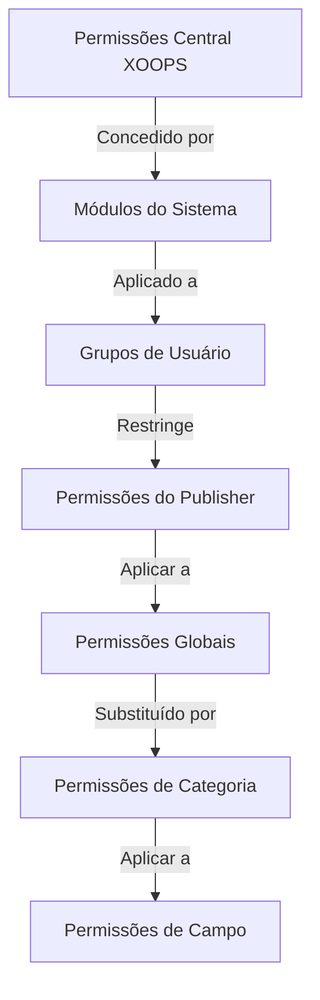

# Configuração de Permissões do Publisher

> Guia completo para configurar permissões de grupo, controle de acesso e gerenciar acesso de usuários no Publisher.

---

## Fundamentos de Permissões

### O Que São Permissões?

Permissões controlam o que diferentes grupos de usuários podem fazer no Publisher:

```
Quem pode:
  - Ver artigos
  - Enviar artigos
  - Editar artigos
  - Aprovar artigos
  - Gerenciar categorias
  - Configurar configurações
```

### Níveis de Permissão

```
Anônimo
  └── Visualizar apenas artigos publicados

Usuários Registrados
  ├── Ver artigos
  ├── Enviar artigos (aguardando aprovação)
  └── Editar próprios artigos

Editores/Moderadores
  ├── Todas as permissões de usuário registrado
  ├── Aprovar artigos
  ├── Editar todos os artigos
  └── Gerenciar algumas categorias

Administradores
  └── Acesso total a tudo
```

---

## Gerenciamento de Permissões de Acesso

### Navegue para Permissões

```
Painel de Admin
└── Módulos
    └── Publisher
        ├── Permissões
        ├── Permissões de Categoria
        └── Gerenciamento de Grupo
```

### Acesso Rápido

1. Faça login como **Administrador**
2. Vá para **Admin → Módulos**
3. Clique em **Publisher → Admin**
4. Clique em **Permissões** no menu esquerdo

---

## Permissões Globais

### Permissões em Nível de Módulo

Controle o acesso ao módulo Publisher e recursos:

```
Visualização de configuração de permissões:
┌─────────────────────────────────────┐
│ Permissão             │ Anon │ Reg │ Editor │ Admin │
├────────────────────────┼──────┼─────┼────────┼───────┤
│ Ver artigos            │  ✓   │  ✓  │   ✓    │  ✓   │
│ Enviar artigos         │  ✗   │  ✓  │   ✓    │  ✓   │
│ Editar próprios        │  ✗   │  ✓  │   ✓    │  ✓   │
│ Editar todos           │  ✗   │  ✗  │   ✓    │  ✓   │
│ Aprovar artigos        │  ✗   │  ✗  │   ✓    │  ✓   │
│ Gerenciar categorias   │  ✗   │  ✗  │   ✗    │  ✓   │
│ Acessar painel admin   │  ✗   │  ✗  │   ✓    │  ✓   │
└─────────────────────────────────────┘
```

### Descrições de Permissão

| Permissão | Usuários | Efeito |
|------------|-------|--------|
| **Ver artigos** | Todos os grupos | Podem ver artigos publicados no front-end |
| **Enviar artigos** | Registrado+ | Podem criar novos artigos (aguardando aprovação) |
| **Editar próprios artigos** | Registrado+ | Podem editar/deletar seus próprios artigos |
| **Editar todos os artigos** | Editores+ | Podem editar artigos de qualquer usuário |
| **Deletar próprios artigos** | Registrado+ | Podem deletar seus próprios artigos não publicados |
| **Deletar todos os artigos** | Editores+ | Podem deletar qualquer artigo |
| **Aprovar artigos** | Editores+ | Podem publicar artigos pendentes |
| **Gerenciar categorias** | Admins | Criar, editar, deletar categorias |
| **Acesso admin** | Editores+ | Acessar interface de admin |

---

## Configurar Permissões Globais

### Etapa 1: Acessar Configurações de Permissão

1. Vá para **Admin → Módulos**
2. Encontre **Publisher**
3. Clique em **Permissões** (ou link Admin e depois Permissões)
4. Você vê matriz de permissões

### Etapa 2: Definir Permissões de Grupo

Para cada grupo, configure o que eles podem fazer:

#### Usuários Anônimos

```yaml
Permissões do Grupo Anônimo:
  Ver artigos: ✓ SIM
  Enviar artigos: ✗ NÃO
  Editar artigos: ✗ NÃO
  Deletar artigos: ✗ NÃO
  Aprovar artigos: ✗ NÃO
  Gerenciar categorias: ✗ NÃO
  Acesso admin: ✗ NÃO

Resultado: Usuários anônimos podem apenas visualizar conteúdo publicado
```

#### Usuários Registrados

```yaml
Permissões do Grupo Registrado:
  Ver artigos: ✓ SIM
  Enviar artigos: ✓ SIM (com aprovação obrigatória)
  Editar próprios artigos: ✓ SIM
  Editar todos os artigos: ✗ NÃO
  Deletar próprios artigos: ✓ SIM (apenas rascunhos)
  Deletar todos os artigos: ✗ NÃO
  Aprovar artigos: ✗ NÃO
  Gerenciar categorias: ✗ NÃO
  Acesso admin: ✗ NÃO

Resultado: Usuários registrados podem contribuir com conteúdo após aprovação
```

#### Grupo de Editores

```yaml
Permissões do Grupo de Editores:
  Ver artigos: ✓ SIM
  Enviar artigos: ✓ SIM
  Editar próprios artigos: ✓ SIM
  Editar todos os artigos: ✓ SIM
  Deletar próprios artigos: ✓ SIM
  Deletar todos os artigos: ✓ SIM
  Aprovar artigos: ✓ SIM
  Gerenciar categorias: ✓ LIMITADO
  Acesso admin: ✓ SIM
  Configurar configurações: ✗ NÃO

Resultado: Editores gerenciam conteúdo mas não configurações
```

#### Administradores

```yaml
Permissões do Grupo de Admins:
  ✓ ACESSO TOTAL a todos os recursos

  - Todas as permissões de editor
  - Gerenciar todas as categorias
  - Configurar todas as configurações
  - Gerenciar permissões
  - Instalar/desinstalar
```

### Etapa 3: Salvar Permissões

1. Configure permissões de cada grupo
2. Marque caixas para ações permitidas
3. Desmarque caixas para ações negadas
4. Clique em **Salvar Permissões**
5. Mensagem de confirmação aparece

---

## Permissões em Nível de Categoria

### Definir Acesso de Categoria

Controle quem pode visualizar/enviar para categorias específicas:

```
Admin → Publisher → Categorias
→ Selecionar categoria → Permissões
```

### Matriz de Permissões de Categoria

```
                 Anônimo  Registrado  Editor  Admin
Ver categoria       ✓         ✓         ✓       ✓
Enviar para cat     ✗         ✓         ✓       ✓
Editar próprio      ✗         ✓         ✓       ✓
Editar todos        ✗         ✗         ✓       ✓
Aprovar na cat      ✗         ✗         ✓       ✓
Gerenciar cat       ✗         ✗         ✗       ✓
```

### Configurar Permissões de Categoria

1. Vá para admin de **Categorias**
2. Encontre categoria
3. Clique em botão **Permissões**
4. Para cada grupo, selecione:
   - [ ] Ver esta categoria
   - [ ] Enviar artigos
   - [ ] Editar próprios artigos
   - [ ] Editar todos os artigos
   - [ ] Aprovar artigos
   - [ ] Gerenciar categoria
5. Clique em **Salvar**

### Exemplos de Permissões de Categoria

#### Categoria Pública de Notícias

```
Anônimo: Apenas visualização
Registrado: Visualizar + Enviar (aguardando aprovação)
Editores: Aprovar + Editar
Admins: Controle total
```

#### Categoria de Atualizações Internas

```
Anônimo: Sem acesso
Registrado: Apenas visualização
Editores: Enviar + Aprovar
Admins: Controle total
```

#### Categoria de Blog de Convidado

```
Anônimo: Apenas visualização
Registrado: Enviar (aguardando aprovação)
Editores: Aprovar
Admins: Controle total
```

---

## Permissões em Nível de Campo

### Controlar Visibilidade de Campo de Formulário

Restringir quais campos do formulário os usuários podem ver/editar:

```
Admin → Publisher → Permissões → Campos
```

### Opções de Campo

```yaml
Campos Visíveis para Usuários Registrados:
  ✓ Título
  ✓ Descrição
  ✓ Conteúdo (corpo)
  ✓ Imagem em destaque
  ✓ Categoria
  ✓ Tags
  ✗ Autor (auto-definido)
  ✗ Data de publicação (apenas editores)
  ✗ Data agendada (apenas editores)
  ✗ Flag de destaque (apenas editores)
  ✗ Permissões (apenas admins)
```

### Exemplos

#### Envio Limitado para Registrado

Usuários registrados veem menos opções:

```
Campos disponíveis:
  - Título ✓
  - Descrição ✓
  - Conteúdo ✓
  - Imagem em destaque ✓
  - Categoria ✓

Campos ocultos:
  - Autor (auto-usuário atual)
  - Data de publicação (editores decidem)
  - Data agendada (apenas admins)
  - Status de destaque (editores escolhem)
```

#### Formulário Completo para Editores

Editores veem todas as opções:

```
Campos disponíveis:
  - Todos os campos básicos
  - Todos os metadados
  - Seleção de autor ✓
  - Data/hora de publicação ✓
  - Data agendada ✓
  - Status de destaque ✓
  - Data de expiração ✓
  - Permissões ✓
```

---

## Configuração de Grupo de Usuário

### Criar Grupo Personalizado

1. Vá para **Admin → Usuários → Grupos**
2. Clique em **Criar Grupo**
3. Digite detalhes do grupo:

```
Nome do Grupo: "Blogueiros da Comunidade"
Descrição do Grupo: "Usuários que contribuem com conteúdo do blog"
Tipo: Grupo regular
```

4. Clique em **Salvar Grupo**
5. Volte para permissões do Publisher
6. Defina permissões para novo grupo

### Exemplos de Grupo

```
Grupos Sugeridos para Publisher:

Grupo: Colaboradores
  - Membros regulares que enviam artigos
  - Podem editar próprios artigos
  - Não podem aprovar artigos

Grupo: Revisores
  - Podem ver artigos enviados
  - Podem aprovar/rejeitar artigos
  - Não podem deletar artigos de outros

Grupo: Editores
  - Podem editar qualquer artigo
  - Podem aprovar artigos
  - Podem moderar comentários
  - Podem gerenciar algumas categorias

Grupo: Publicadores
  - Podem editar qualquer artigo
  - Podem publicar diretamente (sem aprovação)
  - Podem gerenciar todas as categorias
  - Podem configurar configurações
```

---

## Hierarquias de Permissão

### Fluxo de Permissão



### Herança de Permissão

```
Base: Permissões globais do módulo
  ↓
Categoria: Substitui para categorias específicas
  ↓
Campo: Restringe ainda mais campos disponíveis
  ↓
Usuário: Tem permissão se TODOS os níveis permitem
```

**Exemplo:**

```
Usuário quer editar artigo:
1. Grupo do usuário deve ter permissão "editar artigos" (global)
2. Categoria deve permitir edição (nível de categoria)
3. Restrições de campo devem permitir (se aplicável)
4. Usuário deve ser autor OU editor (próprio vs todos)

Se QUALQUER nível nega → Permissão negada
```

---

## Permissões de Fluxo de Trabalho de Aprovação

### Configurar Aprovação de Envio

Controle se artigos precisam de aprovação:

```
Admin → Publisher → Preferências → Fluxo de Trabalho
```

#### Opções de Aprovação

```yaml
Fluxo de Trabalho de Envio:
  Exigir Aprovação: Sim

  Para Usuários Registrados:
    - Novos artigos: Rascunho (aguardando aprovação)
    - Editores devem aprovar
    - Usuário pode editar enquanto pendente
    - Após aprovação: Usuário ainda pode editar

  Para Editores:
    - Novos artigos: Publicar diretamente (opcional)
    - Pular fila de aprovação
    - Ou sempre exigir aprovação
```

#### Configurar Por Grupo

1. Vá para Preferências
2. Encontre "Fluxo de Trabalho de Envio"
3. Para cada grupo, defina:

```
Grupo: Usuários Registrados
  Exigir aprovação: ✓ SIM
  Status padrão: Rascunho
  Pode modificar enquanto pendente: ✓ SIM

Grupo: Editores
  Exigir aprovação: ✗ NÃO
  Status padrão: Publicado
  Pode modificar publicado: ✓ SIM
```

4. Clique em **Salvar**

---

## Moderar Artigos

### Aprovar Artigos Pendentes

Para usuários com permissão "aprovar artigos":

1. Vá para **Admin → Publisher → Artigos**
2. Filtre por **Status**: Pendente
3. Clique no artigo para revisar
4. Verifique qualidade do conteúdo
5. Defina **Status**: Publicado
6. Opcional: Adicione notas editoriais
7. Clique em **Salvar**

### Rejeitar Artigos

Se artigo não atender aos padrões:

1. Abra artigo
2. Defina **Status**: Rascunho
3. Adicione razão de rejeição (em comentário ou email)
4. Clique em **Salvar**
5. Envie mensagem para autor explicando rejeição

### Moderar Comentários

Se moderando comentários:

1. Vá para **Admin → Publisher → Comentários**
2. Filtre por **Status**: Pendente
3. Revise comentário
4. Opções:
   - Aprovar: Clique em **Aprovar**
   - Rejeitar: Clique em **Deletar**
   - Editar: Clique em **Editar**, corrija, salve
5. Clique em **Salvar**

---

## Gerenciar Acesso de Usuário

### Ver Grupos de Usuário

Veja quais usuários pertencem a grupos:

```
Admin → Usuários → Grupos de Usuário

Para cada usuário:
  - Grupo principal (um)
  - Grupos secundários (múltiplos)

Permissões aplicam de todos os grupos (união)
```

### Adicionar Usuário a Grupo

1. Vá para **Admin → Usuários**
2. Encontre usuário
3. Clique em **Editar**
4. Sob **Grupos**, marque grupos para adicionar
5. Clique em **Salvar**

### Mudar Permissões de Usuário

Para usuários individuais (se suportado):

1. Vá para admin de usuário
2. Encontre usuário
3. Clique em **Editar**
4. Procure por substituição de permissões individuais
5. Configure conforme necessário
6. Clique em **Salvar**

---

## Cenários Comuns de Permissão

### Cenário 1: Blog Aberto

Permitir qualquer um enviar:

```
Anônimo: Visualizar
Registrado: Enviar, editar próprio, deletar próprio
Editores: Aprovar, editar todos, deletar todos
Admins: Controle total

Resultado: Blog aberto da comunidade
```

### Cenário 2: Site de Notícias Moderado

Processo de aprovação rigoroso:

```
Anônimo: Apenas visualização
Registrado: Não pode enviar
Editores: Enviar, aprovar outros
Admins: Controle total

Resultado: Apenas profissionais aprovados publicam
```

### Cenário 3: Blog de Equipe

Funcionários podem contribuir:

```
Criar grupo: "Equipe"
Anônimo: Visualizar
Registrado: Apenas visualização (não-equipe)
Equipe: Enviar, editar próprio, publicar diretamente
Admins: Controle total

Resultado: Blog de autoria de equipe
```

### Cenário 4: Multi-Categoria com Diferentes Editores

Editores diferentes para categorias diferentes:

```
Categoria Notícias:
  Grupo de Editores A: Controle total

Categoria Resenhas:
  Grupo de Editores B: Controle total

Categoria Tutoriais:
  Grupo de Editores C: Controle total

Resultado: Controle editorial descentralizado
```

---

## Teste de Permissões

### Verificar se Permissões Funcionam

1. Criar usuário de teste em cada grupo
2. Fazer login como cada usuário de teste
3. Tentar:
   - Ver artigos
   - Enviar artigo (deve criar rascunho se permitido)
   - Editar artigo (próprio e outros)
   - Deletar artigo
   - Acessar painel admin
   - Acessar categorias

4. Verificar se resultados correspondem às permissões esperadas

### Casos de Teste Comuns

```
Caso de Teste 1: Usuário anônimo
  [ ] Pode ver artigos publicados: ✓
  [ ] Não pode enviar artigos: ✓
  [ ] Não pode acessar admin: ✓

Caso de Teste 2: Usuário registrado
  [ ] Pode enviar artigos: ✓
  [ ] Artigos vão para Rascunho: ✓
  [ ] Pode editar próprio artigo: ✓
  [ ] Não pode editar de outros: ✓
  [ ] Não pode acessar admin: ✓

Caso de Teste 3: Editor
  [ ] Pode aprovar artigos: ✓
  [ ] Pode editar qualquer artigo: ✓
  [ ] Pode acessar admin: ✓
  [ ] Não pode deletar todos: ✓ (ou ✓ se permitido)

Caso de Teste 4: Admin
  [ ] Pode fazer tudo: ✓
```

---

## Solução de Problemas de Permissões

### Problema: Usuário não consegue enviar artigos

**Verificar:**
```
1. Grupo de usuário tem permissão "enviar artigos"
   Admin → Publisher → Permissões

2. Usuário pertence a grupo permitido
   Admin → Usuários → Editar usuário → Grupos

3. Categoria permite envio do grupo do usuário
   Admin → Publisher → Categorias → Permissões

4. Usuário é registrado (não anônimo)
```

**Solução:**
```bash
1. Verificar se grupo de usuário registrado tem permissão de envio
2. Adicionar usuário ao grupo apropriado
3. Verificar permissões de categoria
4. Limpar cache de sessão do usuário
```

### Problema: Editor não consegue aprovar artigos

**Verificar:**
```
1. Grupo de editor tem permissão "aprovar artigos"
2. Artigos existem com status "Pendente"
3. Editor está no grupo correto
4. Categoria permite aprovação do grupo do editor
```

**Solução:**
```bash
1. Vá para Permissões, verificar "aprovar artigos" está marcado para grupo de editor
2. Criar artigo de teste, definir para Rascunho
3. Tentar aprovar como editor
4. Verificar mensagens de erro no log do sistema
```

### Problema: Pode ver artigos mas não consegue acessar categoria

**Verificar:**
```
1. Categoria não está desabilitada/oculta
2. Permissões de categoria permitem visualização
3. Grupo do usuário é permitido para visualizar categoria
4. Categoria é publicada
```

**Solução:**
```bash
1. Vá para Categorias, verificar status da categoria é "Habilitado"
2. Verificar permissões de categoria estão definidas
3. Adicionar grupo do usuário à permissão de visualização de categoria
```

### Problema: Permissões mudaram mas não têm efeito

**Solução:**
```bash
1. Limpar cache: Admin → Ferramentas → Limpar Cache
2. Limpar sessão: Fazer logout e login novamente
3. Verificar log do sistema para erros
4. Verificar se permissões realmente foram salvas
5. Tentar navegador diferente/janela incógnita
```

---

## Backup e Exportação de Permissão

### Exportar Permissões

Alguns sistemas permitem exportar:

1. Vá para **Admin → Publisher → Ferramentas**
2. Clique em **Exportar Permissões**
3. Salve arquivo `.xml` ou `.json`
4. Mantenha como backup

### Importar Permissões

Restaurar de backup:

1. Vá para **Admin → Publisher → Ferramentas**
2. Clique em **Importar Permissões**
3. Selecione arquivo de backup
4. Revise mudanças
5. Clique em **Importar**

---

## Melhores Práticas

### Lista de Verificação de Configuração de Permissão

- [ ] Decida sobre grupos de usuário
- [ ] Atribua nomes claros aos grupos
- [ ] Defina permissões base para cada grupo
- [ ] Teste cada nível de permissão
- [ ] Documente estrutura de permissão
- [ ] Crie fluxo de trabalho de aprovação
- [ ] Treine editores sobre moderação
- [ ] Monitore uso de permissões
- [ ] Revise permissões trimestralmente
- [ ] Faça backup de configurações de permissão

### Melhores Práticas de Segurança

```
✓ Princípio de Menor Privilégio
  - Conceder permissões mínimas necessárias

✓ Acesso Baseado em Função
  - Usar grupos para funções (editor, moderador, etc)

✓ Auditar Permissões
  - Revisar quem tem que acesso

✓ Separar Deveres
  - Envia, aprova, publica são diferentes

✓ Revisão Regular
  - Verificar permissões trimestralmente
  - Remover acesso quando usuários saem
  - Atualizar para novos requisitos
```

---

## Guias Relacionados

- Criando Artigos
- Gerenciando Categorias
- Configuração Básica
- Instalação

---

## Próximas Etapas

- Configurar Permissões para seu fluxo de trabalho
- Criar Artigos com permissões apropriadas
- Configurar Categorias com permissões
- Treinar usuários sobre criação de artigos

---

#publisher #permissões #grupos #controle-de-acesso #segurança #moderação #xoops
