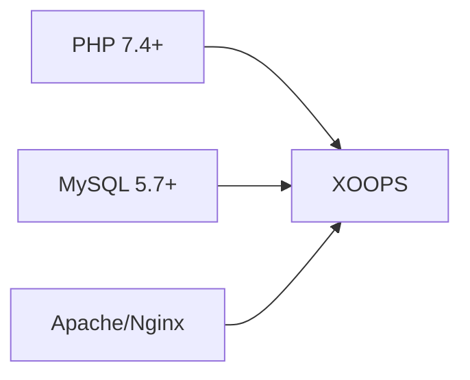
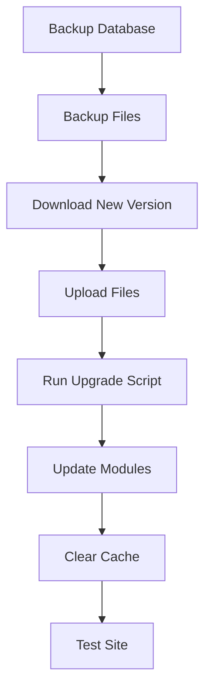

> Perguntas e respostas comuns sobre a instalação do XOOPS.

---

## Pré-Instalação

### P: Quais são os requisitos mínimos de servidor?

**R:** XOOPS 2.5.x requer:
- PHP 7.4 ou superior (PHP 8.x recomendado)
- MySQL 5.7+ ou MariaDB 10.3+
- Apache com mod_rewrite ou Nginx
- Pelo menos 64MB de limite de memória PHP (128MB+ recomendado)



### P: Posso instalar XOOPS em hospedagem compartilhada?

**R:** Sim, XOOPS funciona bem na maioria das hospedagens compartilhadas que atendem aos requisitos. Verifique se sua hospedagem fornece:
- PHP com extensões necessárias (mysqli, gd, curl, json, mbstring)
- Acesso ao banco de dados MySQL
- Capacidade de upload de arquivos
- Suporte .htaccess (para Apache)

### P: Quais extensões PHP são necessárias?

**R:** Extensões obrigatórias:
- `mysqli` - Conectividade de banco de dados
- `gd` - Processamento de imagem
- `json` - Tratamento JSON
- `mbstring` - Suporte a strings multibyte

Recomendadas:
- `curl` - Chamadas de API externas
- `zip` - Instalação de módulo
- `intl` - Internacionalização

---

## Processo de Instalação

### P: O assistente de instalação mostra uma página em branco

**R:** Isto geralmente é um erro PHP. Tente:

1. Ativar exibição de erro temporariamente:
```php
// Add to htdocs/install/index.php at the top
error_reporting(E_ALL);
ini_set('display_errors', 1);
```

2. Verificar log de erros PHP
3. Verificar compatibilidade de versão PHP
4. Garantir que todas as extensões necessárias estejam carregadas

### P: Recebo "Cannot write to mainfile.php"

**R:** Defina permissões de escrita antes da instalação:

```bash
chmod 666 mainfile.php
# After installation, secure it:
chmod 444 mainfile.php
```

### P: Tabelas de banco de dados não estão sendo criadas

**R:** Verifique:

1. O usuário MySQL tem privilégios CREATE TABLE:
```sql
GRANT ALL PRIVILEGES ON xoopsdb.* TO 'xoopsuser'@'localhost';
FLUSH PRIVILEGES;
```

2. O banco de dados existe:
```sql
CREATE DATABASE xoopsdb CHARACTER SET utf8mb4 COLLATE utf8mb4_unicode_ci;
```

3. As credenciais no assistente correspondem às configurações do banco de dados

### P: Instalação completa mas o site mostra erros

**R:** Correções comuns após instalação:

1. Remover ou renomear diretório de instalação:
```bash
mv htdocs/install htdocs/install.bak
```

2. Definir permissões adequadas:
```bash
chmod -R 755 htdocs/
chmod -R 777 xoops_data/
chmod 444 mainfile.php
```

3. Limpar cache:
```bash
rm -rf xoops_data/caches/smarty_cache/*
rm -rf xoops_data/caches/smarty_compile/*
```

---

## Configuração

### P: Onde está o arquivo de configuração?

**R:** A configuração principal está em `mainfile.php` na raiz do XOOPS. Configurações principais:

```php
define('XOOPS_ROOT_PATH', '/path/to/htdocs');
define('XOOPS_VAR_PATH', '/path/to/xoops_data');
define('XOOPS_URL', 'https://yoursite.com');
define('XOOPS_DB_HOST', 'localhost');
define('XOOPS_DB_USER', 'username');
define('XOOPS_DB_PASS', 'password');
define('XOOPS_DB_NAME', 'database');
define('XOOPS_DB_PREFIX', 'xoops');
```

### P: Como altero a URL do site?

**R:** Edite `mainfile.php`:

```php
define('XOOPS_URL', 'https://newdomain.com');
```

Depois limpe o cache e atualize qualquer URL codificada no banco de dados.

### P: Como movo XOOPS para um diretório diferente?

**R:**

1. Mover arquivos para novo local
2. Atualizar caminhos em `mainfile.php`:
```php
define('XOOPS_ROOT_PATH', '/new/path/to/htdocs');
define('XOOPS_VAR_PATH', '/new/path/to/xoops_data');
```
3. Atualizar banco de dados se necessário
4. Limpar todos os caches

---

## Atualizações

### P: Como faço upgrade do XOOPS?

**R:**



1. **Fazer backup de tudo** (banco de dados + arquivos)
2. Baixar nova versão do XOOPS
3. Fazer upload de arquivos (não sobrescrever `mainfile.php`)
4. Executar `htdocs/upgrade/` se fornecido
5. Atualizar módulos via painel admin
6. Limpar todos os caches
7. Testar cuidadosamente

### P: Posso pular versões ao fazer upgrade?

**R:** Geralmente não. Fazer upgrade sequencialmente através de versões principais para garantir que as migrações de banco de dados sejam executadas corretamente. Verifique as notas de lançamento para orientação específica.

### P: Meus módulos pararam de funcionar após upgrade

**R:**

1. Verificar compatibilidade de módulo com nova versão do XOOPS
2. Atualizar módulos para as versões mais recentes
3. Regenerar templates: Admin → Sistema → Manutenção → Templates
4. Limpar todos os caches
5. Verificar logs de erro PHP para erros específicos

---

## Solução de Problemas

### P: Esqueci a senha de administrador

**R:** Resetar via banco de dados:

```sql
-- Generate new password hash
UPDATE xoops_users
SET pass = MD5('newpassword')
WHERE uname = 'admin';
```

Ou use o recurso de redefinição de senha se o email estiver configurado.

### P: Site muito lento após instalação

**R:**

1. Ativar cache em Admin → Sistema → Preferências
2. Otimizar banco de dados:
```sql
OPTIMIZE TABLE xoops_session;
OPTIMIZE TABLE xoops_online;
```
3. Verificar queries lentas em modo debug
4. Ativar PHP OpCache

### P: Imagens/CSS não estão carregando

**R:**

1. Verificar permissões de arquivo (644 para arquivos, 755 para diretórios)
2. Verificar se `XOOPS_URL` está correto em `mainfile.php`
3. Verificar .htaccess para conflitos de reescrita
4. Inspecionar console do navegador para erros 404

---

## Documentação Relacionada

- Guia de Instalação
- Configuração Básica
- Tela Branca da Morte

---

#xoops #faq #installation #troubleshooting
