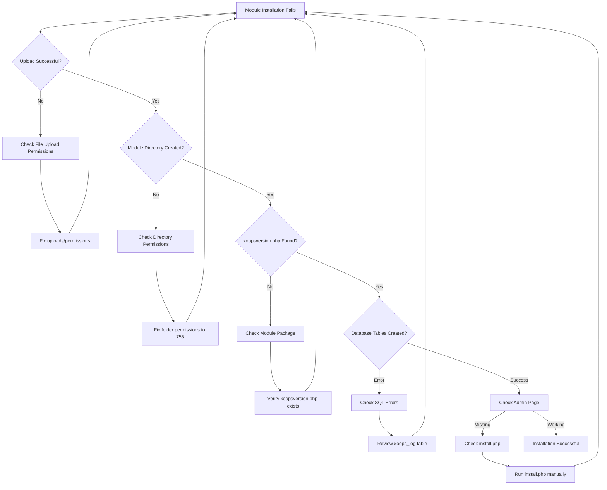
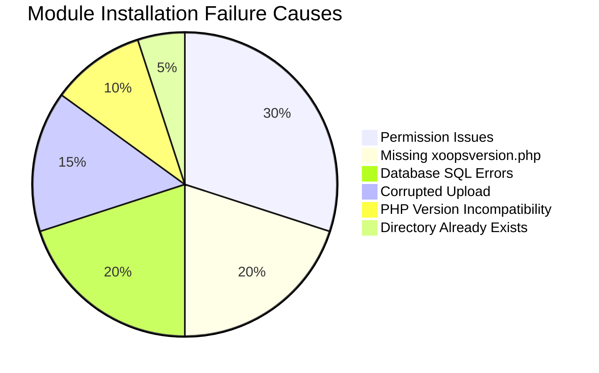

> Problemas comuns e soluções para resolver problemas de instalação de módulo no XOOPS.

---

## Fluxograma de Diagnóstico



---

## Causas Comuns e Soluções



---

## 1. Permissão Negada em Upload de Arquivo

**Sintomas:**
- Upload falha com "Permissão negada"
- Pasta de módulo não criada
- Não consegue escrever em diretório de módulos

**Mensagens de Erro:**
```
Warning: move_uploaded_file(): Unable to move file
Permission denied (13)
```

**Soluções:**

```bash
# Check current permissions
ls -ld /path/to/xoops/modules
ls -ld /path/to/xoops/uploads

# Fix module directory permissions
chmod 755 /path/to/xoops/modules

# Fix temporary upload directory
chmod 777 /path/to/xoops/uploads
chmod 777 /tmp  # if needed

# Fix ownership (if running as different user)
chown -R www-data:www-data /path/to/xoops/modules
chown -R www-data:www-data /path/to/xoops/uploads
```

---

## 2. xoopsversion.php Faltando

**Sintomas:**
- Módulo aparece na lista mas não se ativa
- Instalação começa depois para
- Nenhuma página de admin criada

**Erro em xoops_log:**
```
Module xoopsversion.php not found
```

**Soluções:**

Verificar estrutura do pacote do módulo:

```bash
# Extract and check module contents
unzip module.zip
ls -la mymodule/

# Must contain:
# - xoopsversion.php
# - language/
# - sql/
# - admin/ (optional but recommended)
```

**Estrutura xoopsversion.php válida:**

```php
<?php
$modversion['name'] = 'My Module';
$modversion['version'] = '1.0.0';
$modversion['description'] = 'Module description';
$modversion['author'] = 'Author Name';
$modversion['dirname'] = basename(__DIR__);

// Core module info
$modversion['hasMain'] = 1;
$modversion['hasAdmin'] = 1;

// Database tables
$modversion['sqlfile']['mysql'] = 'sql/mysql.sql';
$modversion['tables'] = ['table_name'];
```

---

## 3. Erros de Execução SQL do Banco de Dados

**Sintomas:**
- Upload bem-sucedido mas tabelas de banco de dados não criadas
- Página de admin não carrega
- Erros "Table doesn't exist"

**Mensagens de Erro:**
```
SQL Error: Table 'xoops_module_table' already exists
Syntax error in SQL statement
```

**Soluções:**

Verificar sintaxe do arquivo SQL e executar manualmente se necessário.

---

## Documentação Relacionada

- Falhas de Instalação de Módulo
- Estrutura de Módulo
- FAQ de Performance
- Ativar Modo Debug

---

#xoops #modules #installation #troubleshooting
