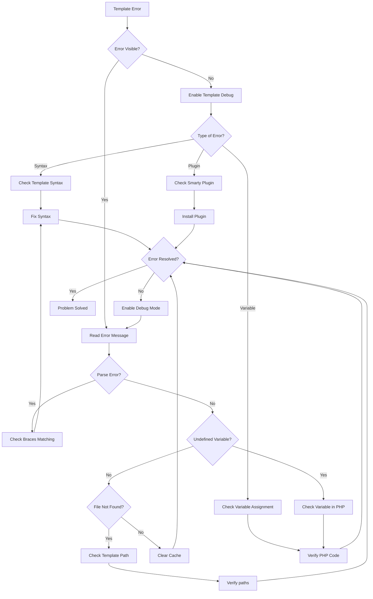
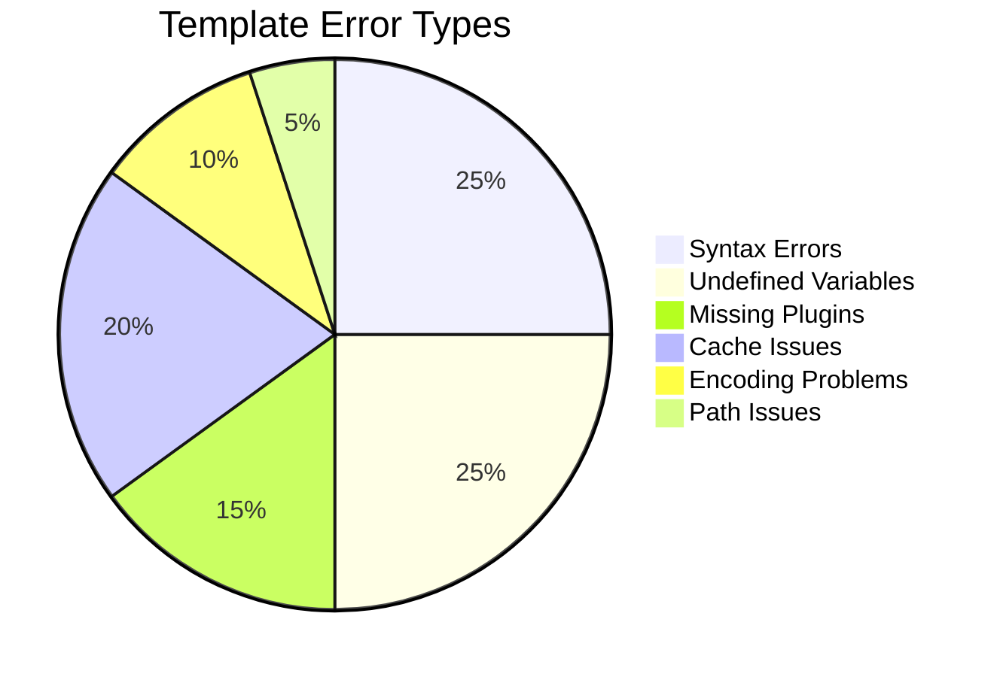

# Erros de Template (Depuração Smarty)

> Problemas comuns de template Smarty e técnicas de depuração para temas e módulos do XOOPS.

---

## Fluxograma de Diagnóstico



---

## Erros Comuns de Template Smarty



---

## 1. Erros de Sintaxe

**Sintomas:**
- Mensagens "Smarty syntax error"
- Templates não compilam
- Página em branco sem saída

**Mensagens de Erro:**
```
Syntax error: unrecognized tag 'myfunction'
Unexpected "}" near end of template
```

### Problemas Comuns de Sintaxe

**Tag de fechamento faltando:**
```smarty
{* WRONG *}
{if $user}
User: {$user.name}
{* Missing {/if} *}

{* CORRECT *}
{if $user}
User: {$user.name}
{/if}
```

**Sintaxe de variável incorreta:**
```smarty
{* WRONG *}
{$user->name}          {* Use . not -> *}
{$array[key]}          {* Use quoted keys *}
{$func()}              {* Can't call functions directly *}

{* CORRECT *}
{$user.name}
{$array.key}
{$array['key']}
{$user|@function}      {* Use modifiers instead *}
```

**Aspas desemparelhadas:**
```smarty
{* WRONG *}
{if $name == 'John}     {* Mismatched quotes *}
{assign var="user' value="John"}

{* CORRECT *}
{if $name == 'John'}
{assign var="user" value="John"}
```

**Soluções:**

```smarty
{* Always balance braces *}
{if condition}
  ...
{elseif condition}
  ...
{else}
  ...
{/if}

{* Verify tag format *}
{foreach $items as $item}
  ...
{/foreach}

{* Check all variables are defined *}
{if isset($variable)}
  {$variable}
{/if}
```

---

## 2. Erros de Variável Indefinida

**Sintomas:**
- Avisos "Undefined variable"
- Variável exibe como vazia
- Aviso PHP em log de erro

**Mensagens de Erro:**
```
Notice: Undefined variable: myvar
Smarty notice: variable "$user" not available
```

**Script de Debug:**

```php
<?php
// In your template file or PHP code
// Create modules/yourmodule/debug_template.php

require_once '../../mainfile.php';

// Get template engine
$tpl = new XoopsTpl();

// Check what variables are assigned
echo "<h1>Template Variables</h1>";
echo "<pre>";
print_r($tpl->get_template_vars());
echo "</pre>";

// Or dump Smarty object
echo "<h1>Smarty Debug</h1>";
echo "<pre>";
$tpl->debug_vars();
echo "</pre>";
?>
```

**Corrigir em PHP:**

```php
<?php
// Ensure variables are assigned before rendering
$xoopsTpl = new XoopsTpl();

// WRONG - variable not assigned
$xoopsTpl->display('file:templates/page.html');

// CORRECT - assign variables first
$user = [
    'name' => 'John',
    'email' => 'john@example.com'
];
$xoopsTpl->assign('user', $user);
$xoopsTpl->display('file:templates/page.html');
?>
```

---

## 3. Problemas de Cache

**Sintomas:**
- Mudanças no template não aparecem
- Versão antiga do template exibida

**Soluções:**

```bash
# Clear Smarty cache
rm -rf xoops_data/caches/smarty_cache/*
rm -rf xoops_data/caches/smarty_compile/*

# Or in admin panel
Admin > System > Maintenance > Clear Cache
```

---

## Procedimento de Depuração Passo a Passo

1. **Ativar exibição de erro PHP** em mainfile.php
2. **Limpar cache Smarty**
3. **Ativar modo debug do XOOPS** com `XOOPS_DEBUG_LEVEL = 2`
4. **Verificar sintaxe de template** para braces desemparelhadas
5. **Verificar variáveis atribuídas em PHP** antes de renderizar
6. **Usar {debug} em template** para inspecionar variáveis
7. **Verificar logs de erro PHP** para erros adicionais

---

## Documentação Relacionada

- Ativar Modo Debug
- Depuração de Template Smarty
- Tela Branca da Morte
- Erros de Permissão Negada

---

#xoops #templates #smarty #debugging #troubleshooting
