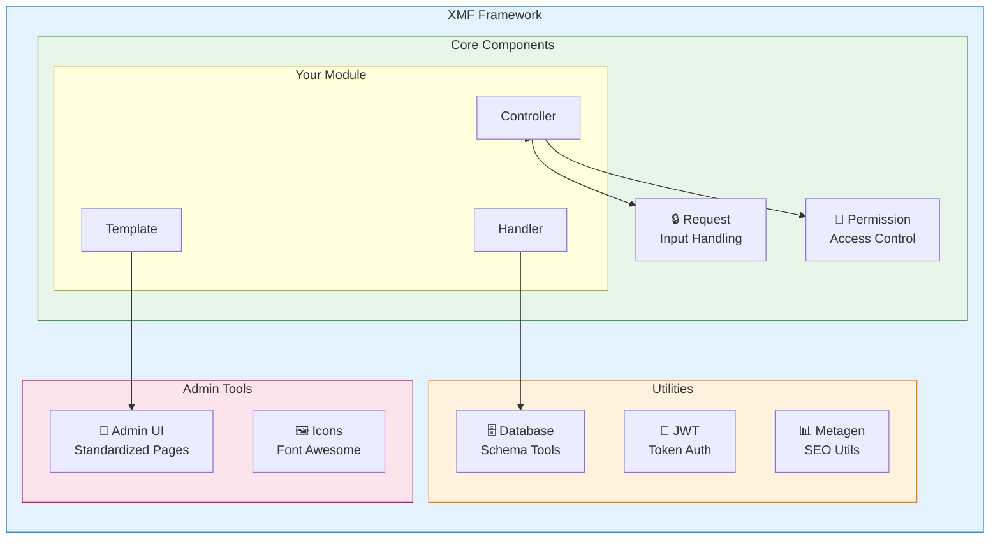
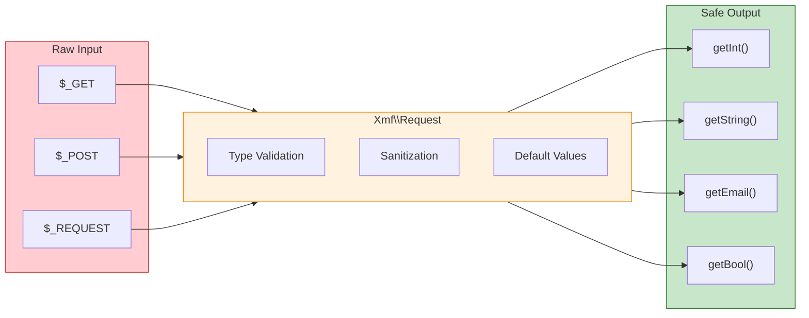

<span class="version-badge version-25x">2.5.x ✅</span> <span class="version-badge version-40x">4.0.x ✅</span>

:::tip[A Ponte para XOOPS Moderno]
XMF funciona **tanto em XOOPS 2.5.x quanto em XOOPS 4.0.x**. É a forma recomendada de modernizar seus módulos hoje enquanto se prepara para XOOPS 4.0. XMF fornece autoloading PSR-4, namespaces e helpers que suavizam a transição.
:::

O **XOOPS Module Framework (XMF)** é uma biblioteca poderosa projetada para simplificar e padronizar o desenvolvimento de módulos XOOPS. XMF fornece práticas modernas de PHP incluindo namespaces, autoloading e um conjunto abrangente de classes helper que reduzem código boilerplate e melhoram a manutenibilidade.

## O que é XMF?

XMF é uma coleção de classes e utilitários que fornecem:

- **Suporte Modern PHP** - Suporte completo a namespaces com autoloading PSR-4
- **Manipulação de Requisições** - Validação segura e sanitização de entrada
- **Module Helpers** - Acesso simplificado a configurações de módulo e objetos
- **Sistema de Permissões** - Gerenciamento fácil de permissões
- **Utilitários de Banco de Dados** - Ferramentas de migração de schema e gerenciamento de tabelas
- **Suporte JWT** - Implementação de JSON Web Token para autenticação segura
- **Geração de Metadados** - Utilitários de SEO e extração de conteúdo
- **Interface Admin** - Páginas de administração de módulo padronizadas

### Visão Geral de Componentes XMF



## Principais Características

### Namespaces e Autoloading

Todas as classes XMF residem no namespace `Xmf`. Classes são carregadas automaticamente quando referenciadas - nenhuma inclusão manual necessária.

```php
use Xmf\Request;
use Xmf\Module\Helper;

// Classes carregam automaticamente quando usadas
$input = Request::getString('input', '');
$helper = Helper::getHelper('mymodule');
```

### Manipulação Segura de Requisições

A classe [Request](../05-XMF-Framework/Basics/XMF-Request.md) fornece acesso type-safe a dados de requisição HTTP com sanitização integrada:



```php
use Xmf\Request;

$id = Request::getInt('id', 0);
$name = Request::getString('name', '');
$email = Request::getEmail('email', '');
```

### Sistema de Helper de Módulo

O [Module Helper](../05-XMF-Framework/Basics/XMF-Module-Helper.md) fornece acesso conveniente à funcionalidade relacionada a módulo:

```php
$helper = \Xmf\Module\Helper::getHelper('mymodule');

// Acessar configuração do módulo
$configValue = $helper->getConfig('setting_name', 'default');

// Obter objeto do módulo
$module = $helper->getModule();

// Acessar handlers
$handler = $helper->getHandler('items');
```

### Gerenciamento de Permissões

O [Permission-Helper](../05-XMF-Framework/Recipes/Permission-Helper.md) simplifica o gerenciamento de permissões XOOPS:

```php
$permHelper = new \Xmf\Module\Helper\Permission();

// Verificar permissão do usuário
if ($permHelper->checkPermission('view', $itemId)) {
    // Usuário tem permissão
}
```

## Estrutura da Documentação

### Basics

- [Getting-Started-with-XMF](../05-XMF-Framework/Basics/Getting-Started-with-XMF.md) - Instalação e uso básico
- [XMF-Request](../05-XMF-Framework/Basics/XMF-Request.md) - Manipulação de requisições e validação de entrada
- [XMF-Module-Helper](../05-XMF-Framework/Basics/XMF-Module-Helper.md) - Uso da classe module helper

### Recipes

- [Permission-Helper](../05-XMF-Framework/Recipes/Permission-Helper.md) - Trabalhando com permissões
- [Module-Admin-Pages](../05-XMF-Framework/Recipes/Module-Admin-Pages.md) - Criando interfaces administrativas padronizadas

### Reference

- [JWT](../05-XMF-Framework/Reference/JWT.md) - Implementação de JSON Web Token
- [Database](../05-XMF-Framework/Reference/Database.md) - Utilitários de banco de dados e gerenciamento de schema
- [Metagen](Reference/Metagen.md) - Utilitários de metadados e SEO

## Requisitos

- XOOPS 2.5.8 ou posterior
- PHP 7.2 ou posterior (PHP 8.x recomendado)

## Instalação

XMF é incluído com XOOPS 2.5.8 e versões posteriores. Para versões anteriores ou instalação manual:

1. Faça download do pacote XMF do repositório XOOPS
2. Extraia para seu diretório XOOPS `/class/xmf/`
3. O autoloader cuidará do carregamento de classes automaticamente

## Exemplo de Início Rápido

Aqui está um exemplo completo mostrando padrões comuns de uso de XMF:

```php
<?php
use Xmf\Request;
use Xmf\Module\Helper;
use Xmf\Module\Helper\Permission;

// Obter helper de módulo
$helper = Helper::getHelper('mymodule');

// Obter valores de configuração
$itemsPerPage = $helper->getConfig('items_per_page', 10);

// Manipular entrada de requisição
$op = Request::getCmd('op', 'list');
$id = Request::getInt('id', 0);

// Verificar permissões
$permHelper = new Permission();
if (!$permHelper->checkPermission('view', $id)) {
    redirect_header('index.php', 3, 'Acesso negado');
}

// Processar baseado em operação
switch ($op) {
    case 'view':
        $handler = $helper->getHandler('items');
        $item = $handler->get($id);
        // ... exibir item
        break;
    case 'list':
    default:
        // ... listar items
        break;
}
```

## Recursos

- [Repositório XMF GitHub](https://github.com/XOOPS/XMF)
- [Website do Projeto XOOPS](https://xoops.org)

---

#xmf #xoops #framework #php #module-development
