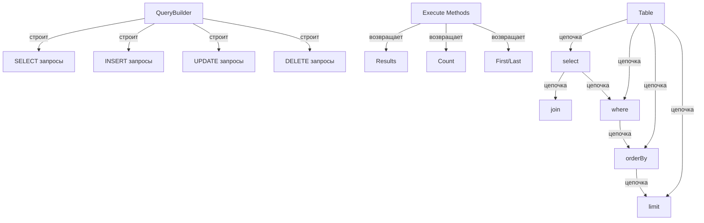

Построитель запросов XOOPS предоставляет современный, fluent интерфейс для построения SQL запросов. Это помогает предотвратить SQL инъекции, улучшает читаемость и обеспечивает абстракцию БД для нескольких СУБД.

## Архитектура построителя запросов



## Класс QueryBuilder

Основной класс построителя запросов с fluent интерфейсом.

### Обзор класса

```php
namespace Xoops\Database;

class QueryBuilder
{
    protected string $table = '';
    protected string $type = 'SELECT';
    protected array $selects = [];
    protected array $joins = [];
    protected array $wheres = [];
    protected array $orders = [];
    protected int $limit = 0;
    protected int $offset = 0;
    protected array $bindings = [];
}
```

### Статические методы

#### table

Создает новый построитель запросов для таблицы.

```php
public static function table(string $table): QueryBuilder
```

**Параметры:**

| Параметр | Тип | Описание |
|----------|-----|---------|
| `$table` | string | Имя таблицы (с префиксом или без) |

**Возвращает:** `QueryBuilder` - Экземпляр построителя запросов

**Пример:**
```php
$query = QueryBuilder::table('users');
$query = QueryBuilder::table('xoops_users'); // С префиксом
```

## SELECT запросы

### select

Указывает колонки для выбора.

```php
public function select(...$columns): self
```

**Параметры:**

| Параметр | Тип | Описание |
|----------|-----|---------|
| `...$columns` | array | Имена колонок или выражения |

**Возвращает:** `self` - Для цепочки методов

**Пример:**
```php
// Простой select
QueryBuilder::table('users')
    ->select('id', 'username', 'email')
    ->get();

// Select с псевдонимами
QueryBuilder::table('users')
    ->select('id as user_id', 'username as name')
    ->get();

// Выбрать все колонки
QueryBuilder::table('users')
    ->select('*')
    ->get();

// Select с выражениями
QueryBuilder::table('orders')
    ->select('id', 'COUNT(*) as total_items')
    ->groupBy('id')
    ->get();
```

### where

Добавляет условие WHERE.

```php
public function where(string $column, string $operator = '=', mixed $value = null): self
```

**Параметры:**

| Параметр | Тип | Описание |
|----------|-----|---------|
| `$column` | string | Имя колонки |
| `$operator` | string | Оператор сравнения |
| `$value` | mixed | Значение для сравнения |

**Возвращает:** `self` - Для цепочки методов

**Операторы:**

| Оператор | Описание | Пример |
|----------|---------|--------|
| `=` | Равно | `->where('status', '=', 'active')` |
| `!=` или `<>` | Не равно | `->where('status', '!=', 'deleted')` |
| `>` | Больше | `->where('price', '>', 100)` |
| `<` | Меньше | `->where('price', '<', 100)` |
| `>=` | Больше или равно | `->where('age', '>=', 18)` |
| `<=` | Меньше или равно | `->where('age', '<=', 65)` |
| `LIKE` | Поиск по шаблону | `->where('name', 'LIKE', '%john%')` |
| `IN` | В списке | `->where('status', 'IN', ['active', 'pending'])` |
| `NOT IN` | Не в списке | `->where('id', 'NOT IN', [1, 2, 3])` |
| `BETWEEN` | Диапазон | `->where('age', 'BETWEEN', [18, 65])` |
| `IS NULL` | Является null | `->where('deleted_at', 'IS NULL')` |
| `IS NOT NULL` | Не является null | `->where('deleted_at', 'IS NOT NULL')` |

**Пример:**
```php
// Одно условие
QueryBuilder::table('users')
    ->select('*')
    ->where('status', '=', 'active')
    ->get();

// Несколько условий (AND)
QueryBuilder::table('users')
    ->select('*')
    ->where('status', '=', 'active')
    ->where('age', '>=', 18)
    ->get();

// Оператор IN
QueryBuilder::table('products')
    ->select('*')
    ->where('category_id', 'IN', [1, 2, 3])
    ->get();

// Оператор LIKE
QueryBuilder::table('users')
    ->select('*')
    ->where('email', 'LIKE', '%@example.com')
    ->get();

// Проверка NULL
QueryBuilder::table('users')
    ->select('*')
    ->where('deleted_at', 'IS NULL')
    ->get();
```

### orderBy

Упорядочивает результаты.

```php
public function orderBy(string $column, string $direction = 'ASC'): self
```

**Параметры:**

| Параметр | Тип | Описание |
|----------|-----|---------|
| `$column` | string | Колонка для сортировки |
| `$direction` | string | `ASC` или `DESC` |

**Пример:**
```php
// Одна сортировка
QueryBuilder::table('users')
    ->select('*')
    ->orderBy('created_at', 'DESC')
    ->get();

// Несколько сортировок
QueryBuilder::table('posts')
    ->select('*')
    ->orderBy('category_id', 'ASC')
    ->orderBy('created_at', 'DESC')
    ->get();

// Случайная сортировка
QueryBuilder::table('quotes')
    ->select('*')
    ->orderBy('RAND()')
    ->get();
```

### limit / offset

Ограничивает и смещает результаты.

```php
public function limit(int $limit): self
public function offset(int $offset): self
```

**Пример:**
```php
// Простое ограничение
QueryBuilder::table('posts')
    ->select('*')
    ->limit(10)
    ->get();

// Постраничная навигация
$page = 2;
$perPage = 20;
$offset = ($page - 1) * $perPage;

QueryBuilder::table('posts')
    ->select('*')
    ->limit($perPage)
    ->offset($offset)
    ->get();
```

## Методы выполнения

### get

Выполняет запрос и возвращает все результаты.

```php
public function get(): array
```

**Возвращает:** `array` - Массив строк результатов

**Пример:**
```php
$users = QueryBuilder::table('users')
    ->select('id', 'username', 'email')
    ->where('status', '=', 'active')
    ->orderBy('username')
    ->get();

foreach ($users as $user) {
    echo $user['username'] . ' (' . $user['email'] . ')' . "\n";
}
```

### first

Получает первый результат.

```php
public function first(): ?array
```

**Возвращает:** `?array` - Первая строка или null

**Пример:**
```php
$user = QueryBuilder::table('users')
    ->select('*')
    ->where('id', '=', 123)
    ->first();

if ($user) {
    echo 'Found: ' . $user['username'];
}
```

### count

Получает количество результатов.

```php
public function count(): int
```

**Возвращает:** `int` - Количество строк

**Пример:**
```php
$activeUsers = QueryBuilder::table('users')
    ->where('status', '=', 'active')
    ->count();

echo "Active users: $activeUsers";
```

## INSERT запросы

### insert

Вставляет строку.

```php
public function insert(array $values): bool
```

**Пример:**
```php
QueryBuilder::table('users')->insert([
    'username' => 'john',
    'email' => 'john@example.com',
    'password' => password_hash('secret', PASSWORD_BCRYPT),
    'created_at' => date('Y-m-d H:i:s')
]);
```

## UPDATE запросы

### update

Обновляет строки.

```php
public function update(array $values): int
```

**Возвращает:** `int` - Количество затронутых строк

**Пример:**
```php
// Обновить одного пользователя
QueryBuilder::table('users')
    ->where('id', '=', 123)
    ->update([
        'email' => 'newemail@example.com',
        'updated_at' => date('Y-m-d H:i:s')
    ]);

// Обновить несколько строк
QueryBuilder::table('posts')
    ->where('status', '=', 'draft')
    ->where('created_at', '<', date('Y-m-d', strtotime('-30 days')))
    ->update([
        'status' => 'archived'
    ]);
```

## DELETE запросы

### delete

Удаляет строки.

```php
public function delete(): int
```

**Возвращает:** `int` - Количество удаленных строк

**Пример:**
```php
// Удалить один сущность
QueryBuilder::table('comments')
    ->where('id', '=', 789)
    ->delete();

// Удалить несколько записей
QueryBuilder::table('log_entries')
    ->where('created_at', '<', date('Y-m-d', strtotime('-30 days')))
    ->delete();
```

## Лучшие практики

1. **Используйте параметризованные запросы** - QueryBuilder обрабатывает привязку параметров автоматически
2. **Цепочка методов** - Используйте fluent интерфейс для читаемого кода
3. **Протестируйте вывод SQL** - Используйте `toSql()` для проверки сгенерированных запросов
4. **Используйте индексы** - Убедитесь, что часто запрашиваемые колонки индексированы
5. **Ограничьте результаты** - Всегда используйте `limit()` для больших наборов данных
6. **Используйте агрегаты** - Позвольте БД считать/суммировать вместо PHP
7. **Экранируйте вывод** - Всегда экранируйте выводимые данные с помощью `htmlspecialchars()`

## Связанная документация

- XoopsDatabase - Уровень БД и соединения
- Criteria - Устаревшая система запросов на основе Criteria
- ../Core/XoopsObject - Сохранение объектов данных
- ../Module/Module-System - Операции БД модулей

---

*См. также: [API БД XOOPS](https://github.com/XOOPS/XoopsCore27/tree/master/htdocs/class)*
