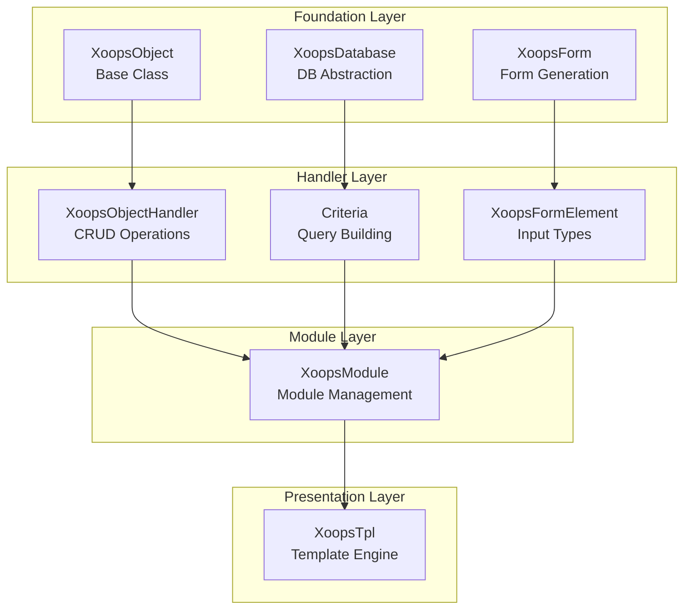
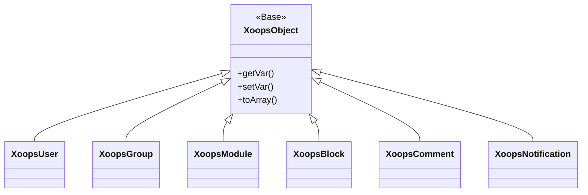
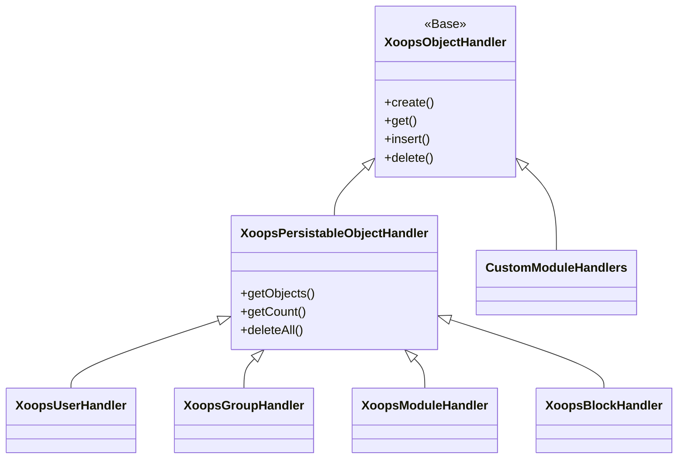
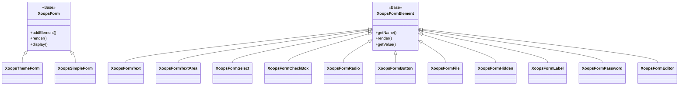

Добро пожаловать в полную справочную документацию API XOOPS. В этом разделе представлена подробная документация по всем основным классам, методам и системам, которые составляют контент-менеджер XOOPS.

## Обзор

API XOOPS организован на несколько основных подсистем, каждая из которых отвечает за определенный аспект функциональности CMS. Понимание этих API необходимо для разработки модулей, тем и расширений для XOOPS.

## Разделы API

### Основные классы

Базовые классы, на которых строятся все остальные компоненты XOOPS.

| Документация | Описание |
|--------------|---------|
| XoopsObject | Базовый класс для всех объектов данных в XOOPS |
| XoopsObjectHandler | Паттерн обработчика для операций CRUD |

### Уровень базы данных

Утилиты абстракции базы данных и построения запросов.

| Документация | Описание |
|--------------|---------|
| XoopsDatabase | Уровень абстракции базы данных |
| Система Criteria | Критерии запроса и условия |
| QueryBuilder | Современное построение запросов с fluent API |

### Система форм

Создание HTML-форм и валидация.

| Документация | Описание |
|--------------|---------|
| XoopsForm | Контейнер форм и отрисовка |
| Элементы форм | Все доступные типы элементов форм |

### Классы ядра

Основные компоненты системы и сервисы.

| Документация | Описание |
|--------------|---------|
| Классы ядра | Системное ядро и основные компоненты |

### Система модулей

Управление модулями и жизненный цикл.

| Документация | Описание |
|--------------|---------|
| Система модулей | Загрузка, установка и управление модулями |

### Система шаблонов

Интеграция шаблонов Smarty.

| Документация | Описание |
|--------------|---------|
| Система шаблонов | Интеграция Smarty и управление шаблонами |

### Система пользователей

Управление пользователями и аутентификация.

| Документация | Описание |
|--------------|---------|
| Система пользователей | Аккаунты пользователей, группы и разрешения |

## Обзор архитектуры



## Иерархия классов

### Модель объекта



### Модель обработчика



### Модель формы



## Паттерны проектирования

API XOOPS реализует несколько хорошо известных паттернов проектирования:

### Паттерн Singleton
Используется для глобальных сервисов, таких как соединения с базой данных и экземпляры контейнера.

```php
$db = XoopsDatabase::getInstance();
$container = XoopsContainer::getInstance();
```

### Паттерн Factory
Обработчики объектов создают объекты домена последовательно.

```php
$handler = xoops_getHandler('user');
$user = $handler->create();
```

### Паттерн Composite
Формы содержат несколько элементов форм; критерии могут содержать вложенные критерии.

```php
$criteria = new CriteriaCompo();
$criteria->add(new Criteria('status', 1));
$criteria->add(new CriteriaCompo(...)); // Вложенные критерии
```

### Паттерн Observer
Система событий позволяет слабую связанность между модулями.

```php
$dispatcher->addListener('module.news.article_published', $callback);
```

## Примеры быстрого старта

### Создание и сохранение объекта

```php
// Получить обработчик
$handler = xoops_getHandler('user');

// Создать новый объект
$user = $handler->create();
$user->setVar('uname', 'newuser');
$user->setVar('email', 'user@example.com');

// Сохранить в базу данных
$handler->insert($user);
```

### Запросы с использованием Criteria

```php
// Построить критерии
$criteria = new CriteriaCompo();
$criteria->add(new Criteria('level', 0, '>'));
$criteria->setSort('uname');
$criteria->setOrder('ASC');
$criteria->setLimit(10);

// Получить объекты
$handler = xoops_getHandler('user');
$users = $handler->getObjects($criteria);
```

### Создание формы

```php
$form = new XoopsThemeForm('User Profile', 'userform', 'save.php', 'post', true);
$form->addElement(new XoopsFormText('Username', 'uname', 50, 255, $user->getVar('uname')));
$form->addElement(new XoopsFormTextArea('Bio', 'bio', $user->getVar('bio')));
$form->addElement(new XoopsFormButton('', 'submit', _SUBMIT, 'submit'));
echo $form->render();
```

## Соглашения API

### Соглашения об именовании

| Тип | Соглашение | Пример |
|-----|-----------|--------|
| Классы | PascalCase | `XoopsUser`, `CriteriaCompo` |
| Методы | camelCase | `getVar()`, `setVar()` |
| Свойства | camelCase (защищено) | `$_vars`, `$_handler` |
| Константы | UPPER_SNAKE_CASE | `XOBJ_DTYPE_INT` |
| Таблицы БД | snake_case | `users`, `groups_users_link` |

### Типы данных

XOOPS определяет стандартные типы данных для переменных объектов:

| Константа | Тип | Описание |
|-----------|-----|---------|
| `XOBJ_DTYPE_TXTBOX` | String | Текстовый ввод (санированный) |
| `XOBJ_DTYPE_TXTAREA` | String | Содержимое области текста |
| `XOBJ_DTYPE_INT` | Integer | Числовые значения |
| `XOBJ_DTYPE_URL` | String | Валидация URL |
| `XOBJ_DTYPE_EMAIL` | String | Валидация электронной почты |
| `XOBJ_DTYPE_ARRAY` | Array | Сериализованные массивы |
| `XOBJ_DTYPE_OTHER` | Mixed | Пользовательская обработка |
| `XOBJ_DTYPE_SOURCE` | String | Исходный код (минимальная санитизация) |
| `XOBJ_DTYPE_STIME` | Integer | Короткая временная метка |
| `XOBJ_DTYPE_MTIME` | Integer | Средняя временная метка |
| `XOBJ_DTYPE_LTIME` | Integer | Длинная временная метка |

## Методы аутентификации

API поддерживает несколько методов аутентификации:

### Аутентификация по API-ключу
```
X-API-Key: your-api-key
```

### OAuth Bearer Token
```
Authorization: Bearer your-oauth-token
```

### Аутентификация на основе сессии
Использует существующую сессию XOOPS при входе в систему.

## Конечные точки REST API

Когда REST API включен:

| Конечная точка | Метод | Описание |
|----------------|-------|---------|
| `/api.php/rest/users` | GET | Список пользователей |
| `/api.php/rest/users/{id}` | GET | Получить пользователя по ID |
| `/api.php/rest/users` | POST | Создать пользователя |
| `/api.php/rest/users/{id}` | PUT | Обновить пользователя |
| `/api.php/rest/users/{id}` | DELETE | Удалить пользователя |
| `/api.php/rest/modules` | GET | Список модулей |

## Связанная документация

- Руководство по разработке модулей
- Руководство по разработке тем
- Конфигурация системы
- Лучшие практики безопасности

## История версий

| Версия | Изменения |
|--------|-----------|
| 2.5.11 | Текущий стабильный выпуск |
| 2.5.10 | Добавлена поддержка GraphQL API |
| 2.5.9 | Улучшена система Criteria |
| 2.5.8 | Поддержка автозагрузки PSR-4 |

---

*Эта документация является частью базы знаний XOOPS. Для последних обновлений посетите [репозиторий XOOPS на GitHub](https://github.com/XOOPS).*
