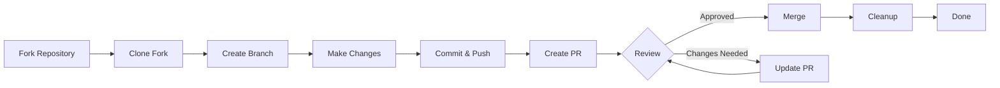

> Это руководство проводит вас через полный процесс внесения вклада в XOOPS, от начальной настройки до объединенного pull request.

---

## Предварительные требования

Перед началом внесения вклада убедитесь, что у вас есть:

- **Git** установлен и настроен
- **GitHub аккаунт** (бесплатно)
- **PHP 7.4+** для разработки XOOPS
- **Composer** для управления зависимостями
- Базовое знание рабочих процессов Git
- Знакомство с Кодексом поведения

---

## Шаг 1: Заложить репозиторий

### На веб-интерфейсе GitHub

1. Перейдите в репозиторий (например, `XOOPS/XoopsCore27`)
2. Нажмите кнопку **Fork** в верхнем правом углу
3. Выберите, куда заложить (ваш личный аккаунт)
4. Дождитесь завершения форка

### Почему заложить?

- Вы получаете собственную копию для работы
- Разработчикам не нужно управлять многими ветками
- Вы имеете полный контроль своего форка
- Pull Requests ссылаются на ваш форк и апстрим репо

---

## Шаг 2: Клонировать ваш форк локально

```bash
# Клонировать ваш форк (замените YOUR_USERNAME)
git clone https://github.com/YOUR_USERNAME/XoopsCore27.git
cd XoopsCore27

# Добавить апстрим удаленный для отслеживания оригинального репозитория
git remote add upstream https://github.com/XOOPS/XoopsCore27.git

# Проверить, что удаленные правильно установлены
git remote -v
# origin    https://github.com/YOUR_USERNAME/XoopsCore27.git (fetch)
# origin    https://github.com/YOUR_USERNAME/XoopsCore27.git (push)
# upstream  https://github.com/XOOPS/XoopsCore27.git (fetch)
# upstream  https://github.com/XOOPS/XoopsCore27.git (nofetch)
```

---

## Шаг 3: Установить окружение разработки

### Установить зависимости

```bash
# Установить зависимости Composer
composer install

# Установить зависимости разработки
composer install --dev

# Для разработки модуля
cd modules/mymodule
composer install
```

### Настроить Git

```bash
# Установить вашу идентичность Git
git config user.name "Your Name"
git config user.email "your.email@example.com"

# Опционально: установить глобальную конфигурацию Git
git config --global user.name "Your Name"
git config --global user.email "your.email@example.com"
```

### Запустить тесты

```bash
# Убедиться, что тесты проходят в чистом состоянии
./vendor/bin/phpunit

# Запустить конкретный набор тестов
./vendor/bin/phpunit --testsuite unit
```

---

## Шаг 4: Создать ветку функции

### Соглашение об именовании ветвей

Следуйте этому шаблону: `<type>/<description>`

**Типы:**
- `feature/` - Новая функция
- `fix/` - Исправление ошибки
- `docs/` - Только документация
- `refactor/` - Рефакторинг кода
- `test/` - Добавление тестов
- `chore/` - Обслуживание, инструменты

**Примеры:**
```bash
# Ветка функции
git checkout -b feature/add-two-factor-auth

# Ветка исправления ошибки
git checkout -b fix/prevent-xss-in-forms

# Ветка документации
git checkout -b docs/update-api-guide

# Всегда разветвляйте от upstream/main (или develop)
git checkout -b feature/my-feature upstream/main
```

### Держите ветку обновленной

```bash
# Перед началом работы синхронизируйте с апстримом
git fetch upstream
git merge upstream/main

# Позже, если апстрим изменился
git fetch upstream
git rebase upstream/main
```

---

## Шаг 5: Сделать ваши изменения

### Практики разработки

1. **Напишите код** следуя стандартам PHP
2. **Напишите тесты** для новой функциональности
3. **Обновите документацию** при необходимости
4. **Запустите линтеры** и форматеры кода

### Проверки качества кода

```bash
# Запустить все тесты
./vendor/bin/phpunit

# Запустить с покрытием
./vendor/bin/phpunit --coverage-html coverage/

# Запустить PHP CS Fixer
./vendor/bin/php-cs-fixer fix --dry-run

# Запустить PHPStan статический анализ
./vendor/bin/phpstan analyse class/ src/
```

### Совершить хорошие изменения

```bash
# Проверить что вы изменили
git status
git diff

# Подготовить конкретные файлы
git add class/MyClass.php
git add tests/MyClassTest.php

# Или подготовить все изменения
git add .

# Совершить с описательным сообщением
git commit -m "feat(auth): add two-factor authentication support"
```

---

## Шаг 6: Держать ветку синхронизированной

Во время работы над функцией главная ветка может измениться:

```bash
# Получить последние изменения из апстрима
git fetch upstream

# Опция A: Переложить (предпочтительно для чистой истории)
git rebase upstream/main

# Опция B: Объединить (проще но добавляет коммиты слияния)
git merge upstream/main

# Если конфликты возникают, разрешить их затем:
git add .
git rebase --continue  # или git merge --continue
```

---

## Шаг 7: Отправить в свой форк

```bash
# Отправить вашу ветку в ваш форк
git push origin feature/my-feature

# На последующих отправках
git push

# Если вы переложили, вам может понадобиться force push (используйте осторожно!)
git push --force-with-lease origin feature/my-feature
```

---

## Шаг 8: Создать pull request

### На веб-интерфейсе GitHub

1. Перейдите в свой форк на GitHub
2. Вы увидите уведомление о создании PR из вашей ветки
3. Нажмите **"Compare & pull request"**
4. Или вручную нажмите **"New pull request"** и выберите вашу ветку

### Название и описание PR

**Формат названия:**
```
<type>(<scope>): <subject>
```

Примеры:
```
feat(auth): add two-factor authentication
fix(forms): prevent XSS in text input
docs: update installation guide
refactor(core): improve performance
```

**Шаблон описания:**

```markdown
## Описание
Краткое объяснение того, что делает этот PR.

## Изменения
- Изменено X с A на B
- Добавлена функция Y
- Исправлена ошибка Z

## Тип изменения
- [ ] Новая функция (добавляет новую функциональность)
- [ ] Исправление ошибки (исправляет проблему)
- [ ] Нарушающее изменение (изменение API/поведения)
- [ ] Обновление документации

## Тестирование
- [ ] Добавлены тесты для новой функциональности
- [ ] Все существующие тесты проходят
- [ ] Проведено ручное тестирование

## Скриншоты (если применимо)
Включите скриншоты before/after для изменений UI.

## Связанные проблемы
Closes #123
Related to #456

## Контрольный список
- [ ] Код следует рекомендациям стиля
- [ ] Проведена самопроверка собственного кода
- [ ] Добавлены комментарии к сложному коду
- [ ] Обновлена документация
- [ ] Нет новых предупреждений
- [ ] Тесты проходят локально
```

### Контрольный список проверки PR

Перед отправкой убедитесь:

- [ ] Код следует стандартам PHP
- [ ] Тесты включены и проходят
- [ ] Документация обновлена (при необходимости)
- [ ] Нет конфликтов слияния
- [ ] Сообщения коммитов четкие
- [ ] Связанные проблемы упоминаются
- [ ] Описание PR детально
- [ ] Нет отладочного кода или консольных логов

---

## Шаг 9: Ответить на обратную связь

### Во время рассмотрения кода

1. **Внимательно прочитайте комментарии** - Поймите обратную связь
2. **Задайте вопросы** - Если неясно, запросите уточнение
3. **Обсудите альтернативы** - Уважительно обсудите подходы
4. **Сделайте запрошенные изменения** - Обновите вашу ветку
5. **Force-push обновленные коммиты** - Если переписываете историю

```bash
# Сделайте изменения
git add .
git commit --amend  # Изменить последний коммит
git push --force-with-lease origin feature/my-feature

# Или добавьте новые коммиты
git commit -m "Address feedback on PR review"
git push origin feature/my-feature
```

### Ожидайте итерации

- Большинству PR требуется несколько раундов обзора
- Будьте терпеливы и конструктивны
- Рассматривайте обратную связь как возможность учиться
- Разработчики могут предложить рефакторинг

---

## Шаг 10: Слияние и очистка

### После одобрения

Когда разработчики одобрят и объединят:

1. **GitHub автоматически объединяет** или разработчик нажимает слияние
2. **Ваша ветка удаляется** (обычно автоматически)
3. **Изменения находятся в апстриме**

### Локальная очистка

```bash
# Переключиться на главную ветку
git checkout main

# Обновить главную с объединенными изменениями
git fetch upstream
git merge upstream/main

# Удалить локальную ветку функции
git branch -d feature/my-feature

# Удалить из вашего форка (если не автоудалено)
git push origin --delete feature/my-feature
```

---

## Диаграмма рабочего процесса



---

## Обычные сценарии

### Синхронизация перед началом

```bash
# Всегда начинайте свежим
git fetch upstream
git checkout -b feature/new-thing upstream/main
```

### Добавление дополнительных коммитов

```bash
# Просто отправьте снова
git add .
git commit -m "feat: additional changes"
git push origin feature/new-thing
```

### Исправление ошибок

```bash
# Последний коммит имеет неправильное сообщение
git commit --amend -m "Correct message"
git push --force-with-lease

# Вернуться в предыдущее состояние (осторожно!)
git reset --soft HEAD~1  # Сохранить изменения
git reset --hard HEAD~1  # Отбросить изменения
```

### Обработка конфликтов слияния

```bash
# Переложить и разрешить конфликты
git fetch upstream
git rebase upstream/main

# Отредактировать конфликтные файлы для разрешения
# Затем продолжить
git add .
git rebase --continue
git push --force-with-lease
```

---

## Лучшие практики

### Делайте

- Держите ветки сосредоточенными на единственных проблемах
- Делайте маленькие логические коммиты
- Пишите описательные сообщения коммитов
- Часто обновляйте вашу ветку
- Тестируйте перед отправкой
- Документируйте изменения
- Быстро отвечайте на обратную связь

### Не делайте

- Работайте прямо на ветке main/master
- Объединяйте несвязанные изменения в одном PR
- Совершайте сгенерированные файлы или node_modules
- Force push после того, как PR публичный (используйте --force-with-lease)
- Игнорируйте отзывы кода
- Создавайте огромные PR (разбейте на меньшие)
- Совершайте чувствительные данные (API ключи, пароли)

---

## Советы для успеха

### Общайтесь

- Спросите вопросы в проблемах перед началом работы
- Запросите руководство по сложным изменениям
- Обсудите подход в описании PR
- Быстро отвечайте на обратную связь

### Следуйте стандартам

- Просмотрите стандарты PHP
- Проверьте рекомендации отчётов об ошибках
- Прочитайте обзор взносов
- Следуйте рекомендациям pull request

### Выучите кодовую базу

- Прочитайте существующий код паттернов
- Изучайте похожие реализации
- Поймите архитектуру
- Проверьте основные концепции

---

## Связанная документация

- Кодекс поведения
- Рекомендации по pull request
- Отчёты об ошибках
- Стандарты кодирования PHP
- Обзор взносов

---

#xoops #git #github #contributing #workflow #pull-request
