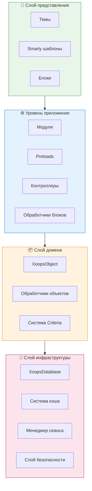
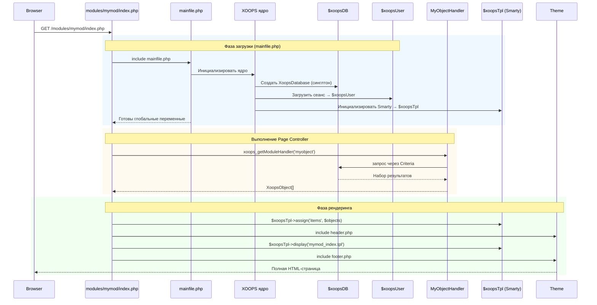

:::note[Об этом документе]
Эта страница описывает **концептуальную архитектуру** XOOPS, которая применима как к текущей (2.5.x), так и будущей (4.0.x) версии. Некоторые диаграммы показывают видение многоуровневого дизайна.

**Для подробностей, зависящих от версии:**
- **XOOPS 2.5.x Сегодня:** использует `mainfile.php`, глобальные переменные (`$xoopsDB`, `$xoopsUser`), preloads и паттерн обработчика
- **XOOPS 4.0 Цель:** PSR-15 middleware, DI контейнер, маршрутизатор - см. [Roadmap](../../07-XOOPS-4.0/XOOPS-4.0-Roadmap.md)
:::

Этот документ обеспечивает всестороннее описание архитектуры системы XOOPS, объясняя, как различные компоненты работают вместе для создания гибкой и расширяемой системы управления содержимым.

## Обзор

XOOPS следует модульной архитектуре, которая разделяет ответственность на отдельные уровни. Система построена вокруг нескольких основных принципов:

- **Модульность**: функциональность организована в независимые, устанавливаемые модули
- **Расширяемость**: система может быть расширена без изменения ядра
- **Абстракция**: слои базы данных и представления изолированы от бизнес-логики
- **Безопасность**: встроенные механизмы безопасности защищают от распространённых уязвимостей

## Слои системы



### 1. Слой представления

Слой представления обрабатывает рендеринг пользовательского интерфейса с использованием механизма шаблонизации Smarty.

**Ключевые компоненты:**
- **Темы**: визуальное оформление и расположение
- **Smarty шаблоны**: динамический рендеринг содержимого
- **Блоки**: переиспользуемые виджеты содержимого

### 2. Уровень приложения

Уровень приложения содержит бизнес-логику, контроллеры и функциональность модулей.

**Ключевые компоненты:**
- **Модули**: независимые пакеты функциональности
- **Обработчики**: классы манипуляции данными
- **Preloads**: слушатели событий и hooks

### 3. Слой домена

Слой домена содержит основные бизнес-объекты и правила.

**Ключевые компоненты:**
- **XoopsObject**: базовый класс для всех объектов домена
- **Обработчики**: операции CRUD для объектов домена

### 4. Слой инфраструктуры

Слой инфраструктуры предоставляет основные сервисы, такие как доступ к базе данных и кэширование.

## Жизненный цикл запроса

Понимание жизненного цикла запроса критически важно для эффективной разработки XOOPS.

### Поток Page Controller в XOOPS 2.5.x

Текущий XOOPS 2.5.x использует паттерн **Page Controller**, где каждый PHP файл обрабатывает свой собственный запрос. Глобальные переменные (`$xoopsDB`, `$xoopsUser`, `$xoopsTpl` и т.д.) инициализируются при загрузке и доступны на всём протяжении выполнения.



### Ключевые глобальные переменные в 2.5.x

| Глобальная | Тип | Инициализирована | Назначение |
|-----------|-----|-----------------|----------|
| `$xoopsDB` | `XoopsDatabase` | Загрузка | Подключение к БД (синглтон) |
| `$xoopsUser` | `XoopsUser\|null` | Загрузка сеанса | Текущий авторизованный пользователь |
| `$xoopsTpl` | `XoopsTpl` | Инициализация шаблонов | Механизм шаблонизации Smarty |
| `$xoopsModule` | `XoopsModule` | Загрузка модуля | Контекст текущего модуля |
| `$xoopsConfig` | `array` | Загрузка конфигурации | Конфигурация системы |

:::note[Сравнение с XOOPS 4.0]
В XOOPS 4.0 паттерн Page Controller заменяется на **Pipeline PSR-15 Middleware** и диспетчеризацию, основанную на маршрутизаторе. Глобальные переменные заменяются на впрыскивание зависимостей. См. [Hybrid Mode Contract](../../07-XOOPS-4.0/Specifications/Hybrid-Mode-Contract.md) для гарантий совместимости при миграции.
:::

### 1. Фаза загрузки

```php
// mainfile.php является точкой входа
include_once XOOPS_ROOT_PATH . '/mainfile.php';

// Инициализация ядра
$xoops = Xoops::getInstance();
$xoops->boot();
```

**Шаги:**
1. Загрузить конфигурацию (`mainfile.php`)
2. Инициализировать автозагрузчик
3. Установить обработку ошибок
4. Установить подключение к БД
5. Загрузить сеанс пользователя
6. Инициализировать механизм шаблонов Smarty

### 2. Фаза маршрутизации

```php
// Маршрутизация запроса к соответствующему модулю
$module = $GLOBALS['xoopsModule'];
$controller = $module->getController();
$controller->dispatch($request);
```

**Шаги:**
1. Разобрать URL запроса
2. Идентифицировать целевой модуль
3. Загрузить конфигурацию модуля
4. Проверить разрешения
5. Маршрутизировать к соответствующему обработчику

### 3. Фаза выполнения

```php
// Выполнение контроллера
$data = $handler->getObjects($criteria);
$xoopsTpl->assign('items', $data);
```

**Шаги:**
1. Выполнить логику контроллера
2. Взаимодействовать со слоем данных
3. Обработать бизнес-правила
4. Подготовить данные представления

### 4. Фаза рендеринга

```php
// Рендеринг шаблона
include XOOPS_ROOT_PATH . '/header.php';
$xoopsTpl->display('db:module_template.tpl');
include XOOPS_ROOT_PATH . '/footer.php';
```

**Шаги:**
1. Применить макет темы
2. Отрендерить шаблон модуля
3. Обработать блоки
4. Выдать ответ

## Основные компоненты

### XoopsObject

Базовый класс для всех объектов данных в XOOPS.

```php
<?php
class MyModuleItem extends XoopsObject
{
    public function __construct()
    {
        $this->initVar('id', XOBJ_DTYPE_INT, null, false);
        $this->initVar('title', XOBJ_DTYPE_TXTBOX, '', true, 255);
        $this->initVar('content', XOBJ_DTYPE_TXTAREA, '', false);
        $this->initVar('created', XOBJ_DTYPE_INT, time(), false);
    }
}
```

**Ключевые методы:**
- `initVar()` - Определить свойства объекта
- `getVar()` - Получить значения свойств
- `setVar()` - Установить значения свойств
- `assignVars()` - Массовое присваивание из массива

### XoopsPersistableObjectHandler

Обрабатывает операции CRUD для экземпляров XoopsObject.

```php
<?php
class MyModuleItemHandler extends XoopsPersistableObjectHandler
{
    public function __construct(\XoopsDatabase $db)
    {
        parent::__construct($db, 'mymodule_items', 'MyModuleItem', 'id', 'title');
    }

    public function getActiveItems($limit = 10)
    {
        $criteria = new CriteriaCompo();
        $criteria->add(new Criteria('status', 1));
        $criteria->setSort('created');
        $criteria->setOrder('DESC');
        $criteria->setLimit($limit);

        return $this->getObjects($criteria);
    }
}
```

**Ключевые методы:**
- `create()` - Создать новый экземпляр объекта
- `get()` - Получить объект по ID
- `insert()` - Сохранить объект в БД
- `delete()` - Удалить объект из БД
- `getObjects()` - Получить несколько объектов
- `getCount()` - Подсчитать соответствующие объекты

### Структура модуля

Каждый модуль XOOPS следует стандартной структуре директорий:

```
modules/mymodule/
├── class/                  # PHP классы
│   ├── MyModuleItem.php
│   └── MyModuleItemHandler.php
├── include/                # Include файлы
│   ├── common.php
│   └── functions.php
├── templates/              # Smarty шаблоны
│   ├── mymodule_index.tpl
│   └── mymodule_item.tpl
├── admin/                  # Администраторская область
│   ├── index.php
│   └── menu.php
├── language/               # Переводы
│   └── english/
│       ├── main.php
│       └── modinfo.php
├── sql/                    # Схема БД
│   └── mysql.sql
├── xoops_version.php       # Информация о модуле
├── index.php               # Входная точка модуля
└── header.php              # Заголовок модуля
```

## Контейнер впрыскивания зависимостей

Современная разработка XOOPS может использовать впрыскивание зависимостей для лучшей тестируемости.

### Базовая реализация контейнера

```php
<?php
class XoopsDependencyContainer
{
    private array $services = [];

    public function register(string $name, callable $factory): void
    {
        $this->services[$name] = $factory;
    }

    public function resolve(string $name): mixed
    {
        if (!isset($this->services[$name])) {
            throw new \InvalidArgumentException("Service not found: $name");
        }

        $factory = $this->services[$name];

        if (is_callable($factory)) {
            return $factory($this);
        }

        return $factory;
    }

    public function has(string $name): bool
    {
        return isset($this->services[$name]);
    }
}
```

### Контейнер, совместимый с PSR-11

```php
<?php
namespace Xmf\Di;

use Psr\Container\ContainerInterface;

class BasicContainer implements ContainerInterface
{
    protected array $definitions = [];

    public function set(string $id, mixed $value): void
    {
        $this->definitions[$id] = $value;
    }

    public function get(string $id): mixed
    {
        if (!$this->has($id)) {
            throw new \InvalidArgumentException("Service not found: $id");
        }

        $entry = $this->definitions[$id];

        if (is_callable($entry)) {
            return $entry($this);
        }

        return $entry;
    }

    public function has(string $id): bool
    {
        return isset($this->definitions[$id]);
    }
}
```

### Пример использования

```php
<?php
// Регистрация сервиса
$container = new XoopsDependencyContainer();

$container->register('database', function () {
    return XoopsDatabaseFactory::getDatabaseConnection();
});

$container->register('userHandler', function ($c) {
    return new XoopsUserHandler($c->resolve('database'));
});

// Разрешение сервиса
$userHandler = $container->resolve('userHandler');
$user = $userHandler->get($userId);
```

## Точки расширения

XOOPS обеспечивает несколько механизмов расширения:

### 1. Preloads

Preloads позволяют модулям подключаться к основным событиям.

```php
<?php
// modules/mymodule/preloads/core.php
class MymoduleCorePreload extends XoopsPreloadItem
{
    public static function eventCoreHeaderEnd($args)
    {
        // Выполнить, когда заканчивается обработка заголовка
    }

    public static function eventCoreFooterStart($args)
    {
        // Выполнить, когда начинается обработка подвала
    }
}
```

### 2. Плагины

Плагины расширяют конкретную функциональность в модулях.

```php
<?php
// modules/mymodule/plugins/notify.php
class MymoduleNotifyPlugin
{
    public function onItemCreate($item)
    {
        // Отправить уведомление при создании элемента
    }
}
```

### 3. Фильтры

Фильтры изменяют данные по мере их прохождения через систему.

```php
<?php
// Пример фильтра содержимого
$myts = MyTextSanitizer::getInstance();
$content = $myts->displayTarea($rawContent, 1, 1, 1);
```

## Лучшие практики

### Организация кода

1. **Используйте namespaces** для нового кода:
   ```php
   namespace XoopsModules\MyModule;

   class Item extends \XoopsObject
   {
       // Реализация
   }
   ```

2. **Следуйте PSR-4 автозагрузке**:
   ```json
   {
       "autoload": {
           "psr-4": {
               "XoopsModules\MyModule\": "class/"
           }
       }
   }
   ```

3. **Разделяйте ответственность**:
   - Логика домена в `class/`
   - Представление в `templates/`
   - Контроллеры в корне модуля

### Производительность

1. **Используйте кэширование** для дорогостоящих операций
2. **Ленивая загрузка** ресурсов, когда это возможно
3. **Минимизируйте запросы к БД** с помощью пакетизации criteria
4. **Оптимизируйте шаблоны**, избегая сложной логики

### Безопасность

1. **Проверяйте весь ввод** с помощью `Xmf\Request`
2. **Экранируйте вывод** в шаблонах
3. **Используйте подготовленные операторы** для запросов к БД
4. **Проверяйте разрешения** перед конфиденциальными операциями

## Связанная документация

- [Паттерны проектирования](Design-Patterns.md) - Паттерны, используемые в XOOPS
- [Слой базы данных](../Database/Database-Layer.md) - Подробности абстракции БД
- [Основы Smarty](../Templates/Smarty-Basics.md) - Документация системы шаблонов
- [Лучшие практики безопасности](../Security/Security-Best-Practices.md) - Рекомендации по безопасности

---

#xoops #architecture #core #design #system-design
