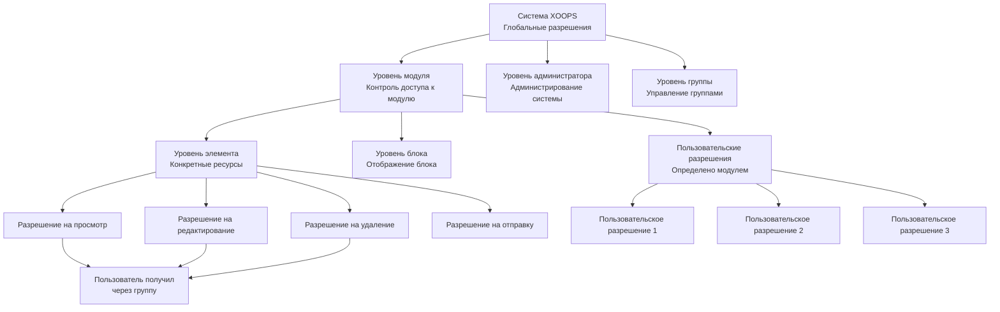
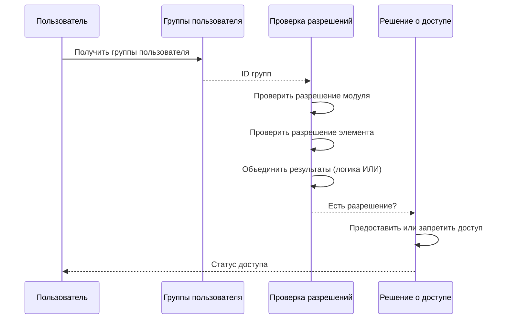

# Система разрешений в XOOPS

Система разрешений XOOPS представляет собой детализированную структуру контроля доступа, которая управляет, кто может выполнять какие действия над какими ресурсами. Этот документ охватывает типы разрешений, механизмы проверки, иерархию и примеры реализации.

## Типы разрешений

### Разрешения на уровне модуля

Разрешения на уровне модуля контролируют доступ к целым модулям или функциям модуля.

**Распространённые названия разрешений:**
- `module_view` - Просмотр содержимого модуля
- `module_read` - Чтение ресурсов модуля
- `module_submit` - Отправка содержимого в модуль
- `module_edit` - Редактирование содержимого модуля
- `module_admin` - Администрирование модуля

```php
<?php
/**
 * Пример разрешения модуля
 */

$permissionHandler = xoops_getHandler('groupperm');
$userGroups = $xoopsUser->getGroups();
$moduleId = 2; // Модуль статей

// Проверить, может ли пользователь просматривать модуль
$canView = false;
foreach ($userGroups as $groupId) {
    if ($permissionHandler->checkRight('module_view', $groupId, $moduleId)) {
        $canView = true;
        break;
    }
}

if (!$canView) {
    redirect('index.php?error=no_access');
}
```

### Разрешения на уровне элемента

Разрешения на уровне элемента контролируют доступ к конкретным ресурсам в модуле.

**Примеры:**
- ID статьи: может ли группа просматривать/редактировать конкретную статью?
- ID категории: может ли группа получить доступ к категории?
- ID страницы: может ли группа просматривать/изменять конкретную страницу?

```php
<?php
/**
 * Пример разрешения элемента
 */

$permissionHandler = xoops_getHandler('groupperm');
$userGroups = $xoopsUser->getGroups();
$moduleId = 2;      // Модуль статей
$articleId = 42;    // Конкретная статья

// Проверить, может ли пользователь редактировать конкретную статью
$canEdit = false;
foreach ($userGroups as $groupId) {
    if ($permissionHandler->checkRight(
        'item_edit',
        $groupId,
        $moduleId,
        $articleId
    )) {
        $canEdit = true;
        break;
    }
}
```

### Разрешения блоков

Разрешения блоков контролируют видимость и взаимодействие с блоками, отображаемыми на страницах.

```php
<?php
/**
 * Пример разрешения блока
 */

$permissionHandler = xoops_getHandler('groupperm');
$userGroups = $xoopsUser->getGroups();

// Проверить, может ли пользователь просматривать блок
$blockId = 5;
$canViewBlock = false;

foreach ($userGroups as $groupId) {
    if ($permissionHandler->checkRight('block_view', $groupId, 1, $blockId)) {
        $canViewBlock = true;
        break;
    }
}
```

### Разрешения группы

Разрешения, контролирующие управление и администрирование групп.

```php
<?php
/**
 * Пример разрешения управления группой
 */

$permissionHandler = xoops_getHandler('groupperm');
$userGroups = $xoopsUser->getGroups();

// Проверить, может ли пользователь управлять группами
$canManageGroups = false;
foreach ($userGroups as $groupId) {
    if ($permissionHandler->checkRight('group_admin', $groupId, 1)) {
        $canManageGroups = true;
        break;
    }
}
```

## Иерархия разрешений

### Структура разрешений



### Цепь наследования разрешений



## Проверка разрешений

### XoopsGroupPermHandler

Класс `XoopsGroupPermHandler` предоставляет методы для проверки и управления разрешениями.

```php
<?php
/**
 * Методы XoopsGroupPermHandler
 */

class XoopsGroupPermHandler
{
    /**
     * Проверить, имеет ли группа разрешение
     *
     * @param string $gperm_name Имя разрешения
     * @param int $gperm_group_id ID группы
     * @param int $gperm_modid ID модуля
     * @param int $gperm_itemid ID элемента (опционально)
     * @return bool Статус разрешения
     */
    public function checkRight(
        $gperm_name,
        $gperm_group_id,
        $gperm_modid,
        $gperm_itemid = 0
    ) { }

    /**
     * Добавить разрешение группе
     *
     * @param string $gperm_name Имя разрешения
     * @param int $gperm_group_id ID группы
     * @param int $gperm_modid ID модуля
     * @param int $gperm_itemid ID элемента (опционально)
     * @return bool Статус успеха
     */
    public function addRight(
        $gperm_name,
        $gperm_group_id,
        $gperm_modid,
        $gperm_itemid = 0
    ) { }

    /**
     * Удалить разрешение из группы
     *
     * @param string $gperm_name Имя разрешения
     * @param int $gperm_group_id ID группы
     * @param int $gperm_modid ID модуля
     * @param int $gperm_itemid ID элемента (опционально)
     * @return bool Статус успеха
     */
    public function deleteRight(
        $gperm_name,
        $gperm_group_id,
        $gperm_modid,
        $gperm_itemid = 0
    ) { }

    /**
     * Получить все разрешения группы в модуле
     *
     * @param int $groupId ID группы
     * @param int $modId ID модуля
     * @return array Список разрешений
     */
    public function getGroupPermissions($groupId, $modId) { }

    /**
     * Получить разрешённые ID элементов для группы
     *
     * @param string $permName Имя разрешения
     * @param int $groupId ID группы
     * @param int $modId ID модуля
     * @return array ID элементов
     */
    public function getPermittedItemIds(
        $permName,
        $groupId,
        $modId
    ) { }
}
```

## Реализация проверки разрешений

### Проверка разрешения одного пользователя

```php
<?php
/**
 * Утилита проверки разрешений
 */
class PermissionChecker
{
    private $permissionHandler;
    private $user;

    public function __construct(XoopsUser $user = null)
    {
        $this->permissionHandler = xoops_getHandler('groupperm');
        $this->user = $user ?? $GLOBALS['xoopsUser'] ?? null;
    }

    /**
     * Проверить, имеет ли пользователь разрешение
     *
     * @param string $permissionName Имя разрешения
     * @param int $moduleId ID модуля
     * @param int $itemId ID элемента (опционально)
     * @return bool Статус разрешения
     */
    public function hasPermission(
        string $permissionName,
        int $moduleId,
        int $itemId = 0
    ): bool
    {
        if (!$this->user instanceof XoopsUser) {
            return false;
        }

        $userGroups = $this->user->getGroups();

        foreach ($userGroups as $groupId) {
            if ($this->permissionHandler->checkRight(
                $permissionName,
                $groupId,
                $moduleId,
                $itemId
            )) {
                return true;
            }
        }

        return false;
    }

    /**
     * Требовать разрешение или запретить доступ
     *
     * @param string $permissionName Имя разрешения
     * @param int $moduleId ID модуля
     * @param int $itemId ID элемента (опционально)
     * @throws Exception Если разрешение запрещено
     */
    public function requirePermission(
        string $permissionName,
        int $moduleId,
        int $itemId = 0
    ): void
    {
        if (!$this->hasPermission($permissionName, $moduleId, $itemId)) {
            throw new Exception('Permission denied');
        }
    }

    /**
     * Получить разрешённые ID элементов
     *
     * @param string $permissionName Имя разрешения
     * @param int $moduleId ID модуля
     * @return array ID элементов, к которым может получить доступ пользователь
     */
    public function getPermittedItems(
        string $permissionName,
        int $moduleId
    ): array
    {
        if (!$this->user instanceof XoopsUser) {
            return [];
        }

        $permitted = [];
        $userGroups = $this->user->getGroups();

        foreach ($userGroups as $groupId) {
            $items = $this->permissionHandler->getPermittedItemIds(
                $permissionName,
                $groupId,
                $moduleId
            );
            $permitted = array_merge($permitted, $items);
        }

        return array_unique($permitted);
    }

    /**
     * Проверить несколько разрешений (логика И)
     *
     * @param array $permissions Имена разрешений
     * @param int $moduleId ID модуля
     * @param int $itemId ID элемента (опционально)
     * @return bool Все разрешения предоставлены
     */
    public function hasAllPermissions(
        array $permissions,
        int $moduleId,
        int $itemId = 0
    ): bool
    {
        foreach ($permissions as $perm) {
            if (!$this->hasPermission($perm, $moduleId, $itemId)) {
                return false;
            }
        }
        return true;
    }

    /**
     * Проверить несколько разрешений (логика ИЛИ)
     *
     * @param array $permissions Имена разрешений
     * @param int $moduleId ID модуля
     * @param int $itemId ID элемента (опционально)
     * @return bool Любое разрешение предоставлено
     */
    public function hasAnyPermission(
        array $permissions,
        int $moduleId,
        int $itemId = 0
    ): bool
    {
        foreach ($permissions as $perm) {
            if ($this->hasPermission($perm, $moduleId, $itemId)) {
                return true;
            }
        }
        return false;
    }
}
```

### Middleware разрешений

```php
<?php
/**
 * Middleware разрешений для фильтрации запросов
 */
class PermissionMiddleware
{
    private $permissionChecker;

    public function __construct(PermissionChecker $checker)
    {
        $this->permissionChecker = $checker;
    }

    /**
     * Применить разрешение к запросу
     *
     * @param string $permissionName Разрешение для проверки
     * @param int $moduleId ID модуля
     * @param int $itemId ID элемента (опционально)
     * @return void Останавливает выполнение при запрещении разрешения
     */
    public function enforce(
        string $permissionName,
        int $moduleId,
        int $itemId = 0
    ): void
    {
        try {
            $this->permissionChecker->requirePermission(
                $permissionName,
                $moduleId,
                $itemId
            );
        } catch (Exception $e) {
            // Зафиксировать отказ в доступе
            error_log(sprintf(
                'Permission denied: %s (User: %s, Module: %d, Item: %d)',
                $permissionName,
                $GLOBALS['xoopsUser']?->getVar('uname') ?? 'anonymous',
                $moduleId,
                $itemId
            ));

            // Отправить ошибку
            header('HTTP/1.1 403 Forbidden');
            die('Access denied');
        }
    }

    /**
     * Фильтровать массив элементов по разрешению
     *
     * @param array $items Элементы для фильтрации
     * @param string $permissionName Имя разрешения
     * @param int $moduleId ID модуля
     * @param callable $idExtractor Обратный вызов для извлечения ID из элемента
     * @return array Отфильтрованные элементы
     */
    public function filterByPermission(
        array $items,
        string $permissionName,
        int $moduleId,
        callable $idExtractor
    ): array
    {
        return array_filter($items, function($item) use (
            $permissionName,
            $moduleId,
            $idExtractor
        ) {
            $itemId = $idExtractor($item);
            return $this->permissionChecker->hasPermission(
                $permissionName,
                $moduleId,
                $itemId
            );
        });
    }
}
```

## Примеры практической реализации

### Контроль доступа к модулю

```php
<?php
/**
 * Пример контроля доступа к модулю
 */

// Получить текущий модуль
$moduleId = $GLOBALS['xoopsModule']->getVar('mid');
$moduleDir = $GLOBALS['xoopsModule']->getVar('dirname');

// Создать проверяющий разрешения
$checker = new PermissionChecker();

// Проверить разрешение на просмотр модуля
if (!$checker->hasPermission('module_view', $moduleId)) {
    redirect('index.php?error=access_denied');
}

// Получить элементы, к которым пользователь может получить доступ
$permittedItems = $checker->getPermittedItems('item_view', $moduleId);

// Построить запрос для отображения только разрешённых элементов
$sql = 'SELECT * FROM articles WHERE id IN (' . implode(',', $permittedItems) . ')';
```

### Пример управления содержимым

```php
<?php
/**
 * Управление статьями с разрешениями
 */

class ArticleManager
{
    private $permissionChecker;
    private $moduleId = 2;

    public function __construct(PermissionChecker $checker)
    {
        $this->permissionChecker = $checker;
    }

    /**
     * Получить статьи, которые может просматривать пользователь
     *
     * @return array Список статей
     */
    public function getViewableArticles(): array
    {
        $this->permissionChecker->requirePermission(
            'module_view',
            $this->moduleId
        );

        $permittedIds = $this->permissionChecker->getPermittedItems(
            'article_view',
            $this->moduleId
        );

        if (empty($permittedIds)) {
            return [];
        }

        $db = XoopsDatabaseFactory::getDatabaseConnection();
        $result = $db->query(
            'SELECT * FROM articles WHERE id IN (' .
            implode(',', $permittedIds) .
            ') AND published = 1'
        );

        $articles = [];
        while ($row = $db->fetchArray($result)) {
            $articles[] = $row;
        }

        return $articles;
    }

    /**
     * Создать статью с проверкой разрешения
     *
     * @param array $data Данные статьи
     * @return int ID статьи
     */
    public function createArticle(array $data): int
    {
        $this->permissionChecker->requirePermission(
            'article_create',
            $this->moduleId
        );

        $db = XoopsDatabaseFactory::getDatabaseConnection();
        $db->query(
            'INSERT INTO articles (title, content, author_id, created) VALUES (?, ?, ?, ?)',
            array($data['title'], $data['content'], $_SESSION['xoopsUserId'], time())
        );

        return $db->getInsertId();
    }

    /**
     * Обновить статью с проверкой разрешения
     *
     * @param int $articleId ID статьи
     * @param array $data Данные для обновления
     * @return bool Успех
     */
    public function updateArticle(int $articleId, array $data): bool
    {
        $this->permissionChecker->requirePermission(
            'article_edit',
            $this->moduleId,
            $articleId
        );

        $db = XoopsDatabaseFactory::getDatabaseConnection();
        return (bool)$db->query(
            'UPDATE articles SET title = ?, content = ? WHERE id = ?',
            array($data['title'], $data['content'], $articleId)
        );
    }

    /**
     * Удалить статью с проверкой разрешения
     *
     * @param int $articleId ID статьи
     * @return bool Успех
     */
    public function deleteArticle(int $articleId): bool
    {
        $this->permissionChecker->requirePermission(
            'article_delete',
            $this->moduleId,
            $articleId
        );

        $db = XoopsDatabaseFactory::getDatabaseConnection();
        return (bool)$db->query(
            'DELETE FROM articles WHERE id = ?',
            array($articleId)
        );
    }
}
```

### Проверка разрешений в административной панели

```php
<?php
/**
 * Контроль доступа к административной панели
 */

// Проверить, что пользователь - вебмастер
if (!in_array(1, $xoopsUser->getGroups())) {
    redirect('index.php');
    exit;
}

$checker = new PermissionChecker();
$moduleId = $GLOBALS['xoopsModule']->getVar('mid');

// Проверить разрешение администратора
$checker->requirePermission('module_admin', $moduleId);

// Загрузить содержимое администратора
?>
<h1>Административная панель</h1>
<p>Добро пожаловать, администратор</p>
```

## Кэширование разрешений

### Оптимизированная проверка разрешений

```php
<?php
/**
 * Кэшированный проверяющий разрешения для производительности
 */
class CachedPermissionChecker extends PermissionChecker
{
    private $cache = [];
    private $cachePrefix = 'xoops_perm_';

    /**
     * Проверить разрешение с кэшированием
     *
     * @param string $permissionName Имя разрешения
     * @param int $moduleId ID модуля
     * @param int $itemId ID элемента (опционально)
     * @return bool Статус разрешения
     */
    public function hasPermission(
        string $permissionName,
        int $moduleId,
        int $itemId = 0
    ): bool
    {
        $cacheKey = $this->getCacheKey(
            $permissionName,
            $moduleId,
            $itemId
        );

        // Проверить кэш памяти
        if (isset($this->cache[$cacheKey])) {
            return $this->cache[$cacheKey];
        }

        // Проверить кэш APCu
        $cacheKeyFull = $this->cachePrefix . $cacheKey;
        $cached = apcu_fetch($cacheKeyFull);
        if ($cached !== false) {
            $this->cache[$cacheKey] = $cached;
            return $cached;
        }

        // Проверить фактическое разрешение
        $result = parent::hasPermission($permissionName, $moduleId, $itemId);

        // Кэшировать результат (TTL 1 час)
        $this->cache[$cacheKey] = $result;
        apcu_store($cacheKeyFull, $result, 3600);

        return $result;
    }

    /**
     * Генерировать ключ кэша
     *
     * @param string $permissionName Имя разрешения
     * @param int $moduleId ID модуля
     * @param int $itemId ID элемента
     * @return string Ключ кэша
     */
    private function getCacheKey(
        string $permissionName,
        int $moduleId,
        int $itemId
    ): string
    {
        $uid = $this->user?->getVar('uid') ?? 0;
        return md5("{$uid}_{$permissionName}_{$moduleId}_{$itemId}");
    }

    /**
     * Очистить кэш разрешений пользователя
     *
     * @param int $uid ID пользователя
     */
    public static function clearUserCache(int $uid): void
    {
        // Это должно быть более сложное в производстве
        apcu_clear_cache();
    }
}
```

## Рекомендации по безопасности

### Правила назначения разрешений

1. **Принцип наименьших привилегий**: назначать только необходимые разрешения
2. **Ролевой доступ**: использовать группы для ролевых разрешений
3. **Регулярные аудиты**: периодически проверять разрешения
4. **Разделение обязанностей**: разделять разрешения администратора и пользователя
5. **Явный отказ**: подход по умолчанию - запретить, явно разрешить

### Проверка разрешений

```php
<?php
/**
 * Рекомендации по проверке разрешений
 */

// Всегда проверять разрешение перед действием
$moduleId = 2;
$articleId = 42;

try {
    $checker = new PermissionChecker();

    // Явная проверка разрешения
    if (!$checker->hasPermission('article_edit', $moduleId, $articleId)) {
        throw new Exception('Insufficient permissions');
    }

    // Выполнить действие только после проверки разрешения
    updateArticle($articleId);

} catch (Exception $e) {
    // Зафиксировать событие безопасности
    error_log('Permission denied: ' . $e->getMessage());
    // Показать пользователю дружественное сообщение об ошибке
    die('You do not have permission to perform this action');
}
```

## Связанные ссылки

- User Management.md
- Group System.md
- Authentication.md
- ../../Security/Security-Guidelines.md

## Теги

#permissions #access-control #security #authorization #acl #permission-checking
