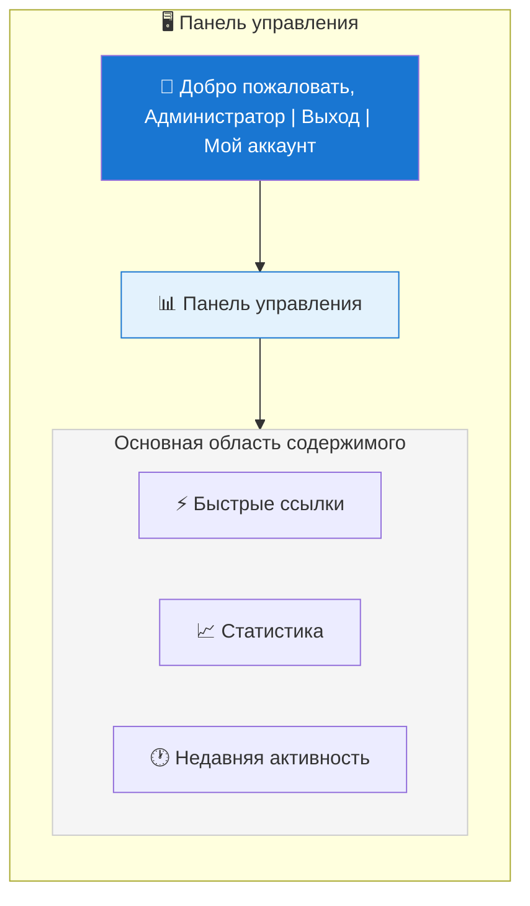
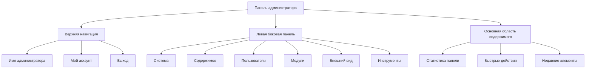

# Обзор панели администратора XOOPS

Полное руководство по навигации и использованию панели администратора XOOPS.

## Доступ к панели администратора

### Вход администратора

Откройте браузер и перейдите на:

```
http://your-domain.com/xoops/admin/
```

Или если XOOPS находится в корне:

```
http://your-domain.com/admin/
```

Введите учетные данные администратора:

```
Имя пользователя: [Ваше имя пользователя администратора]
Пароль: [Ваш пароль администратора]
```

### После входа

Вы увидите главную панель управления:



## Макет панели администратора



## Компоненты панели управления

### Верхняя панель

Верхняя панель содержит основные элементы управления:

| Элемент | Назначение |
|---|---|
| **Логотип администратора** | Нажмите, чтобы вернуться на панель управления |
| **Приветственное сообщение** | Показывает имя вошедшего администратора |
| **Мой аккаунт** | Редактировать профиль и пароль администратора |
| **Справка** | Доступ к документации |
| **Выход** | Выход из панели администратора |

### Левая боковая панель навигации

Главное меню организовано по функциям:

```
├── Система
│   ├── Панель управления
│   ├── Параметры
│   ├── Администраторы
│   ├── Группы
│   ├── Разрешения
│   ├── Модули
│   └── Инструменты
├── Содержимое
│   ├── Страницы
│   ├── Категории
│   ├── Комментарии
│   └── Менеджер медиа
├── Пользователи
│   ├── Пользователи
│   ├── Запросы пользователей
│   ├── Активные пользователи
│   └── Группы пользователей
├── Модули
│   ├── Модули
│   ├── Настройки модулей
│   └── Обновления модулей
├── Внешний вид
│   ├── Темы
│   ├── Шаблоны
│   ├── Блоки
│   └── Изображения
└── Инструменты
    ├── Обслуживание
    ├── Электронная почта
    ├── Статистика
    ├── Журналы
    └── Резервные копии
```

### Основная область содержимого

Отображает информацию и элементы управления для выбранного раздела:

- Формы для настройки
- Таблицы данных со списками
- Графики и статистика
- Кнопки быстрого действия
- Справочный текст и подсказки

### Виджеты панели управления

Быстрый доступ к ключевой информации:

- **Информация о системе:** версия PHP, версия MySQL, версия XOOPS
- **Быстрая статистика:** количество пользователей, всего постов, установленные модули
- **Недавняя активность:** последние входы, изменения содержимого, ошибки
- **Статус сервера:** CPU, память, использование диска
- **Уведомления:** системные предупреждения, доступные обновления

## Основные административные функции

### Управление системой

**Место:** Система > [Различные параметры]

#### Параметры

Настройка основных параметров системы:

```
Система > Параметры > [Категория настроек]
```

Категории:
- Общие параметры (имя сайта, часовой пояс)
- Параметры пользователя (регистрация, профили)
- Параметры электронной почты (конфигурация SMTP)
- Параметры кэша (параметры кэширования)
- Параметры URL (понятные URL)
- Мета-теги (параметры SEO)

Смотрите Базовую конфигурацию и Параметры системы.

#### Администраторы

Управление учётными записями администратора:

```
Система > Администраторы
```

Функции:
- Добавить новых администраторов
- Редактировать профили администраторов
- Изменить пароли администраторов
- Удалить учётные записи администраторов
- Установить разрешения администраторов

### Управление содержимым

**Место:** Содержимое > [Различные параметры]

#### Страницы/Статьи

Управление содержимым сайта:

```
Содержимое > Страницы (или ваш модуль)
```

Функции:
- Создавать новые страницы
- Редактировать существующее содержимое
- Удалять страницы
- Опубликовать/снять с публикации
- Установить категории
- Управлять версиями

#### Категории

Организация содержимого:

```
Содержимое > Категории
```

Функции:
- Создавать иерархию категорий
- Редактировать категории
- Удалять категории
- Назначать на страницы

#### Комментарии

Модерирование комментариев пользователей:

```
Содержимое > Комментарии
```

Функции:
- Просмотреть все комментарии
- Одобрить комментарии
- Редактировать комментарии
- Удалять спам
- Блокировать комментаторов

### Управление пользователями

**Место:** Пользователи > [Различные параметры]

#### Пользователи

Управление учётными записями пользователей:

```
Пользователи > Пользователи
```

Функции:
- Просмотреть всех пользователей
- Создавать новых пользователей
- Редактировать профили пользователей
- Удалять учётные записи
- Сбросить пароли
- Изменить статус пользователя
- Назначить в группы

#### Активные пользователи

Мониторинг активных пользователей:

```
Пользователи > Активные пользователи
```

Показывает:
- Текущих активных пользователей
- Время последней активности
- IP-адрес
- Местоположение пользователя (если настроено)

#### Группы пользователей

Управление ролями и разрешениями пользователей:

```
Пользователи > Группы
```

Функции:
- Создавать пользовательские группы
- Установить разрешения группы
- Назначить пользователей в группы
- Удалить группы

### Управление модулями

**Место:** Модули > [Различные параметры]

#### Модули

Установка и настройка модулей:

```
Модули > Модули
```

Функции:
- Просмотреть установленные модули
- Включить/отключить модули
- Обновить модули
- Настроить параметры модулей
- Установить новые модули
- Просмотреть детали модулей

#### Проверить обновления

```
Модули > Модули > Проверить обновления
```

Отображает:
- Доступные обновления модулей
- Журнал изменений
- Параметры загрузки и установки

### Управление внешним видом

**Место:** Внешний вид > [Различные параметры]

#### Темы

Управление темами сайта:

```
Внешний вид > Темы
```

Функции:
- Просмотреть установленные темы
- Установить тему по умолчанию
- Загрузить новые темы
- Удалить темы
- Предпросмотр темы
- Конфигурация темы

#### Блоки

Управление блоками содержимого:

```
Внешний вид > Блоки
```

Функции:
- Создавать пользовательские блоки
- Редактировать содержимое блоков
- Расставлять блоки на странице
- Установить видимость блока
- Удалить блоки
- Настроить кэширование блоков

#### Шаблоны

Управление шаблонами (расширенное):

```
Внешний вид > Шаблоны
```

Для продвинутых пользователей и разработчиков.

### Системные инструменты

**Место:** Система > Инструменты

#### Режим обслуживания

Предотвращение доступа пользователей во время обслуживания:

```
Система > Режим обслуживания
```

Настройте:
- Включить/отключить обслуживание
- Пользовательское сообщение обслуживания
- Разрешённые IP-адреса (для тестирования)

#### Управление базой данных

```
Система > База данных
```

Функции:
- Проверить согласованность БД
- Выполнить обновления БД
- Восстановить таблицы
- Оптимизировать БД
- Экспортировать структуру БД

#### Журнал активности

```
Система > Журналы
```

Мониторинг:
- Активность пользователя
- Административные действия
- Системные события
- Журналы ошибок

## Быстрые действия

Общие задачи, доступные с панели управления:

```
Быстрые ссылки:
├── Создать новую страницу
├── Добавить нового пользователя
├── Создать блок содержимого
├── Загрузить изображение
├── Отправить массовую электронную почту
├── Обновить все модули
└── Очистить кэш
```

## Горячие клавиши панели администратора

Быстрая навигация:

| Горячая клавиша | Действие |
|---|---|
| `Ctrl+H` | Перейти к справке |
| `Ctrl+D` | Перейти на панель управления |
| `Ctrl+Q` | Быстрый поиск |
| `Ctrl+L` | Выход |

## Управление учётной записью пользователя

### Мой аккаунт

Доступ к профилю администратора:

1. Нажмите "Мой аккаунт" в верхнем правом углу
2. Редактировать информацию профиля:
   - Адрес электронной почты
   - Полное имя
   - Информация пользователя
   - Аватар

### Изменить пароль

Изменить пароль администратора:

1. Перейти в **Мой аккаунт**
2. Нажать "Изменить пароль"
3. Введите текущий пароль
4. Введите новый пароль (два раза)
5. Нажать "Сохранить"

**Советы по безопасности:**
- Используйте надёжные пароли (16+ символов)
- Включайте прописные буквы, строчные буквы, цифры, символы
- Меняйте пароль каждые 90 дней
- Никогда не делитесь учётными данными администратора

### Выход

Выход из панели администратора:

1. Нажмите "Выход" в верхнем правом углу
2. Вас перенаправит на страницу входа

## Статистика панели администратора

### Статистика панели управления

Быстрый обзор показателей сайта:

| Показатель | Значение |
|--------|-------|
| Активных пользователей | 12 |
| Всего пользователей | 256 |
| Всего постов | 1 234 |
| Всего комментариев | 5 678 |
| Всего модулей | 8 |

### Статус системы

Информация о сервере и производительности:

| Компонент | Версия/Значение |
|-----------|---------------|
| Версия XOOPS | 2.5.11 |
| Версия PHP | 8.2.x |
| Версия MySQL | 8.0.x |
| Нагрузка на сервер | 0.45, 0.42 |
| Время безотказной работы | 45 дней |

### Недавняя активность

Временная шкала последних событий:

```
12:45 - Вход администратора
12:30 - Зарегистрировался новый пользователь
12:15 - Опубликована страница
12:00 - Опубликован комментарий
11:45 - Обновлен модуль
```

## Система уведомлений

### Предупреждения администратора

Получайте уведомления о:

- Новых регистрациях пользователей
- Комментариях, ожидающих модерации
- Неудачных попытках входа
- Системных ошибках
- Доступных обновлениях модулей
- Проблемах с БД
- Предупреждениях о свободном месте на диске

Настройте предупреждения:

**Система > Параметры > Параметры электронной почты**

```
Уведомлять администратора при регистрации: Да
Уведомлять администратора при комментариях: Да
Уведомлять администратора об ошибках: Да
Адрес электронной почты для предупреждений: admin@your-domain.com
```

## Распространённые административные задачи

### Создать новую страницу

1. Перейти в **Содержимое > Страницы** (или соответствующий модуль)
2. Нажать "Добавить новую страницу"
3. Заполнить:
   - Заголовок
   - Содержимое
   - Описание
   - Категория
   - Метаданные
4. Нажать "Опубликовать"

### Управлять пользователями

1. Перейти в **Пользователи > Пользователи**
2. Просмотреть список пользователей с:
   - Имя пользователя
   - Электронная почта
   - Дата регистрации
   - Последний вход
   - Статус

3. Нажать на имя пользователя, чтобы:
   - Редактировать профиль
   - Изменить пароль
   - Редактировать группы
   - Заблокировать/разблокировать пользователя

### Настроить модуль

1. Перейти в **Модули > Модули**
2. Найти модуль в списке
3. Нажать на имя модуля
4. Нажать "Параметры" или "Настройки"
5. Настроить параметры модуля
6. Сохранить изменения

### Создать новый блок

1. Перейти в **Внешний вид > Блоки**
2. Нажать "Добавить новый блок"
3. Введите:
   - Название блока
   - Содержимое блока (HTML разрешен)
   - Позиция на странице
   - Видимость (все страницы или конкретные)
   - Модуль (если применимо)
4. Нажать "Отправить"

## Справка панели администратора

### Встроенная документация

Доступ к справке из панели администратора:

1. Нажмите кнопку "Справка" в верхней панели
2. Контекстная справка для текущей страницы
3. Ссылки на документацию
4. Часто задаваемые вопросы

### Внешние ресурсы

- Официальный сайт XOOPS: https://xoops.org/
- Форум сообщества: https://xoops.org/modules/newbb/
- Репозиторий модулей: https://xoops.org/modules/repository/
- Ошибки/проблемы: https://github.com/XOOPS/XoopsCore/issues

## Настройка панели администратора

### Тема администратора

Выберите тему интерфейса администратора:

**Система > Параметры > Общие параметры**

```
Тема администратора: [Выберите тему]
```

Доступные темы:
- По умолчанию (светлая)
- Тёмный режим
- Пользовательские темы

### Настройка панели управления

Выберите, какие виджеты будут отображаться:

**Панель управления > Настроить**

Выберите:
- Информацию о системе
- Статистику
- Недавнюю активность
- Быстрые ссылки
- Пользовательские виджеты

## Разрешения панели администратора

Разные уровни администратора имеют разные разрешения:

| Роль | Возможности |
|---|---|
| **Вебмастер** | Полный доступ ко всем функциям администратора |
| **Администратор** | Ограниченные функции администратора |
| **Модератор** | Только модерирование содержимого |
| **Редактор** | Создание и редактирование содержимого |

Управление разрешениями:

**Система > Разрешения**

## Лучшие практики безопасности панели администратора

1. **Надёжный пароль:** Используйте пароль из 16+ символов
2. **Регулярные изменения:** Меняйте пароль каждые 90 дней
3. **Мониторинг доступа:** Регулярно проверяйте журналы в "Администраторы"
4. **Ограничение доступа:** Переименуйте папку администратора для дополнительной безопасности
5. **Используйте HTTPS:** Всегда получайте доступ к администратору через HTTPS
6. **Белый список IP:** Ограничьте доступ администратора определёнными IP-адресами
7. **Регулярный выход:** Выходите при завершении работы
8. **Безопасность браузера:** Регулярно очищайте кэш браузера

Смотрите Конфигурация безопасности.

## Решение проблем панели администратора

### Не могу получить доступ к панели администратора

**Решение:**
1. Проверьте учётные данные входа
2. Очистите кэш браузера и файлы cookie
3. Попробуйте другой браузер
4. Проверьте, правильный ли путь к папке администратора
5. Проверьте разрешения файлов в папке администратора
6. Проверьте подключение БД в mainfile.php

### Пустая страница администратора

**Решение:**
```bash
# Проверьте ошибки PHP
tail -f /var/log/apache2/error.log

# Временно включите режим отладки
sed -i "s/define('XOOPS_DEBUG', 0)/define('XOOPS_DEBUG', 1)/" /var/www/html/xoops/mainfile.php

# Проверьте разрешения файлов
ls -la /var/www/html/xoops/admin/
```

### Медленная панель администратора

**Решение:**
1. Очистите кэш: **Система > Инструменты > Очистить кэш**
2. Оптимизируйте БД: **Система > База данных > Оптимизировать**
3. Проверьте ресурсы сервера: `htop`
4. Изучите медленные запросы в MySQL

### Модуль не отображается

**Решение:**
1. Проверьте установку модуля: **Модули > Модули**
2. Проверьте, включен ли модуль
3. Проверьте назначенные разрешения
4. Проверьте наличие файлов модуля
5. Изучите журналы ошибок

## Следующие шаги

После ознакомления с панелью администратора:

1. Создайте вашу первую страницу
2. Установите группы пользователей
3. Установите дополнительные модули
4. Настройте основные параметры
5. Реализуйте безопасность

---

**Теги:** #admin-panel #dashboard #navigation #getting-started

**Связанные статьи:**
- ../Configuration/Basic-Configuration
- ../Configuration/System-Settings
- Creating-Your-First-Page
- Managing-Users
- Installing-Modules
