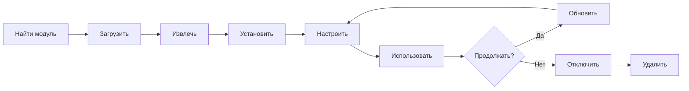

# Установка и управление модулями XOOPS

Узнайте, как расширить функциональность XOOPS путём установки и настройки модулей.

## Понимание модулей XOOPS

### Что такое модули?

Модули - это расширения, которые добавляют функциональность в XOOPS:

| Тип | Назначение | Примеры |
|---|---|---|
| **Содержимое** | Управление определённых типов содержимого | Новости, Блог, Обращения |
| **Сообщество** | Взаимодействие пользователей | Форум, Комментарии, Отзывы |
| **eCommerce** | Продажа продуктов | Магазин, Корзина, Платежи |
| **Медиа** | Работа с файлами/изображениями | Галерея, Загрузки, Видео |
| **Утилиты** | Инструменты и помощники | Электронная почта, Резервная копия, Аналитика |

### Основные модули и дополнительные модули

| Модуль | Тип | Включено | Удаляемое |
|---|---|---|---|
| **System** | Основной | Да | Нет |
| **User** | Основной | Да | Нет |
| **Profile** | Рекомендуемое | Да | Да |
| **PM (Приватные сообщения)** | Рекомендуемое | Да | Да |
| **WF-Channel** | Дополнительное | Часто | Да |
| **News** | Дополнительное | Нет | Да |
| **Forum** | Дополнительное | Нет | Да |

## Жизненный цикл модуля



## Поиск модулей

### Репозиторий модулей XOOPS

Официальный репозиторий модулей XOOPS:

**Посетите:** https://xoops.org/modules/repository/

```
Директория > Модули > [Обзор категорий]
```

Просмотр по категориям:
- Управление содержимым
- Сообщество
- eCommerce
- Мультимедиа
- Разработка
- Администрирование сайта

### Оценка модулей

Перед установкой проверьте:

| Критерии | На что смотреть |
|---|---|
| **Совместимость** | Работает с вашей версией XOOPS |
| **Рейтинг** | Хорошие отзывы и оценки пользователей |
| **Обновления** | Недавно поддерживается |
| **Загрузки** | Популярный и широко используемый |
| **Требования** | Совместимость с вашим сервером |
| **Лицензия** | GPL или подобная открытая лицензия |
| **Поддержка** | Активный разработчик и сообщество |

### Прочитайте информацию модуля

Каждый список модулей показывает:

```
Имя модуля: [Имя]
Версия: [X.X.X]
Требует: XOOPS [Версия]
Автор: [Имя]
Последнее обновление: [Дата]
Загрузки: [Номер]
Рейтинг: [Звёзды]
Описание: [Краткое описание]
Совместимость: PHP [Версия], MySQL [Версия]
```

## Установка модулей

### Способ 1: Установка через панель администратора

**Шаг 1: Доступ к разделу модулей**

1. Войдите в панель администратора
2. Перейдите в **Модули > Модули**
3. Нажмите **"Установить новый модуль"** или **"Обзор модулей"**

**Шаг 2: Загрузить модуль**

Вариант A - Прямая загрузка:
1. Нажмите **"Выбрать файл"**
2. Выберите модуль .zip из компьютера
3. Нажмите **"Загрузить"**

Вариант B - Загрузка по URL:
1. Вставьте URL модуля
2. Нажмите **"Загрузить и установить"**

**Шаг 3: Проверьте информацию модуля**

```
Имя модуля: [Показано имя]
Версия: [Версия]
Автор: [Информация об авторе]
Описание: [Полное описание]
Требования: [Версии PHP/MySQL]
```

Проверьте и нажмите **"Продолжить установку"**

**Шаг 4: Выберите тип установки**

```
☐ Свежая установка (новая установка)
☐ Обновление (обновление существующего)
☐ Удалить затем установить (заменить существующее)
```

Выберите подходящий вариант.

**Шаг 5: Подтвердите установку**

Проверьте финальное подтверждение:
```
Модуль будет установлен в: /modules/modulename/
База данных: xoops_db
Продолжить? [Да] [Нет]
```

Нажмите **"Да"** для подтверждения.

**Шаг 6: Установка завершена**

```
Установка успешна!

Модуль: [Имя модуля]
Версия: [Версия]
Созданные таблицы: [Номер]
Установленные файлы: [Номер]

[Перейти к параметрам модуля] [Вернуться к модулям]
```

### Способ 2: Ручная установка (расширенное)

Для ручной установки или устранения неполадок:

**Шаг 1: Загрузить модуль**

1. Загрузите модуль .zip из репозитория
2. Извлеките в `/var/www/html/xoops/modules/modulename/`

```bash
# Извлечь модуль
unzip module_name.zip
cp -r module_name /var/www/html/xoops/modules/

# Установить разрешения
chmod -R 755 /var/www/html/xoops/modules/module_name
```

**Шаг 2: Запустить скрипт установки**

```
Посетите: http://your-domain.com/xoops/modules/module_name/admin/index.php?op=install
```

Или через панель администратора (Система > Модули > Обновить БД).

**Шаг 3: Проверить установку**

1. Перейдите в **Модули > Модули** в администраторе
2. Найдите свой модуль в списке
3. Проверьте, что он показан как "Активный"

## Конфигурация модуля

### Доступ к параметрам модуля

1. Перейдите в **Модули > Модули**
2. Найдите свой модуль
3. Нажмите на имя модуля
4. Нажмите **"Параметры"** или **"Настройки"**

### Общие параметры модуля

Большинство модулей предлагают:

```
Статус модуля: [Включено/Отключено]
Отобразить в меню: [Да/Нет]
Вес модуля: [1-999] (порядок отображения)
Видно для групп: [Флажки для групп пользователей]
```

### Параметры модуля

Каждый модуль имеет уникальные настройки. Примеры:

**Модуль новостей:**
```
Элементов на странице: 10
Показать автора: Да
Разрешить комментарии: Да
Требуется модерация: Да
```

**Модуль форума:**
```
Тем на странице: 20
Постов на странице: 15
Максимальный размер вложения: 5МБ
Включить подписи: Да
```

**Модуль галереи:**
```
Изображений на странице: 12
Размер миниатюры: 150x150
Максимальная загрузка: 10МБ
Водяной знак: Да/Нет
```

Обратитесь к документации вашего модуля для конкретных параметров.

### Сохранить конфигурацию

После регулировки параметров:

1. Нажмите **"Отправить"** или **"Сохранить"**
2. Вы увидите подтверждение:
   ```
   Параметры сохранены успешно!
   ```

## Управление блоками модулей

Многие модули создают "блоки" - виджет-подобные области содержимого.

### Просмотр блоков модуля

1. Перейдите в **Внешний вид > Блоки**
2. Найдите блоки из вашего модуля
3. Большинство модулей показывают "[Имя модуля] - [Описание блока]"

### Настроить блоки

1. Нажмите на имя блока
2. Отрегулируйте:
   - Заголовок блока
   - Видимость (все страницы или конкретные)
   - Позиция на странице (слева, в центре, справа)
   - Группы пользователей, которые могут видеть
3. Нажмите **"Отправить"**

### Отобразить блок на главной странице

1. Перейдите в **Внешний вид > Блоки**
2. Найдите нужный блок
3. Нажмите **"Редактировать"**
4. Установите:
   - **Видно для:** Выберите группы
   - **Позиция:** Выберите колонку (слева/в центре/справа)
   - **Страницы:** Главная или все страницы
5. Нажмите **"Отправить"**

## Установка конкретных примеров модулей

### Установка модуля новостей

**Идеально для:** Посты в блоге, объявления

1. Загрузите модуль новостей из репозитория
2. Загрузите через **Модули > Модули > Установить**
3. Настройте в **Модули > Новости > Параметры**:
   - Истории на странице: 10
   - Разрешить комментарии: Да
   - Утверждать перед публикацией: Да
4. Создайте блоки для последних новостей
5. Начните публиковать истории!

### Установка модуля форума

**Идеально для:** Обсуждение в сообществе

1. Загрузите модуль форума
2. Установите через панель администратора
3. Создайте категории форума в модуле
4. Настройте параметры:
   - Темы на странице: 20
   - Посты на странице: 15
   - Включить модерацию: Да
5. Назначить разрешения групп пользователей
6. Создайте блоки для последних тем

### Установка модуля галереи

**Идеально для:** Демонстрация изображений

1. Загрузите модуль галереи
2. Установите и настройте
3. Создайте фотоальбомы
4. Загрузите изображения
5. Установите разрешения для просмотра/загрузки
6. Отобразите галерею на сайте

## Обновление модулей

### Проверить обновления

```
Панель администратора > Модули > Модули > Проверить обновления
```

Это показывает:
- Доступные обновления модулей
- Текущая версия vs новая версия
- Журнал изменений/примечания выпуска

### Обновить модуль

1. Перейдите в **Модули > Модули**
2. Нажмите модуль с доступным обновлением
3. Нажмите кнопку **"Обновить"**
4. Выберите **"Обновить"** из типа установки
5. Следуйте мастеру установки
6. Модуль обновлён!

### Важные примечания обновления

Перед обновлением:

- [ ] Создайте резервную копию БД
- [ ] Создайте резервную копию файлов модуля
- [ ] Проверьте журнал изменений
- [ ] Сначала протестируйте на сервере подготовки
- [ ] Запишите любые пользовательские модификации

После обновления:
- [ ] Проверить функциональность
- [ ] Проверить параметры модуля
- [ ] Просмотр предупреждений/ошибок
- [ ] Очистить кэш

## Разрешения модуля

### Назначить доступ группе пользователей

Контролируйте, какие группы пользователей могут получить доступ к модулям:

**Место:** Система > Разрешения

Для каждого модуля настройте:

```
Модуль: [Имя модуля]

Доступ администратора: [Выберите группы]
Доступ пользователя: [Выберите группы]
Разрешение на чтение: [Группы разрешены для просмотра]
Разрешение на запись: [Группы разрешены для постинга]
Разрешение на удаление: [Только администраторы]
```

### Общие уровни разрешений

```
Общественное содержимое (новости, страницы):
├── Доступ администратора: Вебмастер
├── Доступ пользователя: Все вошедшие пользователи
└── Разрешение на чтение: Все

Функции сообщества (форум, комментарии):
├── Доступ администратора: Вебмастер, Модераторы
├── Доступ пользователя: Все вошедшие пользователи
└── Разрешение на запись: Все вошедшие пользователи

Административные инструменты:
├── Доступ администратора: Только вебмастер
└── Доступ пользователя: Отключено
```

## Отключение и удаление модулей

### Отключить модуль (сохранить файлы)

Скройте модуль но сохраните данные:

1. Перейдите в **Модули > Модули**
2. Найдите модуль
3. Нажмите имя модуля
4. Нажмите **"Отключить"** или установите статус Неактивный
5. Модуль скрыт, но данные сохранены

Повторно включите в любое время:
1. Нажмите модуль
2. Нажмите **"Включить"**

### Полностью удалить модуль

Удалить модуль и его данные:

1. Перейдите в **Модули > Модули**
2. Найдите модуль
3. Нажмите **"Удалить"** или **"Удалить"**
4. Подтвердите: "Удалить модуль и все данные?"
5. Нажмите **"Да"** для подтверждения

**Внимание:** Удаление удаляет все данные модуля!

### Переустановка после удаления

Если вы удалите модуль:
- Файлы модуля удалены
- Таблицы БД удалены
- Все данные потеряны
- Должны переустановить для использования
- Могут восстановить из резервной копии

## Решение проблем установки модуля

### Модуль не отображается после установки

**Симптом:** Модуль перечислен, но не виден на сайте

**Решение:**
```
1. Проверьте модуль "Активный" (Модули > Модули)
2. Включите блоки модулей (Внешний вид > Блоки)
3. Проверьте разрешения пользователей (Система > Разрешения)
4. Очистить кэш (Система > Инструменты > Очистить кэш)
5. Проверьте .htaccess не блокирует модуль
```

### Ошибка установки: "Таблица уже существует"

**Симптом:** Ошибка при установке модуля

**Решение:**
```
1. Модуль частично установлен ранее
2. Попробуйте опцию "Удалить затем установить"
3. Или сначала удалите, затем установите заново
4. Проверьте БД на наличие существующих таблиц:
   mysql> SHOW TABLES LIKE 'xoops_module%';
```

### Модуль отсутствует зависимостей

**Симптом:** Модуль не будет устанавливаться - требует другой модуль

**Решение:**
```
1. Запишите требуемые модули из сообщения об ошибке
2. Сначала установите требуемые модули
3. Затем установите модуль
4. Установить в правильном порядке
```

### Пустая страница при доступе к модулю

**Симптом:** Модуль загружается, но ничего не показывает

**Решение:**
```
1. Включите режим отладки в mainfile.php:
   define('XOOPS_DEBUG', 1);

2. Проверьте журнал ошибок PHP:
   tail -f /var/log/php_errors.log

3. Проверьте разрешения файлов:
   chmod -R 755 /var/www/html/xoops/modules/modulename

4. Проверьте подключение БД в конфигурации модуля

5. Отключите модуль и переустановите
```

### Модуль ломает сайт

**Симптом:** Установка модуля ломает веб-сайт

**Решение:**
```
1. Немедленно отключите проблемный модуль:
   Администратор > Модули > [Модуль] > Отключить

2. Очистить кэш:
   rm -rf /var/www/html/xoops/cache/*
   rm -rf /var/www/html/xoops/templates_c/*

3. Восстановить из резервной копии при необходимости

4. Проверить журналы ошибок на предмет основной причины

5. Обратиться к разработчику модуля
```

## Соображения безопасности модуля

### Устанавливайте только из доверенных источников

```
✓ Официальный репозиторий XOOPS
✓ GitHub официальные модули XOOPS
✓ Доверенные разработчики модулей
✗ Неизвестные веб-сайты
✗ Непроверенные источники
```

### Проверьте разрешения модуля

После установки:

1. Проверить код модуля на подозрительную активность
2. Проверить таблицы БД на аномалии
3. Мониторинг изменений файлов
4. Держите модули в актуальном состоянии
5. Удаляйте неиспользуемые модули

### Лучшие практики разрешений

```
Директория модуля: 755 (читаемая, не записываемая веб-сервером)
Файлы модуля: 644 (только для чтения)
Данные модуля: Защищены БД
```

## Ресурсы разработки модулей

### Изучение разработки модулей

- Официальная документация: https://xoops.org/
- Репозиторий GitHub: https://github.com/XOOPS/
- Форум сообщества: https://xoops.org/modules/newbb/
- Руководство разработчика: Доступно в папке документов

## Лучшие практики для модулей

1. **Установить по одному:** Мониторинг конфликтов
2. **Тест после установки:** Проверить функциональность
3. **Документировать пользовательскую конфигурацию:** Запишите ваши параметры
4. **Держите в актуальном состоянии:** Установите обновления модулей оперативно
5. **Удалить неиспользуемое:** Удалите ненужные модули
6. **Резервная копия перед:** Всегда создавайте резервную копию перед установкой
7. **Прочитать документацию:** Проверьте инструкции модуля
8. **Присоединиться к сообществу:** Попросить помощь при необходимости

## Контрольный список установки модуля

Для каждой установки модуля:

- [ ] Исследуйте и прочитайте отзывы
- [ ] Проверить совместимость версии XOOPS
- [ ] Создайте резервную копию БД и файлов
- [ ] Загрузить последнюю версию
- [ ] Установить через панель администратора
- [ ] Настроить параметры
- [ ] Создать/расставить блоки
- [ ] Установить разрешения пользователей
- [ ] Тест функциональности
- [ ] Документировать конфигурацию
- [ ] Запланировать обновления

## Следующие шаги

После установки модулей:

1. Создайте содержимое для модулей
2. Установите группы пользователей
3. Изучите функции администратора
4. Оптимизировать производительность
5. Установить дополнительные модули по мере необходимости

---

**Теги:** #modules #installation #extension #management

**Связанные статьи:**
- Admin-Panel-Overview
- Managing-Users
- Creating-Your-First-Page
- ../Configuration/System-Settings
