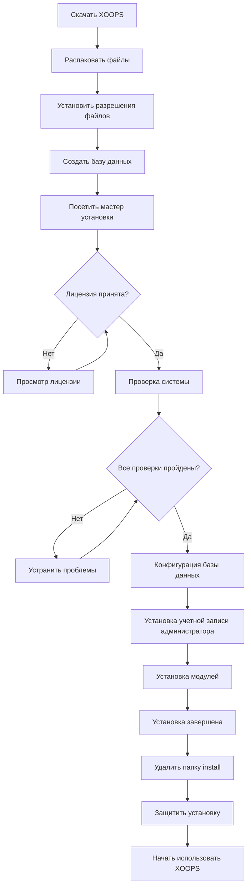

# Полное руководство по установке XOOPS

Это руководство содержит подробное пошаговое руководство по установке XOOPS с нуля с использованием мастера установки.

## Предварительные условия

Перед началом установки убедитесь, что у вас есть:

- Доступ к веб-серверу через FTP или SSH
- Доступ администратора к серверу базы данных
- Зарегистрированное доменное имя
- Проверенные требования к серверу
- Доступные инструменты резервного копирования

## Процесс установки



## Пошаговая установка

### Шаг 1: Загрузите XOOPS

Загрузите последнюю версию с [https://xoops.org/](https://xoops.org/):

```bash
# Используя wget
wget https://xoops.org/download/xoops-2.5.8.zip

# Используя curl
curl -O https://xoops.org/download/xoops-2.5.8.zip
```

### Шаг 2: Распакуйте файлы

Распакуйте архив XOOPS в корневую папку веб-сайта:

```bash
# Перейдите в корневую папку веб-сайта
cd /var/www/html

# Распаковать XOOPS
unzip xoops-2.5.8.zip

# Переименовать папку (необязательно, но рекомендуется)
mv xoops-2.5.8 xoops
cd xoops
```

### Шаг 3: Установите разрешения файлов

Установите правильные разрешения для каталогов XOOPS:

```bash
# Сделать каталоги доступными для записи (755 для каталогов, 644 для файлов)
find . -type d -exec chmod 755 {} \;
find . -type f -exec chmod 644 {} \;

# Сделать определенные каталоги доступными для записи веб-сервером
chmod 777 uploads/
chmod 777 templates_c/
chmod 777 var/
chmod 777 cache/

# Защитить mainfile.php после установки
chmod 644 mainfile.php
```

### Шаг 4: Создайте базу данных

Создайте новую базу данных для XOOPS с помощью MySQL:

```sql
-- Создать базу данных
CREATE DATABASE xoops_db CHARACTER SET utf8mb4 COLLATE utf8mb4_unicode_ci;

-- Создать пользователя
CREATE USER 'xoops_user'@'localhost' IDENTIFIED BY 'secure_password_here';

-- Предоставить привилегии
GRANT ALL PRIVILEGES ON xoops_db.* TO 'xoops_user'@'localhost';
FLUSH PRIVILEGES;
```

Или используя phpMyAdmin:

1. Войдите в phpMyAdmin
2. Нажмите на вкладку "Базы данных"
3. Введите имя базы данных: `xoops_db`
4. Выберите разборку "utf8mb4_unicode_ci"
5. Нажмите "Создать"
6. Создайте пользователя с таким же именем, что и база данных
7. Предоставьте все привилегии

### Шаг 5: Запустите мастер установки

Откройте браузер и перейдите к:

```
http://your-domain.com/xoops/install/
```

#### Фаза проверки системы

Мастер проверяет конфигурацию вашего сервера:

- Версия PHP >= 5.6.0
- Доступны MySQL/MariaDB
- Требуемые расширения PHP (GD, PDO и т.д.)
- Разрешения каталогов
- Подключение к базе данных

**Если проверки не пройдены:**

См. раздел #Типовые-проблемы-с-установкой для решений.

#### Конфигурация базы данных

Введите учетные данные вашей базы данных:

```
Хост базы данных: localhost
Имя базы данных: xoops_db
Пользователь базы данных: xoops_user
Пароль базы данных: [ваш_безопасный_пароль]
Префикс таблицы: xoops_
```

**Важные замечания:**
- Если хост вашей базы данных отличается от localhost (например, удаленный сервер), введите правильное имя хоста
- Префикс таблицы помогает, если вы запускаете несколько экземпляров XOOPS в одной базе данных
- Используйте надежный пароль со смешанным регистром, цифрами и символами

#### Установка учетной записи администратора

Создайте учетную запись администратора:

```
Имя пользователя администратора: admin (или выберите собственное)
Электронная почта администратора: admin@your-domain.com
Пароль администратора: [сильный_уникальный_пароль]
Подтвердить пароль: [повторить_пароль]
```

**Лучшие практики:**
- Используйте уникальное имя пользователя, а не "admin"
- Используйте пароль из 16+ символов
- Храните учетные данные в защищенном менеджере паролей
- Никогда не делитесь учетными данными администратора

#### Установка модулей

Выберите модули по умолчанию для установки:

- **Системный модуль** (требуется) - Основная функциональность XOOPS
- **Модуль пользователя** (требуется) - Управление пользователями
- **Модуль профиля** (рекомендуется) - Профили пользователей
- **Модуль PM (частное сообщение)** (рекомендуется) - Внутренний обмен сообщениями
- **Модуль WF-Channel** (необязательно) - Управление контентом

Выберите все рекомендуемые модули для полной установки.

### Шаг 6: Завершите установку

После всех этапов вы увидите экран подтверждения:

```
Установка завершена!

Ваша установка XOOPS готова к использованию.
Панель администратора: http://your-domain.com/xoops/admin/
Панель пользователя: http://your-domain.com/xoops/
```

### Шаг 7: Защитите вашу установку

#### Удалите папку установки

```bash
# Удалить каталог install (КРИТИЧНО для безопасности)
rm -rf /var/www/html/xoops/install/

# Или переименуйте его
mv /var/www/html/xoops/install/ /var/www/html/xoops/install.bak
```

**ПРЕДУПРЕЖДЕНИЕ:** Никогда не оставляйте папку установки доступной в производстве!

#### Защитить mainfile.php

```bash
# Сделать mainfile.php доступным только для чтения
chmod 644 /var/www/html/xoops/mainfile.php

# Установить права собственности
chown www-data:www-data /var/www/html/xoops/mainfile.php
```

#### Установите правильные разрешения файлов

```bash
# Рекомендуемые разрешения производства
find . -type f -name "*.php" -exec chmod 644 {} \;
find . -type d -exec chmod 755 {} \;

# Каталоги для записи веб-сервером
chmod 777 uploads/ var/ cache/ templates_c/
```

#### Включить HTTPS/SSL

Настройте SSL в веб-сервере (nginx или Apache).

**Для Apache:**
```apache
<VirtualHost *:443>
    ServerName your-domain.com
    DocumentRoot /var/www/html/xoops

    SSLEngine on
    SSLCertificateFile /etc/ssl/certs/your-cert.crt
    SSLCertificateKeyFile /etc/ssl/private/your-key.key

    # Принудительное перенаправление HTTPS
    <IfModule mod_rewrite.c>
        RewriteEngine On
        RewriteCond %{HTTPS} off
        RewriteRule ^(.*)$ https://%{HTTP_HOST}%{REQUEST_URI} [L,R=301]
    </IfModule>
</VirtualHost>
```

## Конфигурация после установки

### 1. Доступ к панели администратора

Перейдите к:
```
http://your-domain.com/xoops/admin/
```

Войдите с помощью учетных данных администратора.

### 2. Настройте основные параметры

Настройте следующее:

- Имя и описание сайта
- Электронная почта администратора
- Часовой пояс и формат даты
- Оптимизация для поисковых систем

### 3. Проверьте установку

- [ ] Посетить домашнюю страницу
- [ ] Проверить загрузку модулей
- [ ] Проверить работу регистрации пользователей
- [ ] Протестировать функции панели администратора
- [ ] Подтвердить работу SSL/HTTPS

### 4. Запланируйте резервные копии

Установите автоматическое резервное копирование:

```bash
# Создать скрипт резервного копирования (backup.sh)
#!/bin/bash
DATE=$(date +%Y%m%d_%H%M%S)
BACKUP_DIR="/backups/xoops"
XOOPS_DIR="/var/www/html/xoops"

# Резервная копия базы данных
mysqldump -u xoops_user -p[password] xoops_db > $BACKUP_DIR/db_$DATE.sql

# Резервная копия файлов
tar -czf $BACKUP_DIR/files_$DATE.tar.gz $XOOPS_DIR

echo "Резервная копия завершена: $DATE"
```

Запланируйте с помощью cron:
```bash
# Ежедневная резервная копия в 2 часа ночи
0 2 * * * /usr/local/bin/backup.sh
```

## Типовые проблемы с установкой

### Проблема: Ошибки отказа в доступе

**Симптом:** "Permission denied" при загрузке или создании файлов

**Решение:**
```bash
# Проверить пользователя веб-сервера
ps aux | grep apache  # Для Apache
ps aux | grep nginx   # Для Nginx

# Исправить разрешения (замените www-data на пользователя веб-сервера)
chown -R www-data:www-data /var/www/html/xoops
chmod -R 755 /var/www/html/xoops
chmod 777 uploads/ var/ cache/ templates_c/
```

### Проблема: Ошибка подключения к базе данных

**Симптом:** "Cannot connect to database server"

**Решение:**
1. Проверьте учетные данные базы данных в мастере установки
2. Проверьте, что MySQL/MariaDB запущена:
   ```bash
   service mysql status  # или mariadb
   ```
3. Проверьте наличие базы данных:
   ```sql
   SHOW DATABASES;
   ```
4. Проверьте подключение из командной строки:
   ```bash
   mysql -h localhost -u xoops_user -p xoops_db
   ```

### Проблема: Пустой белый экран

**Симптом:** Посещение XOOPS показывает пустую страницу

**Решение:**
1. Проверьте журналы ошибок PHP:
   ```bash
   tail -f /var/log/apache2/error.log
   ```
2. Включите режим отладки в mainfile.php:
   ```php
   define('XOOPS_DEBUG', 1);
   ```
3. Проверьте разрешения файлов на mainfile.php и файлы конфигурации
4. Проверьте, установлено ли расширение PHP-MySQL

### Проблема: Невозможно писать в каталог загрузки

**Симптом:** Функция загрузки завершается ошибкой, "Cannot write to uploads/"

**Решение:**
```bash
# Проверить текущие разрешения
ls -la uploads/

# Исправить разрешения
chmod 777 uploads/
chown www-data:www-data uploads/

# Для определенных файлов
chmod 644 uploads/*
```

### Проблема: Отсутствуют расширения PHP

**Симптом:** Проверка системы завершается ошибкой с отсутствующими расширениями (GD, MySQL и т.д.)

**Решение (Ubuntu/Debian):**
```bash
# Установить библиотеку PHP GD
apt-get install php-gd

# Установить поддержку PHP MySQL
apt-get install php-mysql

# Перезагрузить веб-сервер
systemctl restart apache2  # или nginx
```

**Решение (CentOS/RHEL):**
```bash
# Установить библиотеку PHP GD
yum install php-gd

# Установить поддержку PHP MySQL
yum install php-mysql

# Перезагрузить веб-сервер
systemctl restart httpd
```

### Проблема: Медленный процесс установки

**Симптом:** Мастер установки истекает по времени или работает очень медленно

**Решение:**
1. Увеличьте время ожидания PHP в php.ini:
   ```ini
   max_execution_time = 300  # 5 минут
   ```
2. Увеличьте max_allowed_packet MySQL:
   ```sql
   SET GLOBAL max_allowed_packet = 256M;
   ```
3. Проверьте ресурсы сервера:
   ```bash
   free -h  # Проверить ОЗУ
   df -h    # Проверить место на диске
   ```

### Проблема: Панель администратора недоступна

**Симптом:** Не удается получить доступ к панели администратора после установки

**Решение:**
1. Проверьте наличие пользователя администратора в базе данных:
   ```sql
   SELECT * FROM xoops_users WHERE uid = 1;
   ```
2. Очистите кэш и файлы cookie браузера
3. Проверьте, доступна ли папка сеансов для записи:
   ```bash
   chmod 777 var/
   ```
4. Проверьте, не блокируют ли правила htaccess доступ к администратору

## Контрольный список проверки

После установки проверьте:

- [x] Домашняя страница XOOPS загружается правильно
- [x] Панель администратора доступна по адресу /xoops/admin/
- [x] SSL/HTTPS работает
- [x] Папка установки удалена или недоступна
- [x] Разрешения файлов защищены (644 для файлов, 755 для каталогов)
- [x] Резервные копии базы данных запланированы
- [x] Модули загружаются без ошибок
- [x] Система регистрации пользователей работает
- [x] Функция загрузки файлов работает
- [x] Почтовые уведомления отправляются правильно

## Следующие шаги

После завершения установки:

1. Прочитайте руководство по основной конфигурации
2. Защитите вашу установку
3. Изучите панель администратора
4. Установите дополнительные модули
5. Установите группы пользователей и разрешения

---

**Теги:** #installation #setup #getting-started #troubleshooting

**Связанные статьи:**
- Server-Requirements
- Upgrading-XOOPS
- ../Configuration/Security-Configuration
