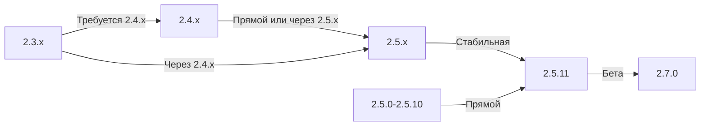

Это руководство охватывает обновление XOOPS со старых версий на последний выпуск, сохраняя ваши данные и настройки.

> **Информация о версии**
> - **Стабильная:** XOOPS 2.5.11
> - **Бета:** XOOPS 2.7.0 (тестирование)
> - **Будущее:** XOOPS 4.0 (в разработке - см. Roadmap)

## Контрольный список перед обновлением

Перед началом обновления проверьте:

- [ ] Документирована текущая версия XOOPS
- [ ] Определена целевая версия XOOPS
- [ ] Завершена полная резервная копия системы
- [ ] Проверена резервная копия базы данных
- [ ] Записан список установленных модулей
- [ ] Задокументированы пользовательские изменения
- [ ] Доступна среда для тестирования
- [ ] Проверен путь обновления (некоторые версии пропускают промежуточные выпуски)
- [ ] Проверены ресурсы сервера (достаточно дискового пространства, памяти)
- [ ] Включен режим обслуживания

## Путь обновления - Руководство

Различные пути обновления в зависимости от текущей версии:



**Важно:** Никогда не пропускайте основные версии. Если обновляете с 2.3.x, сначала обновите до 2.4.x, затем до 2.5.x.

## Шаг 1: Полная резервная копия системы

### Резервная копия базы данных

Используйте mysqldump для резервной копии базы данных:

```bash
# Полная резервная копия базы данных
mysqldump -u xoops_user -p xoops_db > /backups/xoops_db_backup_$(date +%Y%m%d_%H%M%S).sql

# Сжатая резервная копия
mysqldump -u xoops_user -p xoops_db | gzip > /backups/xoops_db_backup_$(date +%Y%m%d_%H%M%S).sql.gz
```

Или используя phpMyAdmin:

1. Выберите вашу базу данных XOOPS
2. Нажмите на вкладку "Экспорт"
3. Выберите формат "SQL"
4. Выберите "Сохранить в файл"
5. Нажмите "Перейти"

Проверьте файл резервной копии:

```bash
# Проверить размер резервной копии
ls -lh /backups/xoops_db_backup*.sql

# Проверить целостность резервной копии (несжатой)
head -20 /backups/xoops_db_backup_*.sql

# Проверить сжатую резервную копию
zcat /backups/xoops_db_backup_*.sql.gz | head -20
```

### Резервная копия файловой системы

Резервная копия всех файлов XOOPS:

```bash
# Сжатая резервная копия файлов
tar -czf /backups/xoops_files_$(date +%Y%m%d_%H%M%S).tar.gz /var/www/html/xoops

# Несжатая (быстрее, требует больше дискового пространства)
tar -cf /backups/xoops_files_$(date +%Y%m%d_%H%M%S).tar /var/www/html/xoops

# Показать ход выполнения резервной копии
tar -czf /backups/xoops_files_$(date +%Y%m%d_%H%M%S).tar.gz --verbose /var/www/html/xoops | tail
```

Безопасное хранение резервных копий:

```bash
# Защищенное хранилище резервных копий
chmod 600 /backups/xoops_*
ls -lah /backups/

# Необязательно: скопировать на удаленное хранилище
scp /backups/xoops_* user@backup-server:/secure/backups/
```

### Протестируйте восстановление резервной копии

**КРИТИЧНО:** Всегда тестируйте работу вашей резервной копии:

```bash
# Проверить содержимое архива tar
tar -tzf /backups/xoops_files_*.tar.gz | head -20

# Извлечь в место тестирования
mkdir /tmp/restore_test
cd /tmp/restore_test
tar -xzf /backups/xoops_files_*.tar.gz

# Проверить наличие ключевых файлов
ls -la xoops/mainfile.php
ls -la xoops/install/
```

## Шаг 2: Включение режима обслуживания

Предотвратите доступ пользователей к сайту во время обновления:

### Вариант 1: Панель администратора XOOPS

1. Войдите в панель администратора
2. Перейдите на "Система > Обслуживание"
3. Включите "Режим обслуживания сайта"
4. Установите сообщение обслуживания
5. Сохраните

### Вариант 2: Ручной режим обслуживания

Создайте файл обслуживания в веб-корневой:

```html
<!-- /var/www/html/maintenance.html -->
<!DOCTYPE html>
<html>
<head>
    <title>Под обслуживанием</title>
    <style>
        body { font-family: Arial; text-align: center; padding: 50px; }
        h1 { color: #333; }
        p { color: #666; margin: 20px 0; }
    </style>
</head>
<body>
    <h1>Сайт на обслуживании</h1>
    <p>Мы в настоящее время обновляем наш сайт.</p>
    <p>Ожидаемое время: примерно 30 минут.</p>
    <p>Спасибо за ваше терпение!</p>
</body>
</html>
```

Настройте Apache для отображения страницы обслуживания:

```apache
# В .htaccess или конфигурация vhost
ErrorDocument 503 /maintenance.html

# Перенаправить весь трафик на страницу обслуживания
<IfModule mod_rewrite.c>
    RewriteEngine On
    RewriteCond %{REMOTE_ADDR} !^192\.168\.1\.100$  # Ваш IP
    RewriteRule ^(.*)$ - [R=503,L]
</IfModule>
```

## Шаг 3: Загрузите новую версию

Загрузите XOOPS с официального сайта:

```bash
# Загрузить последнюю версию
cd /tmp
wget https://xoops.org/download/xoops-2.5.8.zip

# Проверить контрольную сумму (если предоставлена)
sha256sum xoops-2.5.8.zip
# Сравните с официальной контрольной суммой SHA256

# Извлечь во временное место
unzip xoops-2.5.8.zip
cd xoops-2.5.8
```

## Шаг 4: Подготовка файлов перед обновлением

### Определить пользовательские изменения

Проверьте наличие измененных основных файлов:

```bash
# Ищите измененные файлы (файлы с более новым mtime)
find /var/www/html/xoops -type f -newer /var/www/html/xoops/install.php

# Проверить пользовательские темы
ls /var/www/html/xoops/themes/
# Отметьте любые пользовательские темы

# Проверить пользовательские модули
ls /var/www/html/xoops/modules/
# Отметьте любые пользовательские модули, созданные вами
```

### Задокументируйте текущее состояние

Создайте отчет об обновлении:

```bash
cat > /tmp/upgrade_report.txt << EOF
=== Отчет об обновлении XOOPS ===
Дата: $(date)
Текущая версия: 2.5.6
Целевая версия: 2.5.8

=== Установленные модули ===
$(ls /var/www/html/xoops/modules/)

=== Пользовательские изменения ===
[Задокументируйте любые пользовательские изменения темы или модуля]

=== Темы ===
$(ls /var/www/html/xoops/themes/)

=== Статус плагина ===
[Список любых пользовательских изменений кода]

EOF
```

## Шаг 5: Объедините новые файлы с текущей установкой

### Стратегия: Сохраните пользовательские файлы

Замените основные файлы XOOPS, но сохраните:
- `mainfile.php` (конфигурация вашей базы данных)
- Пользовательские темы в `themes/`
- Пользовательские модули в `modules/`
- Загрузки пользователей в `uploads/`
- Данные сайта в `var/`

### Процесс ручного слияния

```bash
# Установить переменные
XOOPS_OLD="/var/www/html/xoops"
XOOPS_NEW="/tmp/xoops-2.5.8"
BACKUP="/backups/pre-upgrade"

# Создать резервную копию перед обновлением на месте
mkdir -p $BACKUP
cp -r $XOOPS_OLD/* $BACKUP/

# Скопировать новые файлы (но сохранить чувствительные файлы)
# Скопировать все, кроме защищенных каталогов
rsync -av --exclude='mainfile.php' \
    --exclude='modules/custom*' \
    --exclude='themes/custom*' \
    --exclude='uploads' \
    --exclude='var' \
    --exclude='cache' \
    --exclude='templates_c' \
    $XOOPS_NEW/ $XOOPS_OLD/

# Проверить сохранение критических файлов
ls -la $XOOPS_OLD/mainfile.php
```

### Использование upgrade.php (если доступно)

Некоторые версии XOOPS включают автоматизированный скрипт обновления:

```bash
# Скопировать новые файлы с установщиком
cp -r /tmp/xoops-2.5.8/* /var/www/html/xoops/

# Запустить мастер обновления
# Посетите: http://your-domain.com/xoops/upgrade/
```

### Разрешения файлов после слияния

Восстановите правильные разрешения:

```bash
# Установить права собственности
chown -R www-data:www-data /var/www/html/xoops

# Установить разрешения каталогов
find /var/www/html/xoops -type d -exec chmod 755 {} \;

# Установить разрешения файлов
find /var/www/html/xoops -type f -exec chmod 644 {} \;

# Сделать каталоги доступными для записи
chmod 777 /var/www/html/xoops/cache
chmod 777 /var/www/html/xoops/templates_c
chmod 777 /var/www/html/xoops/uploads
chmod 777 /var/www/html/xoops/var

# Защитить mainfile.php
chmod 644 /var/www/html/xoops/mainfile.php
```

## Шаг 6: Миграция базы данных

### Просмотрите изменения базы данных

Проверьте примечания выпуска XOOPS на предмет изменений структуры базы данных:

```bash
# Извлечь и просмотреть файлы миграции SQL
find /tmp/xoops-2.5.8 -name "*.sql" -type f
# Задокументируйте все найденные файлы .sql
```

## Шаг 7: Проверьте обновление

### Проверка домашней страницы

Посетите вашу домашнюю страницу XOOPS:

```
http://your-domain.com/xoops/
```

Ожидается: страница загружается без ошибок, отображается правильно

## Следующие шаги

После успешного обновления:

1. Обновите любые пользовательские модули до последних версий
2. Просмотрите примечания выпуска на предмет устаревших функций
3. Рассмотрите оптимизацию производительности
4. Обновите параметры безопасности
5. Тщательно протестируйте всю функциональность
6. Держите файлы резервных копий в безопасности

---

**Теги:** #upgrade #maintenance #backup #database-migration

**Связанные статьи:**
- ../../06-Publisher-Module/User-Guide/Installation
- Server-Requirements
- ../Configuration/Basic-Configuration
- ../Configuration/Security-Configuration
