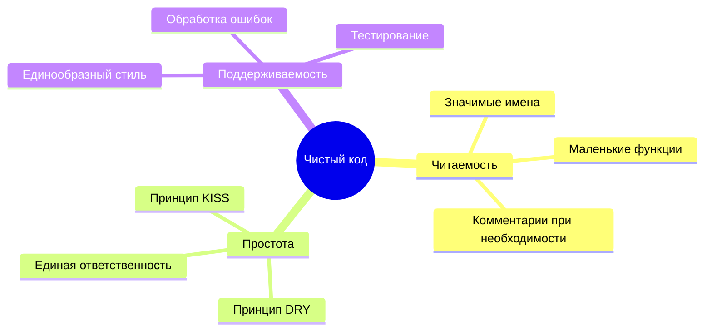

## Обзор

Чистый код - это код, который легко читается, понимается и поддерживается. Это руководство охватывает принципы чистого кода, специально применяемые к разработке модулей XOOPS.

## Основные принципы



## Значимые имена

### Переменные

```php
// Плохо
$d = new DateTime();
$u = $memberHandler->getUser($id);
$arr = [];

// Хорошо
$createdDate = new DateTime();
$currentUser = $memberHandler->getUser($userId);
$publishedArticles = [];
```

### Функции

```php
// Плохо
function process($data) { ... }
function handle($item) { ... }
function doStuff($x, $y) { ... }

// Хорошо
function publishArticle(Article $article): void { ... }
function calculateTotalPrice(array $items): float { ... }
function sendNotificationEmail(User $user, string $subject): bool { ... }
```

### Классы

```php
// Плохо
class Manager { ... }
class Helper { ... }
class Utils { ... }

// Хорошо
class ArticleRepository { ... }
class NotificationService { ... }
class PermissionChecker { ... }
```

## Маленькие функции

### Единая ответственность

```php
// Плохо - делает слишком много
function processArticle($data) {
    // Валидация
    if (empty($data['title'])) {
        throw new Exception('Title required');
    }
    // Сохранение
    $article = new Article();
    $article->setTitle($data['title']);
    $this->repository->save($article);
    // Уведомление
    $this->mailer->send($article->getAuthor(), 'Article published');
    // Логирование
    $this->logger->info('Article created');
    return $article;
}

// Хорошо - каждая функция делает одно
function validateArticleData(array $data): void
{
    if (empty($data['title'])) {
        throw new ValidationException('Title required');
    }
}

function createArticle(array $data): Article
{
    $this->validateArticleData($data);
    return Article::create($data['title'], $data['content']);
}

function publishArticle(Article $article): void
{
    $this->repository->save($article);
    $this->notifyAuthor($article);
    $this->logArticleCreation($article);
}
```

### Длина функции

Держите функции короткими - в идеале менее 20 строк:

```php
// Хорошо - сфокусированная функция
public function getPublishedArticles(int $limit = 10): array
{
    $criteria = new CriteriaCompo();
    $criteria->add(new Criteria('status', 'published'));
    $criteria->setSort('published_at');
    $criteria->setOrder('DESC');
    $criteria->setLimit($limit);

    return $this->repository->getObjects($criteria);
}
```

## Принцип DRY (Не повторяйте себя)

### Извлеките общий код

```php
// Плохо - повторяющийся код
function getActiveUsers() {
    $criteria = new CriteriaCompo();
    $criteria->add(new Criteria('level', 0, '>'));
    $criteria->setSort('uname');
    return $this->userHandler->getObjects($criteria);
}

function getActiveAdmins() {
    $criteria = new CriteriaCompo();
    $criteria->add(new Criteria('level', 0, '>'));
    $criteria->add(new Criteria('is_admin', 1));
    $criteria->setSort('uname');
    return $this->userHandler->getObjects($criteria);
}

// Хорошо - общая логика извлечена
function getUsers(CriteriaCompo $criteria): array
{
    $criteria->add(new Criteria('level', 0, '>'));
    $criteria->setSort('uname');
    return $this->userHandler->getObjects($criteria);
}

function getActiveUsers(): array
{
    return $this->getUsers(new CriteriaCompo());
}

function getActiveAdmins(): array
{
    $criteria = new CriteriaCompo();
    $criteria->add(new Criteria('is_admin', 1));
    return $this->getUsers($criteria);
}
```

## Обработка ошибок

### Используйте исключения правильно

```php
// Плохо - общие исключения
throw new Exception('Error');

// Хорошо - конкретные исключения
throw new ArticleNotFoundException($articleId);
throw new PermissionDeniedException('Cannot edit article');
throw new ValidationException(['title' => 'Title is required']);
```

### Обработайте ошибки изящно

```php
public function findArticle(string $id): ?Article
{
    try {
        return $this->repository->findById($id);
    } catch (DatabaseException $e) {
        $this->logger->error('Database error finding article', [
            'id' => $id,
            'error' => $e->getMessage()
        ]);
        throw new ServiceException('Unable to retrieve article', 0, $e);
    }
}
```

## Комментарии

### Когда писать комментарии

```php
// Плохо - очевидный комментарий
// Увеличить счетчик
$counter++;

// Хорошо - объясняет почему, не что
// Кеширование на 1 час для снижения нагрузки на БД в часы пик
$cache->set($key, $data, 3600);

// Хорошо - документирует сложный алгоритм
/**
 * Вычислить оценку релевантности статьи с использованием алгоритма TF-IDF.
 * Более высокие баллы указывают на лучшее соответствие поисковым запросам.
 */
function calculateRelevanceScore(Article $article, array $terms): float
{
    // ...
}
```

## Организация кода

### Структура класса

```php
class ArticleService
{
    // 1. Константы
    private const MAX_TITLE_LENGTH = 255;

    // 2. Свойства
    private ArticleRepository $repository;
    private EventDispatcher $events;

    // 3. Конструктор
    public function __construct(
        ArticleRepository $repository,
        EventDispatcher $events
    ) {
        $this->repository = $repository;
        $this->events = $events;
    }

    // 4. Открытые методы
    public function publish(Article $article): void { ... }
    public function archive(Article $article): void { ... }

    // 5. Приватные методы
    private function validateForPublication(Article $article): void { ... }
}
```

## Чеклист чистого кода

- [ ] Имена значимые и произносимые
- [ ] Функции делают одно только
- [ ] Функции маленькие (< 20 строк)
- [ ] Нет дублирующегося кода
- [ ] Надлежащая обработка ошибок с конкретными исключениями
- [ ] Комментарии объясняют "почему", не "что"
- [ ] Согласованное форматирование и стиль
- [ ] Нет магических чисел или строк
- [ ] Зависимости внедрены, не созданы

## Связанная документация

- Code Organization
- Error Handling
- Testing Best Practices
- PHP Standards
