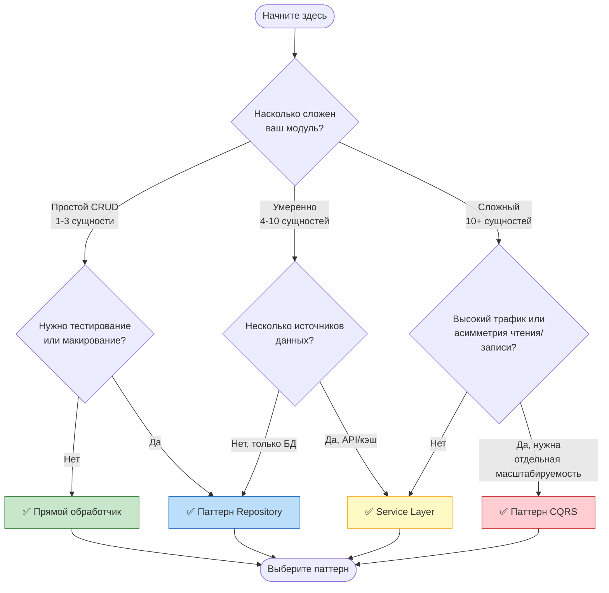
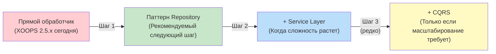

<span class="version-badge version-25x">2.5.x ✅</span> <span class="version-badge version-40x">4.0.x ✅</span>

> **Какой паттерн мне использовать?** Это дерево решений помогает вам выбрать между прямыми обработчиками, паттерном Repository, Service Layer и CQRS.

---

## Быстрое дерево решений



---

## Сравнение паттернов

| Критерий | Прямой обработчик | Repository | Service Layer | CQRS |
|----------|---------------|------------|---------------|------|
| **Сложность** | ⭐ | ⭐⭐ | ⭐⭐⭐ | ⭐⭐⭐⭐⭐ |
| **Тестируемость** | ❌ Сложно | ✅ Хорошо | ✅ Отлично | ✅ Отлично |
| **Гибкость** | ❌ Низкая | ✅ Средняя | ✅ Высокая | ✅ Очень высокая |
| **XOOPS 2.5.x** | ✅ Нативно | ✅ Работает | ✅ Работает | ⚠️ Сложно |
| **XOOPS 4.0** | ⚠️ Устаревший | ✅ Рекомендуется | ✅ Рекомендуется | ✅ Для масштабирования |
| **Размер команды** | 1 разработчик | 1-3 разработчика | 2-5 разработчиков | 5+ разработчиков |
| **Обслуживание** | ❌ Выше | ✅ Умеренно | ✅ Ниже | ⚠️ Требует навыков |

---

## Когда использовать каждый паттерн

### ✅ Прямой обработчик (`XoopsPersistableObjectHandler`)

**Лучше всего для:** Простых модулей, быстрых прототипов, изучение XOOPS

```php
// Простой и прямой - хорошо для небольших модулей
$handler = xoops_getModuleHandler('article', 'news');
$articles = $handler->getObjects(new Criteria('status', 1));
```

**Выберите это, когда:**
- Создаете простой модуль с 1-3 таблицами базы данных
- Создаете быстрый прототип
- Вы единственный разработчик и не нужны тесты
- Модуль не будет значительно расти

**Ограничения:**
- Сложно тестировать модулем (глобальная зависимость)
- Плотная связь со слоем базы данных XOOPS
- Бизнес-логика имеет тенденцию просачиваться в контроллеры

---

### ✅ Паттерн Repository

**Лучше всего для:** Большинства модулей, команд, хотящих тестируемости

```php
// Абстракция позволяет макировать для тестов
interface ArticleRepositoryInterface {
    public function findPublished(): array;
    public function save(Article $article): void;
}

class XoopsArticleRepository implements ArticleRepositoryInterface {
    private $handler;

    public function __construct() {
        $this->handler = xoops_getModuleHandler('article', 'news');
    }

    public function findPublished(): array {
        return $this->handler->getObjects(new Criteria('status', 1));
    }
}
```

**Выберите это, когда:**
- Хотите писать модульные тесты
- Возможно, позже измените источники данных (БД → API)
- Работаете с 2+ разработчиками
- Создаете модули для распространения

**Путь обновления:** Это рекомендуемый паттерн для подготовки к XOOPS 4.0.

---

### ✅ Service Layer

**Лучше всего для:** Модулей с сложной бизнес-логикой

```php
// Service координирует несколько репозиториев и содержит бизнес-правила
class ArticlePublicationService {
    public function __construct(
        private ArticleRepositoryInterface $articles,
        private NotificationServiceInterface $notifications,
        private CacheInterface $cache
    ) {}

    public function publish(int $articleId): void {
        $article = $this->articles->find($articleId);
        $article->setStatus('published');
        $article->setPublishedAt(new DateTime());

        $this->articles->save($article);
        $this->notifications->notifySubscribers($article);
        $this->cache->invalidate("article:{$articleId}");
    }
}
```

**Выберите это, когда:**
- Операции охватывают несколько источников данных
- Бизнес-правила сложны
- Нужно управление транзакциями
- Несколько частей приложения делают то же самое

**Путь обновления:** Объедините с Repository для надежной архитектуры.

---

### ⚠️ CQRS (Разделение ответственности команд и запросов)

**Лучше всего для:** Модулей большого масштаба с асимметрией чтения/записи

```php
// Команды изменяют состояние
class PublishArticleCommand {
    public function __construct(
        public readonly int $articleId,
        public readonly int $publisherId
    ) {}
}

// Запросы читают состояние (могут использовать денормализованные модели чтения)
class GetPublishedArticlesQuery {
    public function __construct(
        public readonly int $limit = 10
    ) {}
}
```

**Выберите это, когда:**
- Чтения значительно превышают записи (100:1 или больше)
- Нужна различная масштабируемость для чтения и записи
- Сложные требования отчетности/аналитики
- Event sourcing будет полезен для вашего домена

**Предупреждение:** CQRS добавляет значительную сложность. Большинству модулей XOOPS это не нужно.

---

## Рекомендуемый путь обновления



### Шаг 1: Оберните обработчики в репозитории (2-4 часа)

1. Создайте интерфейс для ваших потребностей доступа к данным
2. Реализуйте его с использованием существующего обработчика
3. Внедрите репозиторий вместо прямого вызова `xoops_getModuleHandler()`

### Шаг 2: Добавьте Service Layer при необходимости (1-2 дня)

1. Когда бизнес-логика появляется в контроллерах, извлеките в Service
2. Service использует репозитории, а не обработчики напрямую
3. Контроллеры становятся тонкими (маршрут → сервис → ответ)

### Шаг 3: Рассмотрите CQRS только если (редко)

1. У вас миллионы операций чтения в день
2. Модели чтения и записи существенно отличаются
3. Вам нужен event sourcing для журналов аудита
4. У вас есть команда, опытная в CQRS

---

## Карточка быстрого справочника

| Вопрос | Ответ |
|----------|--------|
| **"Мне просто нужно сохранять/загружать данные"** | Прямой обработчик |
| **"Я хочу писать тесты"** | Паттерн Repository |
| **"У меня сложные бизнес-правила"** | Service Layer |
| **"Мне нужно масштабировать чтение отдельно"** | CQRS |
| **"Я готовлюсь к XOOPS 4.0"** | Repository + Service Layer |

---

## Связанная документация

- [Руководство по паттерну Repository](Patterns/Repository-Pattern.md)
- [Руководство по паттерну Service Layer](Patterns/Service-Layer-Pattern.md)
- [Руководство по паттерну CQRS](../07-XOOPS-4.0/Implementation-Guides/CQRS-Pattern-Guide.md) *(продвинуто)*
- [Контракт гибридного режима](../07-XOOPS-4.0/Specifications/Hybrid-Mode-Contract.md)

---

#patterns #data-access #decision-tree #best-practices #xoops
