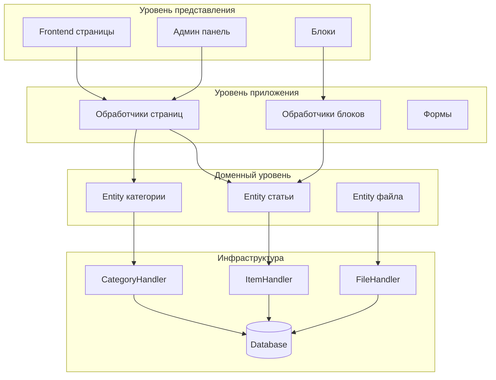

## Обзор

Этот документ содержит технический анализ архитектуры модуля Publisher, паттернов и деталей реализации. Используйте это как справку для понимания того, как устроен модуль XOOPS производственного качества.

## Обзор архитектуры



## Структура каталогов

```
publisher/
├── admin/
│   ├── index.php           # Админ панель
│   ├── item.php            # Управление статьями
│   ├── category.php        # Управление категориями
│   ├── permission.php      # Разрешения
│   ├── file.php            # Менеджер файлов
│   └── menu.php            # Админ меню
├── assets/
│   ├── css/
│   ├── js/
│   └── images/
├── class/
│   ├── Category.php        # Entity категории
│   ├── CategoryHandler.php # Доступ к данным категории
│   ├── Item.php            # Entity статьи
│   ├── ItemHandler.php     # Доступ к данным статьи
│   ├── File.php            # Вложение файла
│   ├── FileHandler.php     # Доступ к данным файла
│   ├── Form/               # Классы форм
│   ├── Common/             # Утилиты
│   └── Helper.php          # Помощник модуля
├── include/
│   ├── common.php          # Инициализация
│   ├── functions.php       # Функции утилит
│   ├── oninstall.php       # Крючки установки
│   ├── onupdate.php        # Крючки обновления
│   └── search.php          # Интеграция поиска
├── language/
├── templates/
├── sql/
└── xoops_version.php
```

## Анализ Entity

### Entity статьи (Item)

Модель данных для статей Publisher с полями для заголовка, содержания, категорий, авторства, статусов публикации и метаданных.

## Обработчики (Handlers)

Обработчики обеспечивают операции CRUD и бизнес-логику для каждого Entity. ItemHandler управляет жизненным циклом статей, CategoryHandler управляет категориями, FileHandler управляет вложениями.

## Паттерны проектирования

### MVC паттерн

Publisher следует MVC архитектуре XOOPS:
- **Model**: Classes (Item, Category, File)
- **View**: Templates (publisher_*.tpl)
- **Controller**: Admin/Frontend handlers

### DAO паттерн

Обработчики (ItemHandler, CategoryHandler, и т.д.) реализуют паттерн Data Access Object для отделения логики доступа к данным.

### Observer паттерн

Publisher использует крючки XOOPS (hooks) и события для поддержки наблюдателей и расширяемости.

## Похожие руководства

- API Reference
- Custom Templates
- Extending Publisher

---

#publisher #architecture #development #xoops
