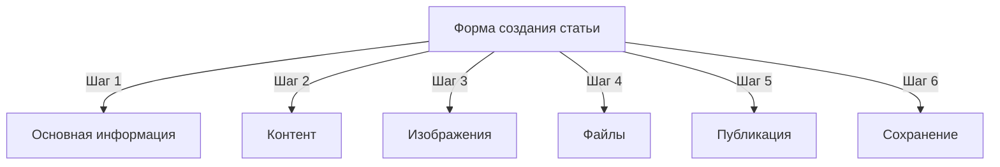
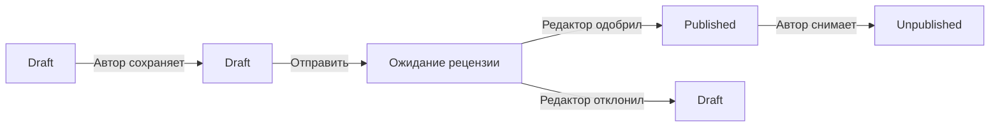
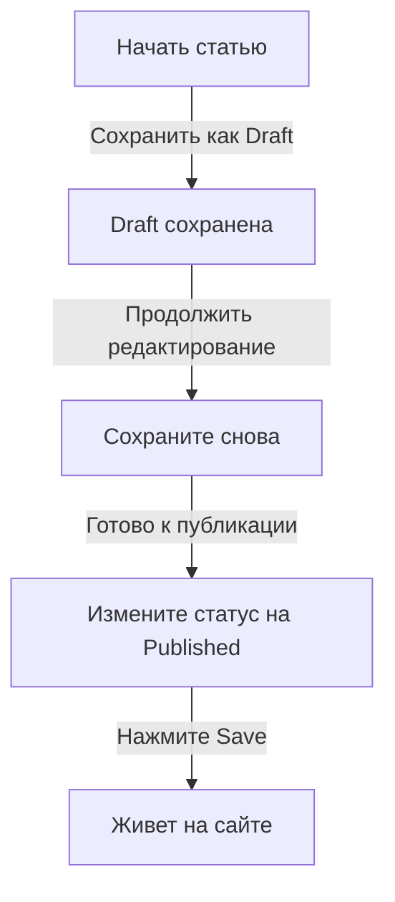

# Создание статей в Publisher

> Пошаговое руководство по созданию, редактированию, форматированию и публикации статей в модуле Publisher.

---

## Доступ к управлению статьями

### Навигация по панели администратора

```
Admin Panel
└── Modules
    └── Publisher
        └── Articles
            ├── Create New
            ├── Edit
            ├── Delete
            └── Publish
```

### Самый быстрый путь

1. Войдите как **Administrator**
2. Нажмите **Modules** в админ панели
3. Найдите **Publisher**
4. Нажмите ссылку **Admin**
5. Нажмите **Articles** в левом меню
6. Нажмите кнопку **Add Article**

---

## Форма создания статьи

### Основная информация

При создании новой статьи заполните следующие разделы:



---

## Шаг 1: Основная информация

### Обязательные поля

#### Название статьи

```
Поле: Title
Тип: Текстовое поле (обязательно)
Макс. длина: 255 символов
Пример: "Топ 5 советов для лучшей фотографии"
```

**Рекомендации:**
- Описательно и конкретно
- Включайте ключевые слова для SEO
- Избегайте КАПСЛОКА
- Держите не более 60 символов для лучшего отображения

#### Выбор категории

```
Поле: Category
Тип: Раскрывающийся список (обязательно)
Варианты: Список созданных категорий
Пример: Photography > Tutorials
```

**Советы:**
- Доступны родительские категории и подкатегории
- Выберите наиболее релевантную категорию
- Только одна категория на статью
- Может быть изменена позже

#### Подзаголовок статьи (опционально)

```
Поле: Subtitle
Тип: Текстовое поле (опционально)
Макс. длина: 255 символов
Пример: "Изучите основы фотографии в 5 простых шагов"
```

**Используется для:**
- Сводный заголовок
- Текст тизера
- Расширенный заголовок

### Описание статьи

#### Краткое описание

```
Поле: Short Description
Тип: Textarea (опционально)
Макс. длина: 500 символов
```

**Назначение:**
- Текст превью статьи
- Отображается в списке категории
- Используется в результатах поиска
- Meta description для SEO

**Пример:**
```
"Откройте для себя важные методы фотографии, которые превратят ваши фото
из обычных в необыкновенные. Это полное руководство охватывает композицию,
освещение и параметры экспозиции."
```

#### Полное содержание

```
Поле: Article Body
Тип: WYSIWYG Editor (обязательно)
Макс. длина: Неограниченно
Формат: HTML
```

Основная область содержания статьи с редактированием в формате WYSIWYG.

---

## Шаг 2: Форматирование контента

### Использование WYSIWYG редактора

#### Форматирование текста

```
Жирный:         Ctrl+B или нажмите кнопку [B]
Курсив:         Ctrl+I или нажмите кнопку [I]
Подчеркивание:  Ctrl+U или нажмите кнопку [U]
Зачеркивание:   Alt+Shift+D или нажмите кнопку [S]
Подстрочный:    Ctrl+, (запятая)
Надстрочный:    Ctrl+. (точка)
```

#### Структура заголовков

Создайте правильную иерархию документа:

```html
<h1>Название статьи</h1>      <!-- Используется один раз вверху -->
<h2>Основной раздел</h2>        <!-- Для основных разделов -->
<h3>Подраздел</h3>              <!-- Для подтем -->
<h4>Под-подраздел</h4>          <!-- Для деталей -->
```

**В редакторе:**
- Нажмите раскрывающийся список **Format**
- Выберите уровень заголовка (H1-H6)
- Введите ваш заголовок

#### Списки

**Неупорядоченный список (маркеры):**

```markdown
• Первый пункт
• Второй пункт
• Третий пункт
```

Шаги в редакторе:
1. Нажмите кнопку [≡] Bulleted list
2. Введите каждый пункт
3. Нажмите Enter для следующего элемента
4. Нажмите Backspace два раза для окончания списка

**Упорядоченный список (нумерованный):**

```markdown
1. Первый шаг
2. Второй шаг
3. Третий шаг
```

Шаги в редакторе:
1. Нажмите кнопку [1.] Numbered list
2. Введите каждый элемент
3. Нажмите Enter для следующего
4. Нажмите Backspace два раза для окончания

**Вложенные списки:**

```markdown
1. Основной пункт
   a. Подпункт
   b. Подпункт
2. Следующий пункт
```

Шаги:
1. Создайте первый список
2. Нажмите Tab для отступа
3. Создайте вложенные элементы
4. Нажмите Shift+Tab для отмены отступа

#### Ссылки

**Добавить гиперссылку:**

1. Выберите текст для ссылки
2. Нажмите кнопку **[🔗] Link**
3. Введите URL: `https://example.com`
4. Опционально: Добавьте название/цель
5. Нажмите **Insert Link**

**Удалить ссылку:**

1. Кликните в тексте со ссылкой
2. Нажмите кнопку **[🔗] Remove Link**

#### Код и цитаты

**Блоковая цитата:**

```
"Это важная цитата от эксперта"
- Атрибуция
```

Шаги:
1. Введите текст цитаты
2. Нажмите кнопку **[❝] Blockquote**
3. Текст будет отступлен и стилизован

**Блок кода:**

```python
def hello_world():
    print("Hello, World!")
```

Шаги:
1. Нажмите **Format → Code**
2. Вставьте код
3. Выберите язык (опционально)
4. Код отображается с подсветкой синтаксиса

---

## Шаг 3: Добавление изображений

### Главное изображение (Hero Image)

```
Поле: Featured Image / Main Image
Тип: Загрузка изображения
Формат: JPG, PNG, GIF, WebP
Макс. размер: 5 МБ
Рекомендуется: 600x400 px
```

**Для загрузки:**

1. Нажмите кнопку **Upload Image**
2. Выберите изображение с компьютера
3. Обрезьте/измените размер если нужно
4. Нажмите **Use This Image**

**Размещение изображения:**
- Отображается в верхней части статьи
- Используется в списках категорий
- Показывается в архиве
- Используется для обмена в социальных сетях

### Встроенные изображения

Вставляйте изображения в текст статьи:

1. Расположите курсор в редакторе где должно быть изображение
2. Нажмите кнопку **[🖼️] Image** на панели инструментов
3. Выберите вариант загрузки:
   - Загрузить новое изображение
   - Выбрать из галереи
   - Введить URL изображения
4. Настройте:
   ```
   Размер изображения:
   - Ширина: 300-600 px
   - Высота: Auto (сохраняет пропорции)
   - Выравнивание: Left/Center/Right
   ```
5. Нажмите **Insert Image**

**Обтекание изображения текстом:**

В редакторе после вставки:

```html
<!-- Изображение слева, текст обтекает его -->

```

### Галерея изображений

Создайте галерею с несколькими изображениями:

1. Нажмите кнопку **Gallery** (если доступна)
2. Загрузите несколько изображений:
   - Одиночный клик: Добавить одно
   - Drag & drop: Добавить несколько
3. Расположите порядок путем перетаскивания
4. Установите описания для каждого изображения
5. Нажмите **Create Gallery**

---

## Шаг 4: Присоединение файлов

### Добавить вложения файлов

```
Поле: File Attachments
Тип: Загрузка файла (несколько разрешено)
Поддерживаемые: PDF, DOC, XLS, ZIP, и т.д.
Макс. на файл: 10 МБ
Макс. на статью: 5 файлов
```

**Для присоединения:**

1. Нажмите кнопку **Add File**
2. Выберите файл с компьютера
3. Опционально: Добавьте описание файла
4. Нажмите **Attach File**
5. Повторите для нескольких файлов

**Примеры файлов:**
- PDF руководства
- Excel таблицы
- Word документы
- ZIP архивы
- Исходный код

### Управление присоединенными файлами

**Редактировать файл:**

1. Нажмите имя файла
2. Отредактируйте описание
3. Нажмите **Save**

**Удалить файл:**

1. Найдите файл в списке
2. Нажмите иконку **[×] Delete**
3. Подтвердите удаление

---

## Шаг 5: Публикация и статус

### Статус статьи

```
Поле: Status
Тип: Раскрывающийся список
Варианты:
  - Draft: Не опубликовано, видит только автор
  - Pending: Ожидание одобрения
  - Published: Живет на сайте
  - Archived: Старый контент
  - Unpublished: Была опубликована, теперь скрыта
```

**Рабочий процесс статуса:**



### Варианты публикации

#### Опубликовать сразу

```
Статус: Published
Дата начала: Сегодня (автоматически)
Дата окончания: (оставьте пусто для отсутствия срока)
```

#### Планирование на позже

```
Статус: Scheduled
Дата начала: Будущая дата/время
Пример: 15 февраля 2024 года в 9:00 AM
```

Статья автоматически опубликуется в указанное время.

#### Установка срока действия

```
Включить срок действия: Yes
Дата срока действия: Будущая дата
Действие: Archive/Hide/Delete
Пример: 1 апреля 2024 года (статья автоматически архивируется)
```

### Параметры видимости

```yaml
Показать статью:
  - Отображать на главной странице: Yes/No
  - Показывать в категории: Yes/No
  - Включать в поиск: Yes/No
  - Включать в последние статьи: Yes/No

Избранная статья:
  - Отметить как избранное: Yes/No
  - Позиция в разделе избранного: (число)
```

---

## Шаг 6: SEO и метаданные

### Параметры SEO

```
Поле: SEO Settings (Развернуть раздел)
```

#### Мета-описание

```
Поле: Meta Description
Тип: Text (160 символов рекомендуется)
Используется: Поисковыми системами, социальными сетями

Пример:
"Изучите основы фотографии в 5 простых шагов.
Откройте техники композиции, освещения и экспозиции."
```

#### Мета-ключевые слова

```
Поле: Meta Keywords
Тип: Список через запятую
Макс: 5-10 ключевых слов

Пример: Фотография, Туториал, Композиция, Освещение, Экспозиция
```

#### URL Slug

```
Поле: URL Slug (автоматически создано из названия)
Тип: Text
Формат: строчные буквы, дефисы, без пробелов

Авто: "top-5-tips-for-better-photography"
Редактировать: Измените перед публикацией
```

#### Open Graph теги

Автоматически созданы из информации статьи:
- Title
- Description
- Featured image
- Article URL
- Publication date

Используется Facebook, LinkedIn, WhatsApp, и т.д.

---

## Шаг 7: Комментарии и взаимодействие

### Параметры комментариев

```yaml
Разрешить комментарии:
  - Включить: Yes/No
  - По умолчанию: Наследуется из предпочтений
  - Переопределить: Специфично для этой статьи

Модерировать комментарии:
  - Требовать одобрения: Yes/No
  - По умолчанию: Наследуется из предпочтений
```

### Параметры оценок

```yaml
Разрешить оценки:
  - Включить: Yes/No
  - Шкала: 5 звезд (по умолчанию)
  - Показать среднее: Yes/No
  - Показать количество: Yes/No
```

---

## Шаг 8: Дополнительные параметры

### Автор и подпись

```
Поле: Author
Тип: Раскрывающийся список
По умолчанию: Текущий пользователь
Варианты: Все пользователи с разрешением автора

Отображение:
  - Показать имя автора: Yes/No
  - Показать биографию автора: Yes/No
  - Показать аватар автора: Yes/No
```

### Блокировка редактирования

```
Поле: Edit Lock
Назначение: Предотвратить случайные изменения

Заблокировать статью:
  - Заблокировано: Yes/No
  - Причина блокировки: "Финальная версия"
  - Дата разблокировки: (опционально)
```

### История версий

Автоматически сохраняемые версии статьи:

```
Просмотр редакций:
  - Нажмите "Revision History"
  - Показывает все сохраненные версии
  - Сравнивайте версии
  - Восстановите предыдущую версию
```

---

## Сохранение и публикация

### Рабочий процесс сохранения



### Сохранить статью

**Автосохранение:**
- Срабатывает каждые 60 секунд
- Автоматически сохраняет как черновик
- Показывает "Last saved: 2 minutes ago"

**Ручное сохранение:**
- Нажмите **Save & Continue** чтобы продолжить редактирование
- Нажмите **Save & View** чтобы увидеть опубликованную версию
- Нажмите **Save** чтобы сохранить и закрыть

### Опубликовать статью

1. Установите **Status**: Published
2. Установите **Start Date**: Now (или будущую дату)
3. Нажмите **Save** или **Publish**
4. Появится сообщение подтверждения
5. Статья опубликована (или запланирована)

---

## Редактирование существующих статей

### Доступ к редактору статей

1. Перейдите в **Admin → Publisher → Articles**
2. Найдите статью в списке
3. Нажмите иконку/кнопку **Edit**
4. Внесите изменения
5. Нажмите **Save**

### Пакетное редактирование

Отредактируйте несколько статей одновременно:

```
1. Перейдите в список Articles
2. Выберите статьи (флажки)
3. Выберите "Bulk Edit" из раскрывающегося списка
4. Измените выбранное поле
5. Нажмите "Update All"

Доступно для:
  - Status
  - Category
  - Featured (Yes/No)
  - Author
```

### Предпросмотр статьи

Перед публикацией:

1. Нажмите кнопку **Preview**
2. Просмотрите как читатели будут видеть
3. Проверьте форматирование
4. Протестируйте ссылки
5. Вернитесь в редактор для корректировки

---

## Управление статьями

### Просмотр всех статей

**Представление списка статей:**

```
Admin → Publisher → Articles

Колонки:
  - Title
  - Category
  - Author
  - Status
  - Created date
  - Modified date
  - Actions (Edit, Delete, Preview)

Сортировка:
  - По названию (A-Z)
  - По дате (новые/старые)
  - По статусу (Published/Draft)
  - По категории
```

### Фильтрация статей

```
Варианты фильтра:
  - По категории
  - По статусу
  - По автору
  - По диапазону дат
  - Поиск по названию

Пример: Показать все статьи "Draft" от "John" в категории "News"
```

### Удаление статьи

**Мягкое удаление (рекомендуется):**

1. Измените **Status**: Unpublished
2. Нажмите **Save**
3. Статья скрыта, но не удалена
4. Может быть восстановлена позже

**Жесткое удаление:**

1. Выберите статью в списке
2. Нажмите кнопку **Delete**
3. Подтвердите удаление
4. Статья удалена навсегда

---

## Лучшие практики контента

### Написание качественных статей

```
Структура:
  ✓ Привлекательное название
  ✓ Ясный подзаголовок/описание
  ✓ Увлекательное открытие
  ✓ Логические разделы с заголовками
  ✓ Поддерживающие визуалы
  ✓ Заключение/резюме
  ✓ Call-to-action

Длина:
  - Блог посты: 500-2000 слов
  - Новости: 300-800 слов
  - Руководства: 2000-5000 слов
  - Минимум: 300 слов
```

### Оптимизация SEO

```
Оптимизация названия:
  ✓ Включайте основное ключевое слово
  ✓ Держите под 60 символов
  ✓ Поместите ключевое слово в начало
  ✓ Будьте описательны и конкретны

Оптимизация контента:
  ✓ Используйте заголовки (H1, H2, H3)
  ✓ Включайте ключевое слово в заголовок
  ✓ Выделяйте важные термины жирным
  ✓ Добавляйте описательные ссылки
  ✓ Включайте изображения с alt текстом

Мета-описание:
  ✓ Включайте основное ключевое слово
  ✓ 155-160 символов
  ✓ Ориентировано на действие
  ✓ Уникально на статью
```

### Советы по форматированию

```
Читаемость:
  ✓ Короткие параграфы (2-4 предложения)
  ✓ Маркированные списки для перечислений
  ✓ Подзаголовки каждые 300 слов
  ✓ Щедрое белое пространство
  ✓ Разрывы строк между разделами

Визуальная привлекательность:
  ✓ Главное изображение вверху
  ✓ Встроенные изображения в контент
  ✓ Alt текст на всех изображениях
  ✓ Блоки кода для технического
  ✓ Блоковые цитаты для выделения
```

---

## Клавиатурные сокращения

### Сокращения редактора

```
Жирный:               Ctrl+B
Курсив:               Ctrl+I
Подчеркивание:        Ctrl+U
Ссылка:               Ctrl+K
Сохранить черновик:   Ctrl+S
```

### Текстовые сокращения

```
-- →  (дефис на тире)
... → … (три точки на многоточие)
(c) → © (авторское право)
(r) → ® (зарегистрировано)
(tm) → ™ (торговый знак)
```

---

## Общие задачи

### Копирование статьи

1. Откройте статью
2. Нажмите кнопку **Duplicate** или **Clone**
3. Статья скопирована как черновик
4. Отредактируйте название и контент
5. Опубликуйте

### Планирование статьи

1. Создайте статью
2. Установите **Start Date**: Будущая дата/время
3. Установите **Status**: Published
4. Нажмите **Save**
5. Статья автоматически опубликуется

### Пакетная публикация

1. Создайте статьи как черновики
2. Установите даты публикации
3. Статьи автоматически опубликуются в назначенное время
4. Мониторьте из представления "Scheduled"

### Перемещение между категориями

1. Отредактируйте статью
2. Измените раскрывающийся список **Category**
3. Нажмите **Save**
4. Статья появится в новой категории

---

## Устранение неполадок

### Проблема: Не удается сохранить статью

**Решение:**
```
1. Проверьте форму на обязательные поля
2. Проверьте выбрана ли категория
3. Проверьте лимит памяти PHP
4. Попробуйте сохранить как черновик сначала
5. Очистите кэш браузера
```

### Проблема: Изображения не отображаются

**Решение:**
```
1. Проверьте успешность загрузки изображения
2. Проверьте формат файла изображения (JPG, PNG)
3. Проверьте путь к изображению в базе данных
4. Проверьте разрешения на каталог загрузки
5. Попробуйте загрузить изображение снова
```

### Проблема: Панель инструментов редактора не отображается

**Решение:**
```
1. Очистите кэш браузера
2. Попробуйте другой браузер
3. Отключите расширения браузера
4. Проверьте консоль JavaScript на ошибки
5. Проверьте установлен ли плагин редактора
```

### Проблема: Статья не опубликуется

**Решение:**
```
1. Проверьте Status = "Published"
2. Проверьте Start Date сегодня или раньше
3. Проверьте разрешения позволяют публикацию
4. Проверьте категория опубликована
5. Очистите кэш модуля
```

---

## Связанные руководства

- Configuration Guide
- Category Management
- Permission Setup
- Custom Templates

---

## Следующие шаги

- Создайте свою первую статью
- Установите категории
- Настройте разрешения
- Просмотрите пользовательские шаблоны

---

#publisher #articles #content #creation #formatting #editing #xoops
