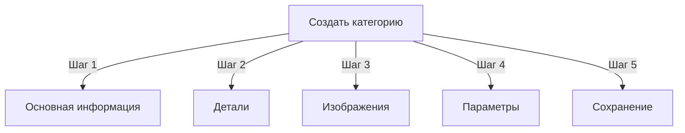

# Управление категориями в Publisher

> Полное руководство по созданию, организации иерархий и управлению категориями в модуле Publisher.

---

## Основы категорий

### Что такое категории?

Категории организуют статьи в логические группы:

```
Пример структуры:

  Новости (Основная категория)
    ├── Технология
    ├── Спорт
    └── Развлечения

  Туториалы (Основная категория)
    ├── Фотография
    │   ├── Основы
    │   └── Продвинутое
    └── Написание
        └── Ведение блога
```

### Преимущества хорошей структуры категорий

```
✓ Лучшая навигация пользователя
✓ Организованный контент
✓ Улучшенная SEO
✓ Более простое управление контентом
✓ Лучший редакционный рабочий процесс
```

---

## Доступ к управлению категориями

### Навигация по админ панели

```
Админ панель
└── Modules
    └── Publisher
        └── Categories
            ├── Create New
            ├── Edit
            ├── Delete
            ├── Permissions
            └── Organize
```

### Быстрый доступ

1. Войдите как **Administrator**
2. Перейдите в **Admin → Modules**
3. Нажмите **Publisher → Admin**
4. Нажмите **Categories** в левом меню

---

## Создание категорий

### Форма создания категории



### Шаг 1: Основная информация

#### Название категории

```
Поле: Category Name
Тип: Текстовое поле (обязательно)
Макс. длина: 100 символов
Уникальность: Должно быть уникальным
Пример: "Фотография"
```

**Рекомендации:**
- Описательное и единственное или множественное число последовательно
- Правильно заглавное
- Избегайте специальных символов
- Держите разумно коротким

#### Описание категории

```
Поле: Description
Тип: Textarea (опционально)
Макс. длина: 500 символов
Используется в: Страницы списков категорий, блоки категорий
```

**Назначение:**
- Объясняет содержание категории
- Появляется над статьями категории
- Помогает пользователям понять область охвата
- Используется для SEO мета-описания

**Пример:**
```
"Советы по фотографии, туториалы и вдохновение для
всех уровней мастерства. От основ композиции до продвинутых
методов освещения, овладейте своим ремеслом."
```

### Шаг 2: Родительская категория

#### Создание иерархии

```
Поле: Parent Category
Тип: Раскрывающийся список
Варианты: Нет (корень), или существующие категории
```

**Примеры иерархии:**

```
Плоская структура:
  Новости
  Туториалы
  Обзоры

Вложенная структура:
  Новости
    Технология
    Бизнес
    Спорт
  Туториалы
    Фотография
      Основы
      Продвинутое
    Написание
```

**Создать подкатегорию:**

1. Нажмите раскрывающийся список **Parent Category**
2. Выберите родительскую (например, "Новости")
3. Заполните название категории
4. Сохраните
5. Новая категория появится как дочерняя

### Шаг 3: Изображение категории

#### Загрузка изображения категории

```
Поле: Category Image
Тип: Загрузка изображения (опционально)
Формат: JPG, PNG, GIF, WebP
Макс. размер: 5 МБ
Рекомендуется: 300x200 px (или размер вашей темы)
```

**Для загрузки:**

1. Нажмите кнопку **Upload Image**
2. Выберите изображение с компьютера
3. Обрезьте/измените размер если нужно
4. Нажмите **Use This Image**

**Где используется:**
- Страница списка категорий
- Заголовок блока категорий
- Хлебные крошки (некоторые темы)
- Обмен в социальных сетях

### Шаг 4: Параметры категории

#### Параметры отображения

```yaml
Статус:
  - Включено: Yes/No
  - Скрыто: Yes/No (скрыто из меню, остается доступным)

Параметры отображения:
  - Показать описание: Yes/No
  - Показать изображение: Yes/No
  - Показать количество статей: Yes/No
  - Показать подкатегории: Yes/No

Макет:
  - Элементов на странице: 10-50
  - Порядок отображения: Date/Title/Author
  - Направление отображения: Ascending/Descending
```

#### Разрешения категории

```yaml
Кто может просматривать:
  - Анонимные: Yes/No
  - Зарегистрированные: Yes/No
  - Конкретные группы: Настраивается по группам

Кто может отправлять:
  - Зарегистрированные: Yes/No
  - Конкретные группы: Настраивается по группам
  - Автор должен иметь: разрешение "submit articles"
```

### Шаг 5: Параметры SEO

#### Мета-теги

```
Поле: Meta Description
Тип: Text (160 символов)
Назначение: Описание поисковой системы

Поле: Meta Keywords
Тип: Список через запятую
Пример: фотография, туториалы, советы, методы
```

#### Конфигурация URL

```
Поле: URL Slug
Тип: Text
Автоматически создано из названия категории
Пример: "photography" из "Photography"
Может быть кастомизировано перед сохранением
```

### Сохранить категорию

1. Заполните все обязательные поля:
   - Category Name ✓
   - Description (рекомендуется)
2. Опционально: Загрузите изображение, установите SEO
3. Нажмите **Save Category**
4. Появится сообщение подтверждения
5. Категория теперь доступна

---

## Иерархия категорий

### Создание вложенной структуры

```
Пошаговый пример: Создание Новости → подкатегория Технология

1. Перейдите в админ категорий
2. Нажмите "Add Category"
3. Название: "Новости"
4. Родительская: (оставьте пусто - это корень)
5. Сохраните
6. Нажмите "Add Category" снова
7. Название: "Технология"
8. Родительская: "Новости" (выберите из раскрывающегося списка)
9. Сохраните
```

### Просмотр дерева иерархии

```
Представление категорий показывает структуру дерева:

📁 Новости
  📄 Технология
  📄 Спорт
  📄 Развлечения
📁 Туториалы
  📄 Фотография
    📄 Основы
    📄 Продвинутое
  📄 Написание
```

Нажмите стрелки расширения для показа/скрытия подкатегорий.

### Переорганизация категорий

#### Переместить категорию

1. Перейдите в список категорий
2. Нажмите **Edit** на категории
3. Измените **Parent Category**
4. Нажмите **Save**
5. Категория перемещена на новое место

#### Переупорядочить категории

Если доступно, используйте drag-and-drop:

1. Перейдите в список категорий
2. Кликните и перетащите категорию
3. Отпустите на новое место
4. Порядок сохраняется автоматически

#### Удаление категории

**Вариант 1: Мягкое удаление (скрытие)**

1. Отредактируйте категорию
2. Установите **Status**: Disabled
3. Нажмите **Save**
4. Категория скрыта, но не удалена

**Вариант 2: Жесткое удаление**

1. Перейдите в список категорий
2. Нажмите **Delete** на категории
3. Выберите действие для статей:
   ```
   ☐ Переместить статьи в родительскую категорию
   ☐ Переместить статьи в корень (Новости)
   ☐ Удалить все статьи в категории
   ```
4. Подтвердите удаление

---

## Операции с категориями

### Редактировать категорию

1. Перейдите в **Admin → Publisher → Categories**
2. Нажмите **Edit** на категории
3. Измените поля:
   - Название
   - Описание
   - Родительская категория
   - Изображение
   - Параметры
4. Нажмите **Save**

### Редактировать разрешения категории

1. Перейдите в категории
2. Нажмите **Permissions** на категории (или нажмите на категорию затем нажмите Permissions)
3. Настройте группы:

```
Для каждой группы:
  ☐ Просматривать статьи в этой категории
  ☐ Отправлять статьи в эту категорию
  ☐ Редактировать собственные статьи
  ☐ Редактировать все статьи
  ☐ Одобрять/модерировать статьи
  ☐ Управлять категорией
```

4. Нажмите **Save Permissions**

### Установить изображение категории

**Загрузить новое изображение:**

1. Отредактируйте категорию
2. Нажмите **Change Image**
3. Загрузите или выберите изображение
4. Обрезьте/измените размер
5. Нажмите **Use Image**
6. Нажмите **Save Category**

**Удалить изображение:**

1. Отредактируйте категорию
2. Нажмите **Remove Image** (если доступно)
3. Нажмите **Save Category**

---

## Разрешения категории

### Матрица разрешений

```
                     Анонимные  Регист.  Редактор  Админ
Просмотр категории      ✓        ✓        ✓        ✓
Отправка статьи         ✗        ✓        ✓        ✓
Редактирование своей    ✗        ✓        ✓        ✓
Редактирование всех     ✗        ✗        ✓        ✓
Модерирование статей    ✗        ✗        ✓        ✓
Управление категорией   ✗        ✗        ✗        ✓
```

### Установить разрешения на уровне категории

#### Контроль доступа по категориям

1. Перейдите в список **Categories**
2. Выберите категорию
3. Нажмите **Permissions**
4. Для каждой группы выберите разрешения:

```
Пример: Категория Новости
  Анонимные:      Только просмотр
  Зарегистрированные: Отправка статей
  Редакторы:      Одобрение статей
  Админы:         Полный контроль
```

5. Нажмите **Save**

#### Разрешения на уровне полей

Контролируйте какие поля формы пользователи могут видеть/редактировать:

```
Пример: Ограничить видимость полей для зарегистрированных

Зарегистрированные могут видеть/редактировать:
  ✓ Title
  ✓ Description
  ✓ Content
  ✗ Author (автоустановлено на текущего пользователя)
  ✗ Scheduled date (только редакторы)
  ✗ Featured (только админы)
```

**Настраивается в:**
- Category Permissions
- Найдите раздел "Field Visibility"

---

## Лучшие практики для категорий

### Структура категорий

```
✓ Держите иерархию 2-3 уровня глубиной
✗ Не создавайте слишком много категорий верхнего уровня
✗ Не создавайте категории с одной статьей

✓ Используйте последовательное наименование (множество или единственное)
✗ Не используйте неопределенные названия ("Материалы", "Другое")

✓ Создавайте категории для существующих статей
✗ Не создавайте пустые категории заранее
```

### Руководство по наименованию

```
Хорошие названия:
  "Фотография"
  "Веб разработка"
  "Советы путешествий"
  "Новости бизнеса"

Избегайте:
  "Статьи" (слишком неопределенно)
  "Контент" (избыточно)
  "Новости&Обновления" (несоответствие)
  "ФОТОГРАФИЯ МАТЕРИАЛЫ" (форматирование)
```

### Советы по организации

```
По тематике:
  Новости
    Технология
    Спорт
    Развлечения

По типу:
  Туториалы
    Видео
    Текст
    Интерактивные

По аудитории:
  Для новичков
  Для экспертов
  Примеры из практики

Географически:
  Северная Америка
    Соединенные Штаты
    Канада
  Европа
```

---

## Блоки категорий

### Блок категорий Publisher

Отображайте списки категорий на вашем сайте:

1. Перейдите в **Admin → Blocks**
2. Найдите **Publisher - Categories**
3. Нажмите **Edit**
4. Настройте:

```
Название блока: "Категории Новостей"
Показывать подкатегории: Yes/No
Показывать количество статей: Yes/No
Высота: (пиксели или авто)
```

5. Нажмите **Save**

### Блок статей категории

Показывайте последние статьи из конкретной категории:

1. Перейдите в **Admin → Blocks**
2. Найдите **Publisher - Category Articles**
3. Нажмите **Edit**
4. Выберите:

```
Категория: Новости (или конкретная категория)
Количество статей: 5
Показывать изображения: Yes/No
Показывать описание: Yes/No
```

5. Нажмите **Save**

---

## Аналитика категорий

### Просмотр статистики категорий

Из админа категорий:

```
Каждая категория показывает:
  - Всего статей: 45
  - Опубликовано: 42
  - Черновиков: 2
  - Ожидание одобрения: 1
  - Всего просмотров: 5,234
  - Последняя статья: 2 часа назад
```

### Просмотр трафика категорий

Если аналитика включена:

1. Нажмите название категории
2. Нажмите вкладку **Statistics**
3. Просмотрите:
   - Просмотры страницы
   - Популярные статьи
   - Тренды трафика
   - Использованные поисковые термины

---

## Шаблоны категорий

### Кастомизация отображения категорий

Если используются пользовательские шаблоны, каждая категория может переопределять:

```
publisher_category.tpl
  ├── Category header
  ├── Category description
  ├── Category image
  ├── Article listing
  └── Pagination
```

**Для кастомизации:**

1. Скопируйте файл шаблона
2. Модифицируйте HTML/CSS
3. Назначьте категории в админе
4. Категория использует пользовательский шаблон

---

## Общие задачи

### Создание иерархии Новостей

```
Admin → Publisher → Categories
1. Создайте "Новости" (родительская)
2. Создайте "Технология" (родительская: Новости)
3. Создайте "Спорт" (родительская: Новости)
4. Создайте "Развлечения" (родительская: Новости)
```

### Перемещение статей между категориями

1. Перейдите в админ **Articles**
2. Выберите статьи (флажки)
3. Выберите **"Change Category"** из раскрывающегося списка пакетных действий
4. Выберите новую категорию
5. Нажмите **Update All**

### Скрытие категории без удаления

1. Отредактируйте категорию
2. Установите **Status**: Disabled
3. Сохраните
4. Категория не показывается в меню (остается доступна через URL)

### Создание категории для черновиков

```
Лучшая практика:

Создайте категорию "На рецензии"
  ├── Назначение: Статьи ожидающие одобрения
  ├── Разрешения: Скрыто от публики
  ├── Только админы/редакторы могут видеть
  ├── Перемещайте статьи сюда до одобрения
  └── Переместите в "Новости" когда опубликовано
```

---

## Экспорт/импорт категорий

### Экспорт категорий

Если доступно:

1. Перейдите в админ **Categories**
2. Нажмите **Export**
3. Выберите формат: CSV/JSON/XML
4. Скачайте файл
5. Резервная копия сохранена

### Импорт категорий

Если доступно:

1. Подготовьте файл с категориями
2. Перейдите в админ **Categories**
3. Нажмите **Import**
4. Загрузите файл
5. Выберите стратегию обновления:
   - Создать только новые
   - Обновить существующие
   - Заменить все
6. Нажмите **Import**

---

## Устранение неполадок категорий

### Проблема: Подкатегории не показываются

**Решение:**
```
1. Проверьте статус родительской категории "Enabled"
2. Проверьте разрешения позволяют просмотр
3. Проверьте подкатегории имеют статус "Enabled"
4. Очистите кэш: Admin → Tools → Clear Cache
5. Проверьте тема показывает подкатегории
```

### Проблема: Не удается удалить категорию

**Решение:**
```
1. Категория должна быть без статей
2. Переместите или удалите статьи сначала:
   Admin → Articles
   Выберите статьи в категории
   Измените категорию на другую
3. Затем удалите пустую категорию
4. Или выберите опцию "move articles" при удалении
```

### Проблема: Изображение категории не отображается

**Решение:**
```
1. Проверьте изображение загрузилось успешно
2. Проверьте формат файла (JPG, PNG)
3. Проверьте разрешения на каталог загрузки
4. Проверьте тема отображает изображения категорий
5. Попробуйте загрузить изображение снова
6. Очистите кэш браузера
```

### Проблема: Разрешения не применяются

**Решение:**
```
1. Проверьте разрешения группы в категории
2. Проверьте глобальные разрешения Publisher
3. Проверьте пользователь принадлежит настроенной группе
4. Очистите кэш сессии
5. Выйдите и войдите снова
6. Проверьте установлены ли модули разрешений
```

---

## Проверочный список лучших практик категорий

Перед развертыванием категорий:

- [ ] Иерархия 2-3 уровня глубиной
- [ ] Каждая категория имеет 5+ статей
- [ ] Названия категорий последовательны
- [ ] Разрешения соответствуют
- [ ] Изображения категорий оптимизированы
- [ ] Описания полные
- [ ] Метаданные SEO заполнены
- [ ] URLs дружественны
- [ ] Категории протестированы на переднем плане
- [ ] Документация обновлена

---

## Связанные руководства

- Article Creation
- Permission Management
- Module Configuration
- Installation Guide

---

## Следующие шаги

- Создайте статьи в категориях
- Настройте разрешения
- Кастомизируйте с пользовательскими шаблонами

---

#publisher #categories #organization #hierarchy #management #xoops
