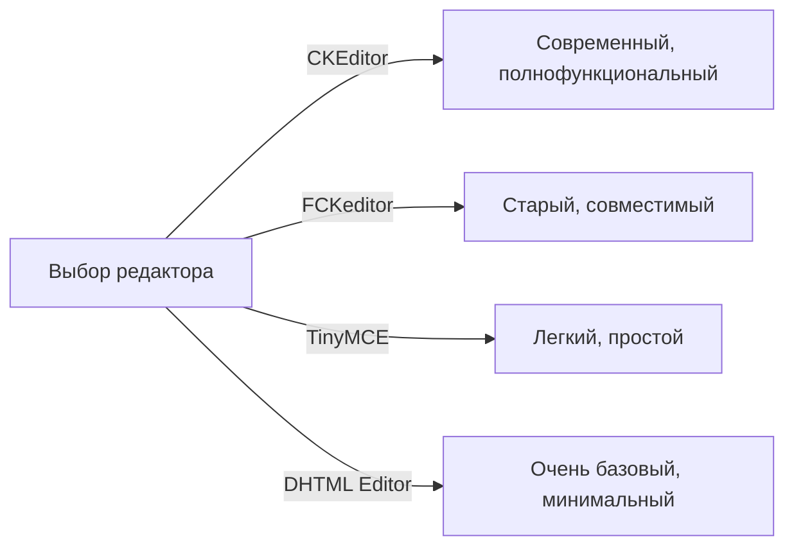
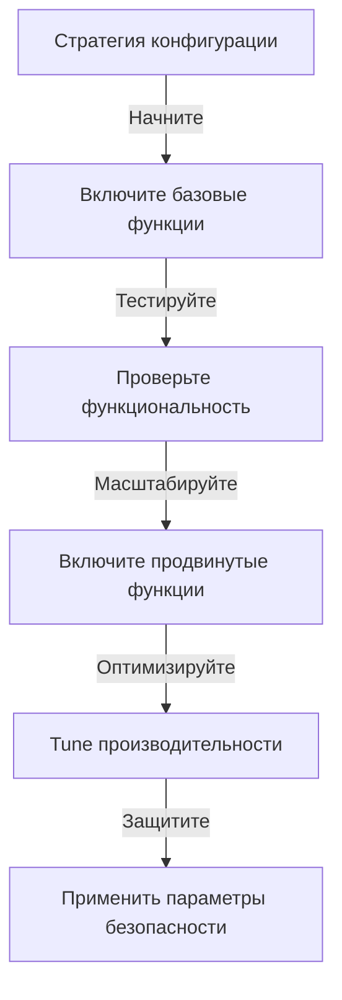

# Базовая конфигурация Publisher

> Настройте параметры модуля Publisher, предпочтения и общие опции для вашей установки XOOPS.

---

## Доступ к конфигурации

### Навигация по админ панели

```
XOOPS Админ панель
└── Modules
    └── Publisher
        ├── Preferences
        ├── Settings
        └── Configuration
```

1. Войдите как **Administrator**
2. Перейдите в **Admin Panel → Modules**
3. Найдите модуль **Publisher**
4. Нажмите **Preferences** или **Admin** ссылку

---

## Общие параметры

### Доступ к конфигурации

```
Admin Panel → Modules → Publisher
```

Нажмите на **иконку шестеренки** или **Settings** для этих опций:

#### Параметры отображения

| Параметр | Варианты | По умолчанию | Описание |
|----------|----------|-------------|---------|
| **Элементов на странице** | 5-50 | 10 | Статей показано в списках |
| **Показать хлебные крошки** | Yes/No | Yes | Отображение след |
| **Использовать нумерацию** | Yes/No | Yes | Нумерация длинных списков |
| **Показать дату** | Yes/No | Yes | Отображение даты статьи |
| **Показать категорию** | Yes/No | Yes | Показывать категорию статьи |
| **Показать автора** | Yes/No | Yes | Показывать автора статьи |
| **Показать просмотры** | Yes/No | Yes | Показывать счетчик просмотров |

**Пример конфигурации:**

```yaml
Элементов на странице: 15
Показать хлебные крошки: Yes
Использовать нумерацию: Yes
Показать дату: Yes
Показать категорию: Yes
Показать автора: Yes
Показать просмотры: Yes
```

#### Параметры автора

| Параметр | По умолчанию | Описание |
|----------|-------------|---------|
| **Показать имя автора** | Yes | Отображение реального имени или логина |
| **Использовать логин** | No | Показывать логин вместо имени |
| **Показать email автора** | No | Отображение email для контакта |
| **Показать аватар автора** | Yes | Отображение аватара пользователя |

---

## Конфигурация редактора

### Выбор WYSIWYG редактора

Publisher поддерживает несколько редакторов:

#### Доступные редакторы



### CKEditor (рекомендуется)

**Лучше всего для:** Большинства пользователей, современных браузеров, полного функционала

1. Перейдите в **Preferences**
2. Установите **Editor**: CKEditor
3. Настройте опции:

```
Редактор: CKEditor 4.x
Панель инструментов: Full
Высота: 400px
Ширина: 100%
Удалить плагины: []
Добавить плагины: [mathjax, codesnippet]
```

### FCKeditor

**Лучше всего для:** Совместимости, старых систем

```
Редактор: FCKeditor
Панель инструментов: Default
Пользовательский конфиг: (опционально)
```

### TinyMCE

**Лучше всего для:** Минимального дискового пространства, базового редактирования

```
Редактор: TinyMCE
Плагины: [paste, table, link, image]
Панель инструментов: minimal
```

---

## Параметры файлов и загрузки

### Конфигурирование каталогов загрузки

```
Admin → Publisher → Preferences → Upload Settings
```

#### Параметры типов файлов

```yaml
Разрешенные типы файлов:
  Изображения:
    - jpg
    - jpeg
    - gif
    - png
    - webp
  Документы:
    - pdf
    - doc
    - docx
    - xls
    - xlsx
    - ppt
    - pptx
  Архивы:
    - zip
    - rar
    - 7z
  Медиа:
    - mp3
    - mp4
    - webm
    - mov
```

#### Ограничения размера файла

| Тип файла | Макс размер | Примечания |
|-----------|------------|-----------|
| **Изображения** | 5 МБ | За файл изображения |
| **Документы** | 10 МБ | PDF, файлы Office |
| **Медиа** | 50 МБ | Видео/аудио файлы |
| **Все файлы** | 100 МБ | Всего за загрузку |

**Конфигурация:**

```
Макс размер загрузки изображения: 5 MB
Макс размер загрузки документа: 10 MB
Макс размер загрузки медиа: 50 MB
Всего размер загрузки: 100 MB
Макс файлов на статью: 5
```

### Изменение размера изображений

Publisher автоматически изменяет размер изображений для согласованности:

```yaml
Размер эскиза:
  Ширина: 150
  Высота: 150
  Режим: Crop/Resize

Размер изображения категории:
  Ширина: 300
  Высота: 200
  Режим: Resize

Главное изображение статьи:
  Ширина: 600
  Высота: 400
  Режим: Resize
```

---

## Параметры комментариев и взаимодействия

### Конфигурация комментариев

```
Preferences → Comments Section
```

#### Параметры комментариев

```yaml
Разрешить комментарии:
  - Включено: Yes/No
  - По умолчанию: Yes
  - Переопределение на статью: Yes

Модерирование комментариев:
  - Модерировать комментарии: Yes/No
  - Модерировать только гостевые: Yes/No
  - Фильтр спама: Enabled
  - Макс комментариев в день: (неограниченно)

Отображение комментариев:
  - Формат отображения: Threaded/Flat
  - Комментариев на странице: 10
  - Формат даты: Full date/Time ago
  - Показать количество комментариев: Yes/No
```

### Конфигурация оценок

```yaml
Разрешить оценки:
  - Включено: Yes/No
  - По умолчанию: Yes
  - Переопределение на статью: Yes

Параметры оценок:
  - Шкала оценок: 5 звезд (по умолчанию)
  - Позволить пользователю оценивать свое: No
  - Показать среднюю оценку: Yes
  - Показать количество оценок: Yes
```

---

## Параметры SEO и URL

### Оптимизация поисковых систем

```
Preferences → SEO Settings
```

#### Конфигурация URL

```yaml
SEO URLs:
  - Включено: No (установите Yes для SEO URLs)
  - Переписывание URL: None/Apache mod_rewrite/IIS rewrite

Формат URL:
  - Категория: /category/news
  - Статья: /article/welcome-to-site
  - Архив: /archive/2024/01

Мета-описание:
  - Автогенерация: Yes
  - Макс длина: 160 символов

Мета-ключевые слова:
  - Автогенерация: Yes
  - Из: Tags статьи, название
```

### Включение SEO URLs (продвинутое)

**Предварительные условия:**
- Apache с включенным `mod_rewrite`
- Поддержка `.htaccess` включена

**Этапы конфигурации:**

1. Перейдите в **Preferences → SEO Settings**
2. Установите **SEO URLs**: Yes
3. Установите **URL Rewriting**: Apache mod_rewrite
4. Проверьте наличие файла `.htaccess` в папке Publisher

**.htaccess конфигурация:**

```apache
<IfModule mod_rewrite.c>
    RewriteEngine On
    RewriteBase /modules/publisher/

    # Переписывания категорий
    RewriteRule ^category/([0-9]+)-(.*)\.html$ index.php?op=showcategory&categoryid=$1 [L,QSA]

    # Переписывания статей
    RewriteRule ^article/([0-9]+)-(.*)\.html$ index.php?op=showitem&itemid=$1 [L,QSA]

    # Переписывания архива
    RewriteRule ^archive/([0-9]+)/([0-9]+)/$ index.php?op=archive&year=$1&month=$2 [L,QSA]
</IfModule>
```

---

## Кэш и производительность

### Конфигурация кэширования

```
Preferences → Cache Settings
```

```yaml
Включить кэширование:
  - Включено: Yes
  - Тип кэша: File (или Memcache)

Время жизни кэша:
  - Списки категорий: 3600 секунд (1 час)
  - Списки статей: 1800 секунд (30 минут)
  - Одиночная статья: 7200 секунд (2 часа)
  - Блок последних статей: 900 секунд (15 минут)

Очистка кэша:
  - Ручная очистка: Доступна в админе
  - Автоочистка при сохранении статьи: Yes
  - Очистить при изменении категории: Yes
```

### Очистить кэш

**Ручная очистка кэша:**

1. Перейдите в **Admin → Publisher → Tools**
2. Нажмите **Clear Cache**
3. Выберите типы кэша для очистки:
   - [ ] Category cache
   - [ ] Article cache
   - [ ] Block cache
   - [ ] All cache
4. Нажмите **Clear Selected**

**Командная строка:**

```bash
# Очистить весь кэш Publisher
php /path/to/xoops/admin/cache_manage.php publisher

# Или напрямую удалить файлы кэша
rm -rf /path/to/xoops/var/cache/publisher/*
```

---

## Уведомления и рабочий процесс

### Email уведомления

```
Preferences → Notifications
```

```yaml
Уведомить админа о новой статье:
  - Включено: Yes
  - Получатель: Admin email
  - Включить сводку: Yes

Уведомить модераторов:
  - Включено: Yes
  - При новой отправке: Yes
  - При ожидающих статьях: Yes

Уведомить автора:
  - При одобрении: Yes
  - При отклонении: Yes
  - При комментарии: No (опционально)
```

### Рабочий процесс отправки

```yaml
Требовать одобрения:
  - Включено: Yes
  - Одобрение редактором: Yes
  - Одобрение админом: No

Сохранение черновика:
  - Интервал автосохранения: 60 секунд
  - Сохранять локальные версии: Yes
  - История версий: Последних 5 версий
```

---

## Параметры контента

### Значения по умолчанию для публикации

```
Preferences → Content Settings
```

```yaml
Статус статьи по умолчанию:
  - Draft/Published: Draft
  - Featured по умолчанию: No
  - Время автопубликации: None

Видимость по умолчанию:
  - Public/Private: Public
  - Показывать на главной странице: Yes
  - Показывать в категориях: Yes

Планируемая публикация:
  - Включено: Yes
  - Разрешить на статью: Yes

Срок действия контента:
  - Включено: No
  - Автоархив старого: No
  - Архивировать после дней: (неограниченно)
```

### Параметры контента WYSIWYG

```yaml
Разрешить HTML:
  - В статьях: Yes
  - В комментариях: No

Разрешить встроенное медиа:
  - Видео (iframe): Yes
  - Изображения: Yes
  - Плагины: No

Фильтрация контента:
  - Удалять теги: No
  - XSS фильтр: Yes (рекомендуется)
```

---

## Параметры поисковых систем

### Конфигурирование интеграции с поиском

```
Preferences → Search Settings
```

```yaml
Включить индексирование статей:
  - Включить в поиск сайта: Yes
  - Тип индексации: Full text/Title only

Параметры поиска:
  - Поиск в названиях: Yes
  - Поиск в контенте: Yes
  - Поиск в комментариях: Yes

Мета-теги:
  - Автогенерация: Yes
  - OG теги (социальные): Yes
  - Twitter cards: Yes
```

---

## Расширенные параметры

### Режим отладки (только для разработки)

```
Preferences → Advanced
```

```yaml
Режим отладки:
  - Включено: No (только для разработки!)

Функции разработки:
  - Показывать SQL запросы: No
  - Логировать ошибки: Yes
  - Email ошибок: admin@example.com
```

### Оптимизация базы данных

```
Admin → Tools → Optimize Database
```

```bash
# Ручная оптимизация
mysql> OPTIMIZE TABLE publisher_items;
mysql> OPTIMIZE TABLE publisher_categories;
mysql> OPTIMIZE TABLE publisher_comments;
```

---

## Кастомизация модуля

### Шаблоны темы

```
Preferences → Display → Templates
```

Выберите набор шаблонов:
- Default
- Classic
- Modern
- Dark
- Custom

Каждый шаблон контролирует:
- Макет статьи
- Список категорий
- Отображение архива
- Отображение комментариев

---

## Советы по конфигурации

### Лучшие практики



1. **Начните просто** - Сначала включите основные функции
2. **Тестируйте каждое изменение** - Проверьте перед продолжением
3. **Включите кэширование** - Улучшает производительность
4. **Создайте резервную копию сначала** - Экспортируйте параметры перед большими изменениями
5. **Мониторьте логи** - Регулярно проверяйте логи ошибок

### Оптимизация производительности

```yaml
Для лучшей производительности:
  - Включить кэширование: Yes
  - Время жизни кэша: 3600 секунд
  - Ограничить элементы на странице: 10-15
  - Сжать изображения: Yes
  - Минифицировать CSS/JS: Yes (если доступно)
```

### Усиление безопасности

```yaml
Для лучшей безопасности:
  - Модерировать комментарии: Yes
  - Отключить HTML в комментариях: Yes
  - XSS фильтрация: Yes
  - Whitelist типов файлов: Strict
  - Макс размер загрузки: Разумный лимит
```

---

## Экспорт/импорт параметров

### Резервная копия конфигурации

```
Admin → Tools → Export Settings
```

**Для создания резервной копии текущей конфигурации:**

1. Нажмите **Export Configuration**
2. Сохраните загруженный файл `.cfg`
3. Храните в безопасном месте

**Для восстановления:**

1. Нажмите **Import Configuration**
2. Выберите файл `.cfg`
3. Нажмите **Restore**

---

## Связанные руководства конфигурации

- Category Management
- Article Creation
- Permission Configuration
- Installation Guide

---

## Устранение неполадок конфигурации

### Параметры не сохраняются

**Решение:**
1. Проверьте разрешения на каталог `/var/config/`
2. Проверьте доступ на запись PHP
3. Проверьте журнал ошибок PHP на проблемы
4. Очистите кэш браузера и попробуйте снова

### Редактор не отображается

**Решение:**
1. Проверьте установлен ли плагин редактора
2. Проверьте конфигурацию редактора XOOPS
3. Попробуйте другой вариант редактора
4. Проверьте консоль браузера на ошибки JavaScript

### Проблемы производительности

**Решение:**
1. Включите кэширование
2. Сократите элементы на странице
3. Сожмите изображения
4. Проверьте оптимизацию базы данных
5. Просмотрите журнал медленных запросов

---

## Следующие шаги

- Настройте разрешения группы
- Создайте первую статью
- Установите категории
- Просмотрите пользовательские шаблоны

---

#publisher #configuration #preferences #settings #xoops
