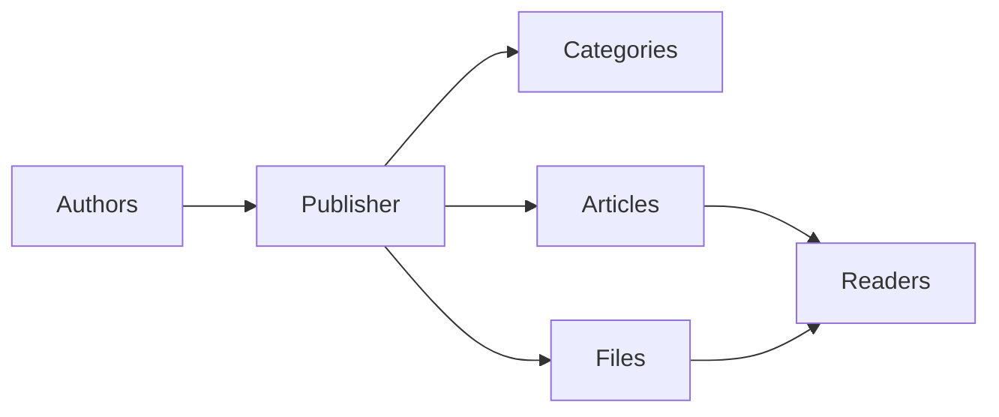
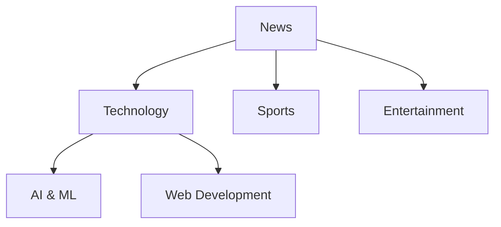
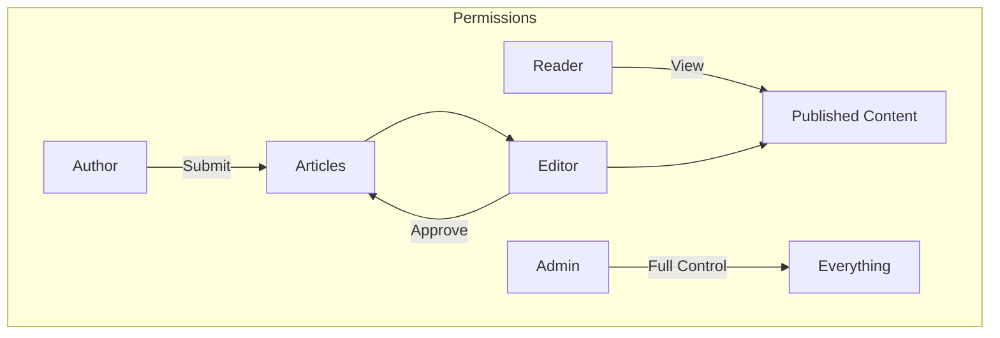
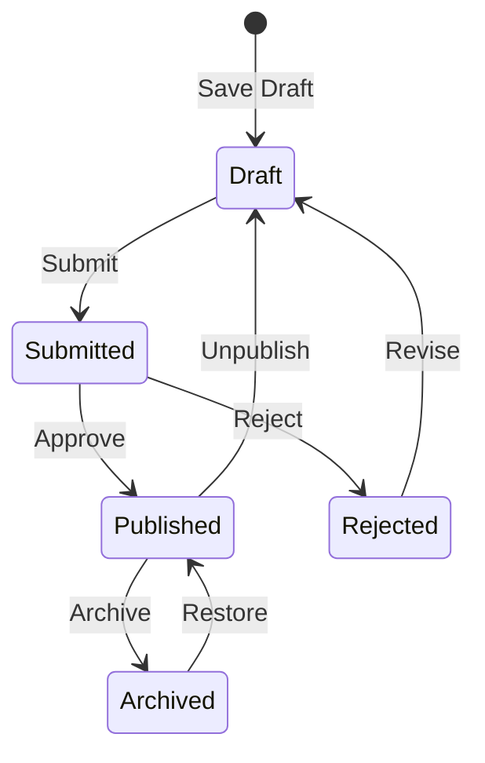

# Начало работы с Publisher

> Пошаговое руководство по настройке и использованию модуля Publisher для новостей/блога.

---

## Что такое Publisher?

Publisher - это первоклассный модуль управления контентом для XOOPS, предназначенный для:

- **Новостных сайтов** - Публикуйте статьи по категориям
- **Блогов** - Личное или многоавторское ведение блога
- **Документации** - Организованные базы знаний
- **Портальных сайтов контента** - Контент смешанных медиа



---

## Быстрая настройка

### Шаг 1: Установите Publisher

1. Загрузите с [GitHub](https://github.com/XoopsModules25x/publisher)
2. Загрузите в `modules/publisher/`
3. Перейдите в Admin → Modules → Install

### Шаг 2: Создайте категории



1. Admin → Publisher → Categories
2. Нажмите "Add Category"
3. Заполните:
   - **Name**: Имя категории
   - **Description**: Что содержит эта категория
   - **Image**: Опциональное изображение категории
4. Установите разрешения (кто может отправлять/просматривать)
5. Сохраните

### Шаг 3: Настройте параметры

1. Admin → Publisher → Preferences
2. Ключевые параметры для настройки:

| Параметр | Рекомендуется | Описание |
|---------|-------------|-------------|
| Items per page | 10-20 | Статьи на индексе |
| Editor | TinyMCE/CKEditor | Редактор форматированного текста |
| Allow ratings | Да | Обратная связь читателей |
| Allow comments | Да | Обсуждения |
| Auto-approve | Нет | Редакционный контроль |

### Шаг 4: Создайте вашу первую статью

1. Main menu → Publisher → Submit Article
2. Заполните форму:
   - **Title**: Заголовок статьи
   - **Category**: Где она принадлежит
   - **Summary**: Краткое описание
   - **Body**: Полное содержание статьи
3. Добавьте опциональные элементы:
   - Избранное изображение
   - Вложенные файлы
   - Параметры SEO
4. Отправьте на рецензию или опубликуйте

---

## Роли пользователей



### Читатель
- Просмотр опубликованных статей
- Оценка и комментирование
- Поиск контента

### Автор
- Отправка новых статей
- Редактирование собственных статей
- Прикрепление файлов

### Редактор
- Одобрение/отклонение отправок
- Редактирование любой статьи
- Управление категориями

### Администратор
- Полный контроль модуля
- Настройка параметров
- Управление разрешениями

---

## Написание статей

### Редактор статей

```
┌─────────────────────────────────────────────────────┐
│ Title: [Your Article Title                        ] │
├─────────────────────────────────────────────────────┤
│ Category: [Select Category          ▼]              │
├─────────────────────────────────────────────────────┤
│ Summary:                                            │
│ ┌─────────────────────────────────────────────────┐ │
│ │ Brief description shown in listings...          │ │
│ └─────────────────────────────────────────────────┘ │
├─────────────────────────────────────────────────────┤
│ Body:                                               │
│ ┌─────────────────────────────────────────────────┐ │
│ │ [B] [I] [U] [Link] [Image] [Code]               │ │
│ ├─────────────────────────────────────────────────┤ │
│ │                                                  │ │
│ │ Full article content goes here...               │ │
│ │                                                  │ │
│ └─────────────────────────────────────────────────┘ │
├─────────────────────────────────────────────────────┤
│ [Submit] [Preview] [Save Draft]                     │
└─────────────────────────────────────────────────────┘
```

### Лучшие практики

1. **Привлекающие заголовки** - Четкие, интересные заголовки
2. **Хорошие резюме** - Подтолкните читателей нажать
3. **Структурированный контент** - Используйте заголовки, списки, изображения
4. **Правильная категоризация** - Помогите читателям найти контент
5. **Оптимизация SEO** - Ключевые слова в заголовке и контенте

---

## Управление контентом

### Поток статуса статьи



### Описание статусов

| Статус | Описание |
|--------|-------------|
| Draft | Незаконченная работа |
| Submitted | Ожидается рецензия |
| Published | В прямом эфире на сайте |
| Expired | Истекла дата истечения |
| Rejected | Требуется редакция |
| Archived | Удалено из списков |

---

## Навигация

### Доступ к Publisher

- **Main Menu** → Publisher
- **Direct URL**: `yoursite.com/modules/publisher/`

### Ключевые страницы

| Страница | URL | Назначение |
|------|-----|---------|
| Index | `/modules/publisher/` | Списки статей |
| Category | `/modules/publisher/category.php?id=X` | Статьи категории |
| Article | `/modules/publisher/item.php?itemid=X` | Одна статья |
| Submit | `/modules/publisher/submit.php` | Новая статья |
| Search | `/modules/publisher/search.php` | Поиск статей |

---

## Блоки

Publisher предоставляет несколько блоков для вашего сайта:

### Последние статьи
Отображает последние опубликованные статьи

### Меню категорий
Навигация по категориям

### Популярные статьи
Наиболее просмотренный контент

### Случайная статья
Случайный контент витрины

### Spotlight
Избранные статьи

---

## Связанная документация

- Creating and Editing Articles
- Managing Categories
- Extending Publisher

---

#xoops #publisher #user-guide #getting-started #cms
