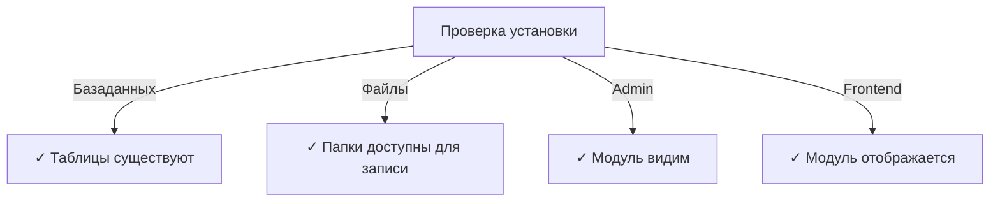

# Руководство по установке Publisher

> Полные инструкции по установке и настройке модуля Publisher для XOOPS CMS.

---

## Системные требования

### Минимальные требования

| Требование | Версия | Примечания |
|-------------|--------|-----------|
| XOOPS | 2.5.10+ | Основная платформа CMS |
| PHP | 7.1+ | Рекомендуется PHP 8.x |
| MySQL | 5.7+ | Сервер базы данных |
| Веб-сервер | Apache/Nginx | С поддержкой переписывания |

### Расширения PHP

```
- PDO (PHP Data Objects)
- pdo_mysql или mysqli
- mb_string (многобайтовые строки)
- curl (для внешнего контента)
- json
- gd (обработка изображений)
```

### Дисковое пространство

- **Файлы модуля**: ~5 МБ
- **Каталог кэша**: 50+ МБ рекомендуется
- **Каталог загрузки**: По необходимости для контента

---

## Проверочный список перед установкой

Перед установкой Publisher убедитесь:

- [ ] XOOPS установлен и работает
- [ ] Учетная запись администратора имеет права управления модулями
- [ ] Создана резервная копия базы данных
- [ ] Разрешения на файлы позволяют писать в каталог `/modules/`
- [ ] Лимит памяти PHP составляет не менее 128 МБ
- [ ] Ограничения на размер загруженных файлов соответствуют (мин. 10 МБ)

---

## Этапы установки

### Этап 1: Загрузка Publisher

#### Вариант A: С GitHub (рекомендуется)

```bash
# Перейдите в каталог модулей
cd /path/to/xoops/htdocs/modules/

# Клонируйте репозиторий
git clone https://github.com/XoopsModules25x/publisher.git

# Проверьте загрузку
ls -la publisher/
```

#### Вариант B: Ручная загрузка

1. Посетите [GitHub Publisher Releases](https://github.com/XoopsModules25x/publisher/releases)
2. Загрузите последний файл `.zip`
3. Распакуйте в `modules/publisher/`

### Этап 2: Установка разрешений на файлы

```bash
# Установите правильное владение
chown -R www-data:www-data /path/to/xoops/htdocs/modules/publisher

# Установите разрешения на каталоги (755)
find publisher -type d -exec chmod 755 {} \;

# Установите разрешения на файлы (644)
find publisher -type f -exec chmod 644 {} \;

# Сделайте скрипты исполняемыми
chmod 755 publisher/admin/index.php
chmod 755 publisher/index.php
```

### Этап 3: Установка через XOOPS Admin

1. Войдите в **XOOPS Admin Panel** как администратор
2. Перейдите в **System → Modules**
3. Нажмите **Install Module**
4. Найдите **Publisher** в списке
5. Нажмите кнопку **Install**
6. Дождитесь завершения установки (показывает созданные таблицы базы данных)

```
Прогресс установки:
✓ Таблицы созданы
✓ Конфигурация инициализирована
✓ Разрешения установлены
✓ Кэш очищен
Установка завершена!
```

---

## Начальная настройка

### Этап 1: Доступ к Publisher Admin

1. Перейдите в **Admin Panel → Modules**
2. Найдите модуль **Publisher**
3. Нажмите ссылку **Admin**
4. Теперь вы в Publisher Administration

### Этап 2: Настройка предпочтений модуля

1. Нажмите **Preferences** в левом меню
2. Настройте основные параметры:

```
Общие параметры:
- Редактор: Выберите свой редактор WYSIWYG
- Элементов на странице: 10
- Показывать хлебные крошки: Да
- Разрешить комментарии: Да
- Разрешить оценки: Да

Параметры SEO:
- SEO URLs: Нет (включить позже при необходимости)
- Переписывание URL: Нет

Параметры загрузки:
- Максимальный размер загрузки: 5 МБ
- Разрешенные типы файлов: jpg, png, gif, pdf, doc, docx
```

3. Нажмите **Save Settings**

### Этап 3: Создание первой категории

1. Нажмите **Categories** в левом меню
2. Нажмите **Add Category**
3. Заполните форму:

```
Название категории: News
Описание: Последние новости и обновления
Изображение: (опционально) Загрузите изображение категории
Родительская категория: (оставьте пусто для верхнего уровня)
Статус: Включено
```

4. Нажмите **Save Category**

### Этап 4: Проверка установки

Проверьте эти индикаторы:



#### Проверка базы данных

```bash
mysql -u xoops_user -p xoops_database
mysql> SHOW TABLES LIKE 'publisher%';

# Должны отобразиться таблицы:
# - publisher_categories
# - publisher_items
# - publisher_comments
# - publisher_files
```

#### Проверка переднего плана

1. Посетите домашнюю страницу XOOPS
2. Ищите блок **Publisher** или **News**
3. Должны отображаться последние статьи

---

## Конфигурация после установки

### Выбор редактора

Publisher поддерживает несколько редакторов WYSIWYG:

| Редактор | Преимущества | Недостатки |
|----------|-------------|-----------|
| FCKeditor | Полнофункциональный | Старый, большой размер |
| CKEditor | Современный стандарт | Сложность конфигурации |
| TinyMCE | Легкий | Ограниченные функции |
| DHTML Editor | Базовый | Очень базовый |

**Для изменения редактора:**

1. Перейдите в **Preferences**
2. Прокрутите до параметра **Editor**
3. Выберите из раскрывающегося списка
4. Сохраните и протестируйте

### Настройка каталога загрузки

```bash
# Создайте каталоги загрузки
mkdir -p /path/to/xoops/uploads/publisher/
mkdir -p /path/to/xoops/uploads/publisher/categories/
mkdir -p /path/to/xoops/uploads/publisher/images/
mkdir -p /path/to/xoops/uploads/publisher/files/

# Установите разрешения
chmod 755 /path/to/xoops/uploads/publisher/
chmod 755 /path/to/xoops/uploads/publisher/*
```

### Настройка размеров изображений

В Preferences установите размеры эскизов:

```
Размер изображения категории: 300 x 200 px
Размер изображения статьи: 600 x 400 px
Размер эскиза: 150 x 100 px
```

---

## Шаги после установки

### 1. Установка разрешений группы

1. Перейдите в **Permissions** в меню администратора
2. Настройте доступ для групп:
   - Анонимные: Только просмотр
   - Зарегистрированные пользователи: Отправка статей
   - Редакторы: Утверждение/редактирование статей
   - Администраторы: Полный доступ

### 2. Настройка видимости модуля

1. Перейдите в **Blocks** в админ XOOPS
2. Найдите блоки Publisher:
   - Publisher - Latest Articles
   - Publisher - Categories
   - Publisher - Archives
3. Настройте видимость блока на странице

### 3. Импорт тестового контента (опционально)

Для тестирования импортируйте примеры статей:

1. Перейдите в **Publisher Admin → Import**
2. Выберите **Sample Content**
3. Нажмите **Import**

### 4. Включение SEO URLs (опционально)

Для поддержки SEO URLs:

1. Перейдите в **Preferences**
2. Установите **SEO URLs**: Yes
3. Включите переписывание **.htaccess**
4. Проверьте наличие файла `.htaccess` в папке Publisher

```apache
# пример .htaccess
<IfModule mod_rewrite.c>
    RewriteEngine On
    RewriteBase /modules/publisher/
    RewriteRule ^category/([0-9]+)-(.*)\.html$ index.php?op=showcategory&categoryid=$1 [L]
    RewriteRule ^article/([0-9]+)-(.*)\.html$ index.php?op=showitem&itemid=$1 [L]
</IfModule>
```

---

## Устранение неполадок при установке

### Проблема: Модуль не отображается в админ

**Решение:**
```bash
# Проверьте разрешения на файлы
ls -la /path/to/xoops/modules/publisher/

# Проверьте наличие xoops_version.php
ls /path/to/xoops/modules/publisher/xoops_version.php

# Проверьте синтаксис PHP
php -l /path/to/xoops/modules/publisher/xoops_version.php
```

### Проблема: Таблицы базы данных не создаются

**Решение:**
1. Проверьте, что пользователь MySQL имеет привилегию CREATE TABLE
2. Проверьте журнал ошибок базы данных:
   ```bash
   mysql> SHOW WARNINGS;
   ```
3. Импортируйте SQL вручную:
   ```bash
   mysql -u user -p database < modules/publisher/sql/mysql.sql
   ```

### Проблема: Загрузка файла не удается

**Решение:**
```bash
# Проверьте наличие каталога и возможность записи
stat /path/to/xoops/uploads/publisher/

# Исправьте разрешения
chmod 777 /path/to/xoops/uploads/publisher/

# Проверьте параметры PHP
php -i | grep upload_max_filesize
```

### Проблема: Ошибки "Page not found"

**Решение:**
1. Проверьте наличие файла `.htaccess`
2. Убедитесь, что Apache `mod_rewrite` включен:
   ```bash
   a2enmod rewrite
   systemctl restart apache2
   ```
3. Проверьте `AllowOverride All` в конфиге Apache

---

## Обновление с предыдущих версий

### С Publisher 1.x на 2.x

1. **Создайте резервную копию текущей установки:**
   ```bash
   cp -r modules/publisher/ modules/publisher-backup/
   mysqldump -u user -p database > publisher-backup.sql
   ```

2. **Загрузите Publisher 2.x**

3. **Перезапишите файлы:**
   ```bash
   rm -rf modules/publisher/
   unzip publisher-2.0.zip -d modules/
   ```

4. **Запустите обновление:**
   - Перейдите в **Admin → Publisher → Update**
   - Нажмите **Update Database**
   - Дождитесь завершения

5. **Проверьте:**
   - Все статьи отображаются корректно
   - Разрешения остаются нетронутыми
   - Загрузка файлов работает

---

## Вопросы безопасности

### Разрешения на файлы

```
- Основные файлы: 644 (доступны для чтения веб-сервером)
- Каталоги: 755 (доступны для просмотра веб-сервером)
- Каталоги загрузки: 755 или 777
- Файлы конфигурации: 600 (недоступны для веб)
```

### Отключение прямого доступа к чувствительным файлам

Создайте `.htaccess` в каталогах загрузки:

```apache
<FilesMatch "\.(php|phtml|php3|php4|php5|phtml)$">
    Deny from all
</FilesMatch>
```

### Безопасность базы данных

```bash
# Используйте надежный пароль
ALTER USER 'publisher_user'@'localhost' IDENTIFIED BY 'strong_password_here';

# Предоставьте минимальные разрешения
GRANT SELECT, INSERT, UPDATE, DELETE ON publisher_db.* TO 'publisher_user'@'localhost';
FLUSH PRIVILEGES;
```

---

## Проверочный список проверки

После установки проверьте:

- [ ] Модуль появляется в списке модулей администратора
- [ ] Можете получить доступ к разделу администратора Publisher
- [ ] Можете создавать категории
- [ ] Можете создавать статьи
- [ ] Статьи отображаются на переднем плане
- [ ] Загрузка файлов работает
- [ ] Изображения отображаются корректно
- [ ] Разрешения применяются правильно
- [ ] Таблицы базы данных созданы
- [ ] Каталог кэша доступен для записи

---

## Следующие шаги

После успешной установки:

1. Прочитайте руководство по базовой конфигурации
2. Создайте свою первую статью
3. Установите разрешения группы
4. Просмотрите управление категориями

---

## Поддержка и ресурсы

- **GitHub Issues**: [Publisher Issues](https://github.com/XoopsModules25x/publisher/issues)
- **XOOPS Forum**: [Community Support](https://www.xoops.org/modules/newbb/)
- **GitHub Wiki**: [Installation Help](https://github.com/XoopsModules25x/publisher/wiki)

---

#publisher #installation #setup #xoops #module #configuration
