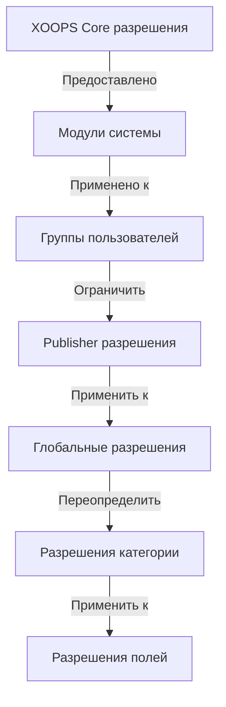

# Настройка разрешений Publisher

> Полное руководство по конфигурированию разрешений групп, контроля доступа и управлению доступом пользователей в Publisher.

---

## Основы разрешений

### Что такое разрешения?

Разрешения контролируют что могут делать разные группы пользователей в Publisher:

```
Кто может:
  - Просматривать статьи
  - Отправлять статьи
  - Редактировать статьи
  - Одобрять статьи
  - Управлять категориями
  - Конфигурировать параметры
```

### Уровни разрешений

```
Анонимные
  └── Только просмотр опубликованных статей

Зарегистрированные пользователи
  ├── Просмотр статей
  ├── Отправка статей (ожидание одобрения)
  └── Редактирование собственных статей

Редакторы/модераторы
  ├── Все разрешения зарегистрированных
  ├── Одобрение статей
  ├── Редактирование всех статей
  └── Управление некоторыми категориями

Администраторы
  └── Полный доступ ко всему
```

---

## Доступ к управлению разрешениями

### Перейдите в разрешения

```
Админ панель
└── Modules
    └── Publisher
        ├── Permissions
        ├── Category Permissions
        └── Group Management
```

### Быстрый доступ

1. Войдите как **Administrator**
2. Перейдите в **Admin → Modules**
3. Нажмите **Publisher → Admin**
4. Нажмите **Permissions** в левом меню

---

## Глобальные разрешения

### Разрешения уровня модуля

Контролируйте доступ к модулю Publisher и функциям:

```
Представление конфигурации разрешений:
┌─────────────────────────────────────┐
│ Разрешение             │ Анон │ Рег │ Редак │ Админ │
├────────────────────────┼──────┼─────┼───────┼───────┤
│ Просматривать статьи   │  ✓   │  ✓  │   ✓   │  ✓   │
│ Отправлять статьи      │  ✗   │  ✓  │   ✓   │  ✓   │
│ Редактировать свою     │  ✗   │  ✓  │   ✓   │  ✓   │
│ Редактировать все      │  ✗   │  ✗  │   ✓   │  ✓   │
│ Одобрять статьи        │  ✗   │  ✗  │   ✓   │  ✓   │
│ Управлять категориями  │  ✗   │  ✗  │   ✗   │  ✓   │
│ Доступ в админ панель  │  ✗   │  ✗  │   ✓   │  ✓   │
└─────────────────────────────────────┘
```

### Описания разрешений

| Разрешение | Пользователи | Эффект |
|-----------|-----------|---------|
| **Просматривать статьи** | Все группы | Может видеть опубликованные статьи на переднем плане |
| **Отправлять статьи** | Регистрированные+ | Может создавать новые статьи (ожидание одобрения) |
| **Редактировать свои статьи** | Регистрированные+ | Может редактировать/удалять свои статьи |
| **Редактировать все статьи** | Редакторы+ | Может редактировать любую статью |
| **Удалять свои статьи** | Регистрированные+ | Может удалять свои неопубликованные статьи |
| **Удалять все статьи** | Редакторы+ | Может удалять любую статью |
| **Одобрять статьи** | Редакторы+ | Может публиковать статьи в ожидании |
| **Управлять категориями** | Админы | Создавать, редактировать, удалять категории |
| **Доступ в админ** | Редакторы+ | Доступ к админ интерфейсу |

---

## Конфигурирование глобальных разрешений

### Шаг 1: Доступ к параметрам разрешений

1. Перейдите в **Admin → Modules**
2. Найдите **Publisher**
3. Нажмите **Permissions** (или Admin ссылка затем Permissions)
4. Вы видите матрицу разрешений

### Шаг 2: Установить разрешения группы

Для каждой группы, конфигурируйте что они могут делать:

#### Анонимные пользователи

```yaml
Разрешения группы Анонимные:
  Просматривать статьи: ✓ YES
  Отправлять статьи: ✗ NO
  Редактировать статьи: ✗ NO
  Удалять статьи: ✗ NO
  Одобрять статьи: ✗ NO
  Управлять категориями: ✗ NO
  Доступ в админ: ✗ NO

Результат: Анонимные пользователи могут только просматривать опубликованный контент
```

#### Зарегистрированные пользователи

```yaml
Разрешения группы Зарегистрированные:
  Просматривать статьи: ✓ YES
  Отправлять статьи: ✓ YES (требуется одобрение)
  Редактировать свои статьи: ✓ YES
  Редактировать все статьи: ✗ NO
  Удалять свои статьи: ✓ YES (только черновики)
  Удалять все статьи: ✗ NO
  Одобрять статьи: ✗ NO
  Управлять категориями: ✗ NO
  Доступ в админ: ✗ NO

Результат: Зарегистрированные могут участвовать в контенте после одобрения
```

#### Группа редакторов

```yaml
Разрешения группы Редакторы:
  Просматривать статьи: ✓ YES
  Отправлять статьи: ✓ YES
  Редактировать свои статьи: ✓ YES
  Редактировать все статьи: ✓ YES
  Удалять свои статьи: ✓ YES
  Удалять все статьи: ✓ YES
  Одобрять статьи: ✓ YES
  Управлять категориями: ✓ ОГРАНИЧЕННО
  Доступ в админ: ✓ YES
  Конфигурировать параметры: ✗ NO

Результат: Редакторы управляют контентом но не параметрами
```

#### Администраторы

```yaml
Разрешения групп Админы:
  ✓ ПОЛНЫЙ ДОСТУП ко всем функциям

  - Все разрешения редакторов
  - Управление всеми категориями
  - Конфигурирование всех параметров
  - Управление разрешениями
  - Установка/удаление
```

### Шаг 3: Сохранить разрешения

1. Конфигурируйте разрешения каждой группы
2. Отмечайте коробки для разрешенных действий
3. Снимайте отметку для запрещенных действий
4. Нажмите **Save Permissions**
5. Появится сообщение подтверждения

---

## Разрешения на уровне категории

### Установить доступ к категории

Контролируйте кто может просматривать/отправлять в конкретные категории:

```
Admin → Publisher → Categories
→ Выберите категорию → Permissions
```

### Матрица разрешений категории

```
                     Анон  Рег   Редак Админ
Просмотр категории    ✓     ✓     ✓     ✓
Отправка в категорию  ✗     ✓     ✓     ✓
Редактирование свое   ✗     ✓     ✓     ✓
Редактирование всех   ✗     ✗     ✓     ✓
Одобрение в категории ✗     ✗     ✓     ✓
Управление категорией ✗     ✗     ✗     ✓
```

### Конфигурирование разрешений категории

1. Перейдите в админ **Categories**
2. Найдите категорию
3. Нажмите кнопку **Permissions**
4. Для каждой группы выберите:
   - [ ] Просмотр этой категории
   - [ ] Отправка статей
   - [ ] Редактирование собственных статей
   - [ ] Редактирование всех статей
   - [ ] Одобрение статей
   - [ ] Управление категорией
5. Нажмите **Save**

### Примеры разрешений категории

#### Публичная категория Новостей

```
Анонимные: Только просмотр
Зарегистрированные: Просмотр + Отправка (ожидание одобрения)
Редакторы: Одобрение + Редактирование
Админы: Полный контроль
```

#### Внутренняя категория обновлений

```
Анонимные: Нет доступа
Зарегистрированные: Только просмотр
Редакторы: Отправка + Одобрение
Админы: Полный контроль
```

#### Категория гостевого блога

```
Анонимные: Только просмотр
Зарегистрированные: Отправка (ожидание одобрения)
Редакторы: Одобрение
Админы: Полный контроль
```

---

## Разрешения на уровне поля

### Контроль видимости поля формы

Ограничивайте какие поля формы пользователи могут видеть/редактировать:

```
Admin → Publisher → Permissions → Fields
```

### Параметры поля

```yaml
Видимые поля для зарегистрированных:
  ✓ Title
  ✓ Description
  ✓ Content (body)
  ✓ Featured image
  ✓ Category
  ✓ Tags
  ✗ Author (автоустановлено)
  ✗ Publication date (только редакторы)
  ✗ Scheduled date (только редакторы)
  ✗ Featured flag (только редакторы)
  ✗ Permissions (только админы)
```

### Примеры

#### Ограниченная отправка для зарегистрированных

Зарегистрированные видят меньше опций:

```
Доступные поля:
  - Title ✓
  - Description ✓
  - Content ✓
  - Featured image ✓
  - Category ✓

Скрытые поля:
  - Author (автоустановлено на текущего пользователя)
  - Publication date (редакторы решают)
  - Scheduled date (только админы)
  - Featured status (редакторы выбирают)
```

#### Полная форма для редакторов

Редакторы видят все опции:

```
Доступные поля:
  - Все базовые поля
  - Все метаданные
  - Выбор автора ✓
  - Дата/время публикации ✓
  - Запланированная дата ✓
  - Статус featured ✓
  - Дата истечения ✓
  - Разрешения ✓
```

---

## Конфигурация группы пользователей

### Создание пользовательской группы

1. Перейдите в **Admin → Users → Groups**
2. Нажмите **Create Group**
3. Введите детали группы:

```
Название группы: "Community Bloggers"
Описание группы: "Пользователи которые участвуют в блог контенте"
Тип: Regular group
```

4. Нажмите **Save Group**
5. Вернитесь в разрешения Publisher
6. Установите разрешения для новой группы

### Примеры групп

```
Предложенные группы для Publisher:

Группа: Contributors
  - Обычные члены отправляющие статьи
  - Могут редактировать свои статьи
  - Не могут одобрять статьи

Группа: Reviewers
  - Могут видеть отправленные статьи
  - Могут одобрять/отклонять статьи
  - Не могут удалять статьи других

Группа: Editors
  - Могут редактировать любую статью
  - Могут одобрять статьи
  - Могут модерировать комментарии
  - Могут управлять некоторыми категориями

Группа: Publishers
  - Могут редактировать любую статью
  - Могут публиковать напрямую (без одобрения)
  - Могут управлять всеми категориями
  - Могут конфигурировать параметры
```

---

## Иерархии разрешений

### Поток разрешений



### Наследование разрешений

```
Базовая: Глобальные разрешения модуля
  ↓
Категория: Переопределяет для конкретных категорий
  ↓
Поле: Дополнительно ограничивает доступные поля
  ↓
Пользователь: Имеет разрешение если ВСЕ уровни разрешают
```

**Пример:**

```
Пользователь хочет отредактировать статью:
1. Группа пользователя должна иметь разрешение "edit articles" (глобальное)
2. Категория должна разрешить редактирование (уровень категории)
3. Ограничения поля должны разрешить (если применимо)
4. Пользователь должен быть автором ИЛИ редактором (для своей или всех)

Если ЛЮБОЙ уровень отклоняет → Разрешение отклонено
```

---

## Разрешения рабочего процесса одобрения

### Конфигурирование одобрения отправок

Контролируйте должны ли статьи быть одобрены:

```
Admin → Publisher → Preferences → Workflow
```

#### Опции одобрения

```yaml
Рабочий процесс отправки:
  Требовать одобрения: Yes

  Для зарегистрированных пользователей:
    - Новые статьи: Draft (ожидание одобрения)
    - Редакторы должны одобрить
    - Пользователь может редактировать пока ожидает
    - После одобрения: Пользователь может редактировать

  Для редакторов:
    - Новые статьи: Публиковать напрямую (опционально)
    - Пропустить очередь одобрения
    - Или всегда требовать одобрения
```

#### Конфигурирование по группам

1. Перейдите в Preferences
2. Найдите "Submission Workflow"
3. Для каждой группы установите:

```
Группа: Зарегистрированные пользователи
  Требовать одобрения: ✓ YES
  Статус по умолчанию: Draft
  Может изменять пока ожидает: ✓ YES

Группа: Редакторы
  Требовать одобрения: ✗ NO
  Статус по умолчанию: Published
  Может изменять опубликованные: ✓ YES
```

4. Нажмите **Save**

---

## Модерирование статей

### Одобрение статей в ожидании

Для пользователей с разрешением "approve articles":

1. Перейдите в **Admin → Publisher → Articles**
2. Отфильтруйте по **Status**: Pending
3. Нажмите статью для рецензии
4. Проверьте качество контента
5. Установите **Status**: Published
6. Опционально: Добавьте редакционные замечания
7. Нажмите **Save**

### Отклонение статей

Если статья не отвечает стандартам:

1. Откройте статью
2. Установите **Status**: Draft
3. Добавьте причину отклонения (в комментарий или email)
4. Нажмите **Save**
5. Отправьте сообщение автору объясняющее отклонение

### Модерирование комментариев

Если модерируете комментарии:

1. Перейдите в **Admin → Publisher → Comments**
2. Отфильтруйте по **Status**: Pending
3. Просмотрите комментарий
4. Опции:
   - Одобрить: Нажмите **Approve**
   - Отклонить: Нажмите **Delete**
   - Редактировать: Нажмите **Edit**, исправьте, сохраните
5. Нажмите **Save**

---

## Управление доступом пользователей

### Просмотр групп пользователей

Посмотрите какие пользователи принадлежат группам:

```
Admin → Users → User Groups

Для каждого пользователя:
  - Первичная группа (одна)
  - Вторичные группы (несколько)

Разрешения применяются из всех групп (объединение)
```

### Добавить пользователя в группу

1. Перейдите в **Admin → Users**
2. Найдите пользователя
3. Нажмите **Edit**
4. Под **Groups**, отметьте группы для добавления
5. Нажмите **Save**

### Изменить разрешения пользователя

Для отдельных пользователей (если поддерживается):

1. Перейдите в админ пользователей
2. Найдите пользователя
3. Нажмите **Edit**
4. Ищите переопределение отдельных разрешений
5. Конфигурируйте как нужно
6. Нажмите **Save**

---

## Типичные сценарии разрешений

### Сценарий 1: Открытый блог

Разрешить кому-то отправлять:

```
Анонимные: Просмотр
Зарегистрированные: Отправка, редактирование своей, удаление своей
Редакторы: Одобрение, редактирование всех, удаление всех
Админы: Полный контроль

Результат: Открытый блог сообщества
```

### Сценарий 2: Модерируемый новостной сайт

Процесс строгого одобрения:

```
Анонимные: Только просмотр
Зарегистрированные: Не могут отправлять
Редакторы: Отправка, одобрение других
Админы: Полный контроль

Результат: Только утвержденные профессионалы публикуют
```

### Сценарий 3: Блог сотрудников

Сотрудники могут участвовать:

```
Создать группу: "Staff"
Анонимные: Просмотр
Зарегистрированные: Только просмотр (не персонал)
Персонал: Отправка, редактирование своей, публикация напрямую
Админы: Полный контроль

Результат: Блог по авторству персонала
```

### Сценарий 4: Много категорий с разными редакторами

Разные редакторы для разных категорий:

```
Категория Новости:
  Группа редакторов A: Полный контроль

Категория Обзоры:
  Группа редакторов B: Полный контроль

Категория Туториалы:
  Группа редакторов C: Полный контроль

Результат: Децентрализованный редакционный контроль
```

---

## Тестирование разрешений

### Проверка работоспособности разрешений

1. Создайте тестового пользователя в каждой группе
2. Войдите как каждый тестовый пользователь
3. Попробуйте:
   - Просмотреть статьи
   - Отправить статью (должна создать черновик если разрешено)
   - Редактировать статью (свою и других)
   - Удалить статью
   - Доступ в админ панель
   - Доступ к категориям

4. Проверьте результаты соответствуют ожидаемым разрешениям

### Типичные тестовые случаи

```
Тестовый случай 1: Анонимный пользователь
  [ ] Может просматривать опубликованные статьи: ✓
  [ ] Не может отправлять статьи: ✓
  [ ] Не может доступить к админ: ✓

Тестовый случай 2: Зарегистрированный пользователь
  [ ] Может отправлять статьи: ✓
  [ ] Статьи идут в Draft: ✓
  [ ] Может редактировать свою статью: ✓
  [ ] Не может редактировать других: ✓
  [ ] Не может доступить к админ: ✓

Тестовый случай 3: Редактор
  [ ] Может одобрять статьи: ✓
  [ ] Может редактировать любую статью: ✓
  [ ] Может доступить к админ: ✓
  [ ] Не может удалять все: ✓ (или ✓ если разрешено)

Тестовый случай 4: Админ
  [ ] Может делать все: ✓
```

---

## Устранение неполадок разрешений

### Проблема: Пользователь не может отправлять статьи

**Проверьте:**
```
1. Группа пользователя имеет разрешение "submit articles"
   Admin → Publisher → Permissions

2. Пользователь принадлежит разрешенной группе
   Admin → Users → Edit user → Groups

3. Категория разрешает отправку группе пользователя
   Admin → Publisher → Categories → Permissions

4. Пользователь зарегистрирован (не анонимный)
```

**Решение:**
```bash
1. Проверьте зарегистрированная группа имеет разрешение отправки
2. Добавьте пользователя в соответствующую группу
3. Проверьте разрешения категории
4. Очистите кэш сессии пользователя
```

### Проблема: Редактор не может одобрять статьи

**Проверьте:**
```
1. Группа редактора имеет разрешение "approve articles"
2. Статьи существуют со статусом "Pending"
3. Редактор в правильной группе
4. Категория разрешает одобрение группе редактора
```

**Решение:**
```bash
1. Перейдите в Permissions, проверьте "approve articles" отмечено для группы редактора
2. Создайте тестовую статью, установите в Draft
3. Попробуйте одобрить как редактор
4. Проверьте сообщения об ошибках в системном логе
```

### Проблема: Может видеть статьи но не может доступить к категории

**Проверьте:**
```
1. Категория не отключена/скрыта
2. Разрешения категории разрешают просмотр
3. Группа пользователя может просматривать категорию
4. Категория опубликована
```

**Решение:**
```bash
1. Перейдите в Categories, проверьте статус категории "Enabled"
2. Проверьте разрешения категории установлены
3. Добавьте группу пользователя в разрешение просмотра категории
```

### Проблема: Разрешения изменены но не вступают в действие

**Решение:**
```bash
1. Очистите кэш: Admin → Tools → Clear Cache
2. Очистите сессию: Выйдите и войдите снова
3. Проверьте системный лог на ошибки
4. Проверьте разрешения действительно сохранены
5. Попробуйте другой браузер/режим инкогнито
```

---

## Резервная копия и экспорт разрешений

### Экспорт разрешений

Некоторые системы разрешают экспорт:

1. Перейдите в **Admin → Publisher → Tools**
2. Нажмите **Export Permissions**
3. Сохраните файл `.xml` или `.json`
4. Храните как резервную копию

### Импорт разрешений

Восстановите из резервной копии:

1. Перейдите в **Admin → Publisher → Tools**
2. Нажмите **Import Permissions**
3. Выберите файл резервной копии
4. Просмотрите изменения
5. Нажмите **Import**

---

## Лучшие практики

### Проверочный список конфигурации разрешений

- [ ] Решите на группы пользователей
- [ ] Назначьте ясные названия группам
- [ ] Установите базовые разрешения для каждой группы
- [ ] Тестируйте каждый уровень разрешений
- [ ] Документируйте структуру разрешений
- [ ] Создайте рабочий процесс одобрения
- [ ] Обучите редакторов модерированию
- [ ] Мониторьте использование разрешений
- [ ] Просмотрите разрешения ежеквартально
- [ ] Создайте резервную копию параметров разрешений

### Лучшие практики безопасности

```
✓ Принцип наименьших привилегий
  - Предоставляйте минимально необходимые разрешения

✓ Доступ на основе ролей
  - Используйте группы для ролей (редактор, модератор, и т.д)

✓ Аудит разрешений
  - Просмотрите кто имеет какой доступ

✓ Разделение обязанностей
  - Отправитель, утверждающий, издатель отличаются

✓ Регулярный просмотр
  - Проверьте разрешения ежеквартально
  - Удалите доступ когда пользователи уходят
  - Обновите для новых требований
```

---

## Связанные руководства

- Creating Articles
- Managing Categories
- Basic Configuration
- Installation

---

## Следующие шаги

- Установите разрешения для вашего рабочего процесса
- Создайте статьи с правильными разрешениями
- Конфигурируйте категории с разрешениями
- Обучите пользователей созданию статей

---

#publisher #permissions #groups #access-control #security #moderation #xoops
