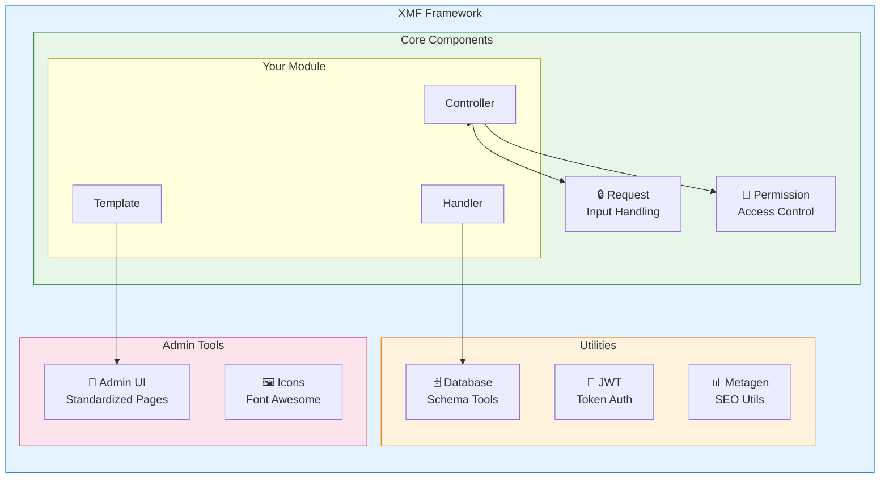
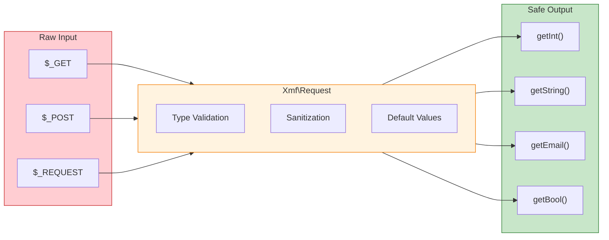

<span class="version-badge version-25x">2.5.x ✅</span> <span class="version-badge version-40x">4.0.x ✅</span>

:::tip[Мост в современный XOOPS]
XMF работает **как в XOOPS 2.5.x, так и в XOOPS 4.0.x**. Это рекомендуемый способ модернизировать ваши модули сегодня, подготавливаясь к XOOPS 4.0. XMF обеспечивает автозагрузку PSR-4, пространства имен и помощников, которые сглаживают переход.
:::

**XOOPS Module Framework (XMF)** - это мощная библиотека, разработанная для упрощения и стандартизации разработки модулей XOOPS. XMF обеспечивает современные практики PHP, включая пространства имен, автозагрузку и комплексный набор вспомогательных классов, которые уменьшают основной код и улучшают обслуживаемость.

## Что такое XMF?

XMF - это коллекция классов и утилит, которые предоставляют:

- **Поддержка современного PHP** - Полная поддержка пространств имен с автозагрузкой PSR-4
- **Обработка запросов** - Безопасная валидация входных данных и очистка
- **Помощники модулей** - Упрощенный доступ к конфигурациям и объектам модулей
- **Система разрешений** - Простое управление разрешениями в использовании
- **Утилиты базы данных** - Инструменты миграции схемы и управления таблицами
- **Поддержка JWT** - Реализация JSON Web Token для безопасной аутентификации
- **Генерация метаданных** - Утилиты SEO и извлечение контента
- **Административный интерфейс** - Стандартизированные страницы администрирования модулей

### Обзор компонентов XMF



## Ключевые функции

### Пространства имен и автозагрузка

Все классы XMF находятся в пространстве имен `Xmf`. Классы автоматически загружаются при упоминании - ручные включения не требуются.

```php
use Xmf\Request;
use Xmf\Module\Helper;

// Классы загружаются автоматически при использовании
$input = Request::getString('input', '');
$helper = Helper::getHelper('mymodule');
```

### Безопасная обработка запросов

Класс [Request](../05-XMF-Framework/Basics/XMF-Request.md) обеспечивает типобезопасный доступ к данным HTTP запроса с встроенной очисткой:



```php
use Xmf\Request;

$id = Request::getInt('id', 0);
$name = Request::getString('name', '');
$email = Request::getEmail('email', '');
```

### Система помощника модулей

[Помощник модулей](../05-XMF-Framework/Basics/XMF-Module-Helper.md) обеспечивает удобный доступ к функциональности, связанной с модулями:

```php
$helper = \Xmf\Module\Helper::getHelper('mymodule');

// Доступ к конфигурации модуля
$configValue = $helper->getConfig('setting_name', 'default');

// Получить объект модуля
$module = $helper->getModule();

// Доступ к обработчикам
$handler = $helper->getHandler('items');
```

### Управление разрешениями

[Помощник разрешений](../05-XMF-Framework/Recipes/Permission-Helper.md) упрощает обработку разрешений XOOPS:

```php
$permHelper = new \Xmf\Module\Helper\Permission();

// Проверить разрешение пользователя
if ($permHelper->checkPermission('view', $itemId)) {
    // У пользователя есть разрешение
}
```

## Структура документации

### Основы

- [Getting-Started-with-XMF](../05-XMF-Framework/Basics/Getting-Started-with-XMF.md) - Установка и базовое использование
- [XMF-Request](../05-XMF-Framework/Basics/XMF-Request.md) - Обработка запросов и валидация входных данных
- [XMF-Module-Helper](../05-XMF-Framework/Basics/XMF-Module-Helper.md) - Использование класса помощника модулей

### Рецепты

- [Permission-Helper](../05-XMF-Framework/Recipes/Permission-Helper.md) - Работа с разрешениями
- [Module-Admin-Pages](../05-XMF-Framework/Recipes/Module-Admin-Pages.md) - Создание стандартизированных административных интерфейсов

### Справочник

- [JWT](../05-XMF-Framework/Reference/JWT.md) - Реализация JSON Web Token
- [Database](../05-XMF-Framework/Reference/Database.md) - Утилиты базы данных и управление схемой
- [Metagen](Reference/Metagen.md) - Утилиты метаданных и SEO

## Требования

- XOOPS 2.5.8 или позже
- PHP 7.2 или позже (PHP 8.x рекомендуется)

## Установка

XMF включен в XOOPS 2.5.8 и более поздних версиях. Для ранних версий или ручной установки:

1. Загрузите пакет XMF из репозитория XOOPS
2. Извлеките в вашу директорию XOOPS `/class/xmf/`
3. Автозагрузчик будет автоматически обрабатывать загрузку классов

## Пример быстрого старта

Вот полный пример, показывающий общие паттерны использования XMF:

```php
<?php
use Xmf\Request;
use Xmf\Module\Helper;
use Xmf\Module\Helper\Permission;

// Получить помощника модулей
$helper = Helper::getHelper('mymodule');

// Получить значения конфигурации
$itemsPerPage = $helper->getConfig('items_per_page', 10);

// Обработать входные данные запроса
$op = Request::getCmd('op', 'list');
$id = Request::getInt('id', 0);

// Проверить разрешения
$permHelper = new Permission();
if (!$permHelper->checkPermission('view', $id)) {
    redirect_header('index.php', 3, 'Access denied');
}

// Обработать на основе операции
switch ($op) {
    case 'view':
        $handler = $helper->getHandler('items');
        $item = $handler->get($id);
        // ... отобразить элемент
        break;
    case 'list':
    default:
        // ... список элементов
        break;
}
```

## Ресурсы

- [XMF GitHub Repository](https://github.com/XOOPS/XMF)
- [XOOPS Project Website](https://xoops.org)

---

#xmf #xoops #framework #php #module-development
