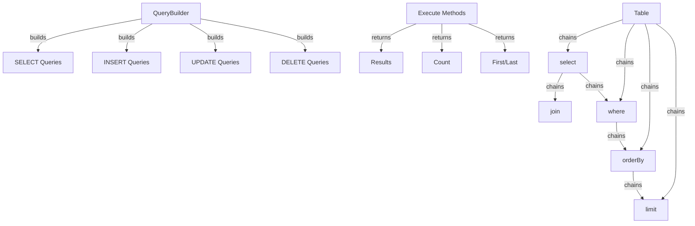

XOOPS Query Builder ponuja sodoben, tekoč vmesnik za izdelavo SQL poizvedb. Pomaga preprečiti vstavljanje SQL, izboljša berljivost in zagotavlja abstrakcijo baze podatkov za več sistemov baze podatkov.

## Arhitektura graditelja poizvedb

## Razred QueryBuilder

Glavni razred graditelja poizvedb s tekočim vmesnikom.

### Pregled razreda
```php
namespace Xoops\Database;

class QueryBuilder
{
    protected string $table = '';
    protected string $type = 'SELECT';
    protected array $selects = [];
    protected array $joins = [];
    protected array $wheres = [];
    protected array $orders = [];
    protected int $limit = 0;
    protected int $offset = 0;
    protected array $bindings = [];
}
```
### Statične metode

#### tabela

Ustvari nov graditelj poizvedb za tabelo.
```php
public static function table(string $table): QueryBuilder
```
**Parametri:**

| Parameter | Vrsta | Opis |
|-----------|------|-------------|
| `$table` | niz | Ime tabele (s predpono ali brez) |

**Vrne:** `QueryBuilder` - Primerek graditelja poizvedb

**Primer:**
```php
$query = QueryBuilder::table('users');
$query = QueryBuilder::table('xoops_users'); // With prefix
```
## SELECT Poizvedbe

### izberite

Določa stolpce za izbiro.
```php
public function select(...$columns): self
```
**Parametri:**

| Parameter | Vrsta | Opis |
|-----------|------|-------------|
| `...$columns` | niz | Imena stolpcev ali izrazi |

**Vrnitve:** `self` - Za veriženje metod

**Primer:**
```php
// Simple select
QueryBuilder::table('users')
    ->select('id', 'username', 'email')
    ->get();

// Select with aliases
QueryBuilder::table('users')
    ->select('id as user_id', 'username as name')
    ->get();

// Select all columns
QueryBuilder::table('users')
    ->select('*')
    ->get();

// Select with expressions
QueryBuilder::table('orders')
    ->select('id', 'COUNT(*) as total_items')
    ->groupBy('id')
    ->get();
```
### kje

Doda pogoj WHERE.
```php
public function where(string $column, string $operator = '=', mixed $value = null): self
```
**Parametri:**

| Parameter | Vrsta | Opis |
|-----------|------|-------------|
| `$column` | niz | Ime stolpca |
| `$operator` | niz | Operator primerjave |
| `$value` | mešano | Vrednost za primerjavo |

**Vrnitve:** `self` - Za veriženje metod

**Operaterji:**

| Operater | Opis | Primer |
|----------|-------------|---------|
| `=` | Enako | `->where('status', '=', 'active')` |
| `!=` ali `<>` | Ni enako | `->where('status', '!=', 'deleted')` |
| `>` | Večji od | `->where('price', '>', 100)` |
| `<` | Manj kot | `->where('price', '<', 100)` |
| `>=` | Večje ali enako | `->where('age', '>=', 18)` |
| `<=` | Manj ali enako | `->where('age', '<=', 65)` |
| `LIKE` | Ujemanje vzorca | `->where('name', 'LIKE', '%john%')` |
| `IN` | Na seznamu | `->where('status', 'IN', ['active', 'pending'])` |
| `NOT IN` | Ni na seznamu | `->where('id', 'NOT IN', [1, 2, 3])` |
| `BETWEEN` | Razpon | `->where('age', 'BETWEEN', [18, 65])` |
| `IS NULL` | Je nič | `->where('deleted_at', 'IS NULL')` |
| `IS NOT NULL` | Ni nič | `->where('deleted_at', 'IS NOT NULL')` |

**Primer:**
```php
// Single condition
QueryBuilder::table('users')
    ->select('*')
    ->where('status', '=', 'active')
    ->get();

// Multiple conditions (AND)
QueryBuilder::table('users')
    ->select('*')
    ->where('status', '=', 'active')
    ->where('age', '>=', 18)
    ->get();

// IN operator
QueryBuilder::table('products')
    ->select('*')
    ->where('category_id', 'IN', [1, 2, 3])
    ->get();

// LIKE operator
QueryBuilder::table('users')
    ->select('*')
    ->where('email', 'LIKE', '%@example.com')
    ->get();

// NULL check
QueryBuilder::table('users')
    ->select('*')
    ->where('deleted_at', 'IS NULL')
    ->get();
```
### ali Kam

Doda pogoj ALI.
```php
public function orWhere(string $column, string $operator = '=', mixed $value = null): self
```
**Primer:**
```php
QueryBuilder::table('users')
    ->select('*')
    ->where('status', '=', 'active')
    ->orWhere('premium', '=', 1)
    ->get();
    // SELECT * FROM users WHERE status = 'active' OR premium = 1
```
### whereIn / whereNotIn

Priročne metode za IN/NOT IN.
```php
public function whereIn(string $column, array $values): self
public function whereNotIn(string $column, array $values): self
```
**Primer:**
```php
QueryBuilder::table('posts')
    ->select('*')
    ->whereIn('status', ['published', 'scheduled'])
    ->get();

QueryBuilder::table('comments')
    ->select('*')
    ->whereNotIn('spam_score', [8, 9, 10])
    ->get();
```
### whereNull / whereNotNull

Priročne metode za NULL čekov.
```php
public function whereNull(string $column): self
public function whereNotNull(string $column): self
```
**Primer:**
```php
QueryBuilder::table('users')
    ->select('*')
    ->whereNotNull('verified_at')
    ->get();
```
### kje Vmes

Preveri, ali je vrednost med dvema vrednostma.
```php
public function whereBetween(string $column, array $values): self
```
**Primer:**
```php
QueryBuilder::table('products')
    ->select('*')
    ->whereBetween('price', [10, 100])
    ->get();

QueryBuilder::table('orders')
    ->select('*')
    ->whereBetween('created_at', ['2024-01-01', '2024-12-31'])
    ->get();
```
### pridruži se

Doda INNER JOIN.
```php
public function join(
    string $table,
    string $first,
    string $operator = '=',
    string $second = null
): self
```
**Primer:**
```php
QueryBuilder::table('posts')
    ->select('posts.*', 'users.username', 'categories.name')
    ->join('users', 'posts.user_id', '=', 'users.id')
    ->join('categories', 'posts.category_id', '=', 'categories.id')
    ->where('posts.published', '=', 1)
    ->get();
```
### leftJoin / rightJoin

Alternativne vrste povezav.
```php
public function leftJoin(
    string $table,
    string $first,
    string $operator = '=',
    string $second = null
): self

public function rightJoin(
    string $table,
    string $first,
    string $operator = '=',
    string $second = null
): self
```
**Primer:**
```php
QueryBuilder::table('users')
    ->select('users.*', 'COUNT(posts.id) as post_count')
    ->leftJoin('posts', 'users.id', '=', 'posts.user_id')
    ->groupBy('users.id')
    ->get();
```
### groupBy

Združi rezultate po stolpcih.
```php
public function groupBy(...$columns): self
```
**Primer:**
```php
QueryBuilder::table('orders')
    ->select('user_id', 'COUNT(*) as order_count', 'SUM(total) as total_spent')
    ->groupBy('user_id')
    ->get();

QueryBuilder::table('sales')
    ->select('department', 'region', 'SUM(amount) as total')
    ->groupBy('department', 'region')
    ->get();
```
### imeti

Doda pogoj HAVING.
```php
public function having(string $column, string $operator = '=', mixed $value = null): self
```
**Primer:**
```php
QueryBuilder::table('orders')
    ->select('user_id', 'COUNT(*) as order_count')
    ->groupBy('user_id')
    ->having('order_count', '>', 5)
    ->get();
```
### orderBy

Rezultati naročil.
```php
public function orderBy(string $column, string $direction = 'ASC'): self
```
**Parametri:**

| Parameter | Vrsta | Opis |
|-----------|------|-------------|
| `$column` | niz | Stolpec za vrstni red po |
| `$direction` | niz | `ASC` ali `DESC` |

**Primer:**
```php
// Single order
QueryBuilder::table('users')
    ->select('*')
    ->orderBy('created_at', 'DESC')
    ->get();

// Multiple orders
QueryBuilder::table('posts')
    ->select('*')
    ->orderBy('category_id', 'ASC')
    ->orderBy('created_at', 'DESC')
    ->get();

// Random order
QueryBuilder::table('quotes')
    ->select('*')
    ->orderBy('RAND()')
    ->get();
```
### omejitev / odmik

Omejitve in izravnave rezultatov.
```php
public function limit(int $limit): self
public function offset(int $offset): self
```
**Primer:**
```php
// Simple limit
QueryBuilder::table('posts')
    ->select('*')
    ->limit(10)
    ->get();

// Pagination
$page = 2;
$perPage = 20;
$offset = ($page - 1) * $perPage;

QueryBuilder::table('posts')
    ->select('*')
    ->limit($perPage)
    ->offset($offset)
    ->get();
```
## Metode izvedbe

### dobiš

Izvede poizvedbo in vrne vse rezultate.
```php
public function get(): array
```
**Vrnitve:** `array` - Niz vrstic z rezultati

**Primer:**
```php
$users = QueryBuilder::table('users')
    ->select('id', 'username', 'email')
    ->where('status', '=', 'active')
    ->orderBy('username')
    ->get();

foreach ($users as $user) {
    echo $user['username'] . ' (' . $user['email'] . ')' . "\n";
}
```
### prvi

Dobi prvi rezultat.
```php
public function first(): ?array
```
**Vrne:** `?array` - Prva vrstica ali nič

**Primer:**
```php
$user = QueryBuilder::table('users')
    ->select('*')
    ->where('id', '=', 123)
    ->first();

if ($user) {
    echo 'Found: ' . $user['username'];
}
```
### zadnji

Dobi zadnji rezultat.
```php
public function last(): ?array
```
**Primer:**
```php
$latestPost = QueryBuilder::table('posts')
    ->select('*')
    ->orderBy('created_at', 'DESC')
    ->last();
```
### štetje

Pridobi štetje rezultatov.
```php
public function count(): int
```
**Vrne:** `int` - Število vrstic

**Primer:**
```php
$activeUsers = QueryBuilder::table('users')
    ->where('status', '=', 'active')
    ->count();

echo "Active users: $activeUsers";
```
### obstaja

Preveri, ali poizvedba vrne rezultate.
```php
public function exists(): bool
```
**Vrne:** `bool` - True, če obstajajo rezultati

**Primer:**
```php
if (QueryBuilder::table('users')->where('email', '=', 'test@example.com')->exists()) {
    echo 'User already exists';
}
```
### agregat

Pridobi skupne vrednosti.
```php
public function aggregate(string $function, string $column): mixed
```
**Primer:**
```php
$maxPrice = QueryBuilder::table('products')
    ->aggregate('MAX', 'price');

$avgAge = QueryBuilder::table('users')
    ->aggregate('AVG', 'age');

$totalSales = QueryBuilder::table('orders')
    ->aggregate('SUM', 'total');
```
## INSERT Poizvedbe

### vstavi

Vstavi vrstico.
```php
public function insert(array $values): bool
```
**Primer:**
```php
QueryBuilder::table('users')->insert([
    'username' => 'john',
    'email' => 'john@example.com',
    'password' => password_hash('secret', PASSWORD_BCRYPT),
    'created_at' => date('Y-m-d H:i:s')
]);
```
### vstavi veliko

Vstavi več vrstic.
```php
public function insertMany(array $rows): bool
```
**Primer:**
```php
QueryBuilder::table('log_entries')->insertMany([
    ['action' => 'login', 'user_id' => 1, 'timestamp' => time()],
    ['action' => 'logout', 'user_id' => 2, 'timestamp' => time()],
    ['action' => 'update', 'user_id' => 3, 'timestamp' => time()]
]);
```
## UPDATE Poizvedbe

### posodobitev

Posodobi vrstice.
```php
public function update(array $values): int
```
**Vrnitve:** `int` - Število prizadetih vrstic

**Primer:**
```php
// Update single user
QueryBuilder::table('users')
    ->where('id', '=', 123)
    ->update([
        'email' => 'newemail@example.com',
        'updated_at' => date('Y-m-d H:i:s')
    ]);

// Update multiple rows
QueryBuilder::table('posts')
    ->where('status', '=', 'draft')
    ->where('created_at', '<', date('Y-m-d', strtotime('-30 days')))
    ->update([
        'status' => 'archived'
    ]);
```
### povečanje / zmanjšanje

Poveča ali zmanjša stolpec.
```php
public function increment(string $column, int $amount = 1): int
public function decrement(string $column, int $amount = 1): int
```
**Primer:**
```php
// Increment view count
QueryBuilder::table('posts')
    ->where('id', '=', 123)
    ->increment('views');

// Decrement stock
QueryBuilder::table('products')
    ->where('id', '=', 456)
    ->decrement('stock', 5);
```
## DELETE Poizvedbe

### izbriši

Izbriše vrstice.
```php
public function delete(): int
```
**Vrne:** `int` - Število izbrisanih vrstic

**Primer:**
```php
// Delete single record
QueryBuilder::table('comments')
    ->where('id', '=', 789)
    ->delete();

// Delete multiple records
QueryBuilder::table('log_entries')
    ->where('created_at', '<', date('Y-m-d', strtotime('-30 days')))
    ->delete();
```
### skrajšaj

Izbriše vse vrstice iz tabele.
```php
public function truncate(): bool
```
**Primer:**
```php
// Clear all sessions
QueryBuilder::table('sessions')->truncate();
```
## Napredne funkcije

### Surovi izrazi
```php
QueryBuilder::table('products')
    ->select('id', 'name', QueryBuilder::raw('price * quantity as total'))
    ->get();
```
### Podpoizvedbe
```php
$recentPostIds = QueryBuilder::table('posts')
    ->select('id')
    ->where('created_at', '>', date('Y-m-d', strtotime('-7 days')))
    ->toSql();

$comments = QueryBuilder::table('comments')
    ->select('*')
    ->whereIn('post_id', $recentPostIds)
    ->get();
```
### Pridobivanje SQL
```php
public function toSql(): string
```
**Primer:**
```php
$sql = QueryBuilder::table('users')
    ->select('id', 'username')
    ->where('status', '=', 'active')
    ->toSql();

echo $sql;
// SELECT id, username FROM xoops_users WHERE status = ?
```
## Popolni primeri

### Kompleksno izbiranje s spoji
```php
<?php
/**
 * Get posts with author and category info
 */

$posts = QueryBuilder::table('posts')
    ->select(
        'posts.id',
        'posts.title',
        'posts.content',
        'posts.created_at',
        'users.username as author',
        'categories.name as category'
    )
    ->join('users', 'posts.user_id', '=', 'users.id')
    ->join('categories', 'posts.category_id', '=', 'categories.id')
    ->where('posts.published', '=', 1)
    ->orderBy('posts.created_at', 'DESC')
    ->limit(10)
    ->get();

foreach ($posts as $post) {
    echo '<article>';
    echo '<h2>' . htmlspecialchars($post['title']) . '</h2>';
    echo '<p class="meta">By ' . htmlspecialchars($post['author']) . ' in ' . htmlspecialchars($post['category']) . '</p>';
    echo '<p>' . htmlspecialchars($post['content']) . '</p>';
    echo '</article>';
}
```
### Paginacija s QueryBuilderjem
```php
<?php
/**
 * Paginated results
 */

$page = isset($_GET['page']) ? (int)$_GET['page'] : 1;
$perPage = 20;
$offset = ($page - 1) * $perPage;

// Get total count
$total = QueryBuilder::table('articles')
    ->where('status', '=', 'published')
    ->count();

// Get page results
$articles = QueryBuilder::table('articles')
    ->select('*')
    ->where('status', '=', 'published')
    ->orderBy('created_at', 'DESC')
    ->limit($perPage)
    ->offset($offset)
    ->get();

// Calculate pagination
$pages = ceil($total / $perPage);

// Display results
foreach ($articles as $article) {
    echo '<div class="article">' . htmlspecialchars($article['title']) . '</div>';
}

// Display pagination links
if ($pages > 1) {
    echo '<nav class="pagination">';
    for ($i = 1; $i <= $pages; $i++) {
        if ($i == $page) {
            echo '<span class="current">' . $i . '</span>';
        } else {
            echo '<a href="?page=' . $i . '">' . $i . '</a>';
        }
    }
    echo '</nav>';
}
```
### Analiza podatkov z agregati
```php
<?php
/**
 * Sales analysis
 */

// Total sales by region
$regionSales = QueryBuilder::table('orders')
    ->select('region', QueryBuilder::raw('SUM(total) as total_sales'), QueryBuilder::raw('COUNT(*) as order_count'))
    ->groupBy('region')
    ->orderBy('total_sales', 'DESC')
    ->get();

foreach ($regionSales as $region) {
    echo $region['region'] . ': $' . number_format($region['total_sales'], 2) . ' (' . $region['order_count'] . ' orders)' . "\n";
}

// Average order value
$avgOrderValue = QueryBuilder::table('orders')
    ->aggregate('AVG', 'total');

echo 'Average order value: $' . number_format($avgOrderValue, 2);
```
## Najboljše prakse

1. **Uporabite parametrizirane poizvedbe** - QueryBuilder samodejno obravnava vezavo parametrov
2. **Verižne metode** - Izkoristite tekoči vmesnik za berljivo kodo
3. **Test SQL Output** - Uporabite `toSql()` za preverjanje ustvarjenih poizvedb
4. **Uporabite indekse** – Zagotovite, da so stolpci, po katerih pogosto povprašujete, indeksirani
5. **Omejitev rezultatov** - vedno uporabite `limit()` za velike nize podatkov
6. **Uporabite agregate** – naj baza podatkov naredi counting/summing namesto PHP
7. **Escape Output** - Prikazane podatke vedno ubežite z `htmlspecialchars()`
8. **Učinkovitost indeksa** – spremljajte počasne poizvedbe in jih ustrezno optimizirajte

## Povezana dokumentacija

- XoopsDatabase - sloj baze podatkov in povezave
- Merila - Podedovani sistem poizvedb, ki temelji na merilih
- ../Core/XoopsObject - Obstojnost podatkovnega objekta
- ../Module/Module-System - Operacije podatkovnih baz modula

---

*Glej tudi: [XOOPS Podatkovna baza API](https://github.com/XOOPS/XoopsCore27/tree/master/htdocs/class)*