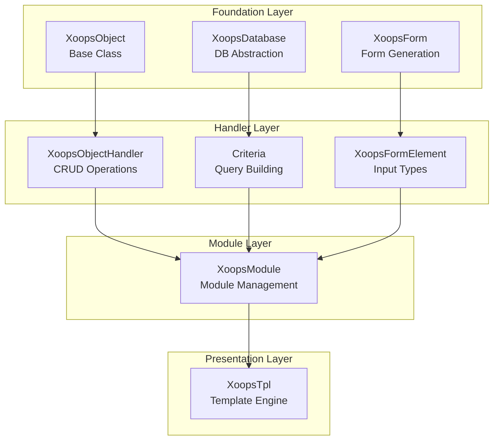
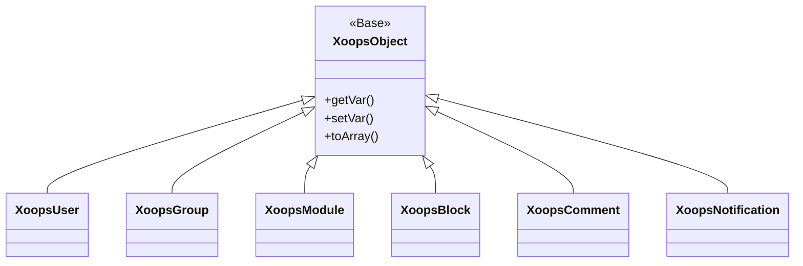
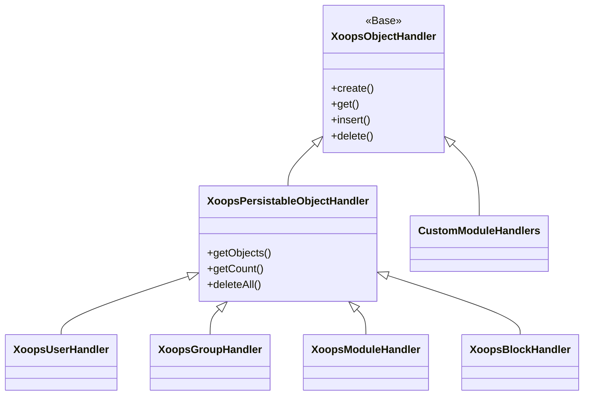
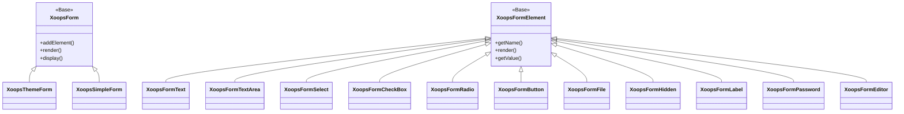

Dobrodošli v obsežni XOOPS API referenčni dokumentaciji. Ta razdelek ponuja podrobno dokumentacijo za vse osnovne razrede, metode in sisteme, ki sestavljajo XOOPS sistem za upravljanje vsebine.

## Pregled

XOOPS API je organiziran v več glavnih podsistemov, od katerih je vsak odgovoren za določen vidik funkcionalnosti CMS. Razumevanje teh API-jev je bistveno za razvoj modulov, tem in razširitev za XOOPS.

## API Oddelki

### Osnovni razredi

Temeljni razredi, na katerih gradijo vse druge komponente XOOPS.

| Dokumentacija | Opis |
|--------------|-------------|
| XoopsObject | Osnovni razred za vse podatkovne objekte v XOOPS |
| XoopsObjectHandler | Vzorec upravljalnika za operacije CRUD |

### Plast baze podatkov

Pripomočki za abstrakcijo baze podatkov in gradnjo poizvedb.

| Dokumentacija | Opis |
|--------------|-------------|
| XoopsDatabase | Abstraktna plast baze podatkov |
| Sistem meril | Merila in pogoji poizvedbe |
| QueryBuilder | Sodobna tekoča izdelava poizvedb |

### Sistem obrazcev

HTML generiranje in potrjevanje obrazcev.

| Dokumentacija | Opis |
|--------------|-------------|
| XoopsForm | Vsebnik obrazca in upodabljanje |
| Elementi obrazca | Vse razpoložljive vrste elementov obrazca |### Razredi jedra

Osnovne sistemske komponente in storitve.

| Dokumentacija | Opis |
|--------------|-------------|
| Razredi jedra | Sistemsko jedro in osnovne komponente |

### Sistem modulov

Upravljanje in življenjski cikel modulov.

| Dokumentacija | Opis |
|--------------|-------------|
| Sistem modulov | Nalaganje, namestitev in upravljanje modula |

### Sistem predlog

Integracija predloge Smarty.

| Dokumentacija | Opis |
|--------------|-------------|
| Sistem predlog | Integracija Smarty in upravljanje predlog |

### Uporabniški sistem

Upravljanje uporabnikov in avtentikacija.

| Dokumentacija | Opis |
|--------------|-------------|
| Uporabniški sistem | Uporabniški računi, skupine in dovoljenja |

## Pregled arhitekture

## Hierarhija razreda

### Objektni model

### Model vodnika

### Model obrazca

## Oblikovalski vzorci

XOOPS API implementira več dobro znanih oblikovalskih vzorcev:

### Enojni vzorec
Uporablja se za globalne storitve, kot so povezave z bazo podatkov in primerki vsebnika.
```php
$db = XoopsDatabase::getInstance();
$container = XoopsContainer::getInstance();
```
### Tovarniški vzorec
Upravljavci objektov dosledno ustvarjajo objekte domene.
```php
$handler = xoops_getHandler('user');
$user = $handler->create();
```
### Sestavljeni vzorec
Obrazci vsebujejo več elementov obrazca; kriteriji lahko vsebujejo ugnezdene kriterije.
```php
$criteria = new CriteriaCompo();
$criteria->add(new Criteria('status', 1));
$criteria->add(new CriteriaCompo(...)); // Nested
```
### Vzorec opazovalca
Sistem dogodkov omogoča ohlapno povezavo med moduli.
```php
$dispatcher->addListener('module.news.article_published', $callback);
```
## Primeri hitrega začetka

### Ustvarjanje in shranjevanje predmeta
```php
// Get the handler
$handler = xoops_getHandler('user');

// Create a new object
$user = $handler->create();
$user->setVar('uname', 'newuser');
$user->setVar('email', 'user@example.com');

// Save to database
$handler->insert($user);
```
### Poizvedovanje s kriteriji
```php
// Build criteria
$criteria = new CriteriaCompo();
$criteria->add(new Criteria('level', 0, '>'));
$criteria->setSort('uname');
$criteria->setOrder('ASC');
$criteria->setLimit(10);

// Get objects
$handler = xoops_getHandler('user');
$users = $handler->getObjects($criteria);
```
### Ustvarjanje obrazca
```php
$form = new XoopsThemeForm('User Profile', 'userform', 'save.php', 'post', true);
$form->addElement(new XoopsFormText('Username', 'uname', 50, 255, $user->getVar('uname')));
$form->addElement(new XoopsFormTextArea('Bio', 'bio', $user->getVar('bio')));
$form->addElement(new XoopsFormButton('', 'submit', _SUBMIT, 'submit'));
echo $form->render();
```
## API konvencije

### Dogovori o poimenovanju

| Vrsta | Konvencija | Primer |
|------|-----------|---------|
| Razredi | PascalCase | `XoopsUser`, `CriteriaCompo` |
| Metode | CamelCase | `getVar()`, `setVar()` |
| Lastnosti | camelCase (zaščiteno) | `$_vars`, `$_handler` |
| Konstante | UPPER_SNAKE_CASE | `XOBJ_DTYPE_INT` |
| Tabele baze podatkov | snake_case | `users`, `groups_users_link` |

### Vrste podatkov

XOOPS definira standardne tipe podatkov za spremenljivke objekta:

| Konstanta | Vrsta | Opis |
|----------|------|-------------|
| `XOBJ_DTYPE_TXTBOX` | Niz | Vnos besedila (prečiščeno) |
| `XOBJ_DTYPE_TXTAREA` | Niz | Vsebina besedilnega polja |
| `XOBJ_DTYPE_INT` | Celo število | Številske vrednosti |
| `XOBJ_DTYPE_URL` | Niz | URL validacija |
| `XOBJ_DTYPE_EMAIL` | Niz | Preverjanje elektronske pošte |
| `XOBJ_DTYPE_ARRAY` | Niz | Serializirana polja |
| `XOBJ_DTYPE_OTHER` | Mešano | Obdelava po meri |
| `XOBJ_DTYPE_SOURCE` | Niz | Izvorna koda (minimalna sanacija) |
| `XOBJ_DTYPE_STIME` | Celo število | Kratek časovni žig |
| `XOBJ_DTYPE_MTIME` | Celo število | Srednji časovni žig |
| `XOBJ_DTYPE_LTIME` | Celo število | Dolg časovni žig |

## Metode preverjanja pristnosti

API podpira več načinov preverjanja pristnosti:

### API Preverjanje pristnosti ključa
```
X-API-Key: your-api-key
```
### Žeton nosilca OAuth
```
Authorization: Bearer your-oauth-token
```
### Preverjanje pristnosti na podlagi seje
Ko je prijavljen, uporablja obstoječo sejo XOOPS.

## REST API Končne točke

Ko je REST API omogočen:

| Končna točka | Metoda | Opis |
|----------|--------|-------------|
| `/api.php/rest/users` | GET | Seznam uporabnikov |
| `/api.php/rest/users/{id}` | GET | Pridobi uporabnika po ID |
| `/api.php/rest/users` | POST | Ustvari uporabnika |
| `/api.php/rest/users/{id}` | PUT | Posodobi uporabnika |
| `/api.php/rest/users/{id}` | DELETE | Izbriši uporabnika |
| `/api.php/rest/modules` | GET | Seznam modulov |

## Povezana dokumentacija

- Vodnik za razvoj modula
- Vodnik za razvoj teme
- Konfiguracija sistema
- Najboljše varnostne prakse

## Zgodovina različic

| Različica | Spremembe |
|---------|---------|
| 2.5.11 | Trenutna stabilna izdaja |
| 2.5.10 | Dodana podpora za GraphQL API |
| 2.5.9 | Izboljšan sistem meril |
| 2.5.8 | PSR-4 podpora za samodejno nalaganje |

---

*Ta dokumentacija je del zbirke znanja XOOPS. Za najnovejše posodobitve obiščite [XOOPS repozitorij GitHub](https://github.com/XOOPS).*