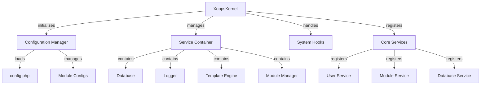

Jedro XOOPS zagotavlja temeljni okvir za zagon sistema, upravljanje konfiguracij, obravnavanje sistemskih dogodkov in zagotavljanje osnovnih pripomočkov. Ti razredi tvorijo hrbtenico aplikacije XOOPS.

## Sistemska arhitektura

## Razred XoopsKernel

Glavni razred jedra, ki inicializira in upravlja sistem XOOPS.

### Pregled razreda
```php
namespace Xoops;

class XoopsKernel
{
    private static ?XoopsKernel $instance = null;
    protected ServiceContainer $services;
    protected ConfigurationManager $config;
    protected array $modules = [];
    protected bool $isLoaded = false;
}
```
### Konstruktor
```php
private function __construct()
```
Zasebni konstruktor uveljavlja vzorec singleton.

### getInstance

Pridobi enojni primerek jedra.
```php
public static function getInstance(): XoopsKernel
```
**Vrne:** `XoopsKernel` - primerek jedra z enim samcem

**Primer:**
```php
$kernel = XoopsKernel::getInstance();
```
### Postopek zagona

Postopek zagona jedra poteka po naslednjih korakih:

1. **Inicializacija** - Nastavite obdelovalce napak, definirajte konstante
2. **Konfiguracija** - Naloži konfiguracijske datoteke
3. **Registracija storitve** - Registrirajte osnovne storitve
4. **Zaznavanje modulov** - Preglejte in identificirajte aktivne module
5. **Inicializacija baze podatkov** - Povežite se z bazo podatkov
6. **Čiščenje** - Pripravite se na obravnavanje zahtev
```php
public function boot(): void
```
**Primer:**
```php
$kernel = XoopsKernel::getInstance();
$kernel->boot();
```
### Metode storitvenega vsebnika

#### registerService

Registrira storitev v storitvenem vsebniku.
```php
public function registerService(
    string $name,
    callable|object $definition
): void
```
**Parametri:**

| Parameter | Vrsta | Opis |
|-----------|------|-------------|
| `$name` | niz | Identifikator storitve |
| `$definition` | klicati\|objekt | Servisna tovarna ali primer |

**Primer:**
```php
$kernel->registerService('custom.handler', function($c) {
    return new CustomHandler();
});
```
#### getService

Pridobi registrirano storitev.
```php
public function getService(string $name): mixed
```
**Parametri:**

| Parameter | Vrsta | Opis |
|-----------|------|-------------|
| `$name` | niz | Identifikator storitve |

**Vračila:** `mixed` - Zahtevana storitev

**Primer:**
```php
$database = $kernel->getService('database');
$logger = $kernel->getService('logger');
```
#### hasService

Preveri, ali je storitev registrirana.
```php
public function hasService(string $name): bool
```
**Primer:**
```php
if ($kernel->hasService('cache')) {
    $cache = $kernel->getService('cache');
}
```
## Upravitelj konfiguracije

Upravlja konfiguracijo aplikacije in nastavitve modula.

### Pregled razreda
```php
namespace Xoops\Core;

class ConfigurationManager
{
    protected array $config = [];
    protected array $defaults = [];
    protected string $configPath;
}
```
### Metode

#### obremenitev

Naloži konfiguracijo iz datoteke ali polja.
```php
public function load(string|array $source): void
```
**Parametri:**

| Parameter | Vrsta | Opis |
|-----------|------|-------------|
| `$source` | niz\|niz | Pot konfiguracijske datoteke ali polje |

**Primer:**
```php
$config = $kernel->getService('config');
$config->load(XOOPS_ROOT_PATH . '/include/config.php');
$config->load(['sitename' => 'My Site', 'admin_email' => 'admin@example.com']);
```
#### dobiš

Pridobi konfiguracijsko vrednost.
```php
public function get(string $key, mixed $default = null): mixed
```
**Parametri:**

| Parameter | Vrsta | Opis |
|-----------|------|-------------|
| `$key` | niz | Konfiguracijski ključ (zapis s pikami) |
| `$default` | mešano | Privzeta vrednost, če ni najden |

**Vrne:** `mixed` - Vrednost konfiguracije

**Primer:**
```php
$siteName = $config->get('sitename');
$adminEmail = $config->get('admin.email', 'admin@example.com');
```
#### komplet

Nastavi vrednost konfiguracije.
```php
public function set(string $key, mixed $value): void
```
**Parametri:**

| Parameter | Vrsta | Opis |
|-----------|------|-------------|
| `$key` | niz | Konfiguracijski ključ |
| `$value` | mešano | Vrednost konfiguracije |

**Primer:**
```php
$config->set('sitename', 'New Site Name');
$config->set('features.cache_enabled', true);
```
#### getModuleConfig

Pridobi konfiguracijo za določen modul.
```php
public function getModuleConfig(
    string $moduleName
): array
```
**Parametri:**

| Parameter | Vrsta | Opis |
|-----------|------|-------------|
| `$moduleName` | niz | Ime imenika modula |

**Vrne:** `array` - Niz konfiguracije modula

**Primer:**
```php
$publisherConfig = $config->getModuleConfig('publisher');
```
## Sistemske kljuke

Sistemske zanke omogočajo modulom in vtičnikom, da izvajajo kodo na določenih točkah v življenjskem ciklu aplikacije.

### Razred HookManager
```php
namespace Xoops\Core;

class HookManager
{
    protected array $hooks = [];
    protected array $listeners = [];
}
```
### Metode

#### addHook

Registrira kaveljsko točko.
```php
public function addHook(string $name): void
```
**Parametri:**

| Parameter | Vrsta | Opis |
|-----------|------|-------------|
| `$name` | niz | Identifikator kljuke |

**Primer:**
```php
$hooks = $kernel->getService('hooks');
$hooks->addHook('system.startup');
$hooks->addHook('user.login');
$hooks->addHook('module.install');
```
#### poslušaj

Pritrdi poslušalec na kavelj.
```php
public function listen(
    string $hookName,
    callable $callback,
    int $priority = 10
): void
```
**Parametri:**

| Parameter | Vrsta | Opis |
|-----------|------|-------------|
| `$hookName` | niz | Identifikator kljuke |
| `$callback` | klicati | Funkcija za izvedbo |
| `$priority` | int | Prioriteta izvajanja (najprej se zaženejo višji) |

**Primer:**
```php
$hooks->listen('user.login', function($user) {
    error_log('User ' . $user->uname . ' logged in');
}, 10);

$hooks->listen('module.install', function($module) {
    // Custom module installation logic
    echo "Installing " . $module->getName();
}, 5);
```
#### sprožilec

Izvede vse poslušalce za kavelj.
```php
public function trigger(
    string $hookName,
    mixed $arguments = null
): array
```
**Parametri:**

| Parameter | Vrsta | Opis |
|-----------|------|-------------|
| `$hookName` | niz | Identifikator kljuke |
| `$arguments` | mešano | Podatki za posredovanje poslušalcem |

**Vrnitve:** `array` - Rezultati vseh poslušalcev

**Primer:**
```php
$results = $hooks->trigger('system.startup');
$results = $hooks->trigger('user.created', $newUser);
```
## Pregled osnovnih storitev

Jedro med zagonom registrira več osnovnih storitev:

| Storitev | Razred | Namen |
|---------|-------|---------|
| `database` | XoopsDatabase | Abstraktna plast baze podatkov |
| `config` | ConfigurationManager | Upravljanje konfiguracije |
| `logger` | Drvar | Beleženje aplikacij |
| `template` | XoopsTpl | Mehanizem predlog |
| `user` | Upravitelj uporabnikov | Storitev upravljanja uporabnikov |
| `module` | ModuleManager | Upravljanje modulov |
| `cache` | CacheManager | Predpomnilniška plast |
| `hooks` | HookManager | Kavlji sistemskih dogodkov |

## Celoten primer uporabe
```php
<?php
/**
 * Custom module boot process utilizing kernel
 */

// Get kernel instance
$kernel = XoopsKernel::getInstance();

// Boot the system
$kernel->boot();

// Get services
$config = $kernel->getService('config');
$database = $kernel->getService('database');
$logger = $kernel->getService('logger');
$hooks = $kernel->getService('hooks');

// Access configuration
$siteName = $config->get('sitename');
$adminEmail = $config->get('admin.email');

// Register module-specific hooks
$hooks->listen('user.login', function($user) {
    // Log user login
    $logger->info('User login: ' . $user->uname);

    // Track in database
    $database->query(
        'INSERT INTO ' . $database->prefix('event_log') .
        ' (type, user_id, message, timestamp) VALUES (?, ?, ?, ?)',
        ['login', $user->uid(), 'User login', time()]
    );
});

$hooks->listen('module.install', function($module) {
    $logger->info('Module installed: ' . $module->getName());
});

// Trigger hooks
$hooks->trigger('system.startup');

// Use database service
$result = $database->query(
    'SELECT * FROM ' . $database->prefix('users') .
    ' LIMIT 10'
);

while ($row = $database->fetchArray($result)) {
    echo "User: " . htmlspecialchars($row['uname']) . "\n";
}

// Register custom service
$kernel->registerService('custom.repository', function($c) {
    return new CustomRepository($c->getService('database'));
});

// Later access custom service
$repo = $kernel->getService('custom.repository');
```
## Jedrne konstante

Jedro definira več pomembnih konstant med zagonom:
```php
// System paths
define('XOOPS_ROOT_PATH', '/var/www/xoops');
define('XOOPS_HTDOCS_PATH', XOOPS_ROOT_PATH . '/htdocs');
define('XOOPS_MODULES_PATH', XOOPS_ROOT_PATH . '/htdocs/modules');
define('XOOPS_THEMES_PATH', XOOPS_ROOT_PATH . '/htdocs/themes');

// Web paths
define('XOOPS_URL', 'http://example.com');
define('XOOPS_HTDOCS_URL', XOOPS_URL . '/htdocs');

// Database
define('XOOPS_DB_PREFIX', 'xoops_');
```
## Obravnava napak

Jedro med zagonom nastavi obdelovalce napak:
```php
// Set custom error handler
set_error_handler(function($errno, $errstr, $errfile, $errline) {
    $kernel->getService('logger')->error(
        "Error: $errstr in $errfile:$errline"
    );
});

// Set exception handler
set_exception_handler(function($exception) {
    $kernel->getService('logger')->critical(
        "Exception: " . $exception->getMessage()
    );
});
```
## Najboljše prakse

1. **Single Boot** - Pokličite `boot()` samo enkrat med zagonom aplikacije
2. **Uporabi vsebnik storitev** - Registrirajte in pridobite storitve prek jedra
3. **Handle Hooks Early** - Registrirajte poslušalce hookov, preden jih sprožite
4. **Zabeležite pomembne dogodke** – za odpravljanje napak uporabite storitev zapisovalnika
5. **Konfiguracija predpomnilnika** - Enkrat naložite konfiguracijo in jo ponovno uporabite
6. **Obravnava napak** - Pred obdelavo zahtev vedno nastavite obdelovalce napak

## Povezana dokumentacija

- ../Module/Module-System - Sistem modula in življenjski cikel
- ../Template/Template-System - Integracija mehanizma predloge
- ../User/User-System - Preverjanje in upravljanje uporabnikov
- ../Database/XoopsDatabase - Plast baze podatkov

---

*Glejte tudi: [XOOPS Izvor jedra](https://github.com/XOOPS/XoopsCore27/tree/master/htdocs/class)*