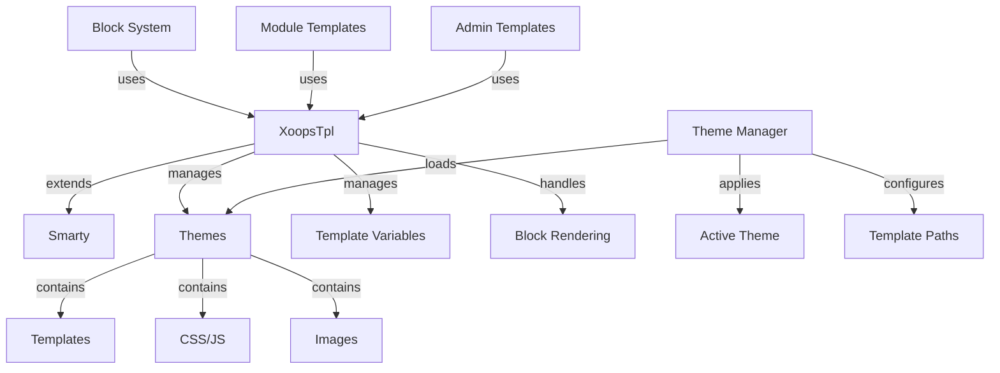

Sistem predlog XOOPS je zgrajen na zmogljivem mehanizmu predlog Smarty, ki zagotavlja prilagodljiv in razširljiv način za ločevanje logike predstavitve od poslovne logike. Upravlja teme, upodabljanje predlog, dodeljevanje spremenljivk in ustvarjanje dinamične vsebine.

## Arhitektura predloge

## Razred XoopsTpl

Glavni razred motorja predloge, ki razširja Smarty.

### Pregled razreda
```php
namespace Xoops\Core;

class XoopsTpl extends Smarty
{
    protected array $vars = [];
    protected string $currentTheme = '';
    protected array $blocks = [];
    protected bool $isAdmin = false;
}
```
### Razširitev Smarty
```php
use Xoops\Core\XoopsTpl;

class XoopsTpl extends Smarty
{
    private static ?XoopsTpl $instance = null;

    private function __construct()
    {
        parent::__construct();
        $this->configureDirectories();
        $this->registerPlugins();
    }

    public static function getInstance(): XoopsTpl
    {
        if (!isset(self::$instance)) {
            self::$instance = new self();
        }
        return self::$instance;
    }
}
```
### Osnovne metode

#### getInstance

Pridobi primerek predloge singleton.
```php
public static function getInstance(): XoopsTpl
```
**Vrnitve:** `XoopsTpl` - Enkratni primerek

**Primer:**
```php
$xoopsTpl = XoopsTpl::getInstance();
```
#### dodeli

Predlogi dodeli spremenljivko.
```php
public function assign(
    string|array $tplVar,
    mixed $value = null
): void
```
**Parametri:**

| Parameter | Vrsta | Opis |
|-----------|------|-------------|
| `$tplVar` | niz\|niz | Ime spremenljivke ali asociativno polje |
| `$value` | mešano | Vrednost spremenljivke |

**Primer:**
```php
$xoopsTpl->assign('page_title', 'Welcome');
$xoopsTpl->assign('user_name', 'John Doe');

// Multiple assignments
$xoopsTpl->assign([
    'items' => $items,
    'total_count' => count($items),
    'show_pagination' => true
]);
```
#### appendAssign

Doda vrednosti spremenljivkam polja predloge.
```php
public function appendAssign(
    string $tplVar,
    mixed $value
): void
```
**Parametri:**

| Parameter | Vrsta | Opis |
|-----------|------|-------------|
| `$tplVar` | niz | Ime spremenljivke |
| `$value` | mešano | Vrednost za dodajanje |

**Primer:**
```php
$xoopsTpl->assign('breadcrumbs', ['Home']);
$xoopsTpl->appendAssign('breadcrumbs', 'Blog');
$xoopsTpl->appendAssign('breadcrumbs', 'Posts');
// breadcrumbs = ['Home', 'Blog', 'Posts']
```
#### getAssignedVars

Pridobi vse dodeljene spremenljivke predloge.
```php
public function getAssignedVars(): array
```
**Vrne:** `array` - Dodeljene spremenljivke

**Primer:**
```php
$vars = $xoopsTpl->getAssignedVars();
foreach ($vars as $name => $value) {
    echo "$name = " . var_export($value, true) . "\n";
}
```
#### zaslon

Upodobi predlogo in jo prikaže v brskalniku.
```php
public function display(
    string $resource,
    string|array $cache_id = null,
    string $compile_id = null,
    object $parent = null
): void
```
**Parametri:**

| Parameter | Vrsta | Opis |
|-----------|------|-------------|
| `$resource` | niz | Pot do datoteke predloge |
| `$cache_id` | niz\|niz | Identifikator predpomnilnika |
| `$compile_id` | niz | Prevedi identifikator |
| `$parent` | predmet | Predmet nadrejene predloge |

**Primer:**
```php
$xoopsTpl->assign('page_title', 'Home');
$xoopsTpl->display('user:index.tpl');

// With absolute path
$xoopsTpl->display(XOOPS_ROOT_PATH . '/templates/user/index.tpl');
```
#### prinesi

Upodobi predlogo in vrne kot niz.
```php
public function fetch(
    string $resource,
    string|array $cache_id = null,
    string $compile_id = null,
    object $parent = null
): string
```
**Vrnitve:** `string` - Upodobljena vsebina predloge

**Primer:**
```php
$xoopsTpl->assign('message', 'Hello World');
$html = $xoopsTpl->fetch('user:message.tpl');
echo $html;

// Use for email templates
$emailContent = $xoopsTpl->fetch('mail:notification.tpl');
mail($to, $subject, $emailContent);
```
#### loadTheme

Naloži določeno temo.
```php
public function loadTheme(string $themeName): bool
```
**Parametri:**

| Parameter | Vrsta | Opis |
|-----------|------|-------------|
| `$themeName` | niz | Ime imenika tem |

**Vrnitve:** `bool` - Resnično ob uspehu

**Primer:**
```php
if ($xoopsTpl->loadTheme('bluemoon')) {
    echo "Theme loaded successfully";
}
```
#### getCurrentTheme

Pridobi ime trenutno aktivne teme.
```php
public function getCurrentTheme(): string
```
**Vrnitve:** `string` - Ime teme

**Primer:**
```php
$currentTheme = $xoopsTpl->getCurrentTheme();
echo "Active theme: $currentTheme";
```
#### setOutputFilter

Doda izhodni filter za obdelavo izpisa predloge.
```php
public function setOutputFilter(string $function): void
```
**Parametri:**

| Parameter | Vrsta | Opis |
|-----------|------|-------------|
| `$function` | niz | Ime funkcije filtra |

**Primer:**
```php
// Remove whitespace from output
$xoopsTpl->setOutputFilter('trim');

// Custom filter
function my_output_filter($output) {
    // Minify HTML
    $output = preg_replace('/\s+/', ' ', $output);
    return trim($output);
}
$xoopsTpl->setOutputFilter('my_output_filter');
```
#### registerPlugin

Registrira vtičnik Smarty po meri.
```php
public function registerPlugin(
    string $type,
    string $name,
    callable $callback
): void
```
**Parametri:**

| Parameter | Vrsta | Opis |
|-----------|------|-------------|
| `$type` | niz | Vrsta vtičnika (modifikator, blok, funkcija) |
| `$name` | niz | Ime vtičnika |
| `$callback` | klicati | Funkcija povratnega klica |

**Primer:**
```php
// Register custom modifier
$xoopsTpl->registerPlugin('modifier', 'markdown', function($text) {
    return markdown_parse($text);
});

// Use in template: {$content|markdown}

// Register custom block tag
$xoopsTpl->registerPlugin('block', 'permission', function($params, $content, $smarty, &$repeat) {
    if ($repeat) return;

    // Check permission
    if (has_permission($params['name'])) {
        return $content;
    }
    return '';
});

// Use in template: {permission name="admin"}...{/permission}
```
## Sistem tem

### Struktura teme

Standardna struktura imenika tem XOOPS:
```
bluemoon/
├── style.css              # Main stylesheet
├── admin.css              # Admin stylesheet
├── theme.html             # Main page template
├── admin.html             # Admin page template
├── blocks/                # Block templates
│   ├── block_left.tpl
│   └── block_right.tpl
├── modules/               # Module templates
│   ├── publisher/
│   │   ├── index.tpl
│   │   └── item.tpl
│   └── news/
│       └── index.tpl
├── images/                # Theme images
│   ├── logo.png
│   └── banner.png
├── js/                    # Theme JavaScript
│   └── script.js
└── readme.txt             # Theme documentation
```
### Razred upravitelja tem
```php
namespace Xoops\Core\Theme;

class ThemeManager
{
    protected array $themes = [];
    protected string $activeTheme = '';
    protected string $themeDirectory = '';

    public function getActiveTheme(): string {}
    public function setActiveTheme(string $theme): bool {}
    public function getThemeList(): array {}
    public function themeExists(string $name): bool {}
}
```
## Spremenljivke predloge

### Standardne globalne spremenljivke

XOOPS samodejno dodeli več globalnih spremenljivk predloge:

| Spremenljivka | Vrsta | Opis |
|----------|------|-------------|
| `$xoops_url` | niz | XOOPS namestitev URL |
| `$xoops_user` | XoopsUser\|null | Objekt trenutnega uporabnika |
| `$xoops_uname` | niz | Trenutno uporabniško ime |
| `$xoops_isadmin` | bool | Uporabnik je admin |
| `$xoops_banner` | niz | Pasica HTML |
| `$xoops_notification` | niz | Oznaka obvestil |
| `$xoops_version` | niz | XOOPS različica |

### Spremenljivke, specifične za blok

Pri upodabljanju blokov:

| Spremenljivka | Vrsta | Opis |
|----------|------|-------------|
| `$block` | niz | Podatki o bloku |
| `$block.title` | niz | Naslov bloka |
| `$block.content` | niz | Blokiraj vsebino |
| `$block.id` | int | ID bloka |
| `$block.module` | niz | Ime modula |

### Spremenljivke predloge modula

Moduli običajno dodelijo:

| Spremenljivka | Vrsta | Opis |
|----------|------|-------------|
| `$module_name` | niz | Prikazno ime modula |
| `$module_dir` | niz | Imenik modulov |
| `$xoops_module_header` | niz | Modul CSS/JS |

## Smarty konfiguracija

### Pogosti modifikatorji Smarty

| Modifikator | Opis | Primer |
|----------|-------------|---------|
| `capitalize` | Veliko prvo črko | `{$title\|capitalize}` |
| `count_characters` | Število znakov | `{$text\|count_characters}` |
| `date_format` | Oblikuj časovni žig | `{$timestamp\|date_format:'%Y-%m-%d'}` |
| `escape` | Ubežni posebni znaki | `{$html\|escape:'html'}` |
| `nl2br` | Pretvori nove vrstice v `<br>` | `{$text\|nl2br}` |
| `strip_tags` | Odstrani oznake HTML | `{$content\|strip_tags}` |
| `truncate` | Omejitev dolžine niza | `{$text\|truncate:100}` |
| `upper` | Pretvori v velike črke | `{$name\|upper}` |
| `lower` | Pretvori v male črke | `{$name\|lower}` |### Nadzorne strukture
```smarty
{* If statement *}
{if $user->isAdmin()}
    <p>Admin content</p>
{else}
    <p>User content</p>
{/if}

{* For loop *}
{foreach $items as $item}
    <div class="item">{$item.title}</div>
{/foreach}

{* For loop with counter *}
{foreach $items as $item name=item_loop}
    {$smarty.foreach.item_loop.iteration}: {$item.title}
{/foreach}

{* While loop *}
{while $condition}
    <!-- content -->
{/while}

{* Switch statement *}
{switch $status}
    {case 'draft'}<span class="draft">Draft</span>{break}
    {case 'published'}<span class="published">Published</span>{break}
    {default}<span class="unknown">Unknown</span>
{/switch}
```
## Celoten primer predloge

### PHP Koda
```php
<?php
/**
 * Module Article List Page
 */

include __DIR__ . '/include/common.inc.php';

$xoopsTpl = XoopsTpl::getInstance();

// Check if module is active
$module = xoops_getModuleByDirname('articles');
if (!$module) {
    redirect_header(XOOPS_URL, 3, 'Module not found');
}

// Get item handler
$itemHandler = xoops_getModuleHandler('item', 'articles');

// Get pagination parameters
$page = !empty($_GET['page']) ? (int)$_GET['page'] : 1;
$perPage = $module->getConfig('items_per_page') ?: 10;
$offset = ($page - 1) * $perPage;

// Build criteria
$criteria = new CriteriaCompo();
$criteria->add(new Criteria('status', 1));
$criteria->setSort('published', 'DESC');
$criteria->setLimit($perPage);
$criteria->setStart($offset);

// Fetch items
$items = $itemHandler->getObjects($criteria);
$total = $itemHandler->getCount(new Criteria('status', 1));

// Calculate pagination
$pages = ceil($total / $perPage);

// Assign template variables
$xoopsTpl->assign([
    'module_name' => $module->getName(),
    'items' => $items,
    'total_items' => $total,
    'current_page' => $page,
    'total_pages' => $pages,
    'items_per_page' => $perPage,
    'show_pagination' => $pages > 1
]);

// Add breadcrumbs
$xoopsTpl->assign('xoops_breadcrumbs', [
    ['url' => XOOPS_URL, 'title' => 'Home'],
    ['url' => $module->getUrl(), 'title' => $module->getName()],
    ['title' => 'Articles']
]);

// Display template
$xoopsTpl->display($module->getPath() . '/templates/user/list.tpl');
```
### Datoteka predloge (list.tpl)
```smarty
<div id="articles-list">
    <h1>{$module_name|escape}</h1>

    {if $items}
        <div class="articles-container">
            {foreach $items as $item}
                <article class="article-item">
                    <header>
                        <h2>
                            <a href="{$item.url|escape}">
                                {$item.title|escape}
                            </a>
                        </h2>
                        <div class="meta">
                            <span class="author">By {$item.author|escape}</span>
                            <span class="date">
                                {$item.published|date_format:'%B %d, %Y'}
                            </span>
                        </div>
                    </header>

                    <div class="content">
                        <p>{$item.summary|truncate:150}</p>
                    </div>

                    <footer>
                        <a href="{$item.url|escape}" class="read-more">
                            Read More »
                        </a>
                    </footer>
                </article>
            {/foreach}
        </div>

        {* Pagination *}
        {if $show_pagination}
            <nav class="pagination">
                {if $current_page > 1}
                    <a href="?page=1" class="first">« First</a>
                    <a href="?page={$current_page - 1}" class="prev">‹ Previous</a>
                {/if}

                {for $i=1 to $total_pages}
                    {if $i == $current_page}
                        <span class="current">{$i}</span>
                    {else}
                        <a href="?page={$i}">{$i}</a>
                    {/if}
                {/for}

                {if $current_page < $total_pages}
                    <a href="?page={$current_page + 1}" class="next">Next ›</a>
                    <a href="?page={$total_pages}" class="last">Last »</a>
                {/if}
            </nav>
        {/if}
    {else}
        <p class="no-items">No articles found.</p>
    {/if}
</div>
```
## Funkcije Smarty po meri

### Ustvarjanje bločne funkcije po meri
```php
<?php
/**
 * Custom Smarty block function for permission checking
 */

function smarty_block_permission($params, $content, $smarty, &$repeat)
{
    if ($repeat) return;

    if (!isset($params['name'])) {
        return 'Permission name required';
    }

    $permName = $params['name'];
    $user = $GLOBALS['xoopsUser'];

    // Check if user has permission
    if ($user && $user->isAdmin()) {
        return $content;
    }

    if ($user && check_user_permission($user->uid(), $permName)) {
        return $content;
    }

    return '';
}
```
Registrirajte se in uporabite:
```php
$xoopsTpl->registerPlugin('block', 'permission', 'smarty_block_permission');
```
Predloga:
```smarty
{permission name="edit_articles"}
    <button>Edit Article</button>
{/permission}
```
## Najboljše prakse

1. **Escape User Content** - Vedno uporabite `|escape` za uporabniško ustvarjeno vsebino
2. **Uporabite poti predloge** – Referenčne predloge glede na temo
3. **Ločite logiko od predstavitve** - Ohranite kompleksno logiko v PHP
4. **Cache Templates** - Omogoči predpomnjenje predlog v produkciji
5. **Pravilno uporabljajte modifikatorje** - Uporabite ustrezne filtre za kontekst
6. **Organizirajte bloke** - Postavite predloge blokov v namenski imenik
7. **Dokumentiraj spremenljivke** - dokumentiraj vse spremenljivke predloge v PHP

## Povezana dokumentacija

- ../Module/Module-System - Sistem modulov in kljuke
- ../Kernel/Kernel-Classes - Jedro in konfiguracija
- ../Core/XoopsObject - Osnovni objektni razred

---

*Glejte tudi: [Dokumentacija Smarty](https://www.Smarty.net/docs) | [XOOPS Predloga API](https://github.com/XOOPS/XoopsCore27/tree/master/htdocs/class)*